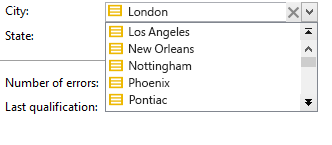
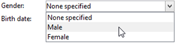
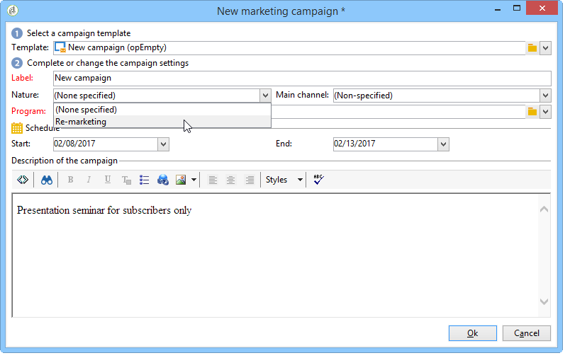
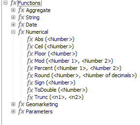

# Schema structure{#schema-structure}

The basic structure of an `<srcschema>` is as follows:

```

<srcSchema>
    <enumeration>
        ...          //definition of enumerations
    </enumeration>
   
    <element>         //definition of the root <element>    (mandatory)

        <compute-string/>  //definition of a compute-string
        <dbindex>
            ...        //definition of indexes
        </dbindex>
        <key>
            ...        //definition of keys
        </key>
        <sysFilter>
            ...           //definition of filters
        </sysFilter>
        <attribute>
            ...             //definition of fields
        </attribute>
    
            <element>           //definition of sub-<element> 
                  <attribute>           //(collection, links or XML)
                  ...                         //and additional fields
                  </attribute>
                ...
            </element>
      
    </element> 

        <methods>                 //definition of SOAP methods
            <method>
                ...
            </method>
            ...
    </methods>  
          
</srcSchema>

```

The XML document of a data schema must contain the **`<srcschema>`** root element with the **name** and **namespace** attributes to populate the schema name and its namespace.

```
<srcSchema name="schema_name" namespace="namespace">
...
</srcSchema>
```

Let us use the following XML content to illustrate the structure of a data schema:

```
<recipient email="John.doe@aol.com" created="2009/03/12" gender="1"> 
  <location city="London"/>
</recipient>
```

With its corresponding data schema:

```
<srcSchema name="recipient" namespace="cus">
  <element name="recipient">
    <attribute name="email"/>
    <attribute name="created"/>
    <attribute name="gender"/>
    <element name="location">
      <attribute name="city"/>
   </element>
  </element>
</srcSchema>

```

## Description {#description}

The point of entry of the schema is its main element. It is easy to identify because it has the same name as the schema, and it should be the child of the root element. The description of the content begins with this element.

In our example, the main element is represented by the following line:

```
<element name="recipient">
```

The elements **`<attribute>`** and **`<element>`** that follow the main element enable you to define the locations and names of the data items in the XML structure.

In our sample schema, these are:

```
<attribute name="email"/>
<attribute name="created"/>
<attribute name="gender"/>
<element name="location">
  <attribute name="city"/>
</element>
```

The following rules must be adhered to:

* Each **`<element>`** and **`<attribute>`** must be identified by name via the **name** attribute.

  >[!IMPORTANT]
  >
  >The name of the element should be concise, preferably in English, and include only authorized characters in accordance with XML naming rules.

* Only **`<element>`** elements can contain **`<attribute>`** elements and **`<element>`** elements in the XML structure.
* An **`<attribute>`** element must have a unique name within an **`<element>`**.
* The use of **`<elements>`** in multi-line data strings is recommended.

## Data types {#data-types}

The data type is entered via the **type** attribute in the **`<attribute>`** and **`<element>`** elements.

A detailed list is available in the description of the [`<attribute>` element](../../configuration/using/schema/attribute.md) and the [`<element>` element](../../configuration/using/schema/element.md)).

When this attribute is not populated, **string** is the default data type unless the element contains child elements. If it does, it is used only to structure the elements hierarchically (**`<location>`** element in our example).

The following data types are supported in schemas:

* **string**: character string. Examples: a first name, a town, etc.

  The size can be specified via the **length** attribute (optional, default value "255").

* **boolean**: Boolean field. Example of possible values: true/false, 0/1, yes/no, etc.
* **byte**, **short**, **long**: integers (1 byte, 2 bytes, 4 bytes). Examples: an age, an account number, a number of points, etc.
* **double**: double-precision floating point number. Examples: a price, a rate, etc.
* **date**, **datetime**: dates and dates + times. Examples: a birth date, a purchase date, etc.
* **datetimenotz**: date + time without time zone data.
* **timespan**: durations. Example: seniority.
* **memo**: long text fields (multiple lines). Examples: a description, a comment, etc.
* **uuid**: "uniqueidentifier" fields to support a GUID (supported in Microsoft SQL Server only).

  >[!NOTE]
  >
  >To contain a **uuid** field in engines other than Microsoft SQL Server, the "newuuid()" function must be added and completed with its default value.

Here is our example schema with the types entered:

```
<srcSchema name="recipient" namespace="cus">
  <element name="recipient">
    <attribute name="email" type="string" length="80"/>
    <attribute name="created" type="datetime"/>
    <attribute name="gender" type="byte"/>
    <element name="location">
      <attribute name="city" type="string" length="50"/>
   </element>
  </element>
</srcSchema>

```

### Mapping the types of Adobe Campaign/DBMS data {#mapping-the-types-of-adobe-campaign-dbms-data}

The table below lists the mappings for the types of data generated by Adobe Campaign for the different database management systems.

<table> 
 <tbody> 
  <tr> 
   <td> <strong>Adobe Campaign</strong><br /> </td> 
   <td> <strong>PosgreSQL</strong><br /> </td> 
   <td> <strong>Oracle</strong><br /> </td> 
   <td> <strong>Teradata</strong><br /> </td> 
   <td> <strong>DB2</strong><br /> </td> 
   <td> <strong>MS SQL</strong><br /> </td> 
  </tr> 
  <tr> 
   <td> String<br /> </td> 
   <td> VARCHAR(255)<br /> </td> 
   <td> VARCHAR2 (NVARCHAR2 if unicode)<br /> </td> 
   <td> VARCHAR (VARCHAR CHARACTER SET UNICODE if Unicode)<br /> </td> 
   <td> VARCHAR<br /> </td> 
   <td> VARCHAR (NVARCHAR if unicode)<br /> </td> 
  </tr> 
  <tr> 
   <td> Boolean<br /> </td> 
   <td> SMALLINT<br /> </td> 
   <td> NUMBER(3)<br /> </td> 
   <td> NUMERIC(3)<br /> </td> 
   <td> SMALLINT<br /> </td> 
   <td> TINYINT<br /> </td> 
  </tr> 
  <tr> 
   <td> Byte<br /> </td> 
   <td> SMALLINT<br /> </td> 
   <td> NUMBER(3)<br /> </td> 
   <td> NUMERIC(3)<br /> </td> 
   <td> SMALLINT<br /> </td> 
   <td> TINYINT<br /> </td> 
  </tr> 
  <tr> 
   <td> Short<br /> </td> 
   <td> SMALLINT<br /> </td> 
   <td> NUMBER(5)<br /> </td> 
   <td> SMALLINT<br /> </td> 
   <td> SMALLINT<br /> </td> 
   <td> SMALLINT<br /> </td> 
  </tr> 
  <tr> 
   <td> Double<br /> </td> 
   <td> DOUBLE PRECISION<br /> </td> 
   <td> FLOAT<br /> </td> 
   <td> FLOAT<br /> </td> 
   <td> DOUBLE<br /> </td> 
   <td> FLOAT<br /> </td> 
  </tr> 
  <tr> 
   <td> Long<br /> </td> 
   <td> INTEGER<br /> </td> 
   <td> NUMBER(10)<br /> </td> 
   <td> INTEGER<br /> </td> 
   <td> INTEGER<br /> </td> 
   <td> INT<br /> </td> 
  </tr> 
  <tr> 
   <td> Int64<br /> </td> 
   <td> BIGINT<br /> </td> 
   <td> NUMBER(20)<br /> </td> 
   <td> NUMERIC(20)<br /> </td> 
   <td> BIGINT<br /> </td> 
   <td> BIGINT<br /> </td> 
  </tr> 
  <tr> 
   <td> Date<br /> </td> 
   <td> DATE<br /> </td> 
   <td> DATE<br /> </td> 
   <td> TIMESTAMP<br /> </td> 
   <td> DATE<br /> </td> 
   <td> DATETIME<br /> </td> 
  </tr> 
  <tr> 
   <td> Time<br /> </td> 
   <td> TIME<br /> </td> 
   <td> FLOAT<br /> </td> 
   <td> TIME<br /> </td> 
   <td> TIME<br /> </td> 
   <td> FLOAT<br /> </td> 
  </tr> 
  <tr> 
   <td> Datetime<br /> </td> 
   <td> TIMESTAMPZ<br /> </td> 
   <td> DATE<br /> </td> 
   <td> TIMESTAMP<br /> </td> 
   <td> TIMESTAMP<br /> </td> 
   <td> MS SQL &lt; 2008: DATETIME<br /> MS SQL &gt;= 2012: DATETIMEOFFSET<br /> </td> 
  </tr> 
  <tr> 
   <td> Datetimenotz<br /> </td> 
   <td> TIMESTAMPZ<br /> </td> 
   <td> DATE<br /> </td> 
   <td> TIMESTAMP<br /> </td> 
   <td> TIMESTAMP<br /> </td> 
   <td> MS SQL &lt; 2008: DATETIME<br /> MS SQL &gt;= 2012: DATETIME2<br /> </td> 
  </tr> 
  <tr> 
   <td> Timespan<br /> </td> 
   <td> DOUBLE PRECISION<br /> </td> 
   <td> FLOAT<br /> </td> 
   <td> FLOAT<br /> </td> 
   <td> DOUBLE<br /> </td> 
   <td> FLOAT<br /> </td> 
  </tr> 
  <tr> 
   <td> Memo<br /> </td> 
   <td> TEXT<br /> </td> 
   <td> CLOB (NCLOB if Unicode)<br /> </td> 
   <td> CLOB (CLOB CHARACTER SET UNICODE if Unicode)<br /> </td> 
   <td> CLOB(6M)<br /> </td> 
   <td> TEXT (NTEXT if Unicode)<br /> </td> 
  </tr> 
  <tr> 
   <td> Blob<br /> </td> 
   <td> BLOB<br /> </td> 
   <td> BLOB<br /> </td> 
   <td> BLOB<br /> </td> 
   <td> BLOB(4M)<br /> </td> 
   <td> IMAGE<br /> </td> 
  </tr> 
 </tbody> 
</table>

## Properties {#properties}

The **`<elements>`** and **`<attributes>`** elemtns of the data schema can be enriched with various properties. You can populate a label in order to describe the current element.

### Labels and descriptions {#labels-and-descriptions}

* The **label** property lets you enter a brief description.

  >[!NOTE]
  >
  >The label is associated with the current language of the instance.

  **Example**:

  ```
  <attribute name="email" type="string" length="80" label="Email"/>
  
  ```

  The label can be seen from the Adobe Campaign client console input form:

  

* The **desc** property lets you enter a long description.

  The description can be seen from the input form in the status bar of the Adobe Campaign client console main window.

  >[!NOTE]
  >
  >The description is associated with the current language of the instance.

  **Example**:

  ```
  <attribute name="email" type="string" length="80" label="Email" desc="Email of recipient"/>
  
  ```

### Default values {#default-values}

The **default** property lets you define an expression returning a default value on content creation.

The value must be an expression compliant with XPath language. For more on this, refer to [Referencing with XPath](../../configuration/using/schema-structure.md#referencing-with-xpath).

**Example**:

* Current date: **default="GetDate()"**
* Counter: **default="'FRM'+CounterValue('myCounter')"**

  In this example, the default value is constructed using the concatenation of a string and calling the **CounterValue** function with a free counter name. The number returned is incremented by one at each insertion.

  >[!NOTE]
  >
  >In the Adobe Campaign client console, the **[!UICONTROL Administration>Counters]** node is used to manage counters.

To link a default value to a field, you can use the `<default>  or  <sqldefault>   field.  </sqldefault> </default>`

`<default>` : allows you to pre-fill the field with a default value when creating entities. The value will not be a default SQL value. 

`<sqldefault>` : allows you have an added value when creating a field. This value appears as an SQL result. During a schema update, only the new records will be impacted by this value.

### Enumerations {#enumerations}

#### Free enumeration {#free-enumeration}

The **userEnum** property lets you define a free enumeration to memorize and display the values entered via this field. The syntax is as follows:

**userEnum="name of enumeration"**

The name given to the enumeration can be chosen freely and shared with other fields.

These values are shown in a drop-down list from the input form:



>[!NOTE]
>
>In the Adobe Campaign client console, the **[!UICONTROL Administration > Enumerations]** node is used to manage enumerations.

#### Set enumeration {#set-enumeration}

The **enum** property lets you define a fixed enumeration used when the list of possible values is known in advance.

The **enum** attribute refers to the definition of an enumeration class populated in the schema outside the main element.

Enumerations allow the user to select a value from a drop-down list instead of entering the value in a regular input field:



Example of an enumeration declaration in the data schema:

```
<enumeration name="gender" basetype="byte" default="0">    
  <value name="unknown" label="Not specified" value="0"/>    
  <value name="male" label="male" value="1"/>   
  <value name="female" label="female" value="2"/>   
</enumeration>

```

An enumeration is declared outside the main element via the **`<enumeration>`** element.

The enumeration properties are as follows:

* **baseType**: type of data associated with the values,
* **label**: description of the enumeration,
* **name**: name of the enumeration,
* **default**: default value of the enumeration.

The enumeration values are declared in the **`<value>`** element with the following attributes:

* **name**: name of the value stored internally,
* **label**: label displayed via the graphical interface.

#### dbenum enumeration {#dbenum-enumeration}

* The **dbenum** property lets you define an enumeration whose properties are similar to those of the **enum** property.

  However, the **name** attribute does not store the value internally, it stores a code which lets you extend the concerned tables without modifying their schema.

  The values are defined via the **[!UICONTROL Administration>Enumerations]** node.

  This enumeration is used for specifying the nature of campaigns, for example.

  

### Example {#example}

Here is our example schema with the properties filled in:

```
<srcSchema name="recipient" namespace="cus">
  <enumeration name="gender" basetype="byte">    
    <value name="unknown" label="Not specified" value="0"/>    
    <value name="male" label="male" value="1"/>   
    <value name="female" label="female" value="2"/>   
  </enumeration>

  <element name="recipient">
    <attribute name="email" type="string" length="80" label="Email" desc="Email of recipient"/>
    <attribute name="created" type="datetime" label="Date of creation" default="GetDate()"/>
    <attribute name="gender" type="byte" label="gender" enum="gender"/>
    <element name="location" label="Location">
      <attribute name="city" type="string" length="50" label="City" userEnum="city"/>
   </element>
  </element>
</srcSchema>

```

## Collections {#collections}

A collection is a list of elements with the same name and the same hierarchical level.

The **unbound** attribute with the value "true" lets you populate a collection element.

**Example**: definition of the **`<group>`** collection element in the schema.

```
<element name="group" unbound="true" label="List of groups">
  <attribute name="label" type="string" label="Label"/>
</element>

```

With projection of the XML content:

```
<group label="Group1"/>
<group label="Group2"/>

```

## Referencing with XPath {#referencing-with-xpath}

The XPath language is used in Adobe Campaign to reference an element or attribute belonging to a data schema.

XPath is a syntax that lets you locate a node in the tree of an XML document.

Elements are designated by their name, and attributes are designated by the name preceded by the character "@".

**Example**:

* **@email**: selects the email,
* **location/@city**: selects the "city" attribute under the **`<location>`** element
* **../@email**: selects the e-mail address from the parent element of the current element
* **group`[1]/@label`**: selects the "label" attribute that is the child of the first **`<group>`** collection element
* **group`[@label='test1']`**: selects the "label" attribute that is the child of the **`<group>`** element and contains the value "test1"

>[!NOTE]
>
>An additional constraint is added when the path crosses a sub-element. In this case, the following expression must be placed between brackets:
>
>* **location/@city** is not valid; please use **`[location/@city]`**
>* **`[@email]`** and **@email** are equivalent
>

It is also possible to define complex expressions, such as the following arithmetic operations:

* **@gender+1**: adds 1 to the content of the **gender** attribute,
* **@email + '('+@created+')'**: constructs a string by taking the value of the e-mail address added to the creation date between parentheses (for the string type, put the constant in quotes).

High-level functions have been added to the expressions in order to enrich the potential of this language.

You can access the list of available functions via any expression editor in the Adobe Campaign client console:



**Example**:

* **GetDate()**: returns the current date
* **Year(@created)**: returns the year of the date contained in the "created" attribute.
* **GetEmailDomain(@email)**: returns the domain of the e-mail address.

## Building a string via the compute string {#building-a-string-via-the-compute-string}

A **Compute string** is an XPath expression used to construct a string representing a record in a table associated with the schema. **Compute string** is mainly used in the graphical interface to display the label of a selected record.

The **Compute string** is defined via the **`<compute-string>`** element under the main element of the data schema. An **expr** attribute contains an XPath expression to calculate the display.

**Example**: compute string of the recipient table.

```
<srcSchema name="recipient" namespace="nms">  
  <element name="recipient">
    <compute-string expr="@lastName + ' ' + @firstName +' (' + @email + ')' "/>
    ...
  </element>
</srcSchema>
```

Result of the computed string for a recipient: **Doe John (john.doe@aol.com)**

>[!NOTE]
>
>If the schema does not contain a Compute string, a Compute string is populated by default with the values of the primary key of the schema.
