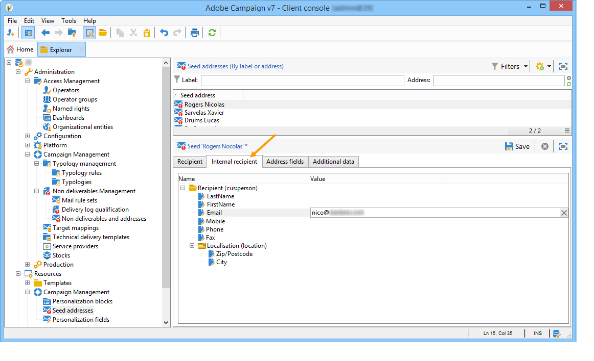

# Seed addresses{#seed-addresses}

If the recipient table is a custom table, additional configurations are required. The **[!UICONTROL nms:seedMember]** schema must be extended. An additional tab is added to the seed addresses for defining the adequate fields, as shown below:



For more on using seed addresses, refer [this section](../../delivery/using/about-seed-addresses.md).

## Implementation {#implementation}

The **nms:seedMember** schema and the linked form which come out-of-the-box are meant to be extended for customer configuration, to reference all necessary fields. The schema definition contains comments detailing its configuration mode.

Definition of the recipients table extended schema: 

```

<srcSchema label="Person" name="person" namespace="cus">
  <element autopk="true" label="Person" name="person">
      <attribute label="LastName" name="lastname" type="string"/>
      <attribute label="FirstName" name="firstname" type="string"/>
    <element label="Address" name="address">
      <attribute label="Email" name="addrEnv" type="string"/>
    </element>
    <attribute label="Code Offer" name="codeOffer" type="string"/>
  </element>
</srcSchema>

```

Apply the following steps:

1. Create an extension of the **nms:seedMember** schema. For more on this, refer to [Extending a schema](../../configuration/using/extending-a-schema.md).
1. In this new extension, add a new element at the root of **[!UICONTROL seedMember]** with the following parameters:

   ```
   name="custom_customNamespace_customSchema"
   ```

   This element must contain the fields required to export the campaigns. These fields should have the same name as the corresponding fields in the external schema. For example, if the schema is **[!UICONTROL cus:person]** , the **[!UICONTROL nms:seedMember]** schema should be extended as follows:

   ```
   
     <srcSchema extendedSchema="nms:seedMember" label="Seed addresses" labelSingular="Seed address" name="seedMember" namespace="cus">
     <element name="common">
       <element name="custom_cus_person">
         <attribute name="lastname" template="cus:person:person/@lastname"/>
         <attribute name="firstname" template="cus:person:person/@firstname"/>
         <attribute name="email" sqlname="myEmailField" template="cus:person:person/address/@addrEnv" xml="false"/>
       </element>
     </element>
     <element name="seedMember">
      <element aggregate="cus:seedMember:common"/>
     </element>
   </srcSchema>
         
   ```

   >[!NOTE]
   >
   >The extension of the **nms:seedMember** schema must comply with the structures of a campaign and a delivery in Adobe Campaign.

   >[!IMPORTANT]
   >
   >
   >    
   >    
   >    * During the extension, you must specify an **SQL name (@sqlname)** for the 'email' field. The SQL name must differ from the 'sEmail' that is reserved for the recipient schema.
   >    * You must update the database structure with the schema created when extending **nms:seedMember**.
   >    * In the **nms:seedMember** extension, the field containing the email address must have **name="email"** as an attribute. The SQL name must be different from 'sEmail' which is already used for the recipient schema. This attribute must be immediately declared under the **`<element name="custom_cus_person" />`** element.
   >    
   >

1. Modify the **[!UICONTROL seedMember]** form accordingly to define a new "Internal recipient" tab in the **[!UICONTROL Seed addresses]** window. For more on this, refer to [Form structure](../../configuration/using/form-structure.md).

   ```
   
   <container colcount="2" label="Internal recipient" name="internal"
                xpath="custom_cus_person">
       <input colspan="2" editable="true" nolabel="true" type="treeEdit">
         <container label="Recipient (cus:person)">
           <input xpath="@last name"/>
           <input xpath="@first name"/>
           <input xpath="@email"/>
         </container>
       </input>
     </container>
   
   ```

If all attributes of the seed address aren't entered, Adobe Campaign automatically substitutes the profiles: they will be entered automatically during personalization using data from an existing profile.
