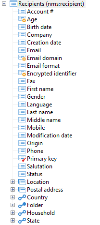

# Structure of a data schema{#structure-of-a-data-schema}

The structure of a data schema is shown in the form of a tree structure. To view it graphically in the Adobe Campaign client console, select the targeted schema and click the **[!UICONTROL Structure]** sub-tab.

As a standard, the fields are displayed first (Active, Activated, etc.) and in alphabetical order. The structuring elements come next (Postal address, Location), and finally the links (Email information, Folder, etc.).

Primary keys are identified by a red key, and foreign keys are identified by a yellow key.

Links are distinguished graphically depending on whether they belong to the table. Those that start from the table, i.e. that have the foreign key in the table, are displayed first (Email information, Folder, Country). "Reverse" collection links (Subscription, Orders, etc.) are displayed at the end.
