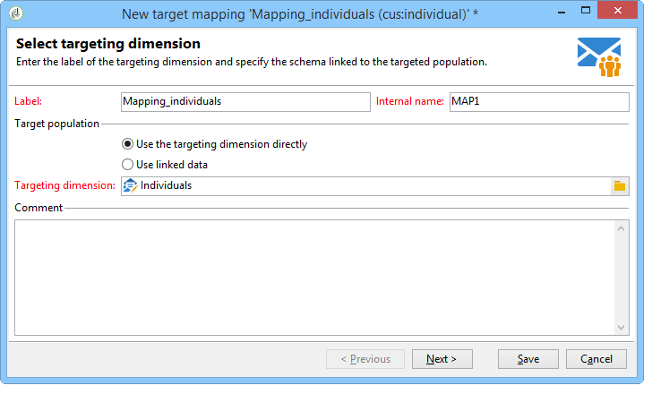
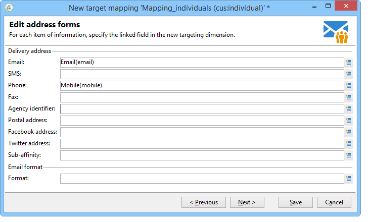
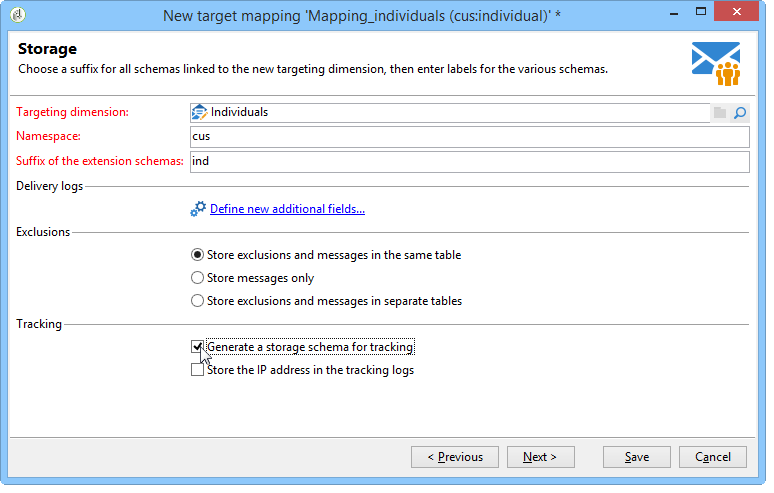
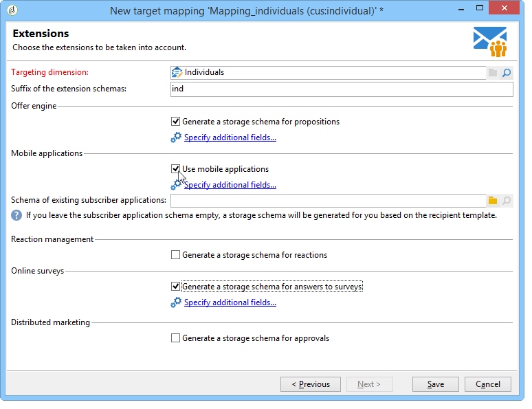
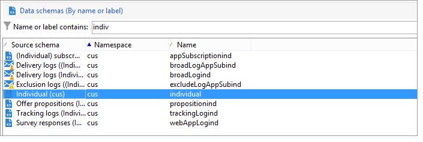
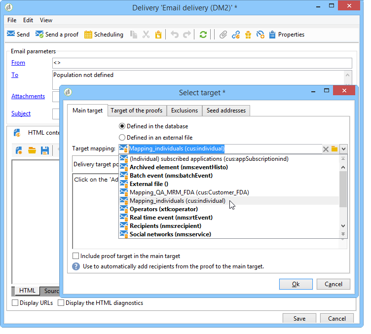

# Target mapping{#target-mapping}


Target mapping creation is necessary in two cases:

* if you use a recipient table other than the one provided by Adobe Campaign,
* if you configure a filtering dimension which is different from the standard targeting dimension on the target mapping screen.

The target mapping creation wizard will help you create all schemas required to use your custom table.

## Creating and configuring schemas linked to the custom table {#creating-and-configuring-schemas-linked-to-the-custom-table}

Before you create a target mapping, several configurations are necessary in order for Adobe Campaign to operate with a new recipient data schema.

To do this, apply the following steps:

1. Create a new data schema which integrates the fields of the custom table that you want to use.

   For further information, refer to [Schema reference (xtk:srcSchema)](../../configuration/using/about-schema-reference.md).

   In our example, we will create a customer schema, a very simple table containing the following fields: ID, first name, last name, email address, mobile phone number. The aim is to be able to send e-mail or SMS alerts to the individuals stored in this table.

   Example schema (cus:individual)

   ```
   
   <srcSchema name="individual" namespace="cus" label="Individuals">
     <element name="individual">
       <key name="id" internal="true">
         <keyfield xpath="@id"/>
       </key>
       <attribute name="id" type="long" length="32"/>
       <attribute name="lastName" type="string" length="100"/>
       <attribute name="firstName" type="string" length="100"/>
       <attribute name="email" type="string" length="100"/>
       <attribute name="mobile" type="string" length="100"/>
     </element>
   </srcSchema>
   
   ```

1. Declare your schema as an external view using the ="true" attribute. Refer to [The view attribute](../../configuration/using/schema-characteristics.md#the-view-attribute).

   ```
   
    <srcSchema desc="External recipient table" namespace="cus" view="true"....>
      ...
    </srcSchema>
   
   ```

1. If you need to add a direct mail address, please use the following type of structure:

   ```
   
   <element advanced="true" name="postalAddress" template="nms:common:postalAddress">
        <attribute expr="SubString(JuxtWords(Smart([../infos/@firstname]), Upper([../infos/@name])), 1, 80)"
                   name="line1"/>
        <attribute expr="Upper([../address/@line2])" name="line2"/>
        <attribute expr="Upper([../address/@line])" name="line3"/>
        <attribute expr="Upper([../address/@line])" name="line4"/>
        <attribute expr="Upper([../address/@line])" name="line5"/>
        <attribute expr="Upper([../address/@line])" name="line6"/>
        <attribute _operation="delete" name="line7"/>
        <attribute _operation="delete" name="addrErrorCount"/>
        <attribute _operation="delete" name="addrQuality"/>
        <attribute _operation="delete" name="addrLastCheck"/>
        <element expr="@line1+'n'+@line2+'n'+@line3+'n'+@line4+'n'+@line5+'n'+@line6"
                 name="serialized"/>
        <attribute expr="AllNonNull2([../address/@line], [../infos/@name])" name="addrDefined"/>
      </element>
   
   ```

1. Click the **[!UICONTROL Administration > Campaign management > Target mappings]** node.
1. Click the **New** button to open the target mapping creation wizard.
1. Enter the **Label** field and select the schema which you have just created in the **Targeting dimension** field.

   

1. In the **Edit address forms** window, select the fields of the schema which match the various delivery addresses. Here, we are able to map the **@email** and **@mobile** fields.

   

1. In the following **Storage** window, enter the **Suffix of the extension schemas** field to differentiate the new schemas from the out-of-the-box schemas provided by Adobe Campaign.

   Click **[!UICONTROL Define new additional fields]** to select the dimension you want to target in your delivery.

   By default, exclusion management is stored in the same tables as messages. Check the **Generate a storage schema for tracking** box if you want to configure storage for the tracking linked to your target mapping.

   
   
   >[!IMPORTANT]
   >
   >Adobe Campaign does not support multiple recipient schemas, know as targeting schemas, linked to the same broadlog and/or trackinglog schemas. This can otherwise lead to anomalies in data reconciliation afterwards. For more information on this, refer to the [Recommendation and limitations](../../configuration/using/about-custom-recipient-table.md) page.

1. In the **Extensions** window, select the optional schemas that you want to generate (the list of available schemas depends on the modules installed on the Adobe Campaign platform).

   

1. Click the **Save** button to close the wizard.

   The wizard uses the start schema to create all the other schemas required to make the new target mapping work.

   

## Using target mapping {#using-target-mapping}

There are two ways of using the new schema as the target of a delivery:

* Create one or more delivery templates based on mapping
* Select mapping directly during target selection when creating a delivery, as shown below:



**Related topic**

* [Quickly respond to customer requests to access their data](https://helpx.adobe.com/campaign/kb/simplifying-campaign-management-acc.html#Quicklyrespondtocustomerrequeststoaccesstheirdata)
