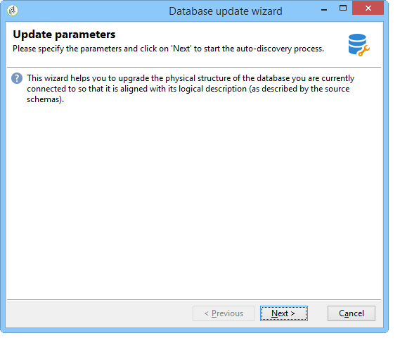
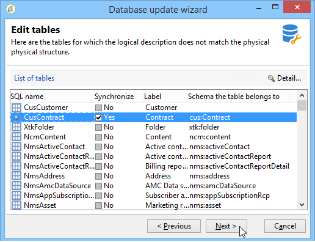
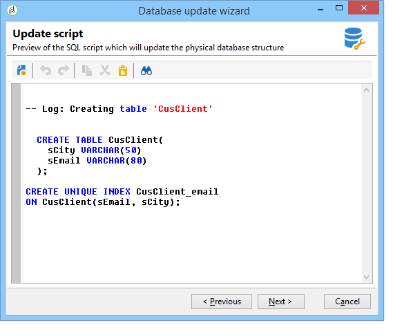
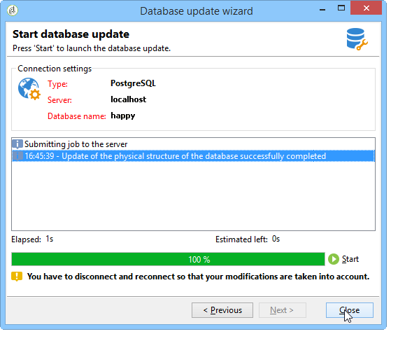

# Updating the database structure{#updating-the-database-structure}

To apply the modifications made to the schemas, launch the database update wizard. This wizard is accessible via **[!UICONTROL Tools > Advanced > Update database structure]** . It checks whether the physical structure of the database matches its logical description and executes the SQL update scripts.

The modules in the database are automatically populated and activated.

The **[!UICONTROL Add stored procedures]** and **[!UICONTROL Import initialization data]** options are used to launch the initial SQL scripts and the data packages executed when the database is created.

You can import a set of data from an external data package. To do this, select **[!UICONTROL Import a package]** and enter the XML file of the package.

Follow the steps and view the database update SQL script:

>[!NOTE]
>
>This is in an editing field and can be modified in order to delete or add SQL code.

Next, launch the database update:

