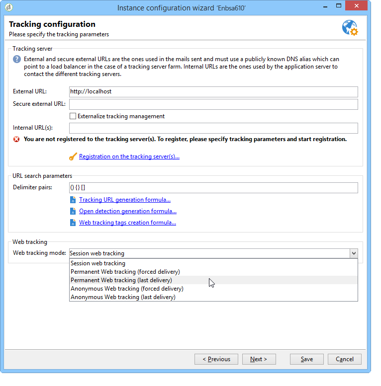
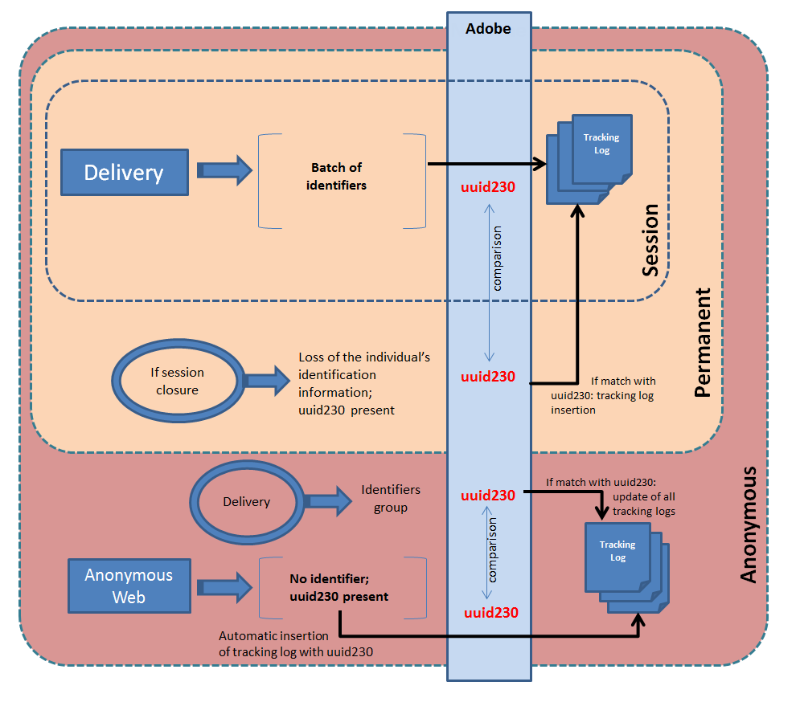

# Web tracking mode{#web-tracking-mode}

Adobe Campaign lets you select a web tracking mode which defines the way in which tracking logs are processed in the application.

There are three available Web tracking modes: **"Session tracking"**,**"Permanent tracking"** and **"Anonymous tracking"**. 



Each mode has specific characteristics. The "permanent" Web tracking mode includes the characteristics of the "session" Web tracking mode, while the "anonymous" mode includes the characteristics of the "permanent" and "session" modes.

>[!IMPORTANT]
>
>The "anonymous" Web tracking mode is enabled by default if the "Leads" package is enabled. In all other cases, the "session" Web tracking mode is enabled by default.
>
>At any time, the default mode can be changed in the instance deployment wizard.

Note that if you are using the **permanent web** or **anonymous** tracking mode, you must add an index to the "sourceID" column (uuid230) in the tracking tables (trackingLogXXX):

1. Identify the tracking table(s) concerned by permanent tracking.
1. Extend the schemas that match these tables by adding the following lines:

```
<dbindex name="sourceId">
 <keyfield xpath="@sourceId"/>
</dbindex>
```

**Permanent** and **Anonymous** Web tracking modes include two options: **Forced delivery** and **Last delivery**.

The **Forced delivery** option enables you to specify the identifier of the delivery (@jobid) during tracking.

The **Last delivery** option lets you link the current tracking log to the last tracked delivery.

**Characteristics of session Web tracking:**

This mode creates a tracking log for people with a session cookie. These are people who clicked a URL in an email sent by Adobe Campaign, thus enabling us to track the following information:

* Delivery ID
* Contact ID
* delivery log
* permanent cookie (uuid230)
* Tracking URL
* date of the tracking log

With this Web tracking mode, if part of the information is missing, no tracking log will be created in the application.

This mode is economical in terms of volume (limited number of records in the trackingLog table) and calculation (no reconciliation).

**Characteristics of the permanent Web tracking mode:**

This Web tracking mode lets you create a tracking log based on the presence of the permanent uuid230 cookie. If a visitor closes their session, Adobe Campaign uses the permanent cookie to recover information on them from previous tracking logs. Adobe Campaign re-inserts a tracking log if the uuid230 of the current session has the same value as a uuid230 already stored in the tracking table.

This means that the visitor needs to have been previously identified in Adobe Campaign (via a delivery) to enable reconciliation on uuid230 values.

By default, searches in previous tracking logs are performed in the "trackingLog" table. If the Leads package is enabled, before searching the "trackingLog" table, Adobe Campaign will search the "incomingLead" table for previous tracking log records.

This mode is costly in terms of calculation during log reconciliation.

**Characteristics of the anonymous Web tracking mode:**

This Web tracking mode lets you retrieve a tracking log linked to anonymous browsing in Adobe Campaign. A tracking log is created automatically for each click on a tracked URL. This log only has the value of the uuid230. During a marketing campaign, a tracking log is created automatically with all identification information (refer to session tracking). Adobe Campaign will automatically search previous logs for a "uuid230" value equal to the value from the tracking log for this marketing campaign. If identical values are found, all previous tracking logs are entered with all the information from the marketing campaign tracking log.

This mode is the most costly in terms of calculation and volume.

>[!NOTE]
>
>If the **[!UICONTROL Leads]** package is installed, you need to do the same for the activity table (**crm:incomingLead**)

The following schema sums up the functionalities of all three Web tracking modes:



**Example of Permanent web tracking based on the last delivery:**

Florence receives a delivery, opens the email, clicks the link, browses on the retail site but doesn't make any purchases. The next day, Florence returns to the retail site, browses and makes a purchase. Since permanent web tracking (last delivery) is enabled, all the logs for her second visit will be linked to the delivery that was sent to her the previous day.
