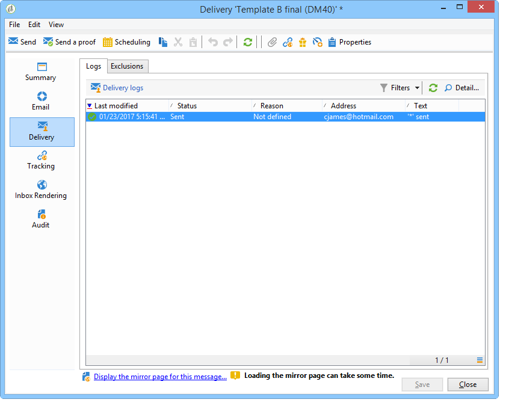
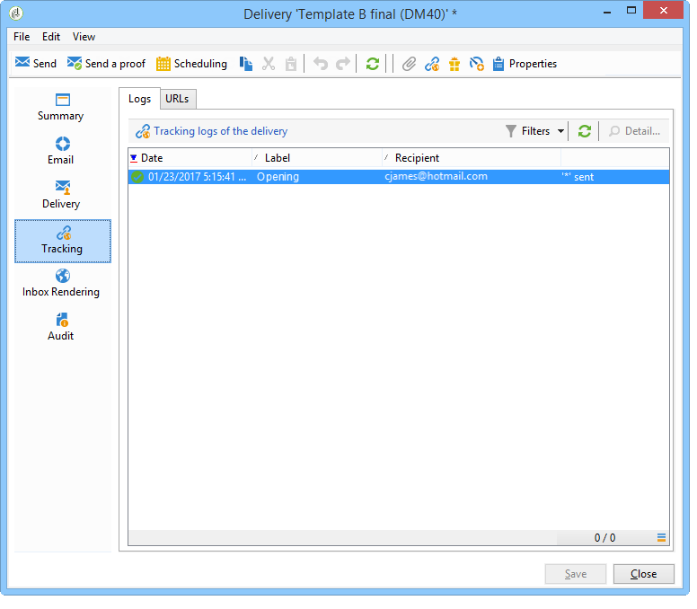
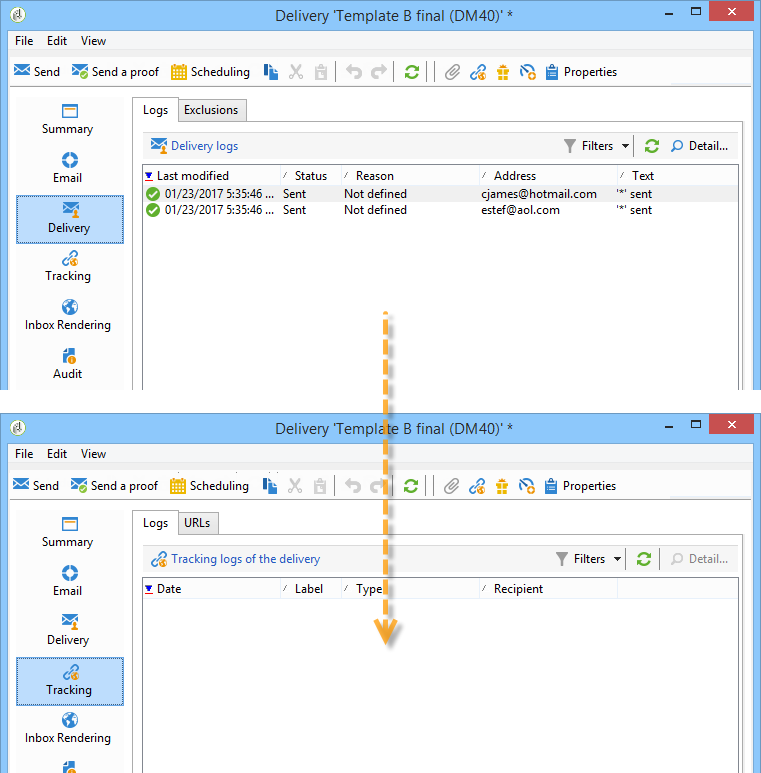

# Analyze the result {#step-8--analyzing-the-result}

Once the test deliveries have been sent, you can check which recipient(s) they have been sent to and whether or not they were opened.

* To find out which recipients have been targeted, open a delivery via the campaign dashboard and click the **[!UICONTROL Delivery]** tab.

  

* To find out whether the delivery has been opened, go to the **[!UICONTROL Tracking]** tab.

  

* Compare with the other delivery.

  

In our example, delivery B has scored the highest open rate. This means that content B will be used for the final delivery.

