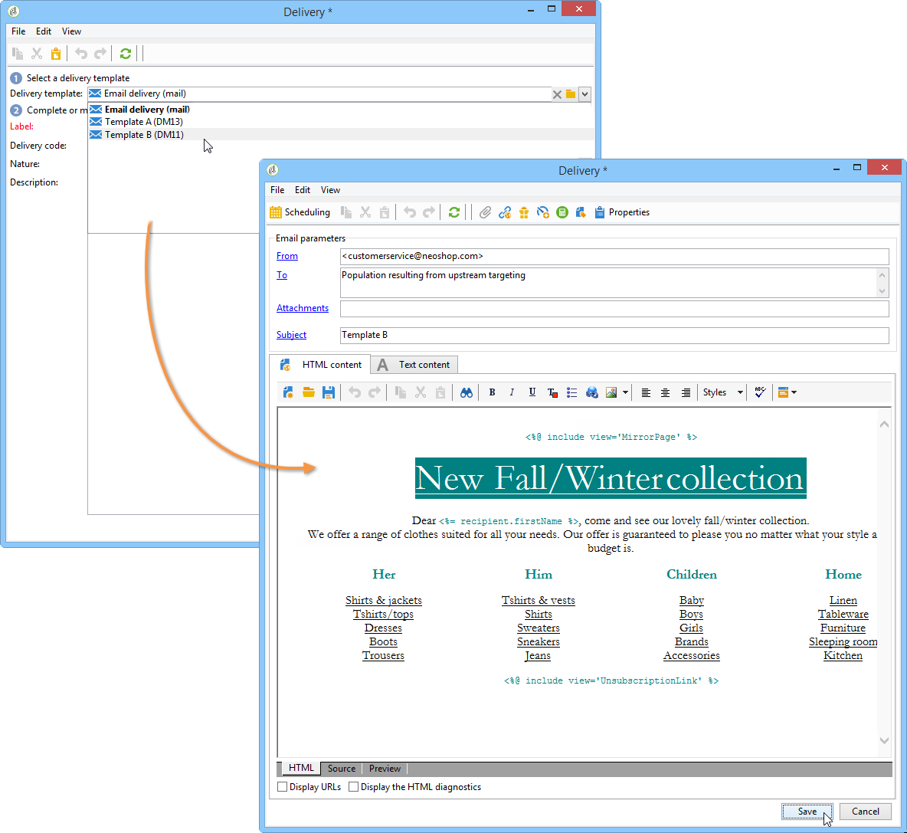
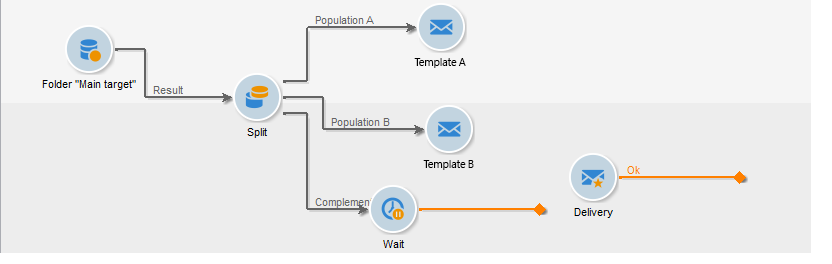
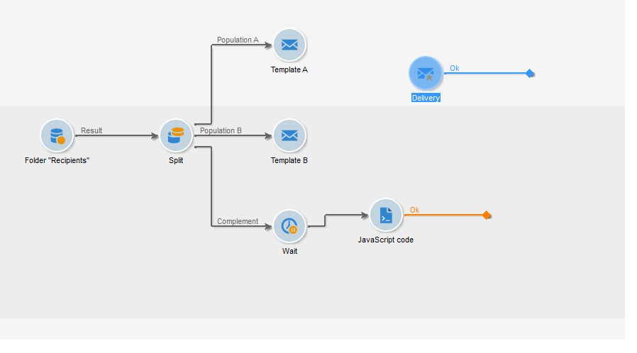

# Configure the deliveries in the workflow {#step-4--configuring-the-deliveries-in-the-workflow}

Once [populations are created](a-b-testing-uc-population-samples.md), you can configure the deliveries. In this use case, the first two deliveries enable you to send different contents to population A and B. The third delivery is the fall-back delivery: it will be sent to the recipients who do not belong to A nor B. Its content will be calculated by a script and will be identical to either A or B, depending on which one scored the highest open rate. We need to configure a wait period for the third delivery, to find out the outcome of deliveries A and B. This is why the third delivery includes a **[!UICONTROL Wait]** activity.

1. Go to the **[!UICONTROL Split]** activity and link the transition destined for population A to one of the email deliveries already in the workflow.

   

1. Double-click the delivery to open it.
1. Using the drop-down list, select the template for delivery A.

   

1. Click **[!UICONTROL Continue]** to view the delivery, then save it.

   

1. Link the transition of the **[!UICONTROL Split]** activity destined for population B to the second email delivery.

   

1. Open the delivery and select the template in delivery B, then save the delivery.

   

1. Link the transition destined for the remaining population to the **[!UICONTROL Wait]** activity.

   

1. Open the **[!UICONTROL Wait]** activity and configure a 5-day waiting period.

   

1. Link the **[!UICONTROL Wait]** activity to the **[!UICONTROL JavaScript code]** activity.

   

You can now create the script. [Learn more](a-b-testing-uc-script.md).
