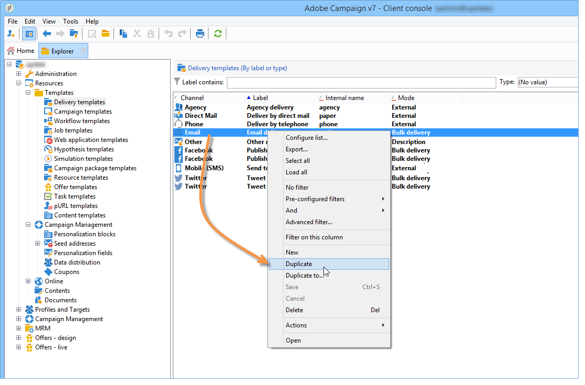
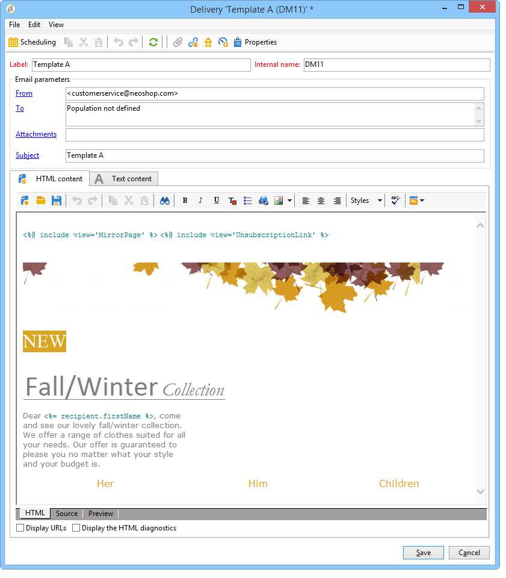

# Create the delivery templates {#step-3--creating-two-delivery-templates}

We now want to create two delivery templates. Each template will be referenced in an **[!UICONTROL Email delivery]** activity linked to the **[!UICONTROL Split]** activity. For more on this, refer to [this section](about-templates.md).

1. Browse to the **[!UICONTROL Resources > Delivery template]** folder.
1. Duplicate the **[!UICONTROL Email]** delivery template.

   

1. Create the content to be used for delivery A.

   

1. Repeat this process to create a template for delivery B.

   

You can now configure the deliveries in the workflow. [Learn more](a-b-testing-uc-configuring-deliveries.md).
