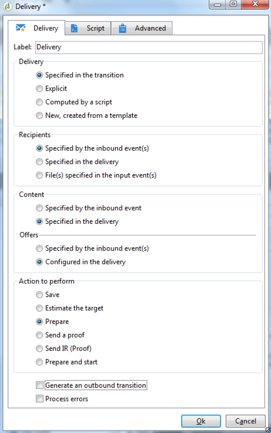

# Defining the final delivery {#step-6--defining-the-final-delivery}

Once the script is created to select the A/B test winner, you can define the parameters of the final delivery.

1. Connect the **[!UICONTROL JavaScript code]** activity to the remaining **[!UICONTROL Delivery]** activity.
1. Open the **[!UICONTROL Delivery]** activity.
1. Uncheck the **[!UICONTROL Generate an outbound transition]** option to finish the workflow with this activity.
1. Leave the other options to their default values. 

   

By preparing the delivery specified in the transition (defined via the **[!UICONTROL Javascript Code]** activity), you will be then able to approve it and to start the sending, as described in the next step.

You can now start the workflow (see [Step 7: Start the workflow](../../delivery/using/a-b-testing-uc-start-workflow.md)).
