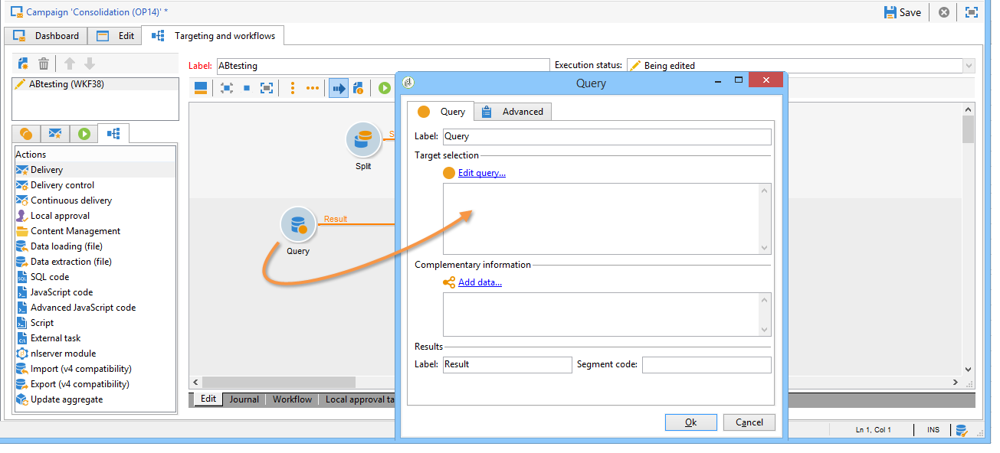
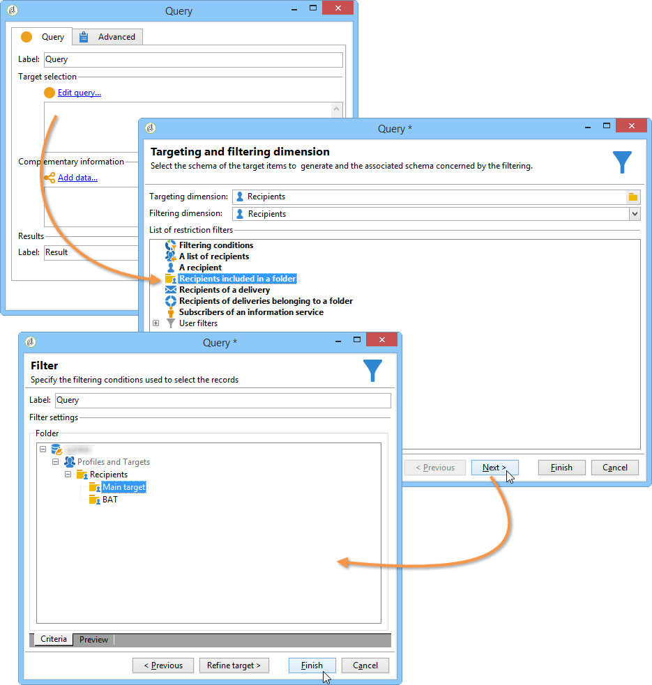
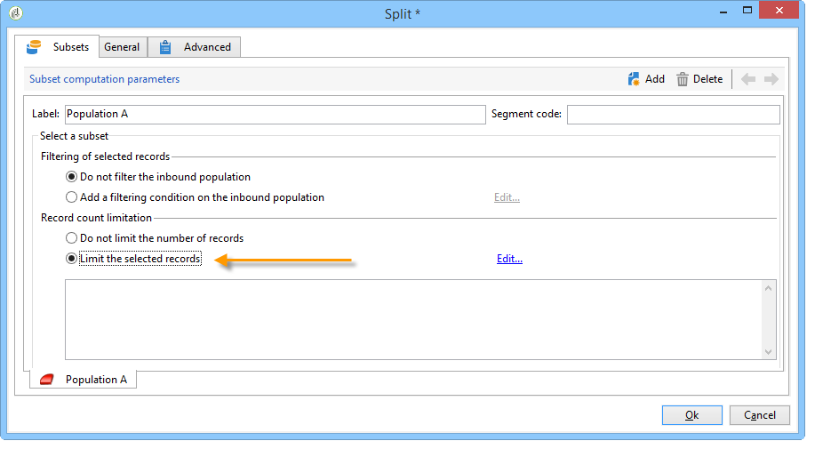
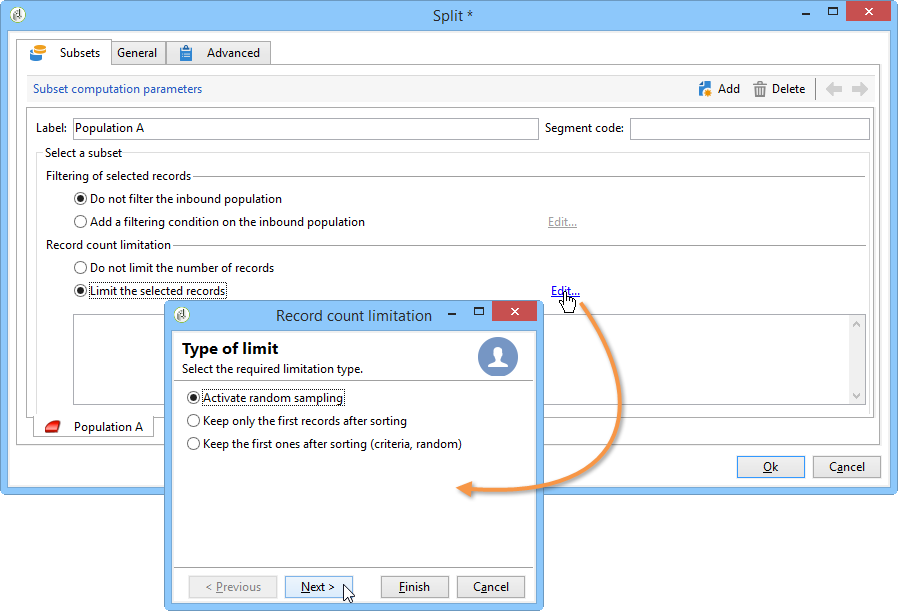
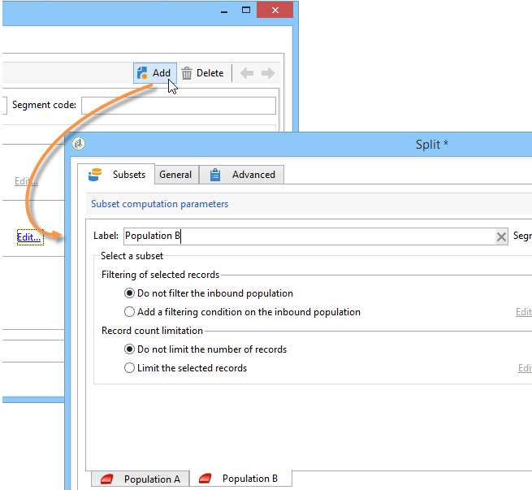
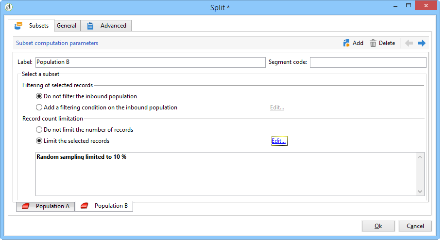
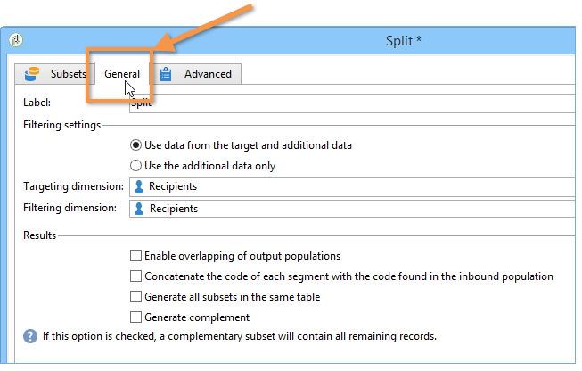

# Configuring population samples {#step-2--configuring-population-samples}

## Configuring the Query activity {#configuring-the-query-activity}

* Double-click the **[!UICONTROL Query]** activity.

  

* Click the **[!UICONTROL Edit query]** link and select the recipients you want to target.

  

* Link the **[!UICONTROL Query]** activity to the **[!UICONTROL Split]** activity.

  

## Configuring the Split activity {#configuring-the-split-activity}

This activity lets you create several populations: the one that receives delivery A, the one that receives delivery B, and the remaining population. Using random selection lets you target just part of the population of each delivery.

1. Creating population A:

    * Double-click the **[!UICONTROL Split]** activity.
    
      

    * In the existing tab, change the label to population A.
    
      

    * Select the **[!UICONTROL Limit the selected records]** option.
    
      

    * Click the **[!UICONTROL Edit]** link, select **[!UICONTROL Activate random sampling]**, and click **[!UICONTROL Next]**.
    
      

    * Set the threshold to 10%, then click **[!UICONTROL Finish]**.
    
      

1. Creating population B:

    * Click **[!UICONTROL Add]** to create a new tab for population B.
    
      

    * Limit the population to 10% as previously.
    
      

1. Creating the remaining population:

    * Go to the **[!UICONTROL General]** tab.
    
      

    * Select **[!UICONTROL Generate complement]**.
    
      

    * Change the label to specify that this population includes neither A nor B, and click **[!UICONTROL OK]** to close the activity.
    
      

You can now create the two delivery templates (see [Step 3: Create two delivery templates](../../delivery/using/a-b-testing-uc-delivery-templates.md)).
