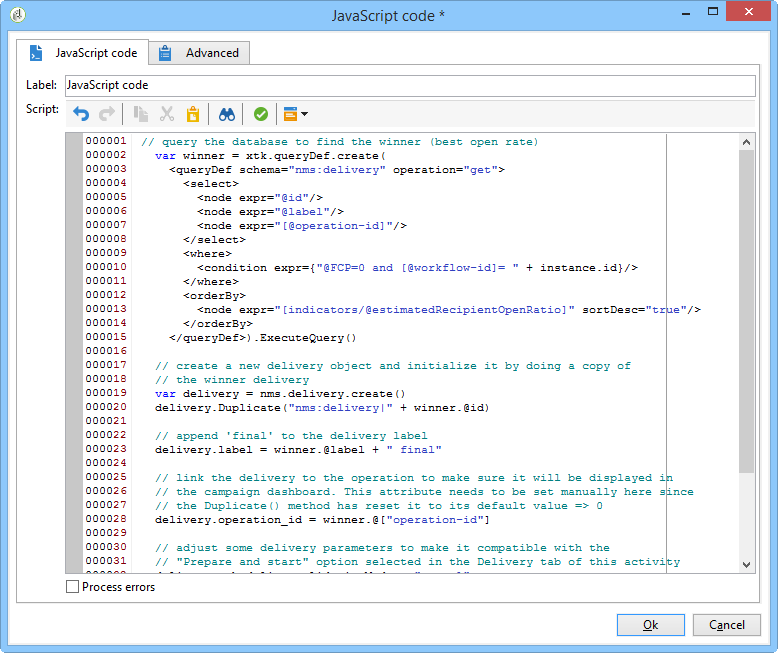
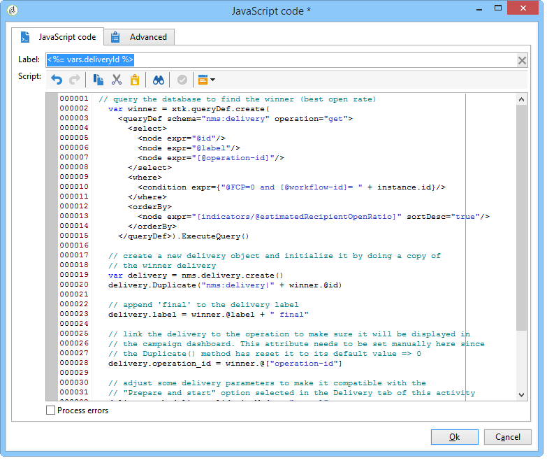

# Creating the script {#step-5--creating-the-script}

The choice of the delivery content destined for the remaining population is calculated by a script. This script recovers the information concerning the delivery with the highest rate of opens and copies the content into the final delivery.

## Example of a script {#example-of-a-script}

The following script can be used as is in the targeting workflow. For more on this, refer to [Implementation](#implementation).

```
 // query the database to find the winner (best open rate)
   var winner = xtk.queryDef.create(
     <queryDef schema="nms:delivery" operation="get">
       <select>
         <node expr="@id"/>
         <node expr="@label"/>
         <node expr="[@operation-id]"/>
         <node expr="[@workflow-id]"/>
       </select>
       <where>
         <condition expr={"@FCP=0 and [@workflow-id]= " + instance.id}/>
       </where>
       <orderBy>
         <node expr="[indicators/@estimatedRecipientOpenRatio]" sortDesc="true"/>
       </orderBy>
     </queryDef>).ExecuteQuery()
   
   // create a new delivery object and initialize it by doing a copy of
   // the winner delivery
   var delivery = nms.delivery.create()
   delivery.Duplicate("nms:delivery|" + winner.@id)

   // append 'final' to the delivery label
   delivery.label = winner.@label + " final"

   // link the delivery to the operation to make sure it will be displayed in
   // the campaign dashboard. This attribute needs to be set manually here since 
   // the Duplicate() method has reset it to its default value => 0
   delivery.operation_id = winner.@["operation-id"]
   delivery.workflow_id = winner.@["workflow-id"]

   // adjust some delivery parameters to make it compatible with the 
   // "Prepare and start" option selected in the Delivery tab of this activity
   delivery.scheduling.validationMode = "manual"
   delivery.scheduling.delayed = 0
 
   // save the delivery in database
   delivery.save()
 
   // store the new delivery Id in event variables
   vars.deliveryId = delivery.id
```

For a detailed explanation of the script, refer to [Details of the script](#details-of-the-script).

## Implementation {#implementation}

1. Open your **[!UICONTROL JavaScript code]** activity.
1. Copy the script offered in [Example of a script](#example-of-a-script) into the **[!UICONTROL JavaScript code]** window.

   

1. In the **[!UICONTROL Label]** field, enter the name of the script, i.e.

   ```
   <%= vars.deliveryId %>
   ```

   

1. Close the **[!UICONTROL JavaScript code]** activity.
1. Save your workflow.

## Details of the script {#details-of-the-script}

This section details the various parts of the script and their operating mode.

* The first part of the script is a query. The **queryDef** command lets you recover from the **NmsDelivery** table the deliveries created by executing the targeting workflow and to sort them based on their estimated rate of opens, then the information from the delivery with the highest rate of opens is recovered.

  ```
  // query the database to find the winner (best open rate)
     var winner = xtk.queryDef.create(
       <queryDef schema="nms:delivery" operation="get">
         <select>
           <node expr="@id"/>
           <node expr="@label"/>
           <node expr="[@operation-id]"/>
         </select>
         <where>
           <condition expr={"@FCP=0 and [@workflow-id]= " + instance.id}/>
         </where>
         <orderBy>
           <node expr="[indicators/@estimatedRecipientOpenRatio]" sortDesc="true"/>
         </orderBy>
       </queryDef>).ExecuteQuery()
  ```

* The delivery with the highest rate of opens is duplicated.

  ```
   // create a new delivery object and initialize it by doing a copy of
   // the winner delivery
  var delivery = nms.delivery.create()
  delivery.Duplicate("nms:delivery|" + winner.@id)
  ```

* The label of the duplicated delivery is modified, and the word **final** is added to it.

  ```
  // append 'final' to the delivery label
  delivery.label = winner.@label + " final"
  ```

* The delivery is copied into the campaign dashboard.

  ```
  // link the delivery to the operation to make sure it will be displayed in
  // the campaign dashboard. This attribute needs to be set manually here since 
  // the Duplicate() method has reset it to its default value => 0
  delivery.operation_id = winner.@["operation-id"]
  delivery.workflow_id = winner.@["workflow-id"]
  ```

  ```
  // adjust some delivery parameters to make it compatible with the 
  // "Prepare and start" option selected in the Delivery tab of this activity
  delivery.scheduling.validationMode = "manual"
  delivery.scheduling.delayed = 0
  ```

* The delivery is saved in the database.

  ```
  // save the delivery in database
  delivery.save()
  ```

* The unique identifier of the duplicated delivery is stored in the workflow variable.

  ```
  // store the new delivery Id in event variables
  vars.deliveryId = delivery.id
  ```

## Other selection criteria {#other-selection-criteria}

The example above lets you select the content of a delivery based on the rate of opens of emails. You can adapt it to base yourself on other delivery-specific indicators:

* Best click throughput: `[indicators/@recipientClickRatio]`,
* Highest reactivity rate (email open and clicks in the message): `[indicators/@reactivity]`,
* Lowest complaint rate: `[indicators/@refusedRatio]` (use the false value for the sortDesc attribute),
* Highest conversion rate: `[indicators/@transactionRatio]`,
* Number of pages visited following the reception of a message: `[indicators/@totalWebPage]`,
* Lowest unsubscription rate: `[indicators/@optOutRatio]`,
* Transaction amount: `[indicators/@amount]`.

You can now define the final delivery (see [Step 6: Define the final delivery](../../delivery/using/a-b-testing-uc-final-delivery.md)).
