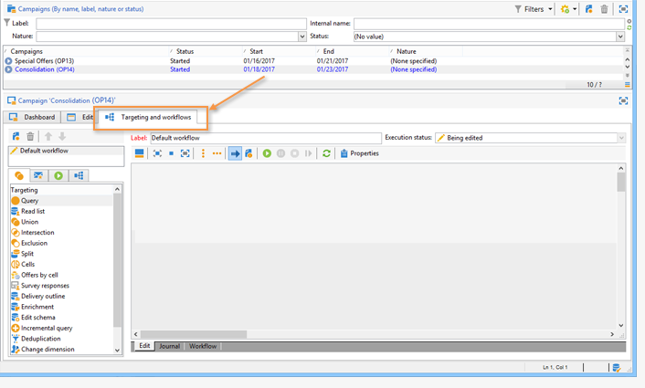
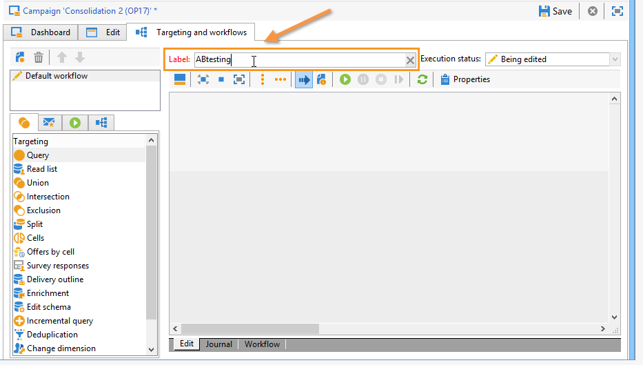
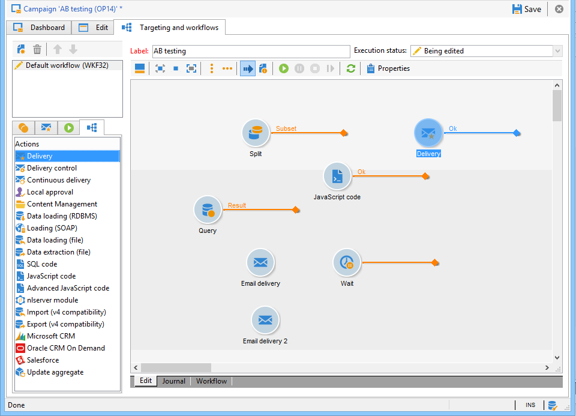

# Creating a targeting workflow {#step-1--creating-a-targeting-workflow}

You need to create your workflow in the **[!UICONTROL Targeting and Workflows]** tab of a campaign. It is made up of a **[!UICONTROL Query]** activity, a **[!UICONTROL Split]** activity linked to two **[!UICONTROL Email delivery]** activities, a **[!UICONTROL Wait]** activity, a **[!UICONTROL JavaScript code]** activity, and a **[!UICONTROL Delivery]** activity.

1. If you haven't already done so, create a campaign (for more on this, refer to this [section](../../campaign/using/setting-up-marketing-campaigns.md#creating-a-campaign)).

   

1. Go to the **[!UICONTROL Targeting and Workflows]** tab.

   

1. Change the label of the existing workflow or click **[!UICONTROL Add]** to create a new one (for more on this, refer to this [section](../../campaign/using/marketing-campaign-deliveries.md#selecting-the-target-population)).

   

1. Use the mouse to drag and drop activities into the workflow diagram, including a **[!UICONTROL Query]** (**[!UICONTROL Target]** tab), a **[!UICONTROL Split]** (**[!UICONTROL Target]** tab), two **[!UICONTROL Email deliveries]** (**[!UICONTROL Deliveries]** tab), a **[!UICONTROL Wait]** activity (**[!UICONTROL Flow Control]** tab), a **[!UICONTROL JavaScript code]** activity (**[!UICONTROL Actions]** tab), and a **[!UICONTROL Delivery]** activity (**[!UICONTROL Actions]** tab).

You can now configure the population samples (see [Step 2: Configure population samples](../../delivery/using/a-b-testing-uc-population-samples.md)).
