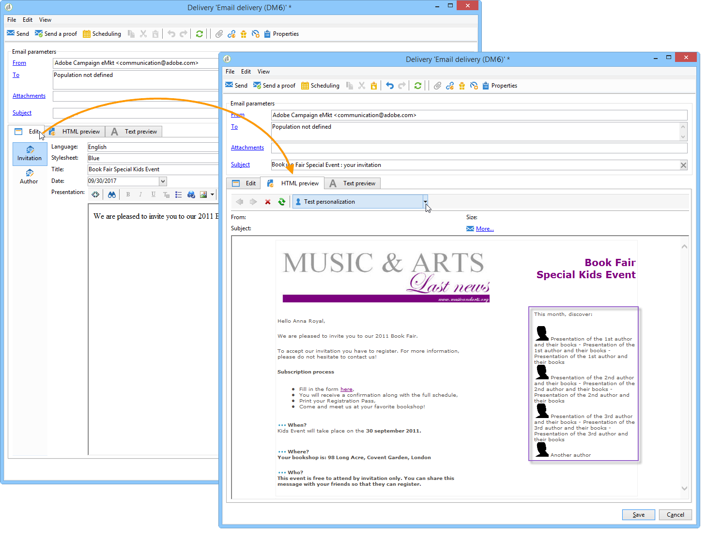

# About content management{#about-content-management}

Adobe Campaign Content Manager module is a specific Campaign Classic [standard package](../../installation/using/installing-campaign-standard-packages.md) that you can install to create recurrent newsletters or website. It can help you to create, validate, and publish your messages.

>[!NOTE]
>
>This section refers to the Content Management module. For more information on how to design email deliveries content, refer to [this section](../../delivery/using/defining-the-email-content.md).

The Content management module incorporates working group, workflow and content aggregation functionality. This allows a message to be formatted automatically: email, mail, SMS, web, etc.

Using content manager in a delivery lets you offer input or selection fields to the operators in charge of content creation. The layout and display of this content as well as any changes made are managed automatically using the stylesheet.

>[!CAUTION]
>
>All changes made to the stylesheet are implemented at delivery level based on the content templates used.

Content management provides the following advantages:

* Structured message editing via input interfaces,
* Separation of data content and how it is presented (generated in XML format),
* Document generation in multiple formats (html, txt, XML, etc.) based on stylesheets to guarantee compliance with graphical charters,
* Recovery and automatic aggregation of external content flows,
* Collaboration with workflow for data validation and checking.

This mode of content creation does however involve a few constraints; including in particular:

* Restricted freedom concerning the final document design,
* The analysis of requirements must be rigorous so that end users will not be inconvenienced by a missing function.
