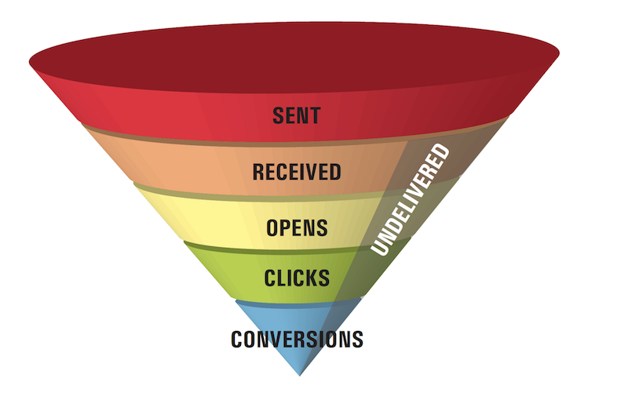
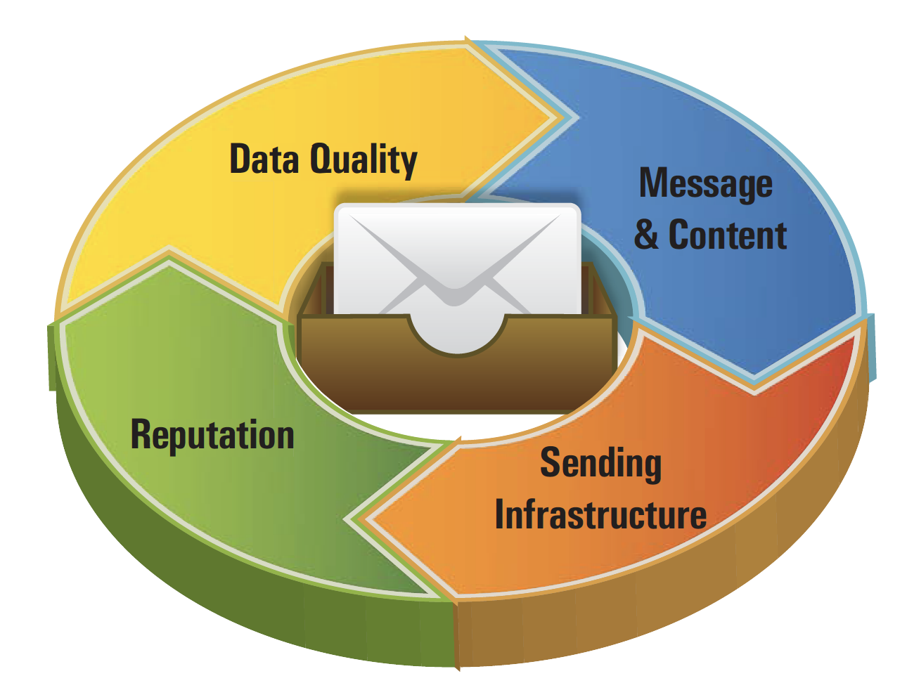

# What is deliverability{#about-deliverability}

Deliverability allows you to measure the success of your campaigns reaching your recipients' inbox without bouncing, or being marked as spam. [Learn why deliverability matters](https://experienceleague.adobe.com/docs/deliverability-learn/deliverability-best-practice-guide/deliverability-strategy-and-definition.html#why-deliverability-matters). 

More precisely, email deliverability refers to the set of characteristics that determine a message's ability to reach its destination, via a personal e-mail address, within a short time, and with the expected quality in terms of content and format.

For a deeper dive on what deliverability is and to learn more on key deliverability terms, concepts, and approaches, refer to the [Adobe Deliverability Best Practice Guide](https://experienceleague.adobe.com/docs/deliverability-learn/deliverability-best-practice-guide/introduction.html).

## How to improve deliverability {#deliverability-key-points}

Deliverability problems are usually linked to measures of protection against spam implemented by internet service providers and mail server administrators.

* For general recommendations on how to design successful email marketing campaigns, refer to [Deliverability strategy and definition](https://experienceleague.adobe.com/docs/deliverability-learn/deliverability-best-practice-guide/deliverability-strategy-and-definition.html).

* For more specific recommendations on how to optimize the deliverability of your Adobe Campaign emails, Adobe recommends using the best practices listed in this section.

>[!NOTE]
>
>Because ISPs are obliged to continuously develop new sophisticated filtering techniques to protect their customers from spammers, email deliverability is characterized by ever-changing criteria and rules. Make sure you refer to the [Adobe Deliverability Best Practice Guide](https://experienceleague.adobe.com/docs/deliverability-learn/deliverability-best-practice-guide/introduction.html) which is regularly updated.

### Deliverability rate

The deliverability rate is the number of messages that hit the recipients’ inboxes compared to the number of messages that were delivered. To improve deliverability, you may work on increasing this rate.

With Adobe Campaign, the deliverability rate depends on numerous factors, particularly:

* Correct configuration of your instances: contact your Adobe representative for assistance.
* Legitimate network configuration: see [this section](../../delivery/using/optimize-delivery.md#network-config) and [Domain setup and strategy](https://experienceleague.adobe.com/docs/deliverability-learn/deliverability-best-practice-guide/transition-process/infrastructure.html#domain-setup-and-strategy).
* Your IP address reputation: see [IP strategy](https://experienceleague.adobe.com/docs/deliverability-learn/deliverability-best-practice-guide/transition-process/infrastructure.html#ip-strategy).
* Quality of the addresses targeted: see [Quarantine management](../../delivery/using/optimize-delivery.md#quarantine-management).
* Low [complaints](https://experienceleague.adobe.com/docs/deliverability-learn/deliverability-best-practice-guide/metrics-for-deliverability/complaints.html) and [hard bounce](https://experienceleague.adobe.com/docs/deliverability-learn/deliverability-best-practice-guide/metrics-for-deliverability/bounces.html#hard-bounces) rates.
* Your message content: see [Controlling email content](../../delivery/using/control-message-content.md).
* Message authentication (SPF, DKIM, DMARC): see [this section](https://experienceleague.adobe.com/docs/deliverability-learn/deliverability-best-practice-guide/transition-process/infrastructure.html#authentication).
* Sender reputation: to learn how main ISPs evaluate a sender reputation, see [this section](https://experienceleague.adobe.com/docs/deliverability-learn/deliverability-best-practice-guide/internet-service-provider-specifics/overview.html).

## Campaign deliverability tools {#deliverability-tools}

<!--Adobe Campaign provides a number of tools designed to ensure optimal deliverability.-->
Adobe Campaign provides several tools to track and improve the deliverability performance of your platform. This page also highlights the main principles you should have in mind to optimize deliverability when using Campaign.

### Carefully build your message

When configuring, designing, and testing your message, make sure you follow the best practices mentioned in the sections listed below. Leveraging all the features provided by Adobe Campaign helps you improve deliverability.

* [Delivery best practices](../../delivery/using/delivery-best-practices.md)
* [Controlling email content](../../delivery/using/control-message-content.md)
* [Inbox rendering](../../delivery/using/inbox-rendering.md)
* [Sending a proof](../../delivery/using/steps-validating-the-delivery.md#sending-a-proof)

### Verify consent through double opt-in {#double-opt-in}

To avoid sending messages to invalid addresses, limit improper communications and improve sender reputation, Adobe recommends implementing a double opt-in mechanism. This method enables you to ensure that your recipients subscribed intentionally.

For more on this, see [Create a subscription form with double opt-in](../../web/using/use-cases--web-forms.md#create-a-subscription--form-with-double-opt-in).

For more on best practices when collecting data from your customers, refer to the [Adobe Deliverability Best Practice Guide](https://experienceleague.adobe.com/docs/deliverability-learn/deliverability-best-practice-guide/first-impressions/address-collection-and-list-growth.html#data-quality-and-hygiene).

### Leverage quarantine management

Adobe Campaign manages a list that gathers spam complaints, hard bounces, and soft bounces that occur consistently.

To protect your deliverability, the recipients whose addresses are on that list are excluded by default from all future deliveries, because sending to these contacts could hurt your sending reputation.

Some internet access providers automatically consider emails to be spam if the rate of invalid addresses is too high. Quarantine therefore allows you to avoid being added to denylist by these providers.

For more on this, refer to the following sections:

* [Understanding delivery failures](../../delivery/using/understanding-delivery-failures.md)
* [Understanding quarantine management](../../delivery/using/understanding-quarantine-management.md)
* [Quarantine vs denylist](../../delivery/using/understanding-quarantine-management.md#quarantine-vs-denylist)

### Use monitoring and reporting tools

Use the features offered by Adobe Campaign to monitor your deliverability.

Adobe Campaign allows you to check how your deliveries are performing through a set of built-in real-time indicators and reports for improved insight on your deliveries.

For more on this, refer to the following sections:

* [Monitoring deliverability](../../delivery/using/monitoring-deliverability.md)
* [About delivery monitoring](../../delivery/using/about-delivery-monitoring.md)
* [About Campaign built-in reports](../../reporting/using/about-campaign-built-in-reports.md)

<!--TO REMOVE
## Background {#background}

Email deliverability presents a major challenge to marketers - whether they're sending a few thousand messages or several billion. One in five messages never reach the inbox, or their intended recipient.

Once relegated as a "technical issue" for the IT department, email deliverability continues to move higher on the marketing agenda. That's because savvy marketers recognize that although many of its elements are technical in nature, deliverability is ultimately a business issue with significant revenue implications.

Consider the email marketing funnel. Deliverability determines the number of messages received, which in turn impacts each subsequent stage of the funnel. Fewer emails received results in fewer opens, fewer clicks, and fewer conversions. **For companies with a large database, the difference between average and great deliverability could literally mean hundreds of thousands to millions of dollars in revenues.**

By settling for average (80%) deliverability, marketers are leaving significant conversions - and dollars - on the table.

What exactly is email deliverability? And how can marketers improve deliverability rates to widen the mouth of the funnel and squeeze more results from their email campaigns?

Email deliverability refers to the set of characteristics that determine a message's ability to reach its destination, via a personal e-mail address, within a short time, and with the expected quality in terms of content and format. These characteristics fall into four main categories: data quality, message and content, sending infrastructure, and reputation. Together, they form the foundation of a successful email deliverability program. This overview outlines the four fundamentals of email deliverability success and offers best practices for reaching the inbox and driving greater revenues from email marketing programs.

-->
