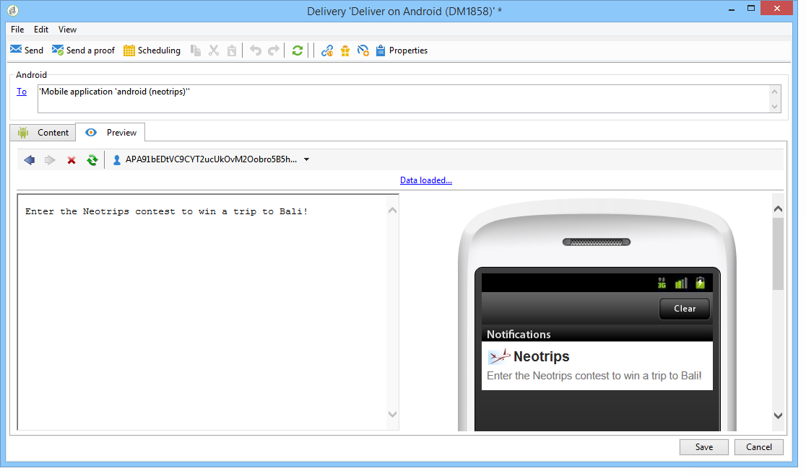
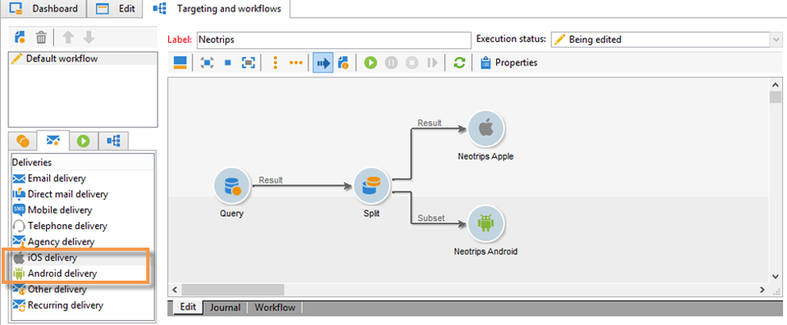

# About mobile app channel{#about-mobile-app-channel}

>[!CAUTION]
>
>This document details the process for integrating your mobile application with the Adobe Campaign platform. It does not provide information on how to create the mobile application or how to configure it for managing notifications. If you would like further information on this, refer to the official Apple ( [https://developer.apple.com/](https://developer.apple.com/)) and Android ( [https://developer.android.com/index.html](https://developer.android.com/index.html)) documentation.

The **Mobile App Channel** lets you use the Adobe Campaign platform to send personalized notifications to iOS and Android terminals via apps. Two delivery channels are available:

* An iOS channel that enables you to send notifications to Apple mobile devices.

  

* An Android channel that enables you to send data messages to Android mobile devices.

  

Corresponding to those two channels there are two delivery activities in the campaign workflows:

>[!NOTE]
>
>Two transactional message templates are also available for transactional messaging.

You can define the application behavior for when the user activates the notification to display the screen that matches the application context. For example:

* A notification is sent to the customer to let them know their parcel has exited the warehouse. Activating the notification opens a page with delivery-related information on it.
* The user has added items to the cart, but left the application without completing the purchase. A notification is sent, telling them that their cart has been abandoned. When they activate the notification, the item is displayed on the screen.

>[!CAUTION]
>
>* You need to make sure the notifications sent to a mobile application are compliant with the prerequisites and conditions specified by Apple (Apple Push Notification Service) and Google (Google Cloud Messaging).
>* Warning: in some countries, the law requires that you inform users of your collected data type mobile applications and the purpose of their processing. You must check the legislation.
>

The **[!UICONTROL NMAC opt-out management]** (mobileAppOptOutMgt) workflow updates notification unsubscriptions on mobile devices. For more information on this workflow, refer to the [Workflows guide](https://helpx.adobe.com/campaign/classic/workflow/using/mobile-app-channel.html).

Adobe Campaign is compatible with both binary and HTTP/2 APNS. For more details on the configuration steps, refer to the [Connectors](https://helpx.adobe.com/campaign/standard/delivery/using/setting-up-mobile-app-channel.html#connectors) section.
