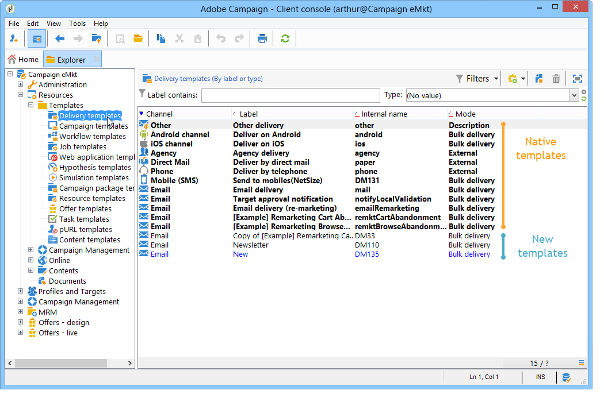

# About templates{#about-templates}

A delivery configuration can be saved in a delivery template in order to be re-used. The template may contain a complete or partial configuration of the delivery.

The delivery template may be executed manually, as described in this chapter, or according to an event (launched at a set time, on arrival of a file at a server, etc.). Delivery templates can be configured via the **[!UICONTROL Resources > Templates > Delivery templates]** node in the tree.

There are two types of template:

1. Adobe Campaign native delivery templates

   Native templates MUST NOT be deleted from the system. They include a minimum configuration for each delivery channel. The administrator can, however, restrict certain functions or offer default values to users (tracking activation, sender email addresses, etc.). Native scenarios appear in bold in the list of templates. They must be duplicated in order to modify them.

1. Predefined delivery templates

   The Adobe Campaign administrator can create new delivery templates. They can be reused by operators (those with suitable access rights) or automatically by server processes. For example, you can configure an email delivery template, and when the user creates a delivery using this template, he simply needs to enter the text or HTML content and then deliver it; the other choices have already been defined by the administrator.

>[!NOTE]
>
>The available templates depend on your access rights, on your instance configuration, and on the context. For instance, when you create an information service, you can link a delivery template for confirmation messages: you may then only access the templates whose target mapping is the subscription mapping. For more on this, refer to [Select a target mapping](selecting-a-target-mapping.md) and [About services and subscriptions](about-services-and-subscriptions.md).
