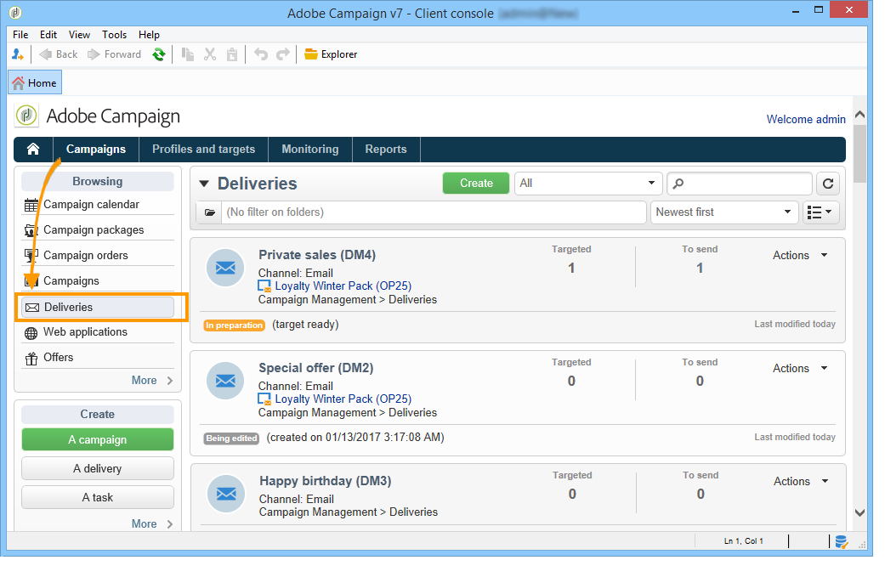
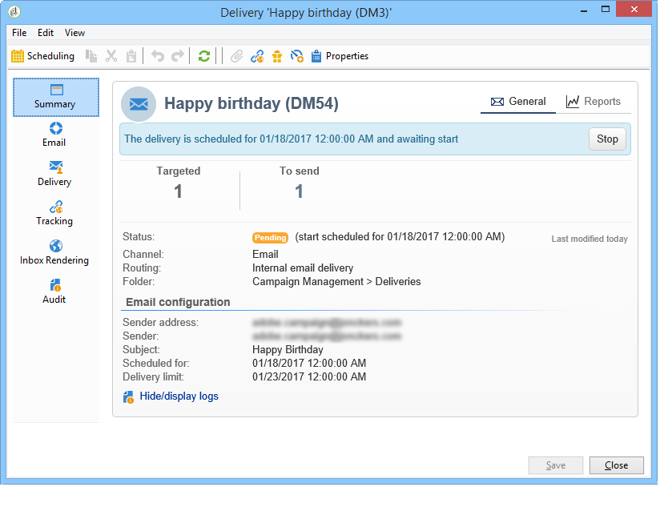
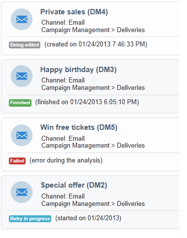
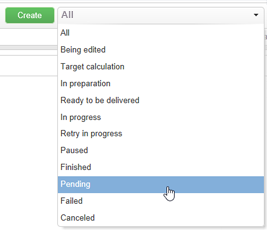
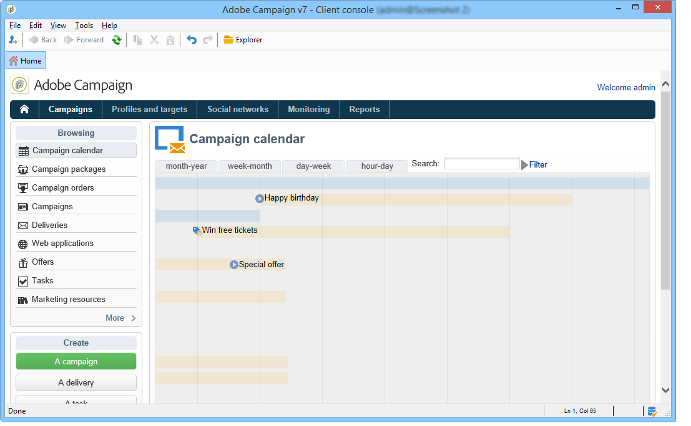
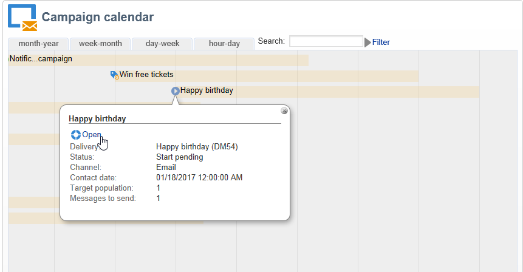

# Accessing deliveries information{#accessing-deliveries-information}

## Accessing the list of deliveries {#accessing-the-list-of-deliveries}

To access the list of deliveries, go to the **Campaigns** universe and click the **Deliveries** link.

If you use [the Explorer view](/platform/using/adobe-campaign-workspace.md#about-adobe-campaign-explorer), you can access all deliveries via the **Campaign management > Deliveries** node in the tree.

>[!NOTE]
>
>Adobe Campaign workspace is presented in [this section](/platform/using/adobe-campaign-workspace.md).

This page lets you access an overall view of your deliveries: it displays all the deliveries in your database. You can view their status, success rate, and modification dates.

>[!NOTE]
>
>Information filtering is presented in [this section](/platform/using/filtering-options.md).

The delivery wizard lets you configure your deliveries, launch the approval process, and send. The content of the wizard depends on the communication channel (email, mobile, push, direct mail) and the operator rights.

To manipulate the deliveries in the list, click a delivery. It opens in a new window and you can confirm its delivery or to pause it, for example. 

Depending on the stage of the delivery cycle, the main possible statuses are:

* Cancelled
* Failed
* Pending 
* Finished
* Paused
* Retry pending
* In progress
* Ready for delivery
* Preparation in progress
* Target calculation
* Being edited

Each status has its own color and label. 

The drop-down list next to the **Create** button enables you to filter deliveries based on their status.

## Accessing the delivery calendar {#accessing-the-delivery-calendar}

To access the delivery calendar, go to the **Campaign** universe and click the **Campaign calendar** link. This calendar displays the breakdown of campaigns over time. You can personalize the display by month, week, or day.

Click the name of a delivery to display the main information about it. You can also open the campaign if necessary by clicking **Open**.

## Accessing deliveries throughput information {#accessing-deliveries-throughput-information}

The information on the **Delivery throughput** page concerns all the deliveries of the platform. To measure the speed at which the messages are delivered, the criteria are the number of messages sent per hour and the size of the messages (in bits per second). In the example below, the first graph shows the successful deliveries in blue, and the number of erroneous deliveries in orange.

You can choose the time slot for which the throughput is calculated. To do this, select the value from the drop-down list, and then click **Refresh**.

