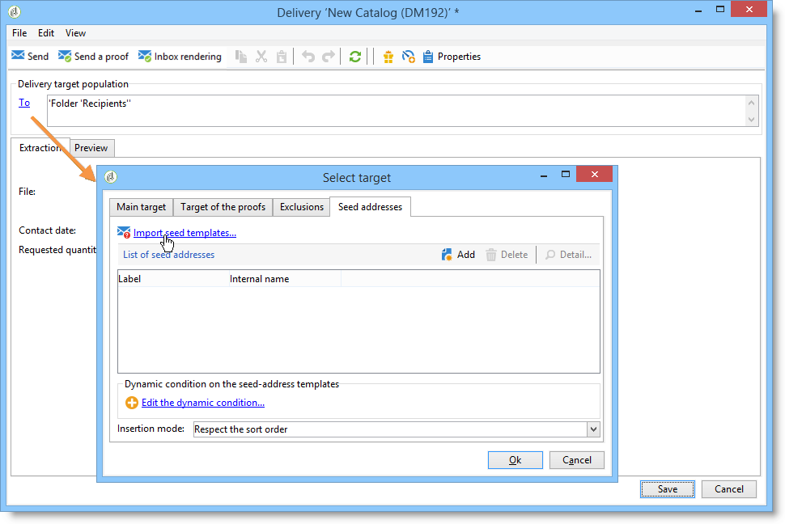
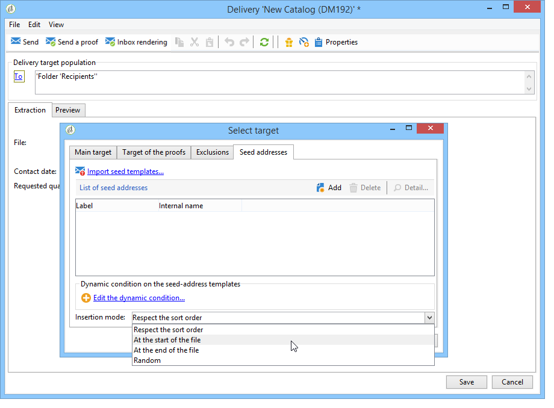
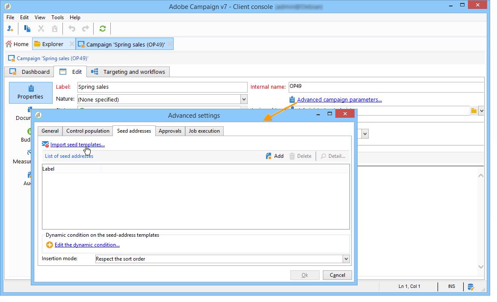

# Add seed addresses{#adding-seed-addresses}

## Seed addresses in a delivery {#seed-addresses-in-a-delivery}

To add specific seed addresses for a delivery, click the **[!UICONTROL To]** link, then select the **[!UICONTROL Seed addresses]** tab.

There are three possible insertion modes:

1. Entering single seed addresses.

   To do this, click the **[!UICONTROL Add]** button and define the content of the address fields. Repeat for each address. For more on this, refer to [this section](../../message-center/using/managing-seed-addresses-in-transactional-messages.md#creating-a-seed-address).

1. Importing address templates and adapt them to suit your needs.

   To do this, click the **[!UICONTROL Import seed templates...]** link and select the folder which contains the address templates. For more on this, refer to [this section](../../delivery/using/creating-seed-addresses.md#creating-seed-address-templates).

   If necessary, once they are added, you can double-click them or click the **[!UICONTROL Detail...]** button to adapt the content of each address.

1. Creating a condition to dynamically select the control addresses to be inserted.

   To do this, click the **[!UICONTROL Edit the dynamic condition...]** link, then enter the seed address selection parameters. For instance, you could include all the seed addresses contained in a specific folder, or seed addresses belonging to a specific department from your organization.

   An example of this is presented in this section: [Use case: select seed addresses on criteria](../../delivery/using/use-case--selecting-seed-addresses-on-criteria.md).

>[!NOTE]
>
>This option is used when the recipient table used is not the default **nms:recipient** table and you are using the Inbox Rendering functionality provided with Adobe Campaign's **[!UICONTROL Deliverability]** module.
>
>For more on this, refer to [Use an external recipient table](../../delivery/using/using-an-external-recipient-table.md) and the documentation on [Inbox rendering](../../delivery/using/inbox-rendering.md).

For deliveries, you can also customize the way addresses are inserted into the extraction file. By default, they are inserted in the sorting order of the output file, but you can choose to insert them at the end or the beginning of the file, or randomly among the recipients of the main target.

## Seed addresses in a campaign {#seed-addresses-in-a-campaign}

To add seed addresses to a target for a campaign, select the operation and click the **[!UICONTROL Edit]** tab.

Click the **[!UICONTROL Advanced campaign settings...]** link and then the **[!UICONTROL Seed addresses]** tab, as shown below:

The seed addresses inserted from the campaign will be added to the target of each delivery in the campaign.
