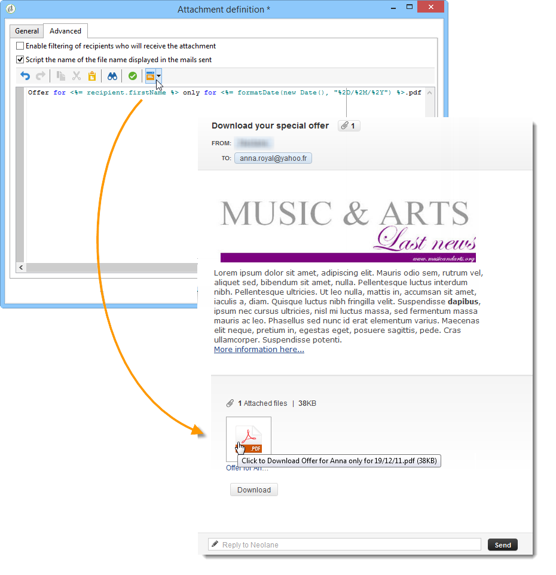

# Attach files to an email{#attaching-files}

## About email attachments {#about-email-attachments}

You can attach one or more files to an email delivery.

>[!NOTE]
>
>To avoid performance issue, it is recommended not to include more than one attachment per email. The recommended threshold can be configured from [the list of Campaign Classic options](../../installation/using/configuring-campaign-options.md#delivery).

There are two possible cases:

* Select a file and attach it to the delivery as it is.
* Personalize the content of the attachment for each recipient. In this case, you need to create a **calculated attachment**: the name of the attachment is computed at the time of delivery for each message depending on the recipient. The content can also be personalized and converted into PDF format at the time of delivery, if you have the **Variable Digital Printing** option.

>[!NOTE]
>
>This type of configuration is generally carried out in the delivery templates. For more on this, refer to [About templates](about-templates.md).

## Attach a local file {#attaching-a-local-file}

To attach a local file to a delivery, follow the steps below.

>[!NOTE]
>
>You can attach several files to a delivery. Attachments can be in any format, included zipped format.

1. Click the **[!UICONTROL Attachments]** link.
1. Click the **[!UICONTROL Add]** button.
1. Click **[!UICONTROL File...]** to select the file to be attached to the delivery.

   

  You can also directly drag and drop the file in the delivery **[!UICONTROL Attachments]** field, or use the **[!UICONTROL Attach]** icon from the delivery wizard toolbar,

  

Once the file is selected, it is immediately uploaded onto the server to be available at the time of delivery. It is listed in the **[!UICONTROL Attachments]** field.

  

## Creating a calculated attachment {#creating-a-calculated-attachment}

When you create a calculated attachment, the name of the attachment can be computed during analysis or delivery of each message and can depend on the recipient. It can also be personalized and converted to PDF.

To create a personalized attachment, follow these steps:

1. Click the **[!UICONTROL Attachments]** link.
1. Click the **[!UICONTROL Add]** button, then select **[!UICONTROL Calculated attachment]**.
1. Select the type of calculation from the **[!UICONTROL Type]** drop-down list:

  

The following options are available:

* **File name is specified when creating the delivery template**
* **The content of the file is personalized and converted to PDF during the delivery of each message**
* **The file name is computed during delivery analysis (it cannot depend on the recipient profile)**
* **File name is computed at the time of delivery for each recipient (it can depend on the recipient)**

### Attaching a local file {#attach-a-local-file}

If the attachment is a local file, select the option: **[!UICONTROL File name is specified when creating the delivery template]**. The file is selected locally and uploaded onto the server. Follow the steps below:

1. Select the file to upload in the **[!UICONTROL Local file]** field.
1. Specify the label if necessary. The label replaces the filename when viewed in messaging systems. If nothing is specified, the filename is used by default.

   

1. If necessary, select **[!UICONTROL Upload file on the server]**, and then click **[!UICONTROL Update on server]** to start the transfer.

   

The file is then available on the server to be attached to the different deliveries created from this template.

### Attaching a personalized message {#attach-a-personalized-message}

The option **[!UICONTROL The file content is personalized and converted into PDF format at the time of delivery for each message]** lets you select a file with personalization fields, such as the last name and first name of the intended recipient.

For this type of attachment, apply the following configuration steps:

1. Select the file to upload.
1. Specify the label if necessary.
1. Select **[!UICONTROL Upload file on the server]**, and then click **[!UICONTROL Update on server]** to start the transfer.
1. You can display a preview. To do this, select a recipient.

   

1. Analyze your delivery and then start it.

   Each recipient receives a personalized PDF attached to the delivery.

   

>[!NOTE]
>
>To avoid performance issue, if you include images downloaded on the fly from a personalized URL as attachment, each image size should not exceed 100,000 bytes by default. This recommended threshold can be configured from [the list of Campaign Classic options](../../installation/using/configuring-campaign-options.md#delivery).

### Attach a calculated file {#attach-a-calculated-file}

You can calculate the attachment name during the delivery preparation. To do this, select the option **[!UICONTROL The file name is calculated during delivery analysis (it cannot depend on the recipient)]**.

>[!NOTE]
>
>This option is used only when the delivery is sent by an external process or a workflow.

1. Specify the label you wish to apply to the attachment. 
1. Specify the access path of the file and its exact name in the definition window.

   >[!IMPORTANT]
   >
   >The file must be present on the server.

   

1. Analyze and then start your delivery.

   The filename computation can be seen in the analysis log.

   

### Attach a personalized file {#attach-a-personalized-file}

When selecting the attachment, you can choose the option **[!UICONTROL The file name is calculated during delivery for each recipient (it can depend on the recipient)]**. You can then map recipient personalization data with the name of the file to send.

>[!NOTE]
>
>This option is used only when the delivery is sent by an external process or a workflow.

1. Specify the label you wish to apply to the attachment.
1. Specify the access path of the file and its exact name in the definition window. If the filename is personalized, you can use the Personalization fields for the relevant values.

   

   >[!IMPORTANT]
   >
   >The file must be present on the server.

1. Analyze and then start your delivery.

   In the example below, the attached file was chosen according to its name as defined using the merge fields.

   

### Attachment settings {#attachment-settings}

For the first two options, you can choose **[!UICONTROL Upload file on the server]** by selecting the appropriate option. The **[!UICONTROL Update the file on the server]** link lets you start uploading.

A message tells you that the file has been uploaded to the server:

For a change of file, a warning message is displayed:

The **[!UICONTROL Advanced]** tab lets you define advanced options on attached files:

* You can define filter options to avoid sending the attached file to all recipients. The option **[!UICONTROL Enable filtering of recipients who will receive the attachment]** activates an input field used to define a recipient selection script, which must be entered in JavaScript.
* You can script the name of the file in order to personalize it.

  Enter your text in the window and use the personalization fields available in the drop-down list. In the following example, the filename is personalized to contain today's date and the name of the recipient.

  
