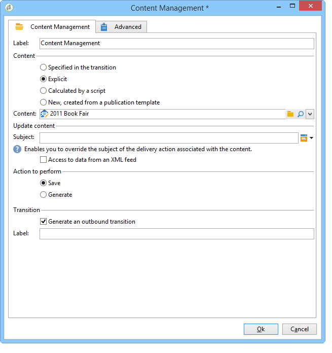
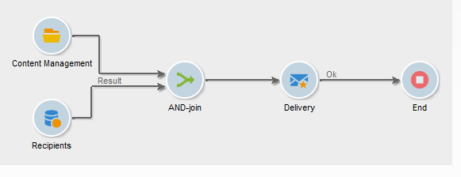
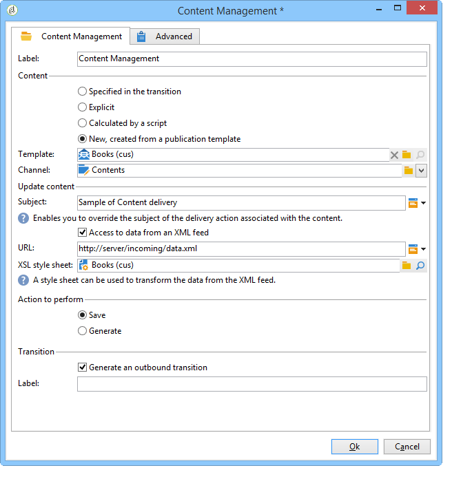
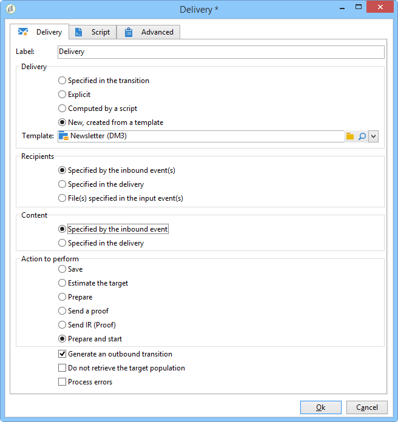
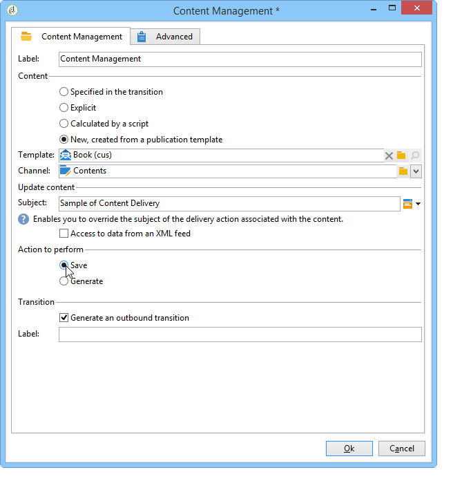
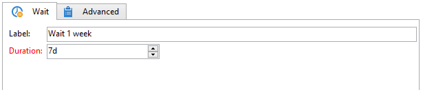
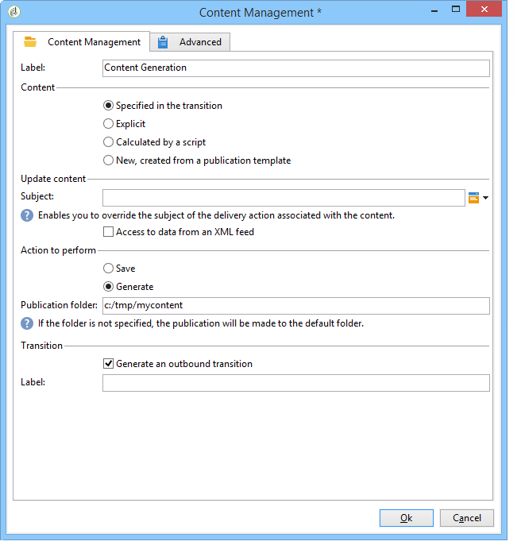
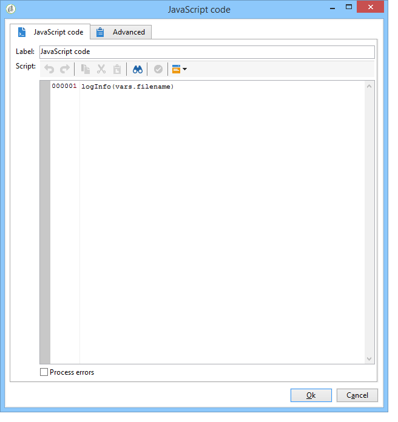
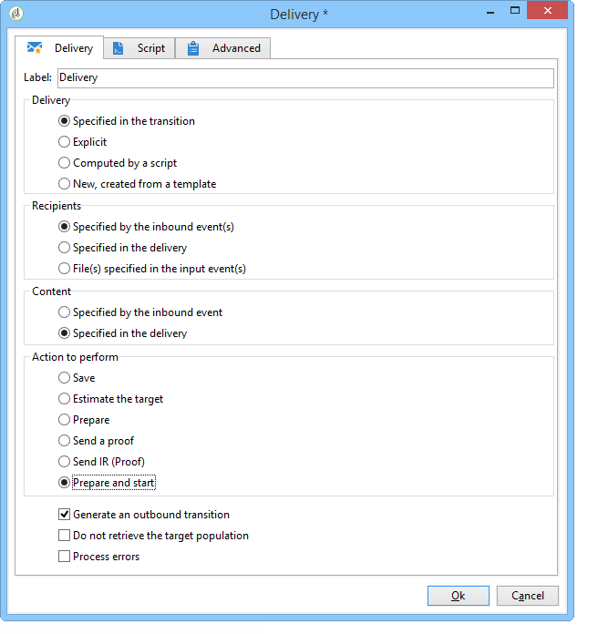
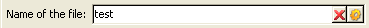

# Automate with workflows{#automating-via-workflows}

## Content management activity {#content-management-activity}

Creating, editing, and publishing content can be automated using a workflow configured via the Adobe Campaign client interface.

The **Content management** activity is accessed via the **[!UICONTROL Tools]** toolbar of the workflow diagram.

Activity properties are broken down into four steps:

* **[!UICONTROL Content]** : lets you enter existing content or create content,
* **[!UICONTROL Update content]** : lets you modify the subject of the content or update the content via an XML data flux,
* **[!UICONTROL Action to execute]** : lets you save or generate content,
* **[!UICONTROL Transition]** : lets you choose whether or not to generate an output transition and give it a name.



### Content {#content}

* **Specified by the transition**

  The content to be used was created previously. Processes will concern the content instance propagated by the incoming event. The content identifier is accessed via the "contentId" variable of the event.

* **Explicit**

  Lets you choose previously created content.

* **Calculated by a script**

  Selects a content instance based on a JavaScript template. The code to be evaluated lets you retrieve the content identifier.

* **New, created via a publication template**

  Creates a new content via a publication template. The content instance will be saved in the populated "String" folder.

### Update the content {#update-the-content}

* **Subject**

  Lets you modify the subject of the delivery action when publishing.

* **Access to the data from an XML feed**

  The content is updated from an XML feed from an external source. A URL must be entered for data downloading to occur.

  An XSL stylesheet can be used to transform the incoming XML data.

### Action to execute {#action-to-execute}

* **Save**

  Saves the created or modified content. The identifier of the saved content is propagated in the "contentId" variable of the outgoing event.

* **Generate**

  Generates the output files for each of the transformation templates with a "File" type publication. The outgoing transition is activated for each generated file, with the following parameters: the identifier of the content saved in the "contentId" variable and the filename in the "filename" variable.

### Transition {#transition}

The **Generate an output transition** option lets you add an output transition to the **[!UICONTROL Content management]** activity to link a new activity to workflow execution. After checking this option, enter a label for the transition.

## Examples {#examples}

### Automate content creation and delivery {#automating-content-creation-and-delivery}

The following example automates the creation and delivery of a content block.



The content is configured via the "Content management" activity:



A new content instance is created via the publication model and the content string folder.

In our example, we have overloaded the delivery subject. It will be taken into account instead of the one entered in the **[!UICONTROL Delivery]** template.

The content is filled in automatically by an XML feed coming from the URL entered:

```
<?xml version='1.0' encoding='ISO-8859-1'?>
<book name="Content automation test" date="2008/06/08" language="eng" computeString="Content automation test">
  <section id="1" name="Introduction">
    <page>Introduction to input forms.</page>
  </section>
</book>
```

The data format does not match the data schema entered in the publication template (**cus:book** in our example); the **`<section>`** element must be replaced with the **`<chapter>`** element. We need to apply the "cus:book-workflow.xsl" stylesheet to make the necessary changes.

Source code of the XSLT stylesheet used:

```
<?xml version="1.0" encoding="utf-8"?>
<xsl:stylesheet version="1.0" xmlns:xsl="http://www.w3.org/1999/XSL/Transform">
 <xsl:output indent="yes" method="xml"  encoding="ISO-8859-1"/>

 <xsl:template match="text()|@*"/>

  <xsl:template match="*">
    <xsl:variable name="element.name" select="name(.)"/>
    <xsl:element name="{$element.name}">
      <xsl:copy-of select="text()|@*"/>
      <xsl:apply-templates/>
    </xsl:element>
  </xsl:template>

  <xsl:template match="book">
  <book name="test">
     <xsl:apply-templates/>
    <book>
 </xsl:template>

  <xsl:template match="section">
    <chapter>
      <xsl:for-each select="@*">
        <xsl:copy-of select="."/>
      </xsl:for-each>
       <xsl:apply-templates/>
    </chapter>
  </xsl:template>
  
</xsl:stylesheet>

```

The final action of the activity is to save the content instance and proceed to the next task.

Targeting is carried out via the **Query** activity.

An **AND-join** activity was added to make sure the delivery is only started once target querying and content updates are complete.

The delivery action is configured via the **Delivery** activity:



A new delivery action is created based on a template.

The delivery template of the activity is used to select the transformation templates of the publication template. Content generation will take into account all HTML and Text templates without delivery templates or those which are referenced with the same template as the activity.

The target to be delivered is entered via the incoming event.

The delivery content is populated via the incoming event.

The last step to completing the activity is to prepare and then launch the delivery.

### Create content for later publishing {#creating-content-and-publishing-it-later}

This example creates a content block and launches file publication after a specific time delay.


The first **Content management** task creates a content instance.



>[!NOTE]
>
>The **[!UICONTROL Publication]** tab of the transformation templates window must be populated with the location of the target to be generated.

A waiting activity is added to pause the next transition for a week. 



Content is entered manually during this time period.

The next task launches content generation.



The content to be published is entered via the incoming transition.

The final action is to generate this content by forcing the publication directory.

The **JavaScript Code** activity retrieves the full name of each generated file.



### Create the delivery and its content {#creating-the-delivery-and-its-content}

This example uses the same concept as the first example, only it creates the delivery action in the first step.


The first **Create delivery** task creates the delivery action.

The fork activity lets you launch target calculation and the creation of the content instance in parallel.

Once the tasks have been executed, the AND-join box activates the **Delivery** task to launch the previously created delivery on content and targeting.



The delivery action to be started is populated via the transition.

The target to be delivered is entered via the incoming event.

The delivery content is populated via the incoming event.

The final action of the activity is to prepare and launch the delivery.

### Import content from FTP {#importing-content-from-ftp}

If your delivery content is available in an HTML file located on FTP or SFTP servers, you can easily load this content into Adobe Campaign deliveries. Refer to [this example](../../workflow/using/loading-delivery-content.md).

### Import content from Amazon Simple Storage Service (S3) connector {#importing-content-from-amazon-simple-storage-service--s3--connector}

If your delivery content is located on Amazon Simple Storage Service (S3) buckets, you can easily load this content into Adobe Campaign deliveries. Refer to [this example](../../workflow/using/loading-delivery-content.md).

## Semi-automatic update {#semi-automatic-update}

Content data can be updated in "semi-automatic" mode. The data is recovered from an XML feed via a URL.

The activation of data recovery is performed manually via the input form.

The aim is to declare an **editBtn** type **`<input>`** field in the form. This control comprises an edit zone and a button to launch processing.

The edit zone lets you populate variable data used to construct the URL of the XML feed of data to be retrieved.

The button executes the **GetAndTransform** SOAP method populated under the **`<input>`** tag.

Control declaration in the form is as follows:

```
<input type="editbtn" xpath="<path>">
  <enter>
    <soapCall name="GetAndTransform" service="ncm:content">
      <param exprIn="<url>" type="string"/>
      <param exprIn="'xtk:xslt|<style sheet>'" type="string"/>
      <param type="DOMElement" xpathOut="<output path>"/>
    </soapCall>
  </enter>
</input>
```

The **GetAndTransform** method must be declared under the **`<enter>`** element of the **`<input>`** tag. This tag takes as parameters the URL of recovery of XML data from an expression constructed dynamically. The second parameter of the function is optional, and references a stylesheet used for an intermediate transformation when the incoming XML data is not in the same format as the content.

The output updates the content based on the path entered in the last parameter.

**Example**: To illustrate this example, we start from the "cus:book" schema.

A semi-automatic update edit control input form is added:



```
<input label="File name" type="editbtn" xpath="/tmp/@name">
  <enter>
    <soapCall name="GetAndTransform" service="ncm:content">
      <param exprIn="'https://myserver.adobe.com/incoming/' + [/tmp/@name] + '.xml'" type="string"/>
      <param exprIn="'xtk:xslt|cus:book-workflow.xsl'" type="string"/>
      <param type="DOMElement" xpathOut="."/>
    </soapCall>
  </enter>
</input>
```

The edit zone lets you enter the name of the file to be retrieved. The URL is constructed based on this name, for example: https://myserver.adobe.com/incomin/data.xml

The format of the data to be retrieved is the same as in example 1 of workflow automation. We shall use the "cus:book-workflow.xsl" stylesheet seen in this example.

The result of job execution updates the content instance from the path '.'.
