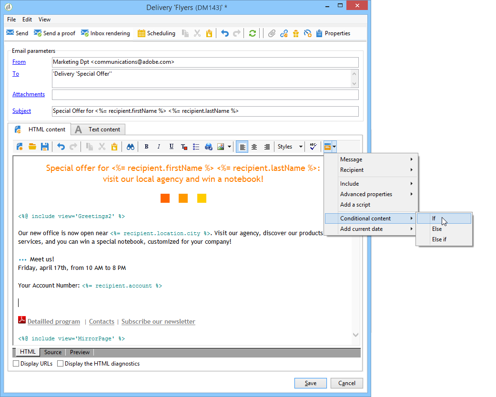
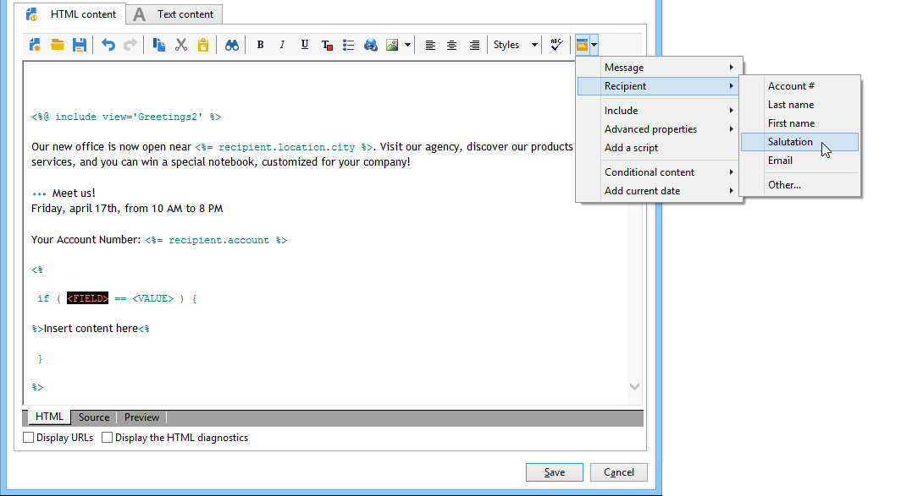
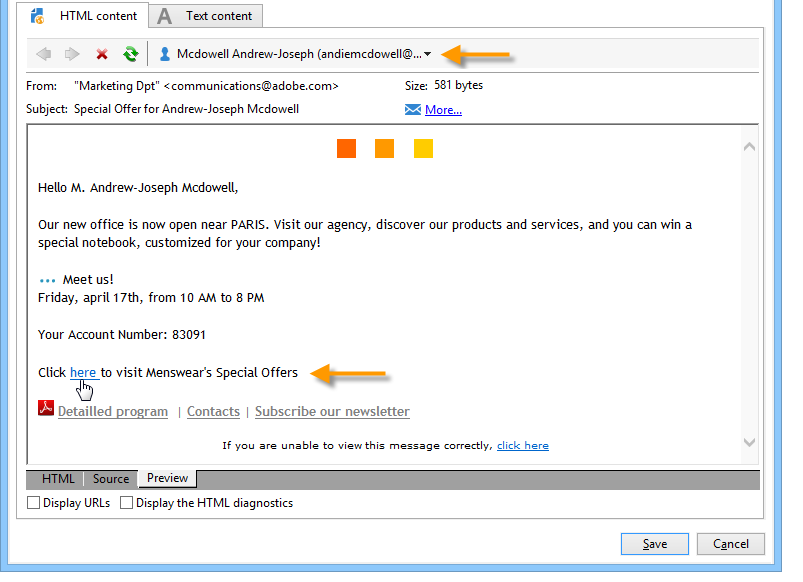
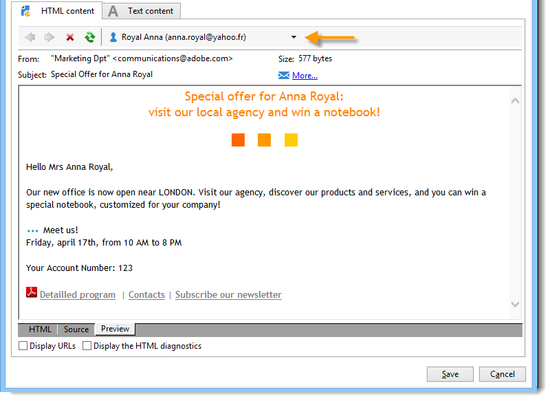
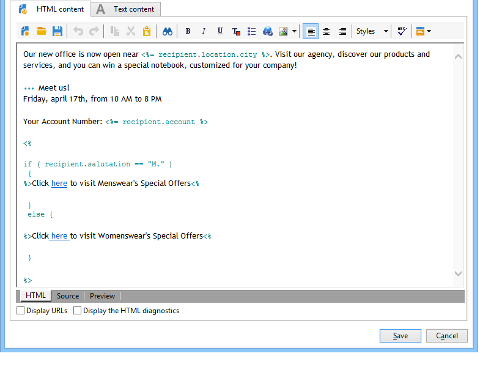

# Conditional content{#conditional-content}

By configuring conditional content fields, you can create dynamic personalization based on the recipient's profile for example. Text blocks and/or images are replaced when a particular condition is satisfied.

 [Discover this feature in video](#conditionnal-content-video)


## Using conditions in an email {#using-conditions-in-an-email}

In the example below, you will learn how to create a message, dynamically personalized on the recipient's gender and interests.

* Display showing "Mr." or "Ms." according to the value of the **[!UICONTROL Gender]** field (M or F) in the data source,
* Personalized assembly of a newsletter or promotional offers according to the interests indicated or detected:

  * Interest 1 -- > Block 1
  * Interest 2 -- > Block 2
  * Interest 3 -- > Block 3
  * Interest 4 -- > Block 4

To create conditional content according to the value of a field, apply the following steps:

1. Click the personalization icon and select **[!UICONTROL Conditional content > If]**.

   

   The personalization elements are inserted in the message body. You must now configure them.

1. Next, fill in the parameters of the **if** expression.

   To do this:

    * Select the first element of the expression, **`<field>`**, (by default, this element is highlighted during insertion of the **if** expression) and click the personalization icon to replace it with the test field.

      

    * Replace **`<value>`** with the value of the field for which the condition will be satisfied. This value must be in quotation marks.
    * Specify the content to be inserted when the condition is satisfied. This could consist of text, an image, a form, a hypertext link, etc.

      

1. Click the **[!UICONTROL Preview]** tab to view the content of the message according to the delivery recipient:

    * Selecting a recipient for which the condition is true:

      

    * Selecting a recipient for which the condition is not true:

      

You can add other cases and define different content according to the values of one or more fields. To do this, use **[!UICONTROL Conditional content > Else]** and **[!UICONTROL Conditional content > Else if]**. These expressions are configured in the same way as the **if** expression.



>[!CAUTION]
>
>To respect JavaScript syntax, the **%> <%** characters must be deleted after adding **Else** and **Else if** conditions.

Click **[!UICONTROL Preview]** and select a recipient to view the conditional content.


## Creating multilingual email {#creating-multilingual-email}

In the example below, you will learn how to create a multilingual email. Content will display in one language or the other depending on the recipient's preferred language.

1. Create an email and select the target population. In this example, the condition to display one version or the other will be based on the **Language** value of the recipient's profile. In this example, these values are set to **EN**, **FR**, **ES**.
1. In the email HTML content, click the **[!UICONTROL Source]** tab and paste the following code:

   ```
   <% if (language == "EN" ) { %>
   <DIV id=en-version>Hello <%= recipient.firstName %>,</DIV>
   <DIV>Discover your new offers!</DIV>
   <DIV><a href="https://www.adobe.com/products/en">www.adobe.com/products/en</A></FONT></DIV><%
    } %>
   <% if (language == "FR" ) { %>
   <DIV id=fr-version>Bonjour <%= recipient.firstName %>,</DIV>
   <DIV>Découvrez nos nouvelles offres !</DIV>
   <DIV><a href="https://www.adobe.com/products/fr">www.adobe.com/products/fr</A></DIV><%
    } %>
    <% if (language == "ES" ) { %>
   <DIV id=es-version><FONT face=Arial>
   <DIV>Olà <%= recipient.firstName %>,</DIV>
   <DIV>Descubra nuestros nuevas ofertas !</DIV>
   <DIV><a href="https://www.adobe.com/products/es">www.adobe.com/products/es</A></DIV>
   <% } %>
   ```

1. Test email content in the **[!UICONTROL Preview]** tab by selecting recipients with different preferred languages.

   >[!NOTE]
   >
   >As no alternative version has been defined in the email content, make sure to filter target population before sending the email.

## Tutorial video {#conditionnal-content-video}

Learn how to add conditional content to a delivery on the example of a multilingual newsletter.

>[!VIDEO](https://video.tv.adobe.com/v/24926?quality=12)

Additional Campaign Classic how-to videos are available [here](https://experienceleague.adobe.com/docs/campaign-classic-learn/tutorials/overview.html).
