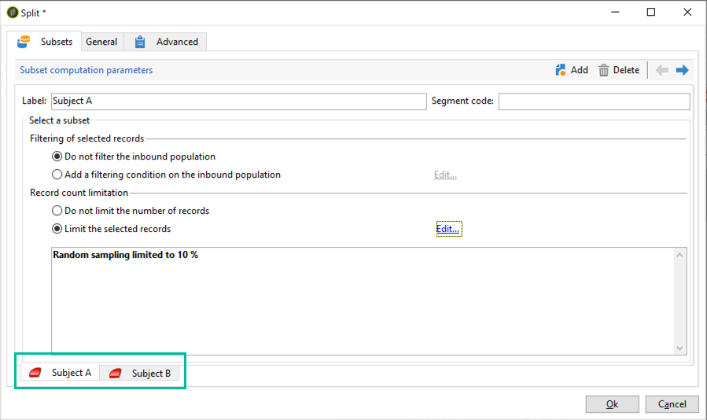
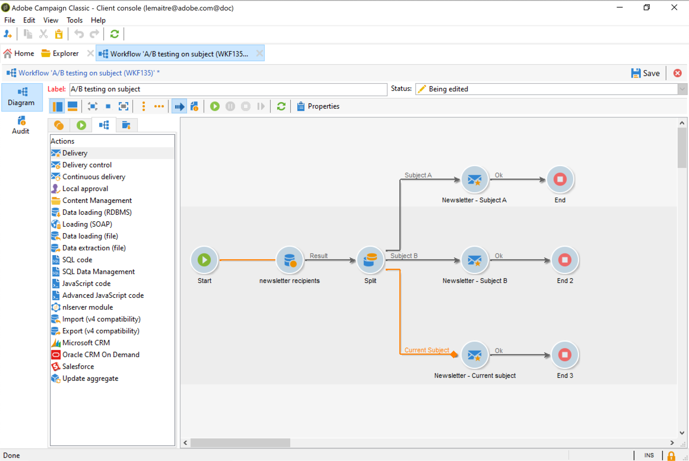

# Configure A/B testing {#configuring-a-b-testing}

This section details how to build a workflow to perform A/B testing. 

1. Create a new workflow then configure a Query activity to target the desired population. Refer to the [Campaign v8 documentation](https://experienceleague.adobe.com/docs/campaign/automation/workflows/wf-activities/targeting-activities/query.html){target="_blank"}.

1. Add a Split activity to divide the targeted population into multiple sub-sets. Refer to the [Campaign v8 documentation](https://experienceleague.adobe.com/docs/campaign/automation/workflows/wf-activities/targeting-activities/split.html){target="_blank"}.

1. Open the activity, then configure each sub-set according to your needs. For more on how to configure a **[!UICONTROL Split]** activity, refer to [this section](../../workflow/using/split.md).

    In this example, we want to test 2 new subjects for a newsletter by presenting each of them to 10% of the targeted population.

   

1. Add a transition in order to send to the remaining population the newsletter with the current subject. To do this, activate the **[!UICONTROL Generate complement]** option from the **[!UICONTROL General]** tab.

   

1. For each sub-set, add the version of the delivery to test.

   

You can now start the workflow. Once the deliveries have been sent, you will be able to track the behavior of the three sub-sets in the delivery logs, in order to see which subject has been the most successful.

Workflows also allow you to automate your processes by automatically identifying the delivery variant that performed better, then sending it to the remaining population. For more on this, refer to this dedicated [use case](a-b-testing-use-case.md).
