# Configuration steps for Android

Once the package is installed, you can define your Android app settings in Adobe Campaign Classic.

>[!NOTE]
>
>To learn how to configure your app for iOS and how to create a delivery for iOS, refer to this [section](../../delivery/using/configuring-the-mobile-application.md).

Key steps are:

1. [Configure the Android external account](#configuring-external-account-android)
1. [Configure the Android service](#configuring-android-service)
1. [Create the mobile app in Campaign](#creating-android-app)
1. [Extend the app schema with additional data](#extend-subscription-schema)

You will then be able to [create an Android rich notification](#creating-android-delivery).

## Configuring Android external account {#configuring-external-account-android}

For Android, two connectors are available:

* The V1 connector which allows one connection per MTA child. 
* The V2 connector which allows simultaneous connections to the FCM server to improve throughput.

To choose which connector you want to use, follow these steps:

1. Go to **[!UICONTROL Administration > Platform > External accounts]**.
1. Select the **[!UICONTROL Android routing]** external account.
1. In the **[!UICONTROL Connector]** tab, fill in the **[!UICONTROL JavaScript used in the connector]** field:

   For Android V2: https://localhost:8080/nms/jsp/androidPushConnectorV2.js

   >[!NOTE]
   >
   > You can also configure it as follow https://localhost:8080/nms/jsp/androidPushConnector.js but we advise you to use version 2 of the connector.

   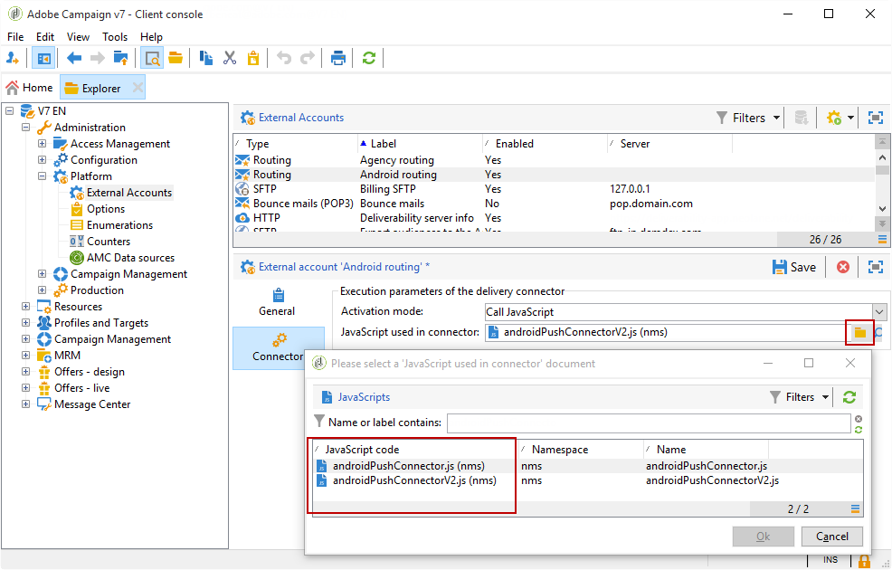

1. For Android V2, one additional parameter is available in the Adobe Server configuration file (serverConf.xml):

    * **maxGCMConnectPerChild**: Maximum limit of parallel HTTP requests to the FCM initiated by each child server (8 by default).

## Configuring Android service {#configuring-android-service}

 [Learn how to configure an Android service in video](https://experienceleague.adobe.com/docs/campaign-classic-learn/getting-started-with-push-notifications-for-android/configuring-an-android-service-in-campaign.html?lang=en#configuring-an-android-service-and-creating-an-android-mobile-application-in-campaign)

1. Go to the **[!UICONTROL Profiles and Targets > Services and subscriptions]** node and click **[!UICONTROL New]**.

   

1. Define a **[!UICONTROL Label]** and an **[!UICONTROL Internal name]**.
1. Go to the **[!UICONTROL Type]** field and select **[!UICONTROL Mobile application]**.

   >[!NOTE]
   >
   >The default **[!UICONTROL Subscriber applications (nms:appSubscriptionRcp)]** target mapping is linked to the recipients table. If you want to use a different target mapping, you need to create a new target mapping and enter it in the **[!UICONTROL Target mapping]** field of the service. For more on creating target mapping, refer to the [Configuration guide](../../configuration/using/about-custom-recipient-table.md).

   

1. Then click the **[!UICONTROL Add]** button to select the application type.

   

1. Create your Android application. For more on this, refer to this [section](../../delivery/using/configuring-the-mobile-application-android.md#creating-android-app).

## Creating Android mobile application {#creating-android-app}

After creating your service, you now need to create your Android application:

1. From your newly created service, click the **[!UICONTROL Add]** button to select the application type.

   

1. Select **[!UICONTROL Create an Android application]** and enter a **[!UICONTROL Label]**.

   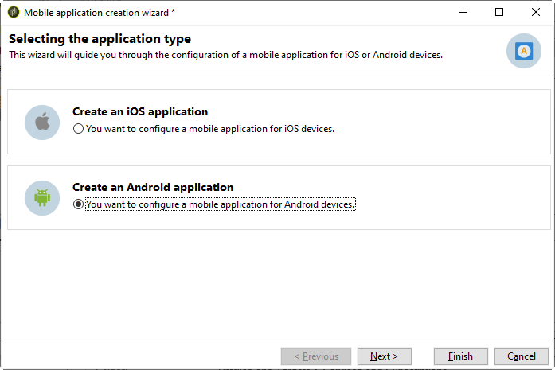

1. Make sure the same **[!UICONTROL Integration key]** is defined in Adobe Campaign and in the application code via the SDK. For more on this, refer to: [Integrating Campaign SDK into the mobile application](../../delivery/using/integrating-campaign-sdk-into-the-mobile-application.md).

    >[!NOTE]
    >
    > The **[!UICONTROL Integration key]** is fully customizable with string value but needs to be exactly the same as the one specified in the SDK.

1. Select the **[!UICONTROL API version]**: HTTP v1 or HTTP (legacy). These configurations are detailed in [this section](#select-api-version)

1. Fill in the **[!UICONTROL Firebase Cloud Messaging the Android connection settings]** fields.

1. Click **[!UICONTROL Finish]** then **[!UICONTROL Save]**. Your Android application is now ready to be used in Campaign Classic.

By default, Adobe Campaign saves a key in the **[!UICONTROL User identifier]** (@userKey) field of the **[!UICONTROL Subscriber applications (nms:appSubscriptionRcp)]** table. This key enables you to link a subscription to a recipient. To collect additional data (such as a complex reconciliation key), you need to apply the following configuration:

### Select the API version{#select-api-version}

After creating service and a new mobile application, you need to configure your mobile application depending on the chosen API version.

* **HTTP v1** configuration is detailed in this [section](../../delivery/using/configuring-the-mobile-application-android.md#android-service-httpv1).
* **HTTP (legacy)** configuration is detailed in this [section](../../delivery/using/configuring-the-mobile-application-android.md#android-service-http).

#### Configure HTTP v1 API{#android-service-httpv1}

To configure the HTTP v1 API version, follow the steps below:

1. In your **[!UICONTROL Mobile application creation wizard]** window, select **[!UICONTROL HTTPV1]** in the **[!UICONTROL API version]** drop-down.

1. Click **[!UICONTROL Load project json file to extract projet details...]** to load directly your JSON key file. For more information on how to extract your JSON file, refer to this [page](https://firebase.google.com/docs/admin/setup#initialize-sdk).

   You can also enter manually the following details:
      * **[!UICONTROL Project Id]**
      * **[!UICONTROL Private Key]**
      * **[!UICONTROL Client Email]**

   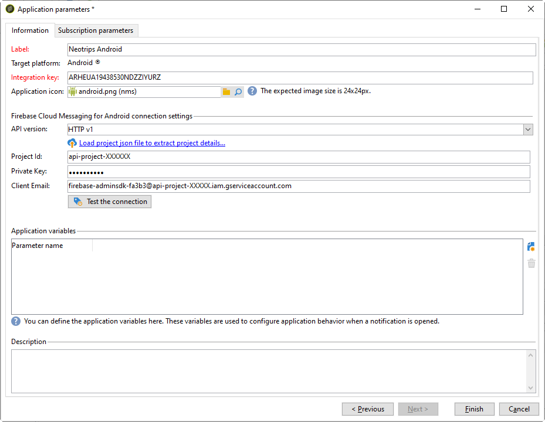

1. Click **[!UICONTROL Test the connection]** to check that your configuration is correct and that the marketing server has access to the FCM.

   >[!CAUTION]
   >
   >For Mid-Sourcing Deployment, the **[!UICONTROL Test connection]** button will not check if the MID server has access to the FCM server.

   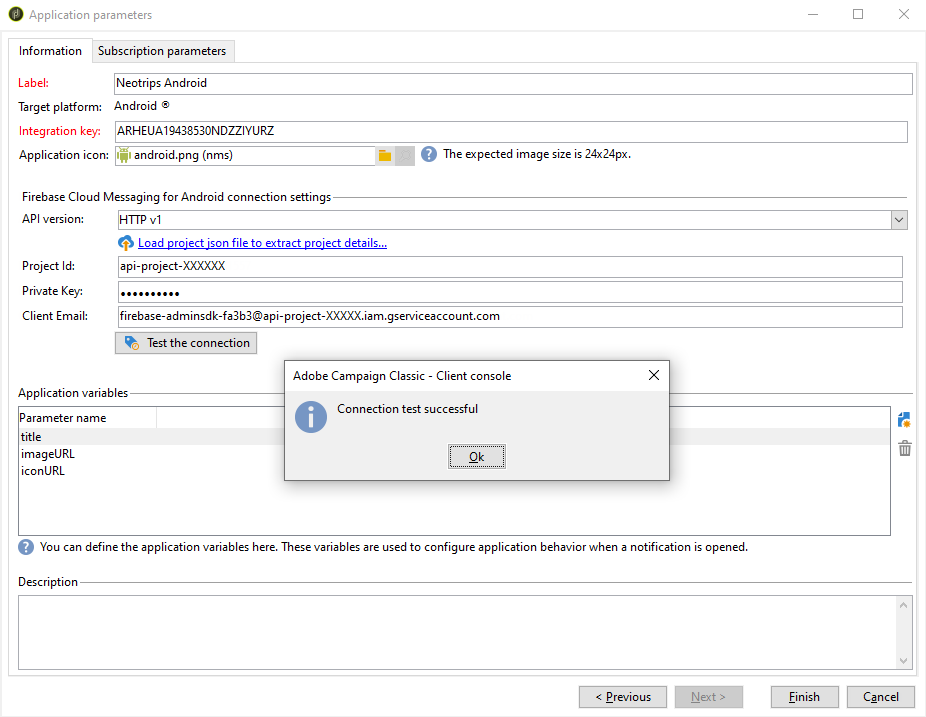

1. As an option, you can enrich a push message content with some **[!UICONTROL Application variables]** if needed. These are fully customizable and a part of the message payload sent to the mobile device.

1. Click **[!UICONTROL Finish]** then **[!UICONTROL Save]**. Your Android application is now ready to be used in Campaign Classic.

Below are the FCM payload names to further personalize your push notification:

| Message type | Configurable message element (FCM payload name) |  Configurable options (FCM payload name) |
|:-:|:-:|:-:|
| data message  | N/A  | validate_only  |
| notification message |  title, body, android_channel_id, icon, sound, tag, color, click_action, image, ticker, sticky, visibility, notification_priority, notification_count   | validate_only |

 
 

#### Configure HTTP (legacy) API{#android-service-http}

To configure the HTTP (legacy) API version, follow the steps below:

1. In your **[!UICONTROL Mobile application creation wizard]** window, select **[!UICONTROL HTTP (legacy)]** in the **[!UICONTROL API version]** drop-down.

1. Enter the **[!UICONTROL Project key]** that was provided by the developer of the mobile application.

1. As an option, you can enrich a push message content with some **[!UICONTROL Application variables]** if needed. These are fully customizable and a part of the message payload sent to the mobile device.

   In the following example, we add **title**, **imageURL** and **iconURL** to create rich push notification and then provides the application with the image, title and icon to display within the notification.

   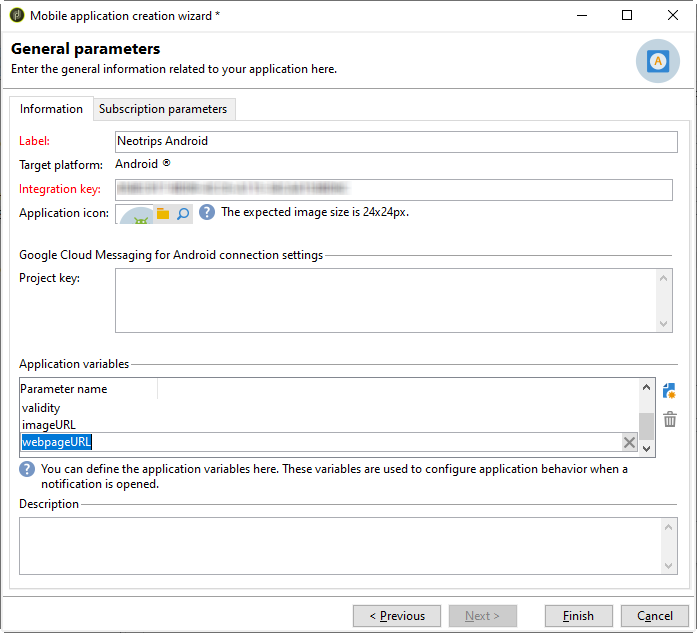

1. Click **[!UICONTROL Finish]** then **[!UICONTROL Save]**. Your Android application is now ready to be used in Campaign Classic.

Below are the FCM payload names to further personalize your push notification:

| Message type | Configurable message element (FCM payload name) |  Configurable options (FCM payload name) |
|:-:|:-:|:-:|
| data message  | N/A  | dryRun  |
| notification message |  title, body, android_channel_id, icon, sound, tag, color, click_action   | dryRun |

 

## Extend the appsubscriptionRcp schema {#extend-subscription-schema}

 [Learn how to extend the appsubscriptionRcp schema in video](https://experienceleague.adobe.com/docs/campaign-classic-learn/getting-started-with-push-notifications-for-android/extending-the-app-subscription-schema.html?lang=en#extending-the-app-subscription-schema-to-personalize-push-notifications)

You need to extend the **appsubscriptionRcp** to define new additional fields to store parameters from the app in Campaign database . These fields will be used for personalization for example. To do this:

1. Create an extension of the **[!UICONTROL Subscriber applications (nms:appsubscriptionRcp)]** schema and define the new fields. Learn more about schema extension in [this page](../../configuration/using/about-schema-edition.md)

1. Define the mapping in the **[!UICONTROL Subscription parameters]** tab.

   >[!CAUTION]
   >
   >Make sure the configuration names in the **[!UICONTROL Subscription parameters]** tab are the same as those in the mobile application code. Refer to the [Integrating Campaign SDK into the mobile application](../../delivery/using/integrating-campaign-sdk-into-the-mobile-application.md) section.

## Creating an Android rich notification {#creating-android-delivery}

With Firebase Cloud Messaging, you can choose between two types of messages:

* **[!UICONTROL Data message]**, handled by the client app.
    Messages are sent directly to the mobile application which will generate and display the android notification to the device. Data messages contain only your custom application variables.

* **[!UICONTROL Notification message]**, handled automatically by the FCM SDK.
     FCM automatically displays the message on your users' devices on behalf of the client app. Notification messages contain a predefined set of parameters and options but can still be further personalized with custom application variables.

For more information on Firebase Cloud Messaging messages types, refer to [FCM documentation](https://firebase.google.com/docs/cloud-messaging/concept-options#notifications_and_data_messages
).

### Creating a data message {#creating-data-message}

1. Go to **[!UICONTROL Campaign management]** > **[!UICONTROL Deliveries]**.

1. Click **[!UICONTROL New]**.

    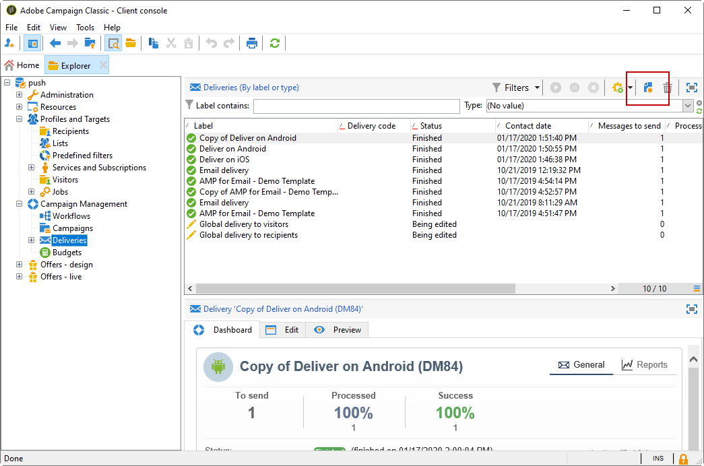

1. Select **[!UICONTROL Deliver on Android (android)]** in the **[!UICONTROL Delivery template]** drop-down. Add a **[!UICONTROL Label]** to your delivery.

1. Click **[!UICONTROL To]** to define the population to target. By default, the **[!UICONTROL Subscriber application]** target mapping is applied. Click **[!UICONTROL Add]** to select your service.

    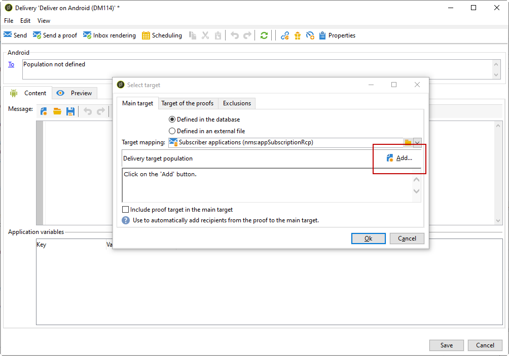

1. In the **[!UICONTROL Target type]** window, select **[!UICONTROL Subscribers of an Android mobile application]** and click **[!UICONTROL Next]**.

1. In the **[!UICONTROL Service]** drop-down, select your previously created service then application and click **[!UICONTROL Finish]**.
    The **[!UICONTROL Application variables]** are automatically added depending on what was added during the configuration steps.

    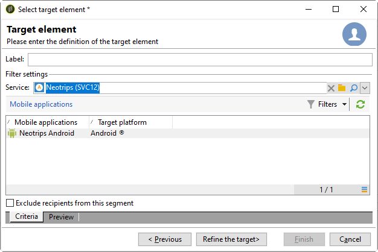

1. Select **[!UICONTROL data message]** as **[!UICONTROL Message Type]**.

1. Edit your rich notification.

    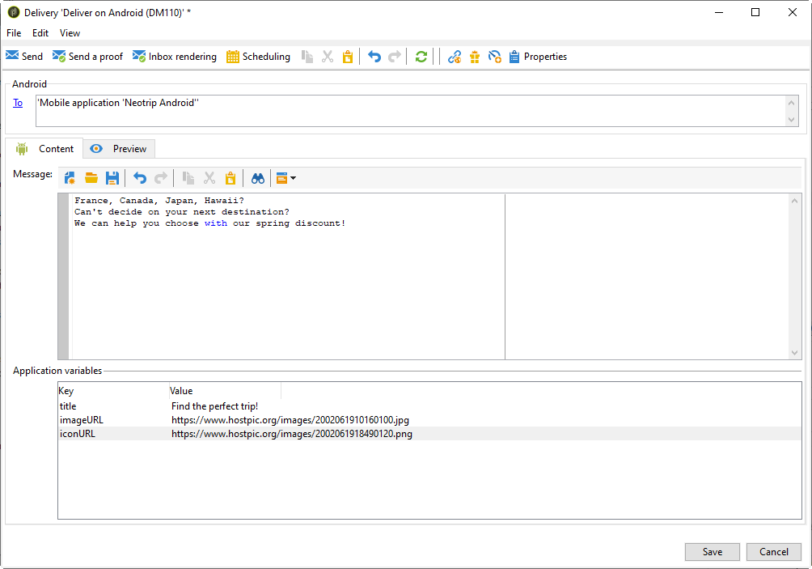

1. You can add information in your previously configured **[!UICONTROL Application variables]** if needed. **[!UICONTROL Application variables]** needs to be configured in the Android service and are a part of the message payload sent to the mobile device.

1. Click **[!UICONTROL Save]** and send your delivery.

The image and web page should be displayed in the push notification when received on the subscribers' mobile Android devices.

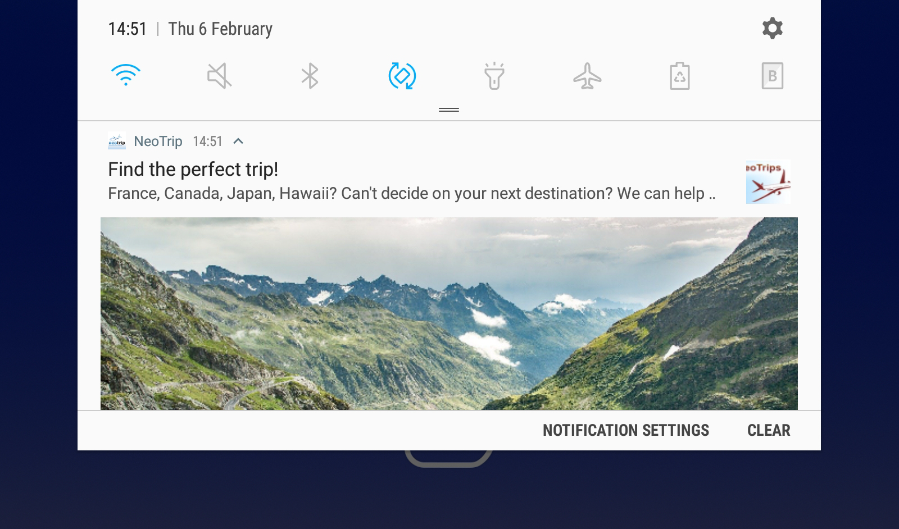

### Creating a notification message {#creating-notification-message}

   >[!NOTE]
   >
   >Additional options for notification message are only available with HTTP v1 API configuration. For more on this, refer to this [section](../../delivery/using/configuring-the-mobile-application-android.md#android-service-httpv1).

 [Learn how to create an Android push notification in video](https://experienceleague.adobe.com/docs/campaign-classic-learn/getting-started-with-push-notifications-for-android/configuring-and-sending-push-notifications.html?lang=en#additional-resources)

1. Go to **[!UICONTROL Campaign management]** > **[!UICONTROL Deliveries]**.

1. Click **[!UICONTROL New]**.

    

1. Select **[!UICONTROL Deliver on Android (android)]** in the **[!UICONTROL Delivery template]** drop-down. Add a **[!UICONTROL Label]** to your delivery.

1. Click **[!UICONTROL To]** to define the population to target. By default, the **[!UICONTROL Subscriber application]** target mapping is applied. Click **[!UICONTROL Add]** to select your service.

    

1. In the **[!UICONTROL Target type]** window, select **[!UICONTROL Subscribers of an Android mobile application]** and click **[!UICONTROL Next]**.

1. In the **[!UICONTROL Service]** drop-down, select your previously created service then application and click **[!UICONTROL Finish]**.

    

1. Select **[!UICONTROL notification message]** as **[!UICONTROL Message Type]**.

1. Add a title and edit your message. Personalize your push notification with the **[!UICONTROL Notification options]**:

   * **[!UICONTROL Channel ID]**: Set your notification's channel ID. The app must create a channel with this channel ID before any notification with this channel ID is received.
   * **[!UICONTROL Sound]**: Set the sound to play when the device receives your notification.
   * **[!UICONTROL Color]**: Set your notification's icon color.
   * **[!UICONTROL Icon]**: Set the notification's icon to display on your profiles' devices.
   * **[!UICONTROL Tag]**: Set the identifier used to replace existing notifications in the notification drawer.
   * **[!UICONTROL Click action]**: Set the action associated with a user click on your notification.

   For more on the **[!UICONTROL Notification options]** and how to fill these fields, refer to [FCM documentation](https://firebase.google.com/docs/reference/fcm/rest/v1/projects.messages#androidnotification).

   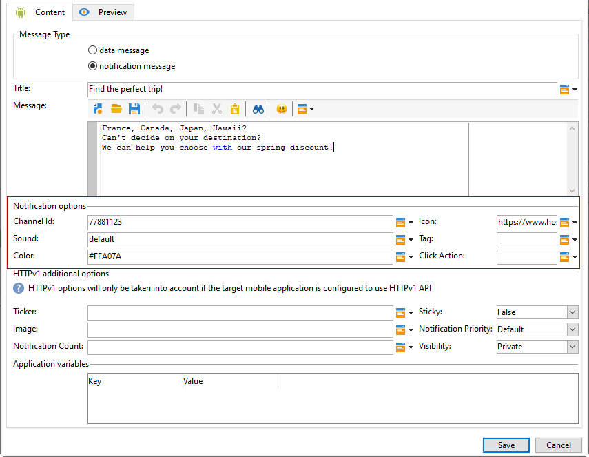

1. If your application is configured with HTTP v1 API protocol, you can further personalize your push notification with the following **[!UICONTROL HTTPV1 additional options]**:

   * **[!UICONTROL Ticker]**: Set the ticker text of your notification. Only available for devices set to Android 5.0 Lollipop.
   * **[!UICONTROL Image]**: Set the image's URL to be displayed in your notification.
   * **[!UICONTROL Notification Count]**: Set the number of new unread information to display directly on the application icon.
   * **[!UICONTROL Sticky]**: Set to true or false. If set to false, the notification is automatically dismissed when the user clicks it. If set to true, the notification is still displayed even when the user clicks it.
   * **[!UICONTROL Notification Priority]**: Set the priority levels of your notification to default, minimum, low or high. For more on this, refer to [FCM documentation](https://firebase.google.com/docs/reference/fcm/rest/v1/projects.messages#NotificationPriority).
   * **[!UICONTROL Visibility]**: Set the visibility levels of your notification to public, private or secret. For more on this, refer to [FCM documentation](https://firebase.google.com/docs/reference/fcm/rest/v1/projects.messages#visibility).

   For more on the **[!UICONTROL HTTP v1 additional options]** and how to fill these fields, refer to [FCM documentation](https://firebase.google.com/docs/reference/fcm/rest/v1/projects.messages#androidnotification).

   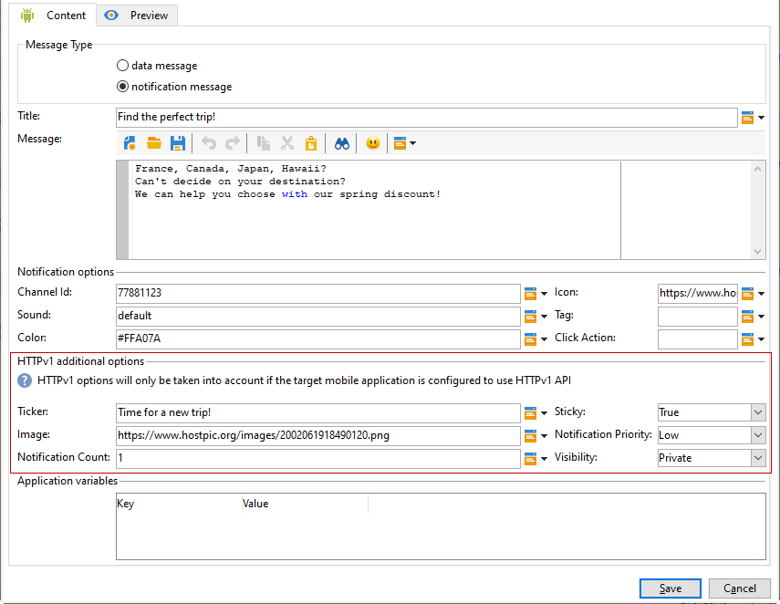

1. You can add information in your previously configured **[!UICONTROL Application variables]** if needed. **[!UICONTROL Application variables]** needs to be configured in the Android service and are a part of the message payload sent to the mobile device.

1. Click **[!UICONTROL Save]** and send your delivery.

The image and web page should be displayed in the push notification when received on the subscribers' mobile Android devices.
