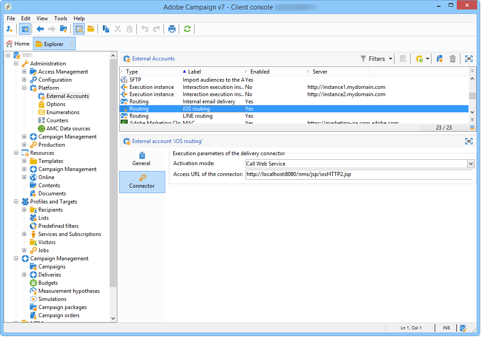
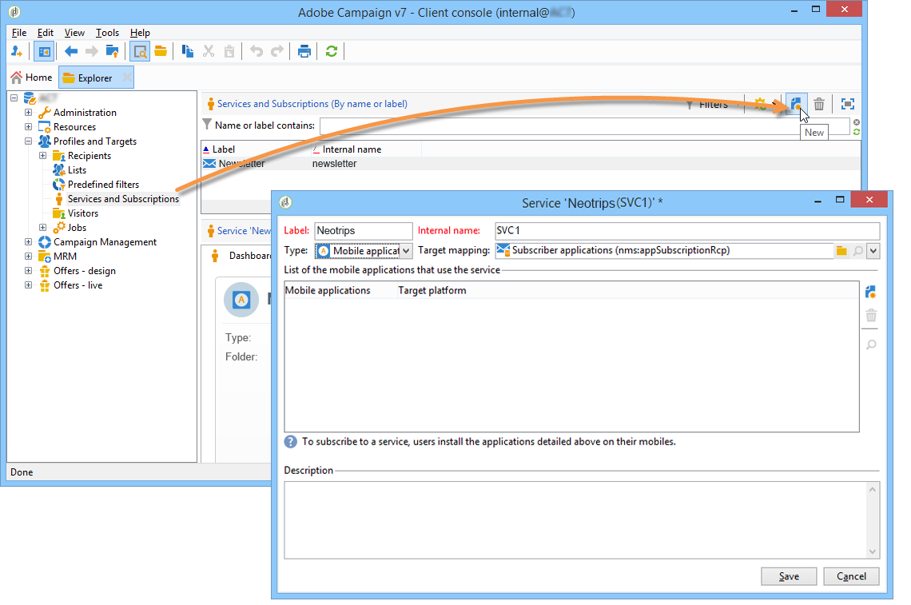
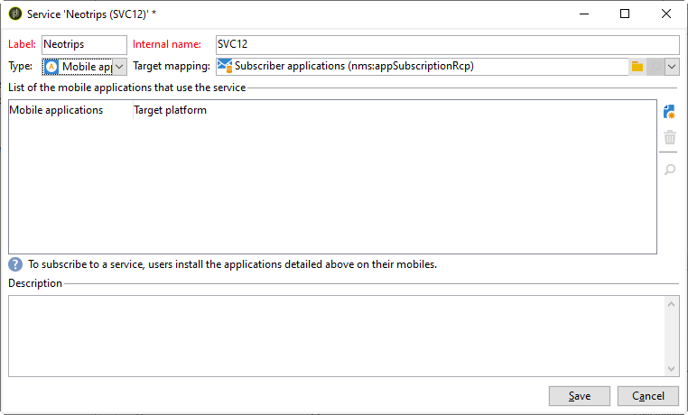
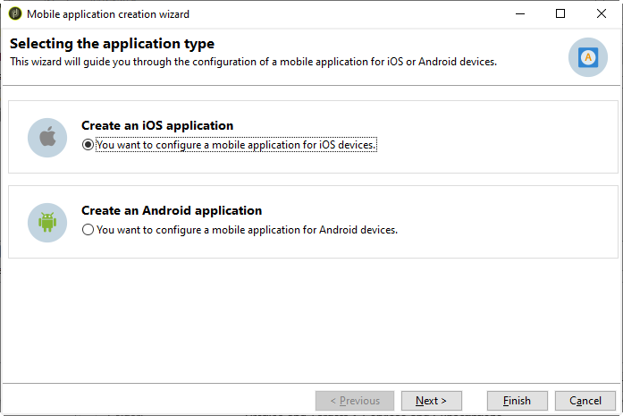
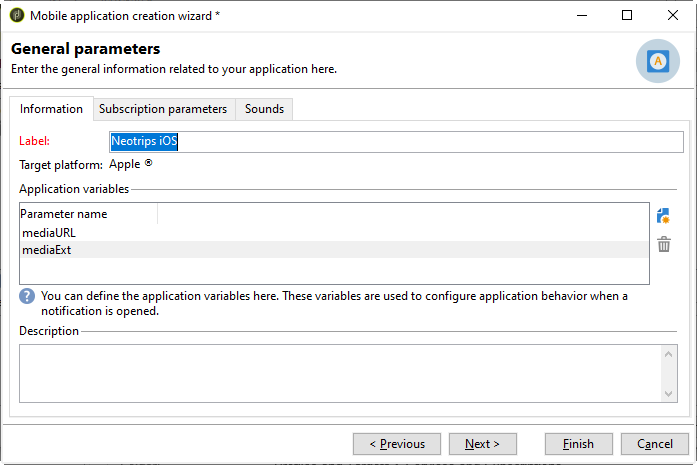
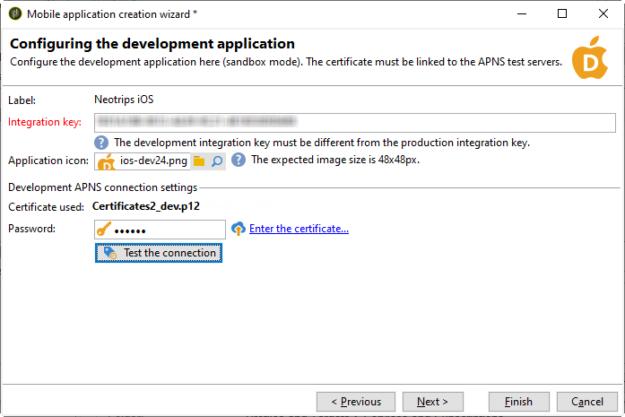
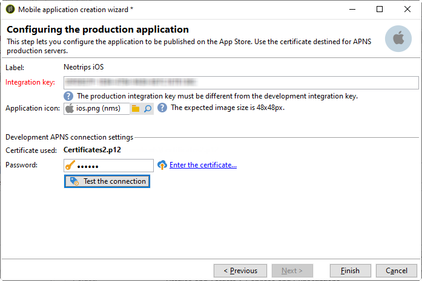

# Configuration steps for iOS {#configuring-the-mobile-application-in-adobe-campaign-ios}

Once the package is installed, you can define your iOS app settings in Adobe Campaign Classic.

>[!NOTE]
>
>To learn how to configure your app for Android and how to create a delivery for Android, refer to this [section](configuring-the-mobile-application-android.md).

Key steps are:

1. [Configure the iOS external account](#configuring-external-account-ios)
1. [Configure the iOS service](#configuring-ios-service)
1. [Integrate the iOS mobile app in Campaign](#creating-ios-app)

You will then be able to [create a push notification for iOS devices](create-notifications-ios.md).


## Configure iOS external account {#configuring-external-account-ios}

For iOS, the iOS HTTP/2 connector sends notifications to the HTTP/2 APNs.

To configure this connector, follow these steps:

1. Go to **[!UICONTROL Administration > Platform > External accounts]**.
1. Select the **[!UICONTROL iOS routing]** external account.
1. In the **[!UICONTROL Connector]** tab, fill in the **[!UICONTROL Access URL of the connector]** field with the following URL: ```http://localhost:8080/nms/jsp/iosHTTP2.jsp```

   

1. Click **[!UICONTROL Save]**.

Your iOS connector is now configured. You can start creating your service.

## Configure iOS service {#configuring-ios-service}

>[!CAUTION]
>
>The application must have been configured for Push actions BEFORE any integration to Adobe Campaign SDK.
>
>If this is not the case, please refer to [this page](https://developer.apple.com/documentation/usernotifications).

1. Go to the **[!UICONTROL Profiles and Targets > Services and subscriptions]** node and click **[!UICONTROL New]**.

   

1. Define a **[!UICONTROL Label]** and an **[!UICONTROL Internal name]**.
1. Go to the **[!UICONTROL Type]** field and select **[!UICONTROL Mobile application]**.

   >[!NOTE]
   >
   >The default **[!UICONTROL Subscriber applications (nms:appSubscriptionRcp)]** target mapping is linked to the recipients table. If you want to use a different target mapping, you need to create a new target mapping and enter it in the **[!UICONTROL Target mapping]** field of the service. For more on creating target mapping, refer to the [Configuration guide](../../configuration/using/about-custom-recipient-table.md).

   

1. Then click the **[!UICONTROL Add]** button to select the application type.

   

1. Create your iOS Development and Production applications. For more on this, refer to this [section](configuring-the-mobile-application.md#creating-ios-app).

## Create iOS mobile app {#creating-ios-app}

After creating your service, create your iOS applicationin Campaign. Follow the steps below:

1. From your newly created service, click the **[!UICONTROL Add]** button to select the application type.

    

1. The following window appears. Select **[!UICONTROL Create an iOS application]** and start by entering the **[!UICONTROL Label]**.

   

1. As an option, you can enrich a push message content with some **[!UICONTROL Application variables]** if needed. These are fully customizable and a part of the message payload sent to the mobile device.
In the following example, we add **mediaURl** and **mediaExt** to create rich push notification and then provides the application with the image to display within the notification.

   

1. The **[!UICONTROL Subscription parameters]** tab allows you to define the mapping with an extension of the **[!UICONTROL Subscriber applications (nms:appsubscriptionRcp)]** schema.

    >[!NOTE]
    >
    >Make sure that you do not use the same certificate for the development version (sandbox) and the production version of the application.

1. The **[!UICONTROL Sounds]** tab allows you to specify a sound to play. Click **[!UICONTROL Add]** and fill **[!UICONTROL Internal name]** field which must contain the name of the file embedded in the application or the name of the system sound.

1. Click **[!UICONTROL Next]** to start configuring the development application.

1. Make sure the same **[!UICONTROL Integration key]** is defined in Adobe Campaign and in the application code via the SDK. For more on this, refer to: [Integrating Campaign SDK into the mobile application](integrating-campaign-sdk-into-the-mobile-application.md). This integration key, which is specific to each application, lets you link the mobile application to the Adobe Campaign platform.

    >[!NOTE]
    >
    > The **[!UICONTROL Integration key]** is fully customizable with string value but needs to be exactly the same as the one specified in the SDK.

1. Select one of the out-of-the-box icons from the **[!UICONTROL Application icon]** field to personalize mobile application in your service.

1. Select the **[!UICONTROL Authentication mode]**. Note that you can always change your authentication mode later on in the **[!UICONTROL Certificate]** tab of your mobile application.
   * **[!UICONTROL Certificate-based authentication]**: Click **[!UICONTROL Enter the certificate...]**  then select your p12 key and enter the password that was provided by the mobile application developer.
   * **[!UICONTROL Token-based authentication]**: Fill in the connection settings **[!UICONTROL Key ID]**, **[!UICONTROL Team ID]** and **[!UICONTROL Bundle ID]** then select your p8 certificate by clicking **[!UICONTROL Enter the private key]**. For more on **[!UICONTROL Token-based authentication]**, refer to [Apple documentation](https://developer.apple.com/documentation/usernotifications/setting_up_a_remote_notification_server/establishing_a_token-based_connection_to_apns).

   >[!NOTE]
   >
   > Adobe recommends using **[!UICONTROL Token-based authentication]** for your iOS configuration since this authentication mode is more secured and not bound to certificate expiration.

   

1. You can click **[!UICONTROL Test the connection]** to be sure it is successful.

1. Click **[!UICONTROL Next]** to start configuring the production application and follow the same steps as detailed above.

   

1. Click **[!UICONTROL Finish]**.

Your iOS application is now ready to be used in Campaign Classic.
