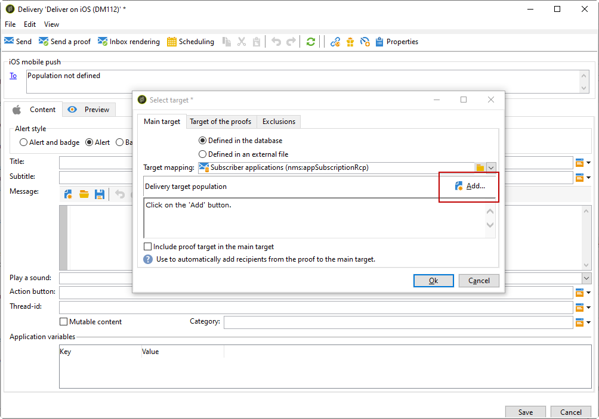

# Configuring the mobile application in Adobe Campaign with iOS {#configuring-the-mobile-application-in-adobe-campaign-ios}

You can find below a configuration sample based on a company which sells online holiday packages. His mobile application (Neotrips) is available to its customers in two versions: Neotrips for Android and Neotrips for iOS.

To configure the mobile application in Adobe Campaign, you need to:

* Create a **[!UICONTROL Mobile application]** type information service for the Neotrips mobile application.
* Add the iOS and Android versions of the application to this service.
* Create a delivery for both iOS and Android.

To learn more on how to configure Neotrips for Android and how to create a delivery for Android, refer to this [section](../../delivery/using/configuring-the-mobile-application-android.md).


>[!NOTE]
>
>Go to the **[!UICONTROL Subscriptions]** tab of the service to view the list of subscribers to the service, i.e. all people who have installed the application on their mobile and agreed to receive notifications.

## Installing the package {#installing-package-ios}

1. Access the package import wizard from **[!UICONTROL Tools > Advanced > Package import...]** in the Adobe Campaign client console.

   

1. Select **[!UICONTROL Install a standard package]**.

1. In the list that appears, check **[!UICONTROL Mobile App Channel]**.

   

1. Click **[!UICONTROL Next]**, then **[!UICONTROL Start]** to start the package installation.

   Once the packages are installed, the progress bar shows **100%** and you can see the following message in the installation logs: **[!UICONTROL Installation of packages successful]**.

   

1. **[!UICONTROL Close]** the installation window.

## Configuring iOS external account {#configuring-external-account-ios}

For iOS, the iOS HTTP/2 connector sends notifications to the HTTP/2 APNS.

To configure this connector, follow these steps:

1. Go to **[!UICONTROL Administration > Platform > External accounts]**.
1. Select the **[!UICONTROL iOS routing]** external account.
1. In the **[!UICONTROL Connector]** tab, fill in the **[!UICONTROL Access URL of the connector]** field with the following URL: ```http://localhost:8080/nms/jsp/iosHTTP2.jsp```

   >[!NOTE]
   >
   > Starting Campaign 20.3 release, the iOS legacy binary connector is deprecated. If you are using this connector, you need to adapt your implementation accordingly. [Learn more](https://helpx.adobe.com/campaign/kb/migrate-to-http2.html)

   

1. Click **[!UICONTROL Save]**.

Your iOS connector is now configured. You can start creating your service.

## Configuring iOS service {#configuring-ios-service}

>[!CAUTION]
>
>The application must have been configured for Push actions BEFORE any integration to Adobe Campaign SDK.
>
>If this is not the case, please refer to [this page](https://developer.apple.com/library/archive/documentation/NetworkingInternet/Conceptual/RemoteNotificationsPG/).

1. Go to the **[!UICONTROL Profiles and Targets > Services and subscriptions]** node and click **[!UICONTROL New]**.

   

1. Define a **[!UICONTROL Label]** and an **[!UICONTROL Internal name]**.
1. Go to the **[!UICONTROL Type]** field and select **[!UICONTROL Mobile application]**.

   >[!NOTE]
   >
   >The default **[!UICONTROL Subscriber applications (nms:appSubscriptionRcp)]** target mapping is linked to the recipients table. If you want to use a different target mapping, you need to create a new target mapping and enter it in the **[!UICONTROL Target mapping]** field of the service. For more on creating target mapping, refer to the [Configuration guide](../../configuration/using/about-custom-recipient-table.md).

   

1. Then click the **[!UICONTROL Add]** button to select the application type.

   

1. Create your iOS Development and Production applications. For more on this, refer to this [section](../../delivery/using/configuring-the-mobile-application.md#creating-ios-app).

## Creating iOS mobile application {#creating-ios-app}

After creating your service, you now need to create your iOS application:

1. From your newly created service, click the **[!UICONTROL Add]** button to select the application type.

    

1. The following window appears. Select **[!UICONTROL Create an iOS application]** and start by entering the **[!UICONTROL Label]**.

   

1. As an option, you can enrich a push message content with some **[!UICONTROL Application variables]** if needed. These are fully customizable and a part of the message payload sent to the mobile device.
In the following example, we add **mediaURl** and **mediaExt** to create rich push notification and then provides the application with the image to display within the notification.

   

1. The **[!UICONTROL Subscription parameters]** tab allows you to define the mapping with an extension of the **[!UICONTROL Subscriber applications (nms:appsubscriptionRcp)]** schema.

    >[!NOTE]
    >
    >Make sure that you do not use the same certificate for the development version (sandbox) and the production version of the application.

1. The **[!UICONTROL Sounds]** tab allows you to specify a sound to play. Click **[!UICONTROL Add]** and fill **[!UICONTROL Internal name]** field which must contain the name of the file embedded in the application or the name of the system sound.

1. Click **[!UICONTROL Next]** to start configuring the development application.

1. Make sure the same **[!UICONTROL Integration key]** is defined in Adobe Campaign and in the application code via the SDK. For more on this, refer to: [Integrating Campaign SDK into the mobile application](../../delivery/using/integrating-campaign-sdk-into-the-mobile-application.md). This integration key, which is specific to each application, lets you link the mobile application to the Adobe Campaign platform.

    >[!NOTE]
    >
    > The **[!UICONTROL Integration key]** is fully customizable with string value but needs to be exactly the same as the one specified in the SDK.

1. Select one of the out-of-the-box icon from the **[!UICONTROL Application icon]** field to personalize mobile application in your service.

1. Select the **[!UICONTROL Authentication mode]**. Note that you can always change your authentication mode later on in the **[!UICONTROL Certificate]** tab of your mobile application.
   * **[!UICONTROL Certificate-based authentication]**: Click **[!UICONTROL Enter the certificate...]**  then select your p12 key and enter the password that was provided by the mobile application developer.
   * **[!UICONTROL Token-based authentication]**: Fill in the connection settings **[!UICONTROL Key ID]**, **[!UICONTROL Team ID]** and **[!UICONTROL Bundle ID]** then select your p8 certificate by clicking **[!UICONTROL Enter the private key]**. For more on **[!UICONTROL Token-based authentication]**, refer to [Apple documentation](https://developer.apple.com/documentation/usernotifications/setting_up_a_remote_notification_server/establishing_a_token-based_connection_to_apnsToken-based).

   >[!NOTE]
    >
    > Adobe recommends using **[!UICONTROL Token-based authentication]** for your iOS configuration since this authentication mode is more secured and not bound to certificate expiration.

   

1. You can click **[!UICONTROL Test the connection]** to be sure it is successful.

1. Click **[!UICONTROL Next]** to start configuring the production application and follow the same steps as detailed above.

   

1. Click **[!UICONTROL Finish]**.

Your iOS application is now ready to be used in Campaign Classic.

## Creating an iOS rich notification {#creating-ios-delivery}

With iOS 10 or higher, it is possible to generate rich notifications. Adobe Campaign can send notifications using variables that will allow the device to display a rich notification.

You now need to create a new delivery and link it to the mobile application that you created.

1. Go to **[!UICONTROL Campaign management]** > **[!UICONTROL Deliveries]**.

1. Click **[!UICONTROL New]**.

    

1. Select **[!UICONTROL Deliver on iOS (ios)]** in the **[!UICONTROL Delivery template]** drop-down. Add a **[!UICONTROL Label]** to your delivery.

1. Click **[!UICONTROL To]** to define the population to target. By default, the **[!UICONTROL Subscriber application]** target mapping is applied. Click **[!UICONTROL Add]** to select our previously created service.

    

1. In the **[!UICONTROL Target type]** window, select **[!UICONTROL Subscribers of an iOS mobile application (iPhone, iPad)]** and click **[!UICONTROL Next]**.

1. In the **[!UICONTROL Service]** drop-down, select your previously created service then the application you want to target and click **[!UICONTROL Finish]**.
    The **[!UICONTROL Application variables]** are automatically added depending on what was added during the configuration steps.

   

1. Edit your rich notification.

   

1. Check the **[!UICONTROL Mutable content]** box in the edit notification window to allow the mobile application to download media content.

1. Click **[!UICONTROL Save]** and send your delivery.

The image and web page should be displayed in the push notification when received on the subscribers' mobile iOS devices.

   