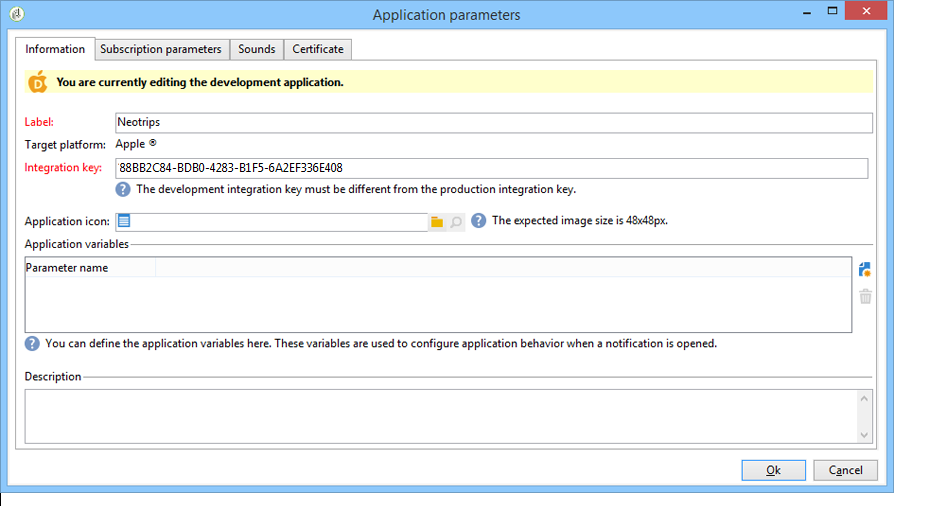
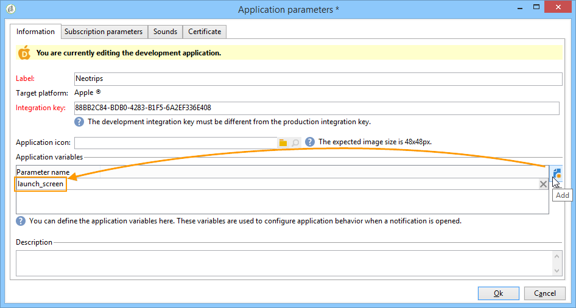
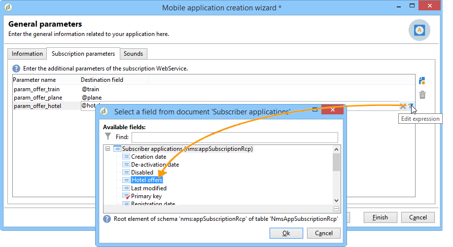
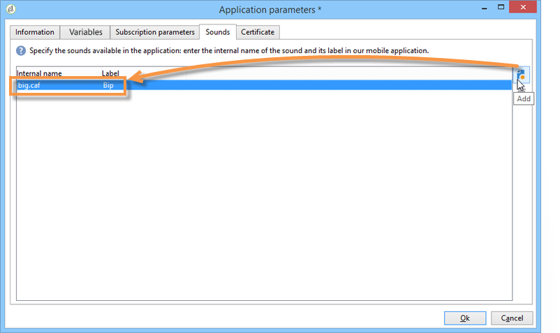
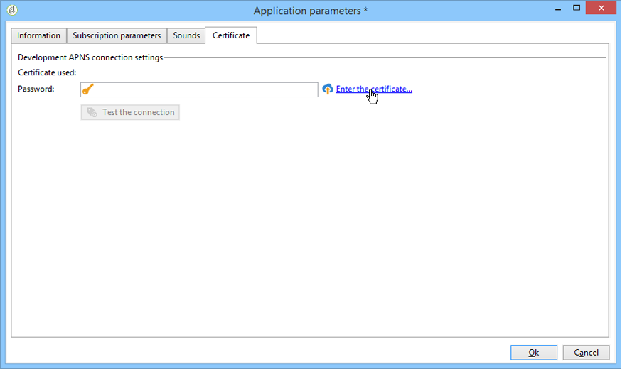
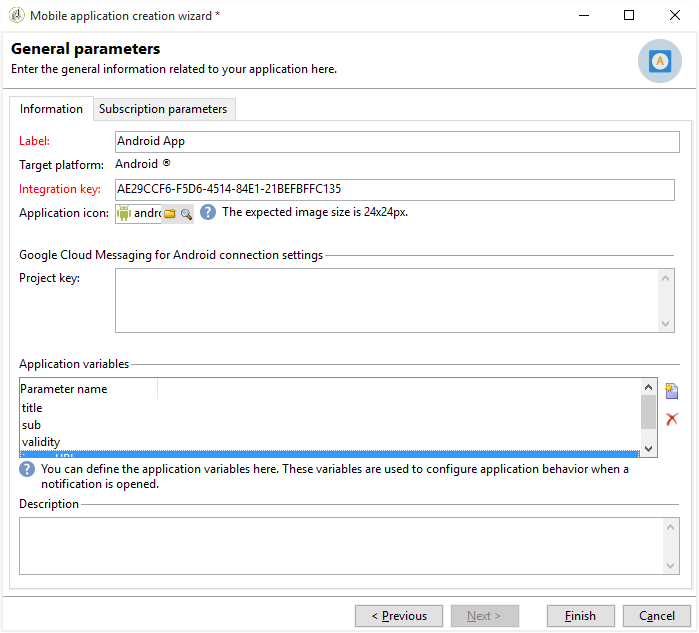
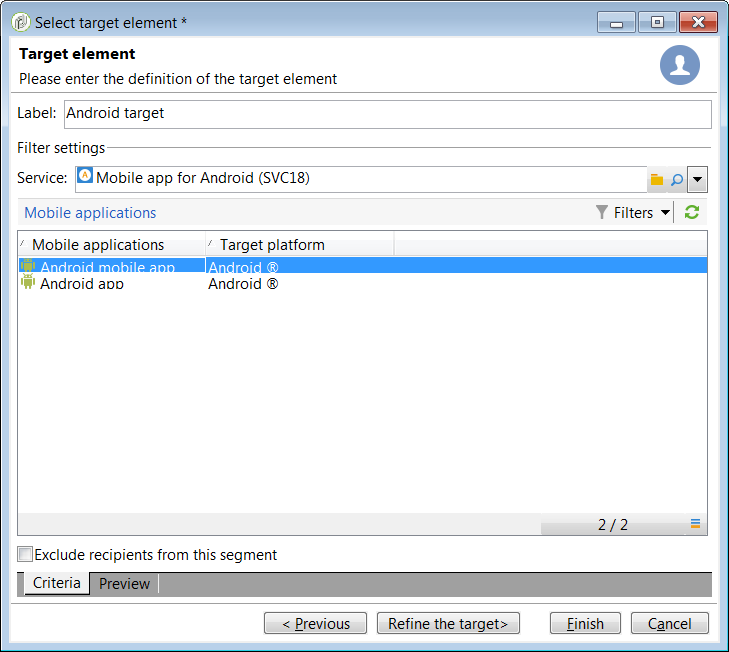
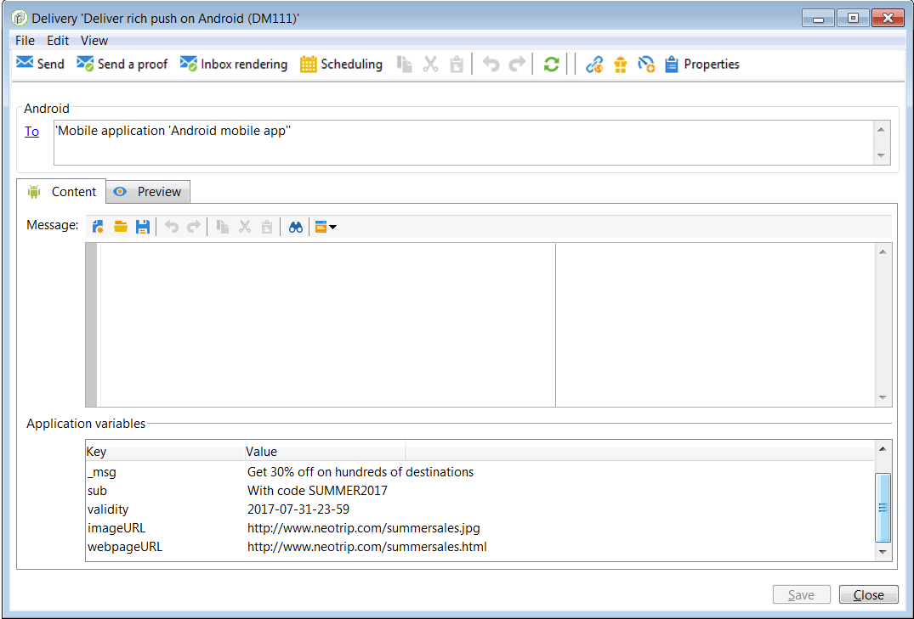
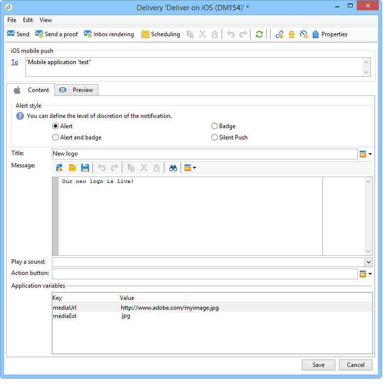

# Configuring the mobile application in Adobe Campaign {#configuring-the-mobile-application-in-adobe-campaign}

You can find below a configuration sample based on a company which sells online holiday packages. His mobile application (Neotrips) is available to its customers in two versions: Neotrips for Android and Neotrips for iOS. To configure the mobile application in Adobe Campaign, you need to:

* Create a **[!UICONTROL Mobile application]** type [information service](#creating-the-service-and-collecting-subscriptions) for the Neotrips mobile application.
* Add the iOS and Android versions of the application to this service.
* Create a delivery for both iOS and Android.


>[!NOTE]
>
>Go to the **[!UICONTROL Subscriptions]** tab of the service to view the list of subscribers to the service, i.e. all people who have installed the application on their mobile and agreed to receive notifications.

## Configuring the mobile application with iOS {#configuring-the-mobile-application-ios}

Installing the package
Configuring the external account
Configuring the service
create the delivery

### Step 1: Installing the package {#installing-package-ios}

1. Access the package import wizard from **[!UICONTROL Tools > Advanced > Package import...]** in the Adobe Campaign client console.

1. Select **[!UICONTROL Install a standard package]**.

1. In the list that appears, check the packages you want to install.

1. Click **[!UICONTROL Next]**, then **[!UICONTROL Start]** to start the package installation.

   Once the packages are installed, the progress bar shows **100%** and you can see the following message in the installation logs: **[!UICONTROL Installation of packages successful]**.

1. **[!UICONTROL Close]** the installation window.

### Step 2: Configuring iOS external account {#configuring-external-account-ios}

For iOS, two connectors are available:

* The iOS binary connector sends notifications on the legacy binary APNS server.
* The iOS HTTP/2 connector sends notifications to the HTTP/2 APNS.

To choose which connector you want to use, follow these steps:

1. Go to **[!UICONTROL Administration > Platform > External accounts]**.
1. Select the iOS routing external account.
1. In the **[!UICONTROL Connector]** tab, fill in the **[!UICONTROL Access URL of the connector]** field:

   For iOS binary: https://localhost:8080/nms/jsp/ios.jsp

   For iOS HTTP2: http://localhost:8080/nms/jsp/iosHTTP2.jsp

   

### Step 3: Configuring iOS service {#configuring-ios-service}

1. Go to the **[!UICONTROL Profiles and Targets > Services and subscriptions]** node and click **[!UICONTROL New]**. 

   

1. Define a **[!UICONTROL Label]** and an **[!UICONTROL Internal name]**.
1. Go to the **[!UICONTROL Type]** field and select **[!UICONTROL Mobile application]**.

   >[!NOTE]
   >
   >The default **[!UICONTROL Subscriber applications (nms:appSubscriptionRcp)]** target mapping is linked to the recipients table. If you want to use a different target mapping, you need to create a new target mapping and enter it in the **[!UICONTROL Target mapping]** field of the service. For more on creating target mapping, refer to the [Configuration guide](../../configuration/using/about-custom-recipient-table.md).

1. Then click the **[!UICONTROL Add]** button to define the various versions of your mobile application (iOS, Android). 

   

See below for a detailed presentation of the configuration steps for each version.

>[!NOTE]
>
>When you create an iOS application, the wizard invites you to configure the application's development version (sandbox) and the production version. Once created, the two versions of the application are added.



1. Start by entering the **[!UICONTROL Label]**.
1. Make sure the same **[!UICONTROL Integration key]** is defined in Adobe Campaign and in the application code (via the SDK). For more on this, refer to: [Integrating Campaign SDK into the mobile application](#integrating-campaign-sdk-into-the-mobile-application). This integration key, which is specific to each application, lets you link the mobile application to the Adobe Campaign platform.
1. If your application handles an application icon (top left corner of the notification), you can add it here so that the preview is more faithful to the actual style of the delivery. To add an image in the content (rich notification), refer to the [Rich notifications](#rich-notifications) section.

   >[!CAUTION]
   >
   >Expected image resolution is 48x48 pixels for iOS.

1. For Android, enter the application's connection settings: enter the project key that was provided by the developer of the mobile application. 
1. Then enter the application variables.

   

   Variables let you define the application behavior following the receipt of a notification: for instance, you can configure an application specific screen to come up when the user activates the notification. These variables must be defined in the code of your mobile application. Click the **[!UICONTROL Add]** button to add them to Adobe Campaign.

   The delivery wizard lets you define the values of these variables. Refer to [Creating notifications](../../delivery/using/creating-notifications.md).

>[!NOTE]
>
>This tab only needs configuring if you want to collect additional data.



By default, Adobe Campaign saves a key in the **[!UICONTROL User identifier]** (@userKey) field of the **[!UICONTROL Subscriber applications (nms:appSubscriptionRcp)]** table. This key enables you to link a subscription to a recipient. To collect additional data (such as a complex reconciliation key), you need to apply the following configuration:

1. Create an extension of the **[!UICONTROL Subscriber applications (nms:appsubscriptionRcp)]** schema and define the new fields.
1. Define the mapping in the **[!UICONTROL Subscription parameters]** tab.

   >[!CAUTION]
   >
   >Make sure the configuration names in the **[!UICONTROL Subscription parameters]** tab are the same as those in the mobile application code. Refer to the [Integrating Campaign SDK into the mobile application](#integrating-campaign-sdk-into-the-mobile-application) section.

   
### Step 4: Creating an iOS delivery {#creating-ios-delivery}


## Configuring the mobile application with Android {#configuring-the-mobile-application-in-adobe-campaign}

Installing the package
Configuring the external account
Configuring the service
create the delivery

### Step 1: Installing the package {#installing-package-android}

1. Access the package import wizard from **[!UICONTROL Tools > Advanced > Package import...]** in the Adobe Campaign client console.

1. Select **[!UICONTROL Install a standard package]**.

1. In the list that appears, check the packages you want to install.

1. Click **[!UICONTROL Next]**, then **[!UICONTROL Start]** to start the package installation.

   Once the packages are installed, the progress bar shows **100%** and you can see the following message in the installation logs: **[!UICONTROL Installation of packages successful]**.

1. **[!UICONTROL Close]** the installation window.

### Step 2: Configuring Android external account {#configuring-external-account-android}

For Android, two connectors are available:

* The V1 connector which allows one connection per MTA child. 
* The V2 connector which allows simultaneous connections to the FCM server to improve throughput.

To choose which connector you want to use, follow these steps:

1. Go to **[!UICONTROL Administration > Platform > External accounts]**.
1. Select the **[!UICONTROL Android routing]** external account.
1. In the **[!UICONTROL Connector]** tab, fill in the **[!UICONTROL JavaScript used in the connector]** field:

   For Android V1: https://localhost:8080/nms/jsp/androidPushConnector.js

   For Android V2: https://localhost:8080/nms/jsp/androidPushConnectorV2.js

   

1. For Android V2, one additional parameter is available in the Adobe Server configuration file (serverConf.xml):

    * **maxGCMConnectPerChild**: Maximum limit of parallel HTTP requests to the FCM initiated by each child server (8 by default).

### Step 3: Configuring Android service {#configuring-android-service}

1. Go to the **[!UICONTROL Profiles and Targets > Services and subscriptions]** node and click **[!UICONTROL New]**. 

   

1. Define a **[!UICONTROL Label]** and an **[!UICONTROL Internal name]**.
1. Go to the **[!UICONTROL Type]** field and select **[!UICONTROL Mobile application]**.

   >[!NOTE]
   >
   >The default **[!UICONTROL Subscriber applications (nms:appSubscriptionRcp)]** target mapping is linked to the recipients table. If you want to use a different target mapping, you need to create a new target mapping and enter it in the **[!UICONTROL Target mapping]** field of the service. For more on creating target mapping, refer to the [Configuration guide](../../configuration/using/about-custom-recipient-table.md).

1. Then click the **[!UICONTROL Add]** button to define the various versions of your mobile application (iOS, Android). 

   

See below for a detailed presentation of the configuration steps for each version.

>[!NOTE]
>
>When you create an iOS application, the wizard invites you to configure the application's development version (sandbox) and the production version. Once created, the two versions of the application are added.


1. Start by entering the **[!UICONTROL Label]**.
1. Make sure the same **[!UICONTROL Integration key]** is defined in Adobe Campaign and in the application code (via the SDK). For more on this, refer to: [Integrating Campaign SDK into the mobile application](#integrating-campaign-sdk-into-the-mobile-application). This integration key, which is specific to each application, lets you link the mobile application to the Adobe Campaign platform.
1. If your application handles an application icon (top left corner of the notification), you can add it here so that the preview is more faithful to the actual style of the delivery. To add an image in the content (rich notification), refer to the [Rich notifications](#rich-notifications) section.

   >[!CAUTION]
   >
   >Expected image resolution is 48x48 pixels for iOS.

1. For Android, enter the application's connection settings: enter the project key that was provided by the developer of the mobile application. 
1. Then enter the application variables.

   

   Variables let you define the application behavior following the receipt of a notification: for instance, you can configure an application specific screen to come up when the user activates the notification. These variables must be defined in the code of your mobile application. Click the **[!UICONTROL Add]** button to add them to Adobe Campaign.

   The delivery wizard lets you define the values of these variables. Refer to [Creating notifications](../../delivery/using/creating-notifications.md).

>[!NOTE]
>
>This tab only needs configuring if you want to collect additional data.


By default, Adobe Campaign saves a key in the **[!UICONTROL User identifier]** (@userKey) field of the **[!UICONTROL Subscriber applications (nms:appSubscriptionRcp)]** table. This key enables you to link a subscription to a recipient. To collect additional data (such as a complex reconciliation key), you need to apply the following configuration:

1. Create an extension of the **[!UICONTROL Subscriber applications (nms:appsubscriptionRcp)]** schema and define the new fields.
1. Define the mapping in the **[!UICONTROL Subscription parameters]** tab.

   >[!CAUTION]
   >
   >Make sure the configuration names in the **[!UICONTROL Subscription parameters]** tab are the same as those in the mobile application code. Refer to the [Integrating Campaign SDK into the mobile application](#integrating-campaign-sdk-into-the-mobile-application) section.

   
### Step 4: Creating an iOS delivery {#creating-android-delivery}


### Application sounds {#application-sounds}

>[!NOTE]
>
>This tab is only available for iOS versions of the applications.



If your iOS application has embedded sounds, use this tab to add them. You will then be able to use the delivery wizard to select one of the sounds to be played when the notification is received. For more on this, refer to [Sending notifications on iOS](../../delivery/using/creating-notifications.md#sending-notifications-on-ios).

>[!NOTE]
>
>System sounds can also be defined in this screen.

In the **[!UICONTROL Application setting]** screen, the **[!UICONTROL Internal name]** field must contain the name of the file embedded in the application or the name of the system sound. The value entered in the **[!UICONTROL Label]** field will appear in the **[!UICONTROL Play a sound]** drop-down list of the delivery wizard.

### Certificate {#certificate}

>[!NOTE]
>
>This tab is only available for iOS versions of the applications.

In this screen, enter the application connection settings. 



Click the **[!UICONTROL Enter the certificate...]** link then select the authentication certificate and enter the password that was provided by the mobile application developer.

>[!NOTE]
>
>Make sure that you do not use the same certificate for the development version (sandbox) and the production version of the application.

## Rich notifications {#rich-notifications}

A rich notification allows you to include other types of media into your notifications such as images, videos, etc.

### Android {#android}

Adobe Campaign allows you to define application variables in addition to content (see [Sending notifications on Android](../../delivery/using/creating-notifications.md#sending-notifications-on-android)). These variables can be used to provide information such as the image URL to the mobile application. The mobile application can then generate a custom notification.

You first need to create a mobile application in Adobe Campaign and define the application variables for that application.

1. Go to **[!UICONTROL Profiles and Targets]** > **[!UICONTROL Services and Subscriptions]**.
1. Click **[!UICONTROL New]** to create a service.
1. In the **[!UICONTROL Edit]** tab, select **[!UICONTROL Mobile application]** as the **[!UICONTROL Type]** and **[!UICONTROL Subscriber application]** (nms:appSubscriptionRcp) as the **[!UICONTROL Target mapping]**.
1. In the **[!UICONTROL List of mobile applications that use the service]**, add a new application and select **[!UICONTROL Create an Android application]**.
1. Click **[!UICONTROL Next]**.
1. In the **[!UICONTROL Information]** tab of the creation wizard, enter a label.
1. In the **[!UICONTROL Application variables]** field, add the parameters that you want to use for sending a rich push:

    * title
    * sub
    * validity
    * imageURL
    * webpageURL

    >[!NOTE]
    >
    >Applications variables detailed here also have to be added in the SDK code source.

1. Click **[!UICONTROL Finish]** and save the service.

   

Then you need to create a new delivery template and link it to the mobile application that you created.

1. Go to **[!UICONTROL Resources]** > **[!UICONTROL Templates]** > **[!UICONTROL Delivery templates]**.
1. Duplicate the **[!UICONTROL Deliver on Android]** template.
1. Change the label and click **[!UICONTROL Continue]**.
1. Click the **[!UICONTROL To]** link to target the application's subscribers.
1. Change the **[!UICONTROL Target mapping]** to **[!UICONTROL Subscriber applications (nms:appSubscriptionRcp)]**.

   

1. Click **[!UICONTROL Add]**, select **[!UICONTROL Subscribers of an Android mobile application]** and click **[!UICONTROL Next]**.
1. Enter a label, select the service that you created and the mobile application that you created within this service.

   

1. Click **[!UICONTROL Finish]**.

The parameters that you created within your mobile application are displayed in the **Application variables** field.


Finally, create a new Android delivery and add the values that you want for the parameters that you defined in the mobile application.

1. Go to **[!UICONTROL Campaign management]** > **[!UICONTROL Deliveries]**.
1. Click **[!UICONTROL New]**.
1. Select the delivery template that you just created and click **[!UICONTROL Continue]**.
1. In the **[!UICONTROL Application variables]** field, add the values of your choice for the different parameters.

   

1. Click **[!UICONTROL Save]** and send your delivery.

The image and web page should be displayed in the push notification when received on the subscribers' mobile Android devices.

### iOS {#ios}

With iOS 10 or higher, it is possible to generate rich notifications. Adobe Campaign can send notifications using variables that will allow the device to display a rich notification.

>[!NOTE]
>
>If you want to use rich notifications, you need to use the iOS HTTP/2 connector. Refer to the [Connectors](#connectors) section.

In Adobe Campaign, the following parameters have to be sent to the mobile application:

* Check the **[!UICONTROL Mutable content]** box in the edit notification window. This will allow the mobile application to download media content.
* The **[!UICONTROL Category]** field must be set. The value must match one of the mobile application's content extensions (parameter **UNNotificationExtensionCategory**).
* In the application variables, add the URL of the media file you want the mobile application to download and display. 

  

To implement rich notifications in the mobile application, you need to add the following extensions to your project:

* Notification Service Extension
* Notification Content Extension (one or more according to your implementation)

**Notification Service Extension**

The media has to be downloaded at the notification service extension level.

```
#import "NotificationService.h"

@interface NotificationService ()

@property (nonatomic, strong) void (^contentHandler)(UNNotificationContent *contentToDeliver);
@property (nonatomic, strong) UNMutableNotificationContent *bestAttemptContent;

@end

@implementation NotificationService

- (void)didReceiveNotificationRequest:(UNNotificationRequest *)request withContentHandler:(void (^)(UNNotificationContent * _Nonnull))contentHandler {
    NSDictionary *userInfo = nil;
    NSString *url = nil;

    self.contentHandler = contentHandler;
    self.bestAttemptContent = [request.content mutableCopy];

    userInfo = request.content.userInfo;
    if ( userInfo != nil )
    {
        url = userInfo[@"mediaUrl"];  // Get the url of the media to download (Adobe Campaign additional variable)
    }
    ...
    // Perform the download to local storage
```

**Notification Content Extension**

At this level, you need to:

* Associate your content extension to the category sent by Adobe Campaign:

  If you want your mobile application to display an image, you can set the category value to "image" in Adobe Campaign and in your mobile application, you create a notification extension with the **UNNotificationExtensionCategory** parameter set to "image". When the push notification is received on the device, the extension is called according to the defined category value.

* Define your notification layout

  You need to define a layout with the relevant widgets. For an image, the widget is named **UIImageView**.

* Display your media

  You need to add code to feed the media data to the widget. Here is an example of code for an image:

  ```
  #import "NotificationViewController.h"
  #import <UserNotifications/UserNotifications.h>
  #import <UserNotificationsUI/UserNotificationsUI.h>

  @interface NotificationViewController () <UNNotificationContentExtension>
  
  @property (strong, nonatomic) IBOutlet UIImageView *imageView;
  @property (strong, nonatomic) IBOutlet UILabel *notifContent;
  @property (strong, nonatomic) IBOutlet UILabel *label;
  
  @end

  @implementation NotificationViewController

  - (void)viewDidLoad {
      [super viewDidLoad];
      // Do any required interface initialization here.
  }

  - (void)didReceiveNotification:(UNNotification *)notification {
      self.label.text = notification.request.content.title;
      self.notifContent.text = notification.request.content.body;
      UNNotificationAttachment *attachment = [notification.request.content.attachments objectAtIndex:0];
      if ([attachment.URL startAccessingSecurityScopedResource])
      {
        NSData * imageData = [[NSData alloc] initWithContentsOfURL:attachment.URL];
        self.imageView.image =[UIImage imageWithData: imageData];
        [attachment.URL stopAccessingSecurityScopedResource];
      }
  }
  @end
  ```
