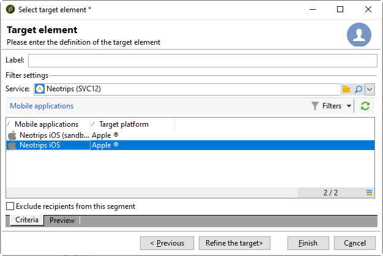
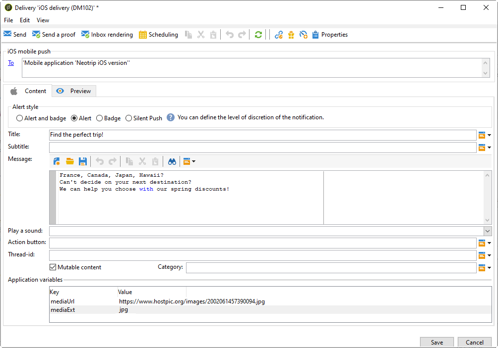
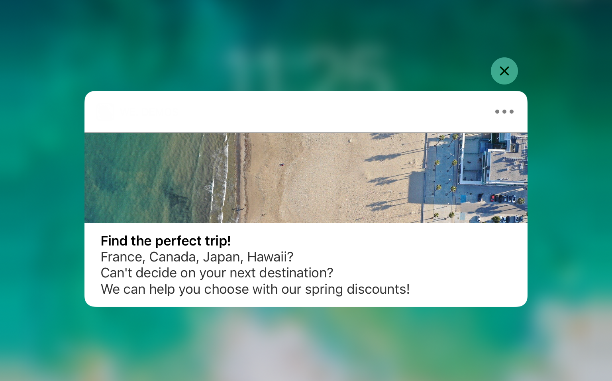
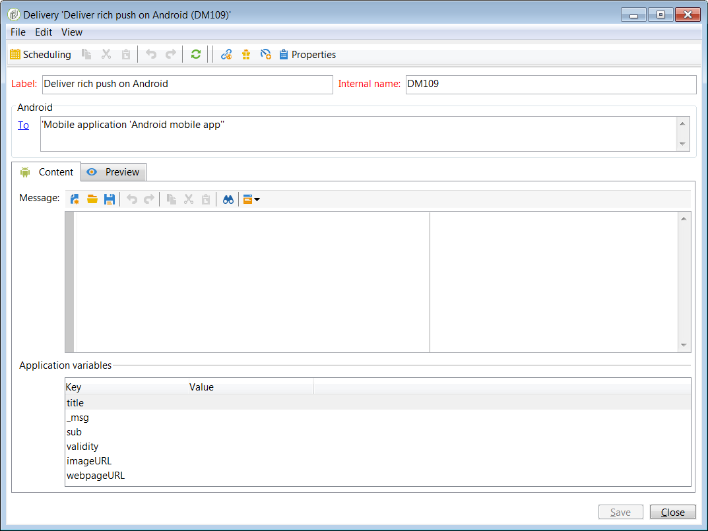

# Configuring the mobile application in Adobe Campaign {#configuring-the-mobile-application-in-adobe-campaign}

You can find below a configuration sample based on a company which sells online holiday packages. His mobile application (Neotrips) is available to its customers in two versions: Neotrips for Android and Neotrips for iOS. To configure the mobile application in Adobe Campaign, you need to:

* Create a **[!UICONTROL Mobile application]** type information service for the Neotrips mobile application.
* Add the iOS and Android versions of the application to this service.
* Create a delivery for both iOS and Android.

>[!NOTE]
>
>Go to the **[!UICONTROL Subscriptions]** tab of the service to view the list of subscribers to the service, i.e. all people who have installed the application on their mobile and agreed to receive notifications.

## Configuring the mobile application with iOS {#configuring-the-mobile-application-ios}

>[!CAUTION]
>
>The application must have been configured for Push actions BEFORE any integration to Adobe Campaign SDK.
>
>If this is not the case, please refer to [this page](https://developer.apple.com/library/archive/documentation/NetworkingInternet/Conceptual/RemoteNotificationsPG/).

### Step 1: Installing the package {#installing-package-ios}

1. Access the package import wizard from **[!UICONTROL Tools > Advanced > Package import...]** in the Adobe Campaign client console.

   

1. Select **[!UICONTROL Install a standard package]**.

1. In the list that appears, check **[!UICONTROL Mobile App Channel]**.

   

1. Click **[!UICONTROL Next]**, then **[!UICONTROL Start]** to start the package installation.

   Once the packages are installed, the progress bar shows **100%** and you can see the following message in the installation logs: **[!UICONTROL Installation of packages successful]**.

   

1. **[!UICONTROL Close]** the installation window.

### Step 2: Configuring iOS external account {#configuring-external-account-ios}

For iOS, two connectors are available:

* The iOS binary connector sends notifications on the legacy binary APNS server.
* The iOS HTTP/2 connector sends notifications to the HTTP/2 APNS.

To choose which connector you want to use, follow these steps:

1. Go to **[!UICONTROL Administration > Platform > External accounts]**.
1. Select the **[!UICONTROL iOS routing]** external account.
1. In the **[!UICONTROL Connector]** tab, fill in the **[!UICONTROL Access URL of the connector]** field:

   For iOS HTTP2: http://localhost:8080/nms/jsp/iosHTTP2.jsp

   

   >[!NOTE]
   >
   > You can also configure it as follow https://localhost:8080/nms/jsp/ios.jsp but we advise you to use version 2 of the connector.

1. Click **[!UICONTROL Save]**.

Your iOS connector is now configured. You can start creating your service.

### Step 3: Configuring iOS service {#configuring-ios-service}

1. Go to the **[!UICONTROL Profiles and Targets > Services and subscriptions]** node and click **[!UICONTROL New]**.

   

1. Define a **[!UICONTROL Label]** and an **[!UICONTROL Internal name]**.
1. Go to the **[!UICONTROL Type]** field and select **[!UICONTROL Mobile application]**.

   >[!NOTE]
   >
   >The default **[!UICONTROL Subscriber applications (nms:appSubscriptionRcp)]** target mapping is linked to the recipients table. If you want to use a different target mapping, you need to create a new target mapping and enter it in the **[!UICONTROL Target mapping]** field of the service. For more on creating target mapping, refer to the [Configuration guide](../../configuration/using/about-custom-recipient-table.md).

   

1. Then click the **[!UICONTROL Add]** button to select the application type.

   

1. The following window appears. Select **[!UICONTROL Create an iOS application]**.

   

1. Start by entering the **[!UICONTROL Label]**.

1. Add **[!UICONTROL Application variables]** to your application. Application variables are fully customizable but need to match the ones detailed in the payload. Here for example, we add mediaURl and mediaExt to create rich push notification.

   

1. The **[!UICONTROL Subscription parameters]** tab allows you to define the mapping with an extension of the **[!UICONTROL Subscriber applications (nms:appsubscriptionRcp)]** schema.

    >[!NOTE]
    >
    >Make sure that you do not use the same certificate for the development version (sandbox) and the production version of the application.

1. The **[!UICONTROL Sounds]** tab allows your to specify a sound to play. Click **[!UICONTROL Add]** and fill **[!UICONTROL Internal name]** field which must contain the name of the file embedded in the application or the name of the system sound.

1. Click **[!UICONTROL Next]** to start configuring the development application.

1. Make sure the same **[!UICONTROL Integration key]** is defined in Adobe Campaign and in the application code via the SDK. For more on this, refer to: [Integrating Campaign SDK into the mobile application](#integrating-campaign-sdk-into-the-mobile-application). This integration key, which is specific to each application, lets you link the mobile application to the Adobe Campaign platform.

    >[!NOTE]
    >
    > The **[!UICONTROL Integration key]** is fully customizable with string value but needs to be exactly the same as the one specified in the SDK.

1. If your application handles an application icon, you can add it here so that the preview is more faithful to the actual style of the delivery. To add an image in the content (rich notification), refer to the [Creating notifications](../../delivery/using/creating-notifications.md) section.

1. Click the **[!UICONTROL Enter the certificate...]** link then select the authentication certificate and enter the password that was provided by the mobile application developer. You can click **[!UICONTROL Test the connection]** to be sure it is successful.

   

1. Click **[!UICONTROL Next]** to start configuring the production application and follow the same steps as detailed above.

   

1. Click **[!UICONTROL Finish]**. Your iOS application is now ready to be used in Campaign Classic.

### Step 4: Creating an iOS rich notification {#creating-ios-delivery}

With iOS 10 or higher, it is possible to generate rich notifications. Adobe Campaign can send notifications using variables that will allow the device to display a rich notification.

You now need to create a new delivery and link it to the mobile application that you created.

1. Go to **[!UICONTROL Campaign management]** > **[!UICONTROL Deliveries]**.

1. Click **[!UICONTROL New]**.

    

1. Select **[!UICONTROL Deliver on iOS (ios)]** in the **[!UICONTROL Delivery template]** drop-down. Add a **[!UICONTROL Label]** to your delivery.

1. Click **[!UICONTROL To]** to define the population to target. By default, the **[!UICONTROL Subscriber application]** target mapping is applied. Click **[!UICONTROL Add]** to select our previously created service.

1. In the **[!UICONTROL Target type]** window, select **[!UICONTROL Subscribers of an iOS mobile application (iPhone, iPad)]** and click **[!UICONTROL Next]**.

1. In the **[!UICONTROL Service]** drop-down, select your previously created service then the application you want to target and click **[!UICONTROL Finish]**.
    The **[!UICONTROL Application variables]** are automatically added depending on what was added during the configuration steps.

   

1. Edit your rich notification.

   

1. Check the **[!UICONTROL Mutable content]** box in the edit notification window to allow the mobile application to download media content.

1. Click **[!UICONTROL Save]** and send your delivery.

The image and web page should be displayed in the push notification when received on the subscribers' mobile iOS devices.

   

## Configuring the mobile application with Android {#configuring-the-mobile-application-android}

### Step 1: Installing the package {#installing-package-android}

1. Access the package import wizard from **[!UICONTROL Tools > Advanced > Package import...]** in the Adobe Campaign client console.

   

1. Select **[!UICONTROL Install a standard package]**.

1. In the list that appears, check **[!UICONTROL Mobile App Channel]**.

   

1. Click **[!UICONTROL Next]**, then **[!UICONTROL Start]** to start the package installation.

   Once the packages are installed, the progress bar shows **100%** and you can see the following message in the installation logs: **[!UICONTROL Installation of packages successful]**.

   

1. **[!UICONTROL Close]** the installation window.

### Step 2: Configuring Android external account {#configuring-external-account-android}

For Android, two connectors are available:

* The V1 connector which allows one connection per MTA child. 
* The V2 connector which allows simultaneous connections to the FCM server to improve throughput.

To choose which connector you want to use, follow these steps:

1. Go to **[!UICONTROL Administration > Platform > External accounts]**.
1. Select the **[!UICONTROL Android routing]** external account.
1. In the **[!UICONTROL Connector]** tab, fill in the **[!UICONTROL JavaScript used in the connector]** field:

   For Android V2: https://localhost:8080/nms/jsp/androidPushConnectorV2.js

   >[!NOTE]
   >
   > You can also configure it as follow https://localhost:8080/nms/jsp/androidPushConnector.js but we advise you to use version 2 of the connector.

   

1. For Android V2, one additional parameter is available in the Adobe Server configuration file (serverConf.xml):

    * **maxGCMConnectPerChild**: Maximum limit of parallel HTTP requests to the FCM initiated by each child server (8 by default).

### Step 3: Configuring Android service {#configuring-android-service}

1. Go to the **[!UICONTROL Profiles and Targets > Services and subscriptions]** node and click **[!UICONTROL New]**.

   

1. Define a **[!UICONTROL Label]** and an **[!UICONTROL Internal name]**.
1. Go to the **[!UICONTROL Type]** field and select **[!UICONTROL Mobile application]**.

   >[!NOTE]
   >
   >The default **[!UICONTROL Subscriber applications (nms:appSubscriptionRcp)]** target mapping is linked to the recipients table. If you want to use a different target mapping, you need to create a new target mapping and enter it in the **[!UICONTROL Target mapping]** field of the service. For more on creating target mapping, refer to the [Configuration guide](../../configuration/using/about-custom-recipient-table.md).

   

1. Then click the **[!UICONTROL Add]** button to select the application type.

   

1. Select **[!UICONTROL Create an Android application]**.

   

1. Enter a **[!UICONTROL Label]**.

1. Make sure the same **[!UICONTROL Integration key]** is defined in Adobe Campaign and in the application code (via the SDK). For more on this, refer to: [Integrating Campaign SDK into the mobile application](#integrating-campaign-sdk-into-the-mobile-application). This integration key, which is specific to each application, lets you link the mobile application to the Adobe Campaign platform.

1. If your application handles an application icon, you can add it here so that the preview is more faithful to the actual style of the delivery. To add an image in the content (rich notification), refer to the [Creating notifications](../../delivery/using/creating-notifications.md) section.

1. Enter the application's connection settings: enter the project key that was provided by the developer of the mobile application.

1. Then enter the **[!UICONTROL Application variables]**.

   

   Variables let you define the application behavior following the receipt of a notification: for instance, you can configure an application specific screen to come up when the user activates the notification. These variables are fully customizable and must be defined in the code of your mobile application. Click the **[!UICONTROL Add]** button to add them to Adobe Campaign.
   Here we added the following **[!UICONTROL Application variables]**:
    * title
    * imageURL
    * iconURL

1. Click **[!UICONTROL Finish]** then **[!UICONTROL Save]**. Your Android application is now ready to be used in Campaign Classic.

By default, Adobe Campaign saves a key in the **[!UICONTROL User identifier]** (@userKey) field of the **[!UICONTROL Subscriber applications (nms:appSubscriptionRcp)]** table. This key enables you to link a subscription to a recipient. To collect additional data (such as a complex reconciliation key), you need to apply the following configuration:

1. Create an extension of the **[!UICONTROL Subscriber applications (nms:appsubscriptionRcp)]** schema and define the new fields.
1. Define the mapping in the **[!UICONTROL Subscription parameters]** tab.
   >[!CAUTION]
   >
   >Make sure the configuration names in the **[!UICONTROL Subscription parameters]** tab are the same as those in the mobile application code. Refer to the [Integrating Campaign SDK into the mobile application](#integrating-campaign-sdk-into-the-mobile-application) section.

### Step 4: Creating an Android rich notification {#creating-android-delivery}

You now need to create a new delivery and link it to the mobile application that you created.

1. Go to **[!UICONTROL Campaign management]** > **[!UICONTROL Deliveries]**.

1. Click **[!UICONTROL New]**.

    

1. Select **[!UICONTROL Deliver on Android (android)]** in the **[!UICONTROL Delivery template]** drop-down. Add a **[!UICONTROL Label]** to your delivery.

1. Click **[!UICONTROL To]** to define the population to target. By default, the **[!UICONTROL Subscriber application]** target mapping is applied. Click **[!UICONTROL Add]** to select our previously created service.

1. In the **[!UICONTROL Target type]** window, select Subscribers of an Android mobile application and click **[!UICONTROL Next]**.

1. In the **[!UICONTROL Service]** drop-down, select your previously created service and application and click **[!UICONTROL Finish]**.
    The **[!UICONTROL Application variables]** are automatically added depending on what was added during the configuration steps.

    

1. Edit your rich notification.

    

1. Click **[!UICONTROL Save]** and send your delivery.

The image and web page should be displayed in the push notification when received on the subscribers' mobile Android devices.

