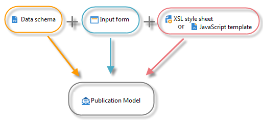

# Content manager resources and principles{#content-manager-resources-and-principles}

You need to define a publication template, which contains transformation templates for each content.

A content block is structured in an XML document for data storage. An edit interface is used to input the content from the Adobe Campaign client console or via a web browser. The content can also be entered automatically via the capture of XML flow or data aggregated in a database.

Combining the XML document and the XSL or JavaScript Template stylesheets automatically generates the projection of the publication template in the various formats (HTML, text).

The following resources are required for content configuration:

* Data schemas: description of the XML content structure. For more on this, refer to [Data schemas](../../delivery/using/data-schemas.md).
* Data entry forms: construction of data entry screens. For more on this, refer to [Input forms](../../delivery/using/input-forms.md).
* Images: images used in data entry forms. For more on this, refer to [Image management](../../delivery/using/content-manager-resources-and-principles.md#image-management).
* Stylesheets: formatting of output documents using XSLT language. For more on this, refer to [Formatting](../../delivery/using/formatting.md).
* JavaScript templates: formatting of output documents using JavaScript language. For more on this, refer to [Publication templates](../../delivery/using/publication-templates.md).
* JavaScript codes: JavaScript codes for data aggregation. For more on this, refer to [Aggregator](../../delivery/using/content-manager-resources-and-principles.md#aggregator).
* Publication templates: definition of publication templates. For more on this, refer to [Publication templates](../../delivery/using/publication-templates.md).
* Content: content instances to be created and published. For more on this, refer to [Using a content template](../../delivery/using/using-a-content-template.md).

