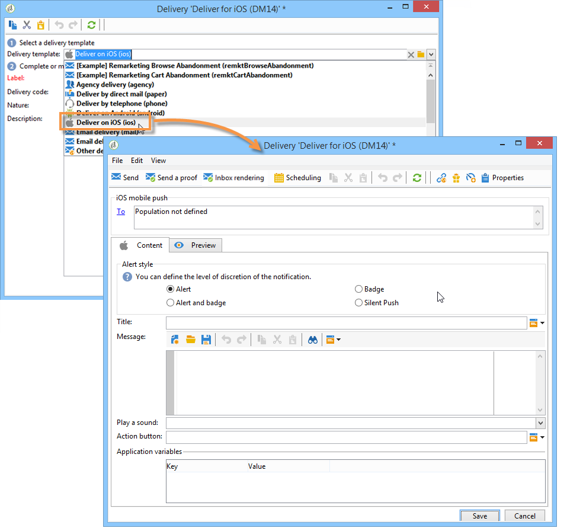
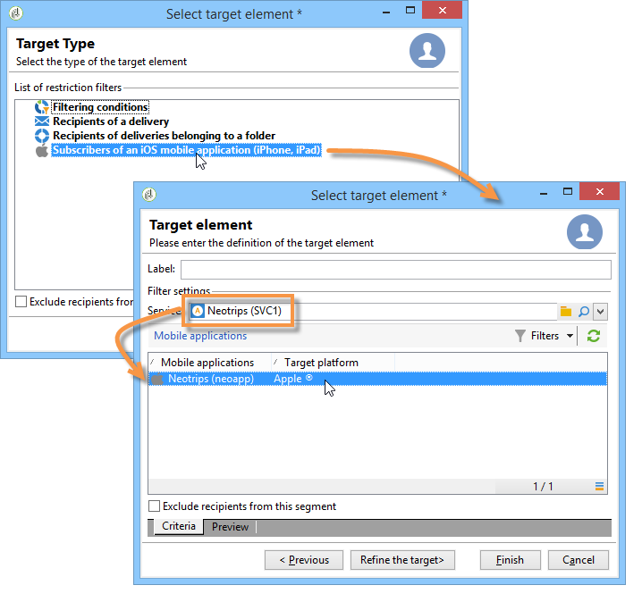
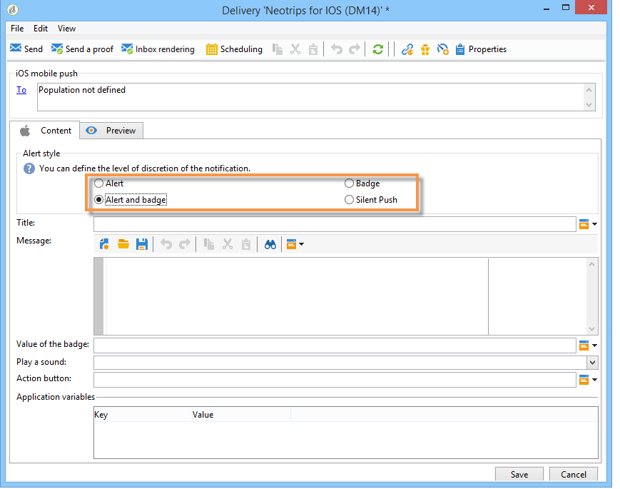
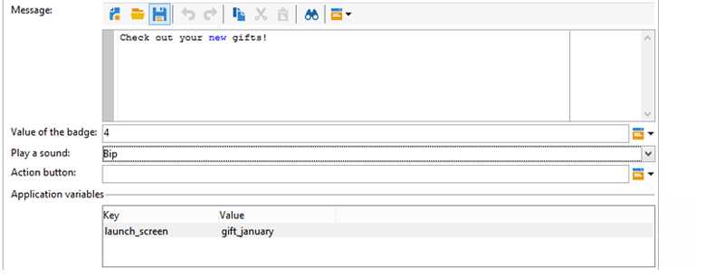
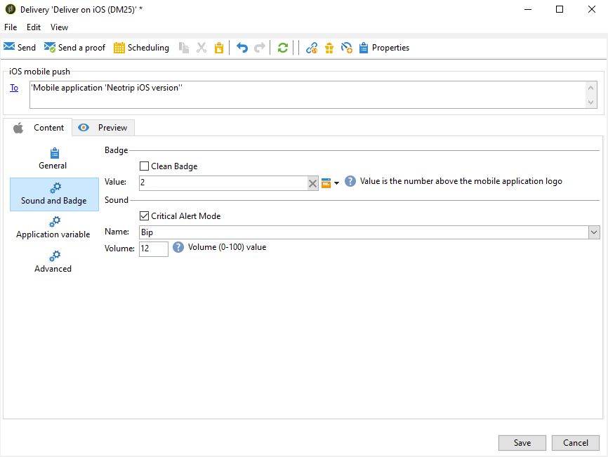
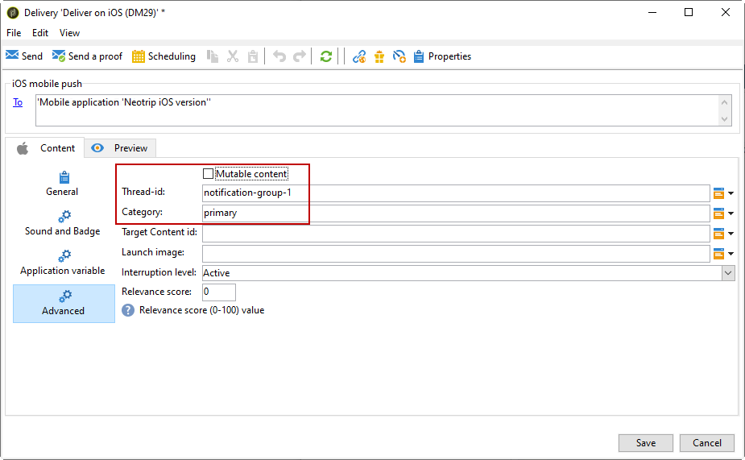
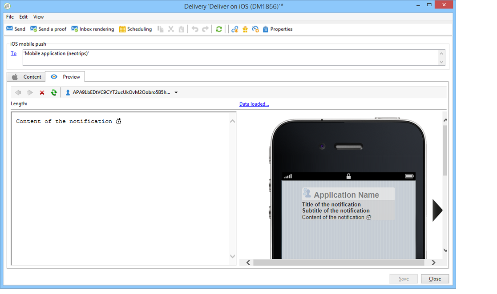
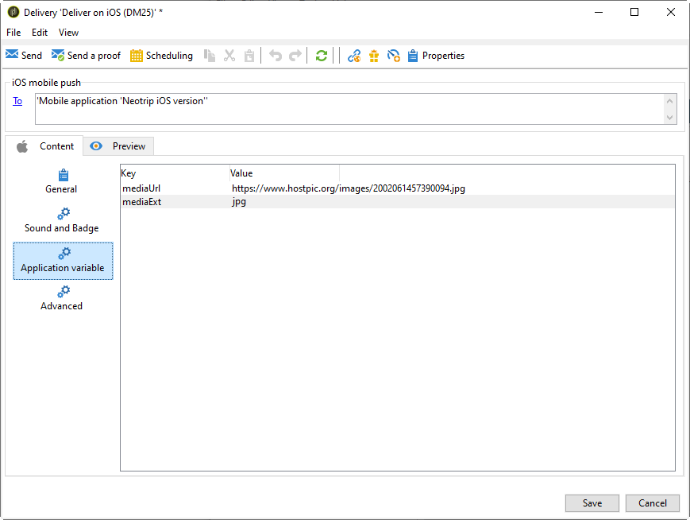

# Create notifications for iOS{#create-notifications-ios}

This section details the elements specific to the delivery of iOS notifications. Global concepts on delivery creation are presented in the [Campaign v8 documentation](https://experienceleague.adobe.com/docs/campaign/campaign-v8/send/create-message.html){target="_blank"}.

Start by creating a new delivery.

To create a push notification for iOS devices, follow the steps below:

1. Select the **[!UICONTROL Deliver on iOS]** delivery template.

   

1. To define the target of the notification, click the **[!UICONTROL To]** link, then click **[!UICONTROL Add]**.

   

   >[!NOTE]
   >
   >The detailed process when selecting the target population of a delivery is presented in this section in the [Campaign v8 documentation](https://experienceleague.adobe.com/docs/campaign/campaign-v8/send/create-message.html#target-population.){target="_blank"}.
   >
   >For more on the use of personalization fields, refer to [this section](about-personalization.md).
   >
   >For more on the inclusion of a seed list, refer to [About seed addresses](about-seed-addresses.md).

1. Select **[!UICONTROL Subscribers of an iOS mobile application (iPhone, iPad)]**, select the service relevant to your mobile application (Neotrips, in this case), then select the iOS version of the application.

   

1. Choose your **[!UICONTROL Notification type]** between **[!UICONTROL General notification (Alert, Sound, Badge)]** or **[!UICONTROL Silent notification]**.

   

   >[!NOTE]
   >
   >The **Silent Push** mode allows a "silent" notification to be sent to a mobile application. The user is not made aware of the notification's arrival. It is transferred directly to the application.

1. In the **[!UICONTROL Title]** field, enter the label of the title that you want to appear in the list of notifications available from the notification center. 

   This field allows you to define the value of the **title** parameter of the iOS notification payload.

1. You can add a **[!UICONTROL Subtitle]**, value of the subtitle parameter of the iOS notification payload. Refer to the [this section](configuring-the-mobile-application.md).

1. Enter the content of the message in the **[!UICONTROL Message content]** section of the assistant. The use of personalization fields is presented in the [About personalization](about-personalization.md) section.

   

1. Click the **[!UICONTROL Insert emoticon]** icon to insert emoticons to your push notification. To customize the emoticon list, refer to [this section](customizing-emoticon-list.md)

1. From the **[!UICONTROL Sound and Badge]** tab, you can edit the following options:

   * **[!UICONTROL Clean Badge]**: enable this options to refresh the badge value.

   * **[!UICONTROL Value]**: set a number which will be used to display directly on the application icon the number of new unread information.

   * **[!UICONTROL Critical alert mode]**: enable this option to add sound to your notification even the user's phone is set on focus mode or if the iPhone is muted.

   * **[!UICONTROL Name]**: select the sound to be played by the mobile terminal when the notification is received.

   * **[!UICONTROL Volume]**: volume of your sound from 0 to 100.

   >[!NOTE]
   >
   >Sounds must be included in the application and defined when the service is created. Refer to [this section](configuring-the-mobile-application.md#configuring-external-account-ios).

   

1. From the **[!UICONTROL Application variables]** tab, your **[!UICONTROL Application variables]** are automatically added. They let you define notification behavior, for instance, you can configure a specific application screen to be displayed when the user activates the notification.

   For more on this, refer to [this section](configuring-the-mobile-application.md).

1. From the **[!UICONTROL Advanced]** tab, you can edit the following general options:

   * **[!UICONTROL Mutable content]**: enable this option to allow the mobile application to download media content.

   * **[!UICONTROL Thread-id]**: identifier used to group related notifications together.

   * **[!UICONTROL Category]**: name of your category ID which will display action buttons. These notifications give the user a faster way to perform different tasks in response to a notification without opening or navigating in the application.

   

1. For time sensitive notification, you can specify the following options:

   * **[!UICONTROL Target content ID]**: identifier used to target which application window to brought forward when the notification is opened.

   * **[!UICONTROL Launch image]**: name of the launch image file to display. If the user chooses to launch your application, the selected image will displayed instead of your application's launch screen.

   * **[!UICONTROL Interruption level]**:

      * **[!UICONTROL Active]**: Set by default, the system presents the notification immediately, lights up the screen, and can play a sound. Notifications do not break through Focus modes.

      * **[!UICONTROL Passive]**: The system adds the notification to the notification list without lighting up the screen or playing a sound. Notifications do not break through Focus modes.

      * **[!UICONTROL Time sensitive]**: The system presents the notification immediately, lights up the screen, can play a sound and break through Focus modes. This level does not require a special permission from Apple.

      * **[!UICONTROL Critical]**: The system presents the notification immediately, lights up the screen, and bypasses the mute switch or focus modes. Note that this level requires a special permission from Apple.

   * **[!UICONTROL Relevance score]**: set a relevance score from 0 to 100. The system uses this to sort the notifications in the notification summary.

   

1. Once the notification is configured, click the **[!UICONTROL Preview]** tab to preview the notification. 

   

   >[!NOTE]
   >
   >The notification style (banner or alert) is not defined in Adobe Campaign. It depends on the configuration selected by the user in their iOS settings. However, Adobe Campaign allows you to preview each type of notification style. Click the arrow in the bottom right to switch from one style to another.
   >
   >The preview uses the iOS 10 look and feel.

To send a proof and to send the final delivery, use the same process as email deliveries. [Learn more](steps-validating-the-delivery.md)

After sending messages, you can monitor and track your deliveries. For more on this, refer to these sections:

* [Push notification quarantines](delivery-failures-quarantine.md#push-notification-quarantines)
* [Monitoring a delivery](about-delivery-monitoring.md)
* [Understanding delivery failures](delivery-failures-quarantine.md)

## Create an iOS rich notification {#creating-ios-delivery}

With iOS 10 or higher, it is possible to generate rich notifications. Adobe Campaign can send notifications using variables that will allow the device to display a rich notification.

You now need to create a new delivery and link it to the mobile application that you created.

1. Go to **[!UICONTROL Campaign management]** > **[!UICONTROL Deliveries]**.

1. Click **[!UICONTROL New]**.

    

1. Select **[!UICONTROL Deliver on iOS (ios)]** in the **[!UICONTROL Delivery template]** drop-down. Add a **[!UICONTROL Label]** to your delivery.

1. Click **[!UICONTROL To]** to define the population to target. By default, the **[!UICONTROL Subscriber application]** target mapping is applied. Click **[!UICONTROL Add]** to select our previously created service.

    

1. In the **[!UICONTROL Target type]** window, select **[!UICONTROL Subscribers of an iOS mobile application (iPhone, iPad)]** and click **[!UICONTROL Next]**.

1. In the **[!UICONTROL Service]** drop-down, select your previously created service then the application you want to target and click **[!UICONTROL Finish]**.

   

1. Edit your rich notification.

   

1. From the **[!UICONTROL Application variables]** tab, your **[!UICONTROL Application variables]** are automatically added depending on what was added during the configuration steps.

   >[!NOTE]
   >
   >Application variables must be defined in the code of the mobile application and entered during service creation. For more on this, refer to [this section](configuring-the-mobile-application.md).

   

1. From the **[!UICONTROL Advanced]** tab, check the **[!UICONTROL Mutable content]** box to allow the mobile application to download media content.

1. Click **[!UICONTROL Save]** and send your delivery.

The image and web page should be displayed in the push notification when received on the subscribers' mobile iOS devices.

   

