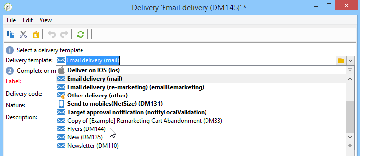
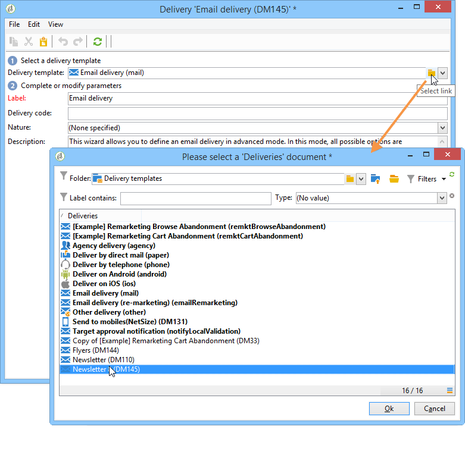
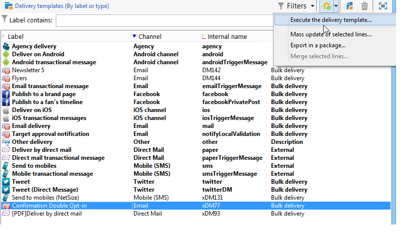

# Creating a delivery from a template{#creating-a-delivery-from-a-template}

## Linking the template to a delivery {#linking-the-template-to-a-delivery}

To create a delivery based on an existing template, select the template from the list of available delivery templates.

Otherwise, click the **[!UICONTROL Select link]** folder to the right of the field to browse the tree.

Select the desired directory from the **[!UICONTROL Folder]** field, or click the **[!UICONTROL Display sub-levels]** icon to display the contents of the directories in the sub-trees of the current directory.

Select the delivery template to be used, and click **[!UICONTROL Ok]**.

## Executing the template {#executing-the-template}

You can launch the execution of a template directly from the template list without creating a delivery first. To do this, select the template to be executed and right-click. Select **[!UICONTROL Actions>Execute the delivery template...]**.

You can also use **[!UICONTROL File>Actions>Execute the delivery template...]**.

Enter the delivery parameters and click **[!UICONTROL Send]**.

This action generates a delivery in the folder attached to the template. The name of this delivery is the name of the delivery template from which it was created.

>[!NOTE]
>
>For further information about configuring a delivery, see [Defining the email content](../../delivery/using/defining-the-email-content.md).
