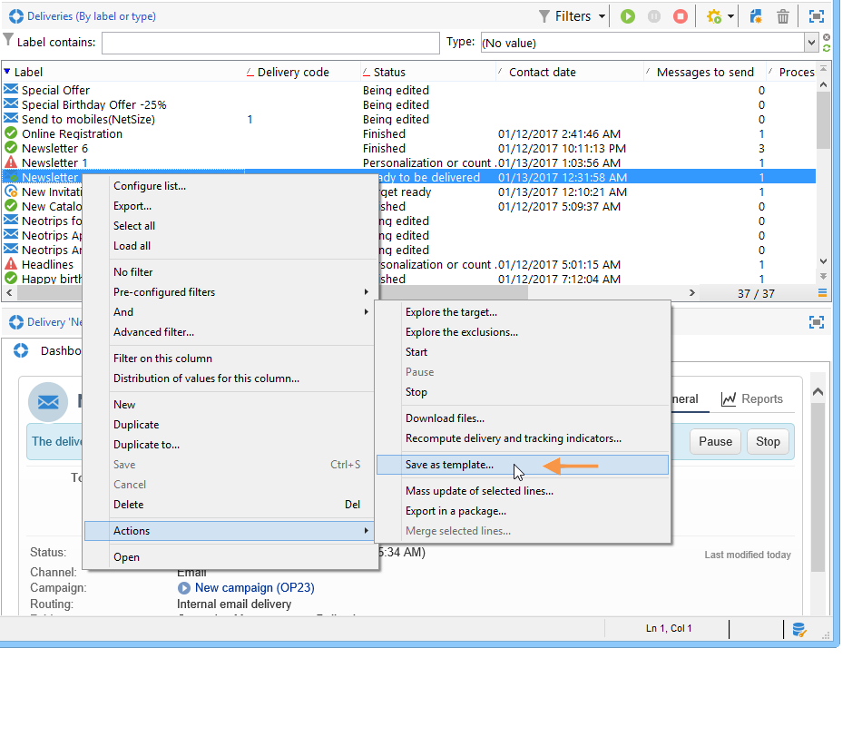
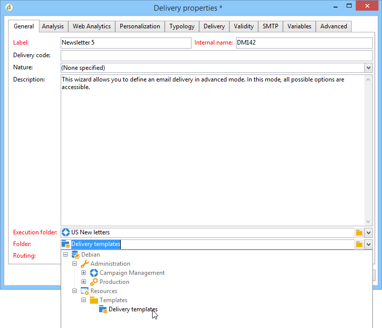
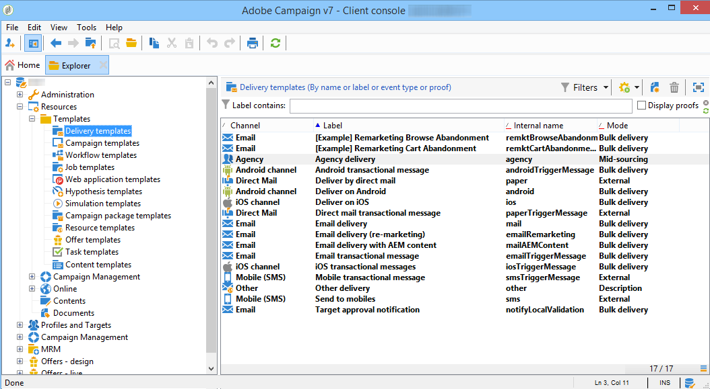
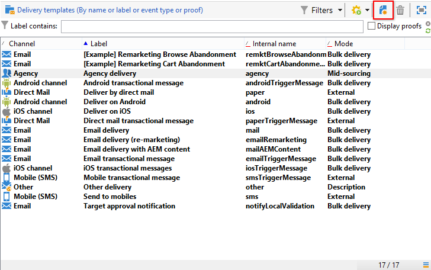
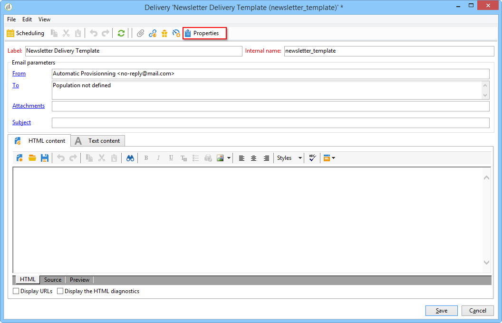
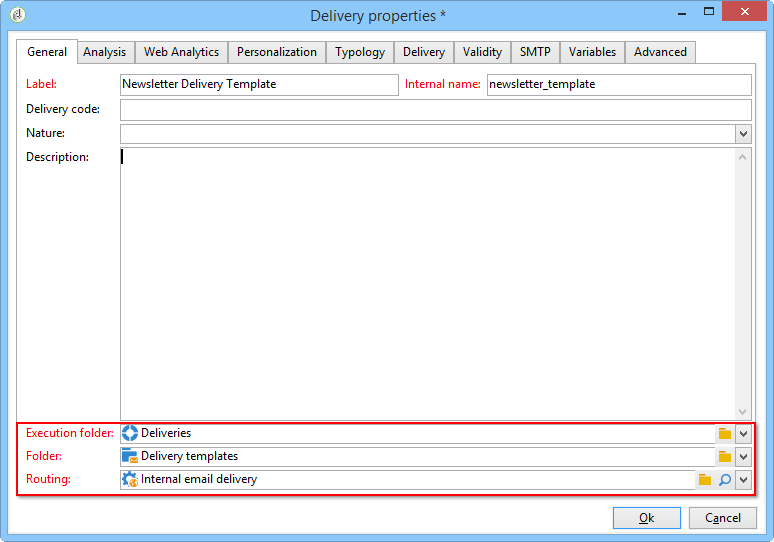
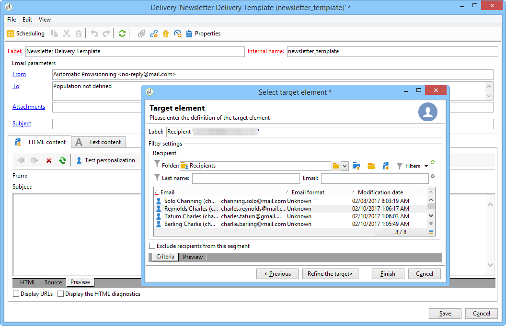

# Creating a delivery template{#creating-a-delivery-template}

## Converting an existing delivery to a template {#converting-an-existing-delivery-to-a-template}

A delivery can be converted to a template for new repeated delivery actions. To convert a delivery to a template, select it from the delivery list, accessible via the **Campaign management** node of the tree.

Right-click and select **Actions > Save as template...**.

This action creates a delivery template from the selected delivery. You must enter the folder where it is saved (in the **Folder** field) as well as the folder where the deliveries created based on this template are created (in the **Execution folder** field).

For more information on the configuration mode, refer to [Linking the template to a delivery](../../delivery/using/creating-a-delivery-template.md#linking-the-template-to-a-delivery).

## Creating a new template {#creating-a-new-template}

To configure a delivery template, carry out the following steps:

1. Open the Campaign Explorer.
1. In the **Resources** folder, select **Templates** then **Delivery templates**.

   

1. Click **New** in the toolbar to create a new delivery template.

   

1. Modify the **Label **and the **Internal name** of the folder.
1. Save your template and reopen it.
1. Click the **Properties** button, and then modify the values according to your requirements. 

   

1. In the **General **tab, confirm or change the locations selected in the **Execution folder**, **Folder**, and **Routing** drop-down menus.

   

1. Complete the **Email parameters **category with your email subject and targeted population.
1. Add your **HTML content** to personalize your template, you can display a mirror page link and an unsubscription link.
1. Select the **Preview** tab. In the **Test personalization** drop-down menu, select **Recipient** to preview your template as the chosen profile.

   

1. Click **Save**. Your template is now ready to be used in a delivery.

>[!NOTE]
>
>To avoid configuration errors, we recommend that you duplicate a native template and alter its properties rather than create a new template.

