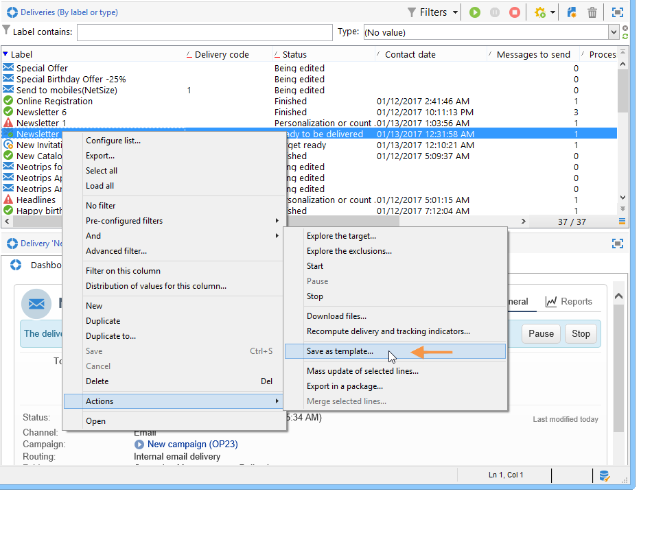
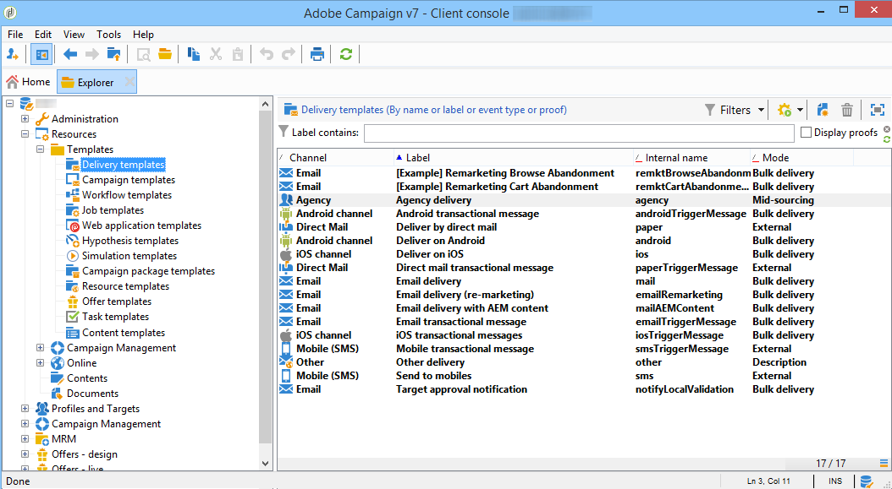
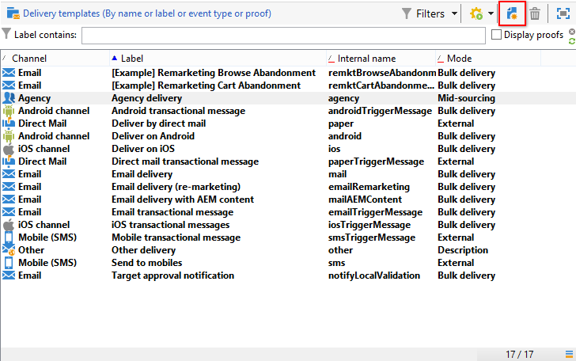
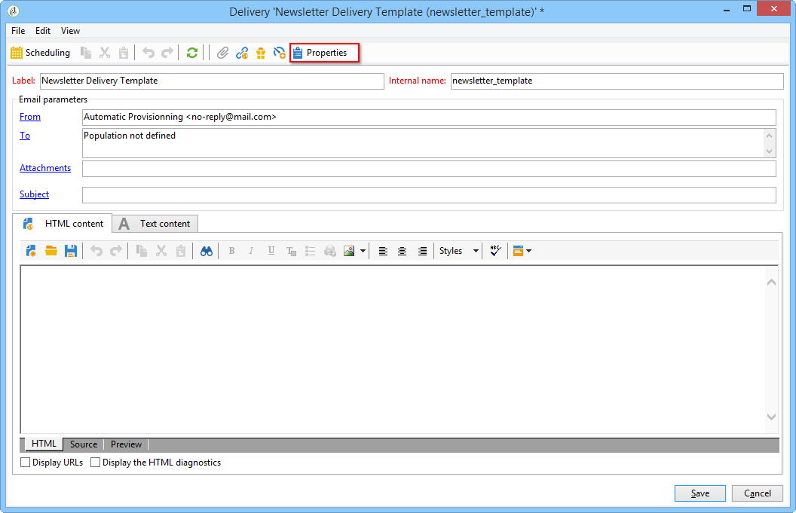
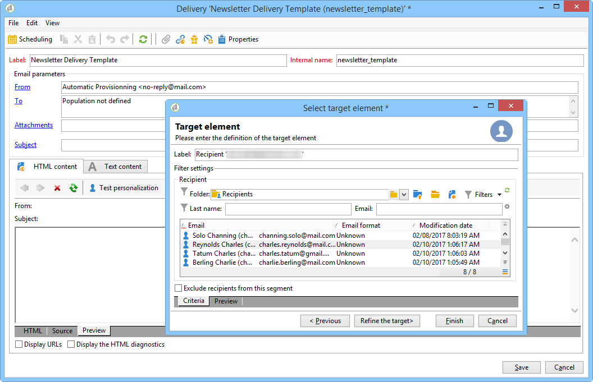

# Creating a delivery template{#creating-a-delivery-template}

 [Discover this feature in video](#delivery-template-video)

## Converting an existing delivery to a template {#converting-an-existing-delivery-to-a-template}

A delivery can be converted to a template for new repeated delivery actions. To convert a delivery to a template, select it from the delivery list, accessible via the **[!UICONTROL Campaign management]** node of the tree.

Right-click and select **[!UICONTROL Actions > Save as template...]**.

This action creates a delivery template from the selected delivery. You must enter the folder where it is saved (in the **[!UICONTROL Folder]** field) as well as the folder where the deliveries created based on this template are created (in the **[!UICONTROL Execution folder]** field).

For more information on the configuration mode, refer to [Linking the template to a delivery](creating-a-delivery-from-a-template.md#linking-the-template-to-a-delivery).

## Creating a new template {#creating-a-new-template}

>[!NOTE]
>
>To avoid configuration errors, Adobe recommends that you duplicate a native template and customize its settings rather than create a new template.

To configure a delivery template, carry out the following steps:

1. Open the Campaign Explorer.
1. In the **Resources** folder, select **Templates** then **Delivery templates**.

   

1. Click **New** in the toolbar to create a new delivery template, or **Duplicate** an existing template.

   

1. Modify the **Label** and the **Internal name** of the folder.
1. Save your template and reopen it.
1. Click the **Properties** button, and then modify the values according to your requirements.

   

1. In the **General** tab, confirm or change the locations selected in the **Execution folder**, **Folder**, and **Routing** drop-down menus.

   

1. Complete the **Email parameters** category with your email subject and targeted population.
1. Add your **HTML content** to personalize your template, you can display a mirror page link and an unsubscription link.
1. Select the **Preview** tab. In the **Test personalization** drop-down menu, select **Recipient** to preview your template as the chosen profile.

   

1. Click **Save**. Your template is now ready to be used in a delivery.

## Tutorial videos {#delivery-template-video}

### How to configure a delivery template 

The following video demonstrates how to configure a template for an ad hoc delivery.

>[!VIDEO](https://video.tv.adobe.com/v/24066?quality=12)

### How to set up delivery templates properties

The following video shows how to set the delivery template properties and explains each property in detail.

>[!VIDEO](https://video.tv.adobe.com/v/24067?quality=12)

### How to deploy an ad-hoc delivery template

This video explains how to deploy an ad-hoc email delivery template and it explains the difference between an email delivery and a delivery workflow.

>[!VIDEO](https://video.tv.adobe.com/v/24065?quality=12)

Additional Campaign Classic how-to videos are available [here](https://experienceleague.adobe.com/docs/campaign-classic-learn/tutorials/overview.html).
