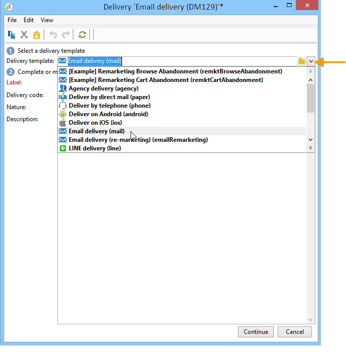

# Creating an email delivery{#creating-an-email-delivery}

To create a new email delivery, follow the steps below:

>[!NOTE]
>
>Global concepts on delivery creation are presented in [this section](steps-about-delivery-creation-steps.md).

1. Create a new delivery, for example from the Delivery dashboard.
1. Select the delivery template **Email delivery (mail)** or any email delivery template that you created. For more on delivery templates, refer to [this section](about-templates.md).

   

1. Identify your delivery with a label, code, and description. For more on this, refer to [this section](steps-create-and-identify-the-delivery.md#identifying-the-delivery).
1. Click **Continue** to confirm this information and display the message configuration window.
