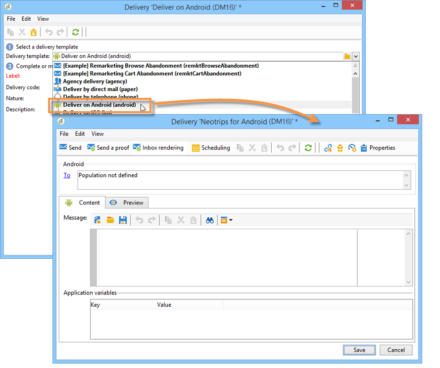
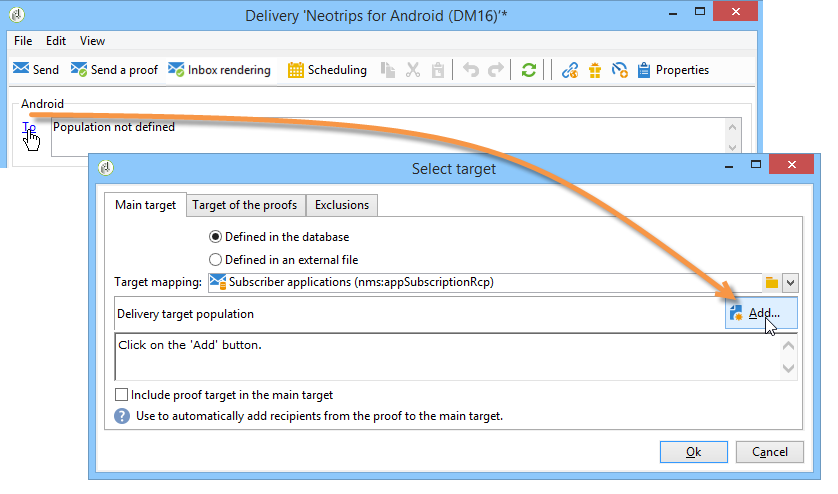
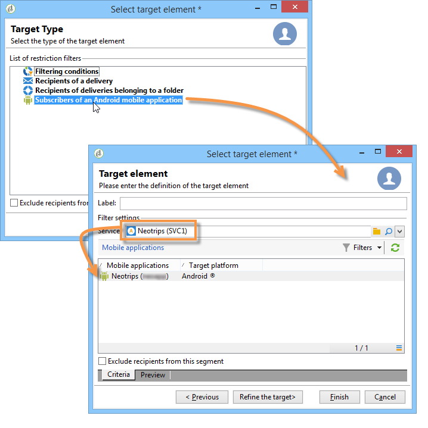
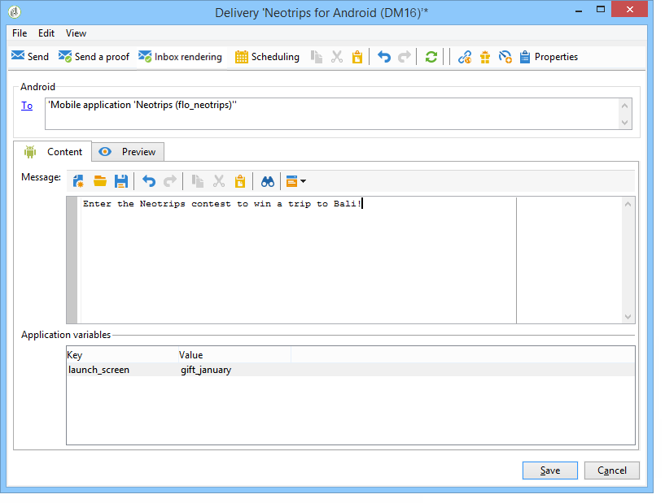

# Creating notifications{#creating-notifications}

This section details the elements specific to the delivery of iOS and Android notifications. Global concepts on delivery creation are presented in [this section](../../delivery/using/key-steps-when-creating-a-delivery.md).

Start by creating a new delivery.

## Sending notifications on iOS {#sending-notifications-on-ios}

1. Select the **Deliver on iOS** delivery template.

   

1. To define the target of the notification, click the **To** link, then click **Add**.

   

   >[!NOTE]
   >
   >The detailed process when selecting the target population of a delivery is presented in [this section](../../delivery/using/key-steps-when-creating-a-delivery.md#defining-the-target-population).  
   >For more on the use of personalization fields, refer to [About personalization](../../delivery/using/about-personalization.md).  
   >For more on the inclusion of a seed list, refer to [About seed addresses](../../delivery/using/about-seed-addresses.md).

1. Select **Subscribers of an iOS mobile application (iPhone, iPad)**, select the service relevant to your mobile application (Neotrips, in this case), then select the iOS version of the application.

   

1. Select the notification type: **Alert**, **Badge**, or **Alert and badge** or **Silent Push**.

   

   >[!NOTE]
   >
   >The **Silent Push** mode is available from iOS 7. This allows a "silent" notification to be sent to a mobile application. The user is not made aware of the notification's arrival. It is transferred directly to the application.

1. In the **Title** field, enter the label of the title that you want to appear on the notification. It will only appear in the list of notifications available from the notification center. This field allows you to define the value of the **title** parameter of the iOS notification payload.
1. If you use the HTTP/2 connector, you can add a subtitle (value of the **subtitle** parameter of the iOS notification payload). Refer to the [Connectors](../../delivery/using/creating-notifications.md#connectors) section.
1. Then enter the **Message** and the **Value of the badge** based on the chosen notification type. 

   

   >[!NOTE]
   >
   >You can add emojis into the content of your notification. To do so, go to an emoji listing website ( [example](https://www.utf8-chartable.de/unicode-utf8-table.pl?start=9728)), copy an emoji and paste it directly into the content editor. On Windows 7, some emojis may not be displayed correctly in the editor (square symbol), but they should be sent correctly in the final notification. The ability to display emojis depends the OS used on the device. We recommend that you send proofs to verify that the delivery is correctly displayed before sending it.

   >[!NOTE]
   >
   >**Badge** and **Alert and badge** type notifications enable you to modify the value of the badge (the number above the mobile application logo). To refresh the badge, you just have to enter 0 as the value. If the field is empty, the badge value will not change.

1. The **Action button** allows you to define a label for the action button appearing on the alert notifications (**action_loc_key** field of the payload). If your iOS application manages localizable strings (**Localizable.strings**), enter the corresponding key into this field. If your application does not manage localizable text, enter the label that you want to see appear on the action button. For more information on localizable strings, consult the .
1. In the **Play a sound** field, select the sound to be played by the mobile terminal when the notification is received.

   >[!NOTE]
   >
   >Sounds must be included in the application and defined when the service is created. Refer to [Application sounds](../../delivery/using/creating-notifications.md#-application-sounds).

1. In the **Application variables** field, enter the value of each variable. Application variables let you define notification behavior: for instance, you can configure a specific application screen to be displayed when the user activates the notification.

   >[!NOTE]
   >
   >Application variables must be defined in the code of the mobile application and entered during service creation. For more on this, refer to: [General information](../../delivery/using/creating-notifications.md#-general-information).

1. Once the notification is configured, click the **Preview** tab to preview the notification. 

   

   >[!NOTE]
   >
   >The notification style (banner or alert) is not defined in Adobe Campaign. It depends on the configuration selected by the user in their iOS settings. However, Adobe Campaign allows you to preview each type of notification style. Click the arrow in the bottom right to switch from one style to another.  
   >The preview uses the iOS 10 look and feel.

To send a proof and to send the final delivery, use the same process as email deliveries.

After sending messages, you can monitor and track your deliveries. For more on this, refer to these sections:

* [Push notification quarantines](../../delivery/using/creating-notifications.md#push-notification-quarantines)
* [Monitoring a delivery](../../delivery/using/monitoring-a-delivery.md)
* [Understanding delivery failures](../../delivery/using/understanding-delivery-failures.md)

## Sending notifications on Android {#sending-notifications-on-android}

1. Start by selecting the **Deliver on Android (android)** delivery template.

   

1. To define the target of the notification, click the **To** link, then click **Add**.

   

1. Select **Subscribers of an Android mobile application**, choose the service relevant to your mobile application (Neotrips, in this case), then select the Android version of the application.

   

1. Then enter the content for the notification.

   

   >[!NOTE]
   >
   >You can add emojis into the content of your notification. To do so, go to an emoji listing website ( [example](https://www.utf8-chartable.de/unicode-utf8-table.pl?start=9728)), copy an emoji and paste it directly into the content editor. On Windows 7, some emojis may not be displayed correctly in the editor (square symbol), but they should be sent correctly in the final email. The ability to display emojis depends the OS used on the device. We recommend that you send proofs to verify that the delivery is correctly displayed before sending it.

1. In the **Application variables** field, enter the value of each variable. Application variables let you define notification behavior: for instance, you can configure a specific application screen to be displayed when the user activates the notification.

   >[!NOTE]
   >
   >Application variables must be defined in the code of the mobile application and entered during service creation. For more on this, refer to: [General information](../../delivery/using/creating-notifications.md#-general-information).

1. Once the notification is configured, click the **Preview** tab to preview the notification. 

   

To send a proof and to send the final delivery, use the same process as email deliveries.

The detailed process when validating and sending a delivery is presented in the sections below:

* [Validating the delivery](../../delivery/using/creating-notifications.md#validating-the-delivery)
* [Sending the delivery](../../delivery/using/creating-notifications.md#sending-the-delivery)

After sending messages, you can monitor and track your deliveries. For more on this, refer to these sections:

* [Push notification quarantines](../../delivery/using/creating-notifications.md#push-notification-quarantines)
* [Monitoring a delivery](../../delivery/using/monitoring-a-delivery.md)
* [Understanding delivery failures](../../delivery/using/understanding-delivery-failures.md)

