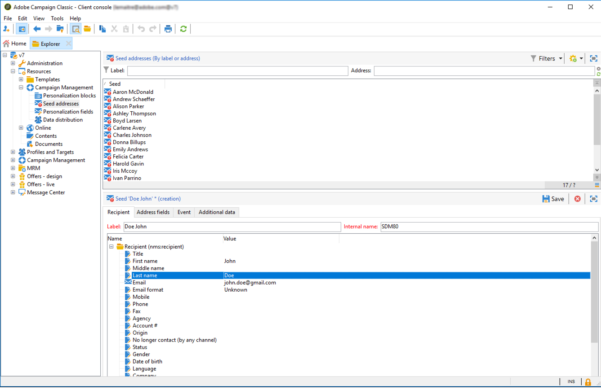
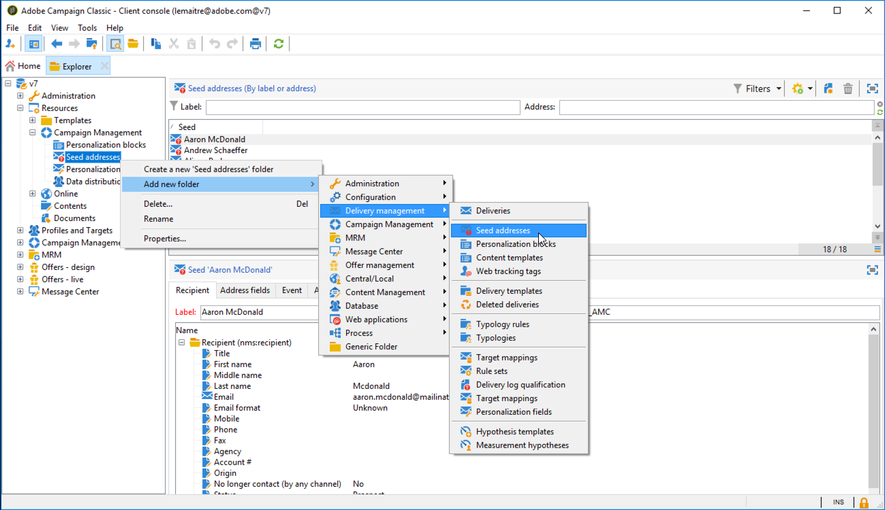
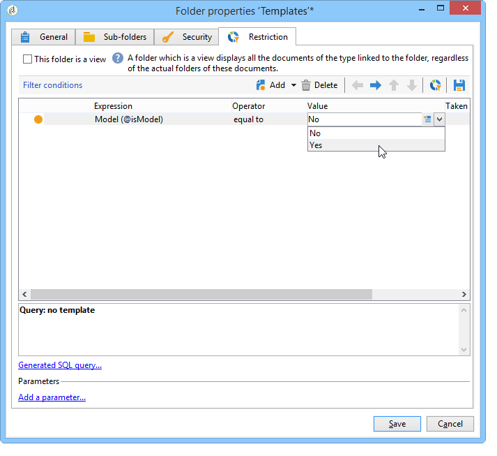

# Creating seed addresses{#creating-seed-addresses}

Seed addresses are not managed via standard profiles and targets, but in a dedicated node of the Adobe Campaign hierarchy **[!UICONTROL Resources > Campaign management > Seed addresses]**.

You can create sub-folders in order to organize the seed addresses. To do this, right-click the **[!UICONTROL Seed addresses]** node and select **[!UICONTROL Create a new 'Seed addresses' folder]**. Name the sub-folder and then press **[!UICONTROL Enter]** to validate. You can now create or copy seed addresses to this sub-folder. For more on this, refer to [Defining addresses](#defining-addresses).

Adobe Campaign also lets you create seed address templates which are imported into deliveries or campaigns and adapted based on the specific needs of the concerned deliveries and campaigns. Refer to [Creating seed address templates](#creating-seed-address-templates).

## Defining addresses {#defining-addresses}

To create seed addresses, follow the steps below:

1. Click the **[!UICONTROL New]** button above the list of seed addresses.
1. Enter the data linked to the address in the matching fields from the **[!UICONTROL Recipient]** tab. The available fields correspond to the standard fields in the profiles of the delivery recipients (nms:recipient table): name, first name, email, etc.

   >[!NOTE]
   >
   >The label of the address is automatically filled in with the last name and first name you defined.
   >
   >It is not necessary to enter all fields of each tab when creating a seed address. Any missing personalization elements are entered randomly during delivery.

   

1. In the **[!UICONTROL Seed fields]** tab, enter the values that will be inserted in the delivery logs during the analysis phase (in the **[!UICONTROL nms:broadLog]** table).

1. In the **[!UICONTROL Additional data]** tab, enter the personalization data used for the deliveries created in the Data management workflows and which you want to assign a specific value to.

   >[!NOTE]
   >
   >Make sure that additional target data has been defined with an alias starting with '@' in the **[!UICONTROL Enrichment]** activity. Otherwise, you will not be able to use them properly with your seed addresses in your delivery activity.

## Creating seed address templates {#creating-seed-address-templates}

To create address templates which will be imported and may be modified for each delivery, the process is the same as when defining a new seed address. The only difference is that seed address templates addresses must be stored in a 'Template' type folder.

To define a template folder, apply the following process:

1. Create a new **[!UICONTROL Seed addresses]** type folder, right-click the folder then select **[!UICONTROL Properties...]**.

   

1. Click the **[!UICONTROL Restriction]** tab and add the following filtering condition: **@isModel = true**.

   

   Addresses stored in this folder may now be used as address templates. You can import them into deliveries or campaigns and adapt them based on the specific needs of the concerned deliveries and campaigns (see [Adding seed addresses](../../delivery/using/adding-seed-addresses.md)).
