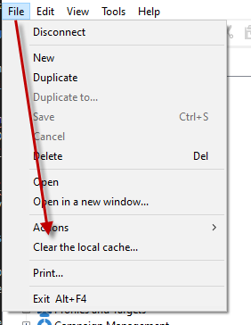

# Customizing the emoticon list {#customize-emoticons}

The emoticon list displayed in the pop-up is ruled by an enumeration.
An enumeration allows you to display values in a list in order to restrict the choices that the user has for a given field.
The emoticon list order can be customized, you can also add other emoticons to your list.
Emoticons are available for email and push for more on this refer to

## Adding a new emoticon {#add-new-emoticon}

>[!CAUTION]
>
>The emoticon list can not exceed 81 entries.

1. Choose your new emoticon to add from this [page](https://unicode.org/emoji/charts/full-emoji-list.html). Note that it has to be compatible with the different platforms such as browser and OS.

1. From the **[!UICONTROL Explorer]**, select **[!UICONTROL Administration]** > **[!UICONTROL Platform]** > **[!UICONTROL Enumerations]** and click the **[!UICONTROL Emoticon list]** out-of-the-box enumeration.

    >[!NOTE]
    >
    >Out-of-the-box enumerations can only be managed by an administrator of your Adobe Campaign Classic console.

    

1. Click **[!UICONTROL Add]**.

1. Fill in the fields:
    * **[!UICONTROL U+]**: Code of your new emoticon. You can find the list of emoticons' codes in this [page](https://unicode.org/emoji/charts/full-emoji-list.html).

    * **[!UICONTROL Label)**: Label of your new emoticon.

    * **[!UICONTROL Display order]**: Choose here in which order your new emoticon will be displayed. Note that by selecting an existing display order the existing emoticon will be automatically moved to the store.
     In this example, we chose the display order number 80 which means that if an entry already had this order it will be automatically moved to the store and our new entry will take its place in the enumeration list.

     

1. Click **[!UICONTROL Ok]** then **[!UICONTROL Save]** when your configuration is finished.

1. For your changes to be taken into account, you need to clear your cache by selecting **[!UICONTROL File]** > **[!UICONTROL Clear the local cache...]**.

     

1. Your new emoticon has now been added to the **[!UICONTROL Emoticon list]** out-of-the-box enumeration. Double-click  it to change its **[!UICONTROL Display order]** or move it to the store if you do not need it anymore.

Your new emoticon can now be found in your deliveries in the **[!UICONTROL Insert emoticon]** pop-up window in the 80th position as configured in the previous steps. For more information on how to use emoticons in your deliveries, refer to this page.

