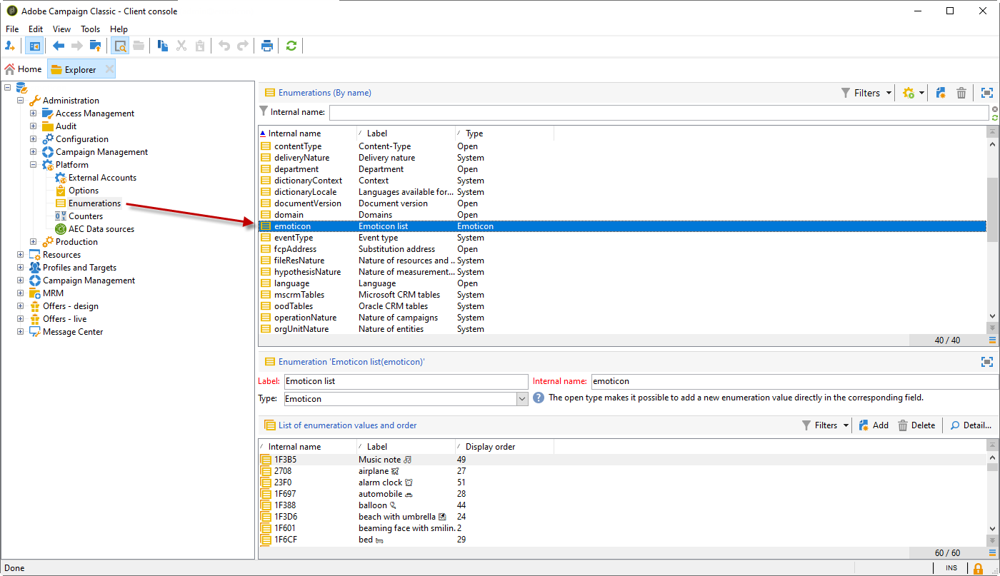
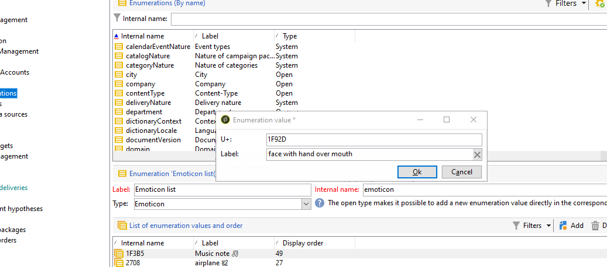
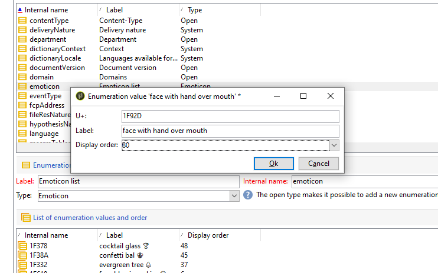
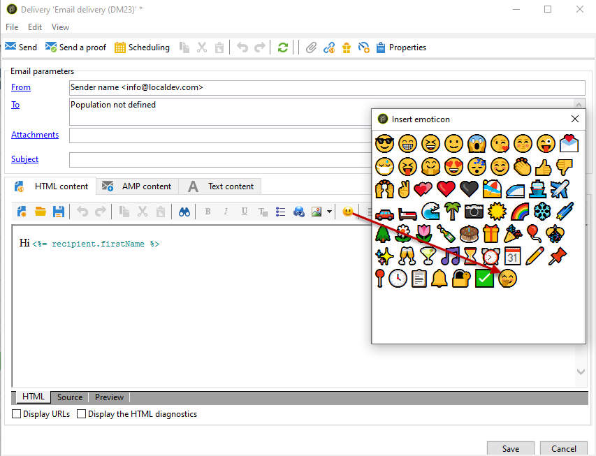
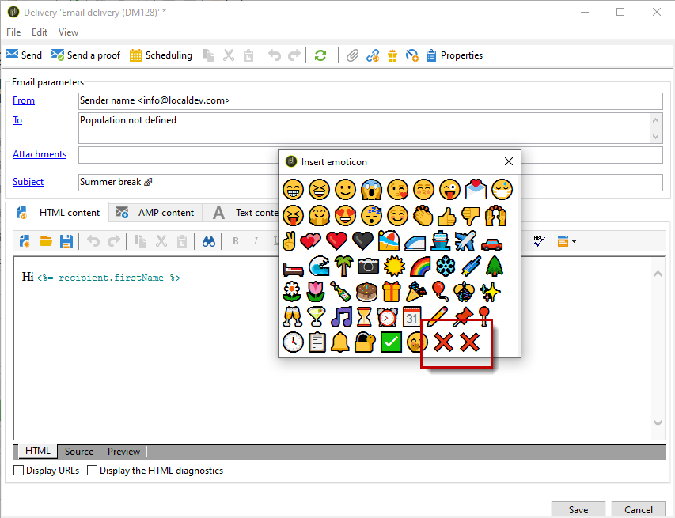

# Customizing the emoticon list {#customize-emoticons}

The emoticon list displayed in the pop-up is ruled by an enumeration which allows you to display values in a list to restrict the choices that the user has for a given field.
The emoticon list order can be customized, you can also add other emoticons to your list.
Emoticons are available for email and push for more on this refer to this [page](../../delivery/using/defining-the-email-content.md#inserting-emoticons).

## Adding a new emoticon {#add-new-emoticon}

>[!CAUTION]
>
>The emoticon list can not display more than 81 entries.

1. Choose your new emoticon to add from this [page](https://unicode.org/emoji/charts/full-emoji-list.html). Note that it has to be compatible with the different platforms such as browser and OS.

1. From the **[!UICONTROL Explorer]**, select **[!UICONTROL Administration]** > **[!UICONTROL Platform]** > **[!UICONTROL Enumerations]** and click the **[!UICONTROL Emoticon list]** out-of-the-box enumeration.

    >[!NOTE]
    >
    >Out-of-the-box enumerations can only be managed by an administrator of your Adobe Campaign Classic console.

    

1. Click **[!UICONTROL Add]**.

1. Fill in the fields:

    * **[!UICONTROL U+]**: Code of your new emoticon. You can find the list of emoticons' codes in this [page](https://unicode.org/emoji/charts/full-emoji-list.html).
    To avoid compatibility issues, we advise you to choose emoticons which are supported on browsers and on every operation system.

    * **[!UICONTROL Label]**: Label of your new emoticon.

     

1. Click **[!UICONTROL Ok]** then **[!UICONTROL Save]** when your configuration is finished.
    Your new emoticon will be automatically placed in the store.

1. To display it in the **[!UICONTROL Insert emoticon]** window of your deliveries, select your newly created emoticon by double-clicking it.

1. Choose in the **[!UICONTROL Display order]** drop-down in which order your new emoticon will be displayed. Note that by selecting an already assigned display order the existing emoticon will be automatically moved to the store.

     In this example, we chose the display order number 61 which means that if an entry already had this order it will automatically be moved to the store and our new entry will take its place in the enumeration list.

    

1. Your new emoticon has now been added to the **[!UICONTROL Insert emoticon list]** out-of-the-box enumeration. You can change its **[!UICONTROL Display order]** at any time or move it to the store if you do not need it anymore.

1. For your changes to be taken into account, disconnect then reconnect from Adobe Campaign Classic. If your new emoticon still doesn't appear in the **[!UICONTROL Insert emoticon]** pop-up window, you might need to clear your cache. For more on this, refer to this [section](../../platform/using/faq-campaign-config.md#perform-soft-cache-clear).

1. Your new emoticon can now be found in your deliveries in the **[!UICONTROL Insert emoticon]** pop-up window in the 61st position as configured in the previous steps. For more information on how to use emoticons in your deliveries, refer to this [page](../../delivery/using/defining-the-email-content.md#inserting-emoticons).

    

1. If the following emoticons appear in your **[!UICONTROL Insert emoticon]** pop-up window, this means that they were not correctly configured. Check if your **[!UICONTROL U+]** code or **[!UICONTROL Display order]** is correct in the **[!UICONTROL Emoticon list]**.

    
