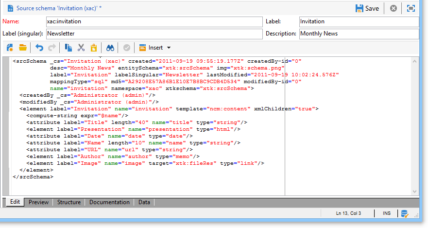

# Data schemas{#data-schemas}

Below are some general principles concerning the use of data schemas in Adobe Campaign.

For more on creating and configuring data schemas in Adobe Campaign, refer to [this section](../../configuration/using/about-schema-edition.md).

## Schema structure {#schema-structure}

The XML document of a data schema must contain the **`<srcschema>`** root element with the **name** and **namespace** attributes to populate the schema name and its namespace.

```
<srcSchema name="schema_name" namespace="namespace">
...
</srcSchema>
```

The point of entry of the schema is its main element. It is easy to identify because it has the same name as the schema, and it should be the child of the root element. The description of the content begins with this element.

In a content management schema, the main element is represented by the following line:

```
<element name="book" template="ncm:content" xmlChildren="true">
```

The **template** attribute entered in the main element lets you extend the schema with generic properties to all content definitions such as name, creation date, author, associated string, etc.

These properties are described in the **ncm:content** schema.

>[!NOTE]
>
>The presence of the **xmlChildren** attribute indicates that the data structure entered via the main element is stored in an XML document of the content instance.

>[!CAUTION]
>
>When creating a new schema or during a schema extension, you need to keep the same primary key sequence value (@pkSequence) for the whole schema.

## Data types {#data-types}

Here is an example of a content management schema with the types filled in:

```
<srcSchema name="book" namespace="cus">
  <element name="book" template="ncm:content" xmlChildren="true">
    <attribute name="title" type="string"/>
    <attribute name="date" type="date"/>
    <attribute name="language" type="string"/>
    <element name="chapter">
      <attribute name="name" type="string"/>
      <element name="page" type="string>
        <attribute name="number" type="short"/>
      </element>
    </element>
  </element>
</element>
```

## Properties {#properties}

Various properties can be used to enrich the **`<element>`** and **`<attribute>`** elements of the data schema.

The main properties used in content management are as follows:

* **label**: short description,
* **desc**: long description,
* **default**: expression returning a default value on content creation,
* **userEnum**: free enumeration to store and display the values entered via this field,
* **enum**: fixed enumeration used when the list of possible values is known in advance.

Here is our example schema with the properties filled in:

```
<srcSchema name="book" namespace="cus">
  <enumeration name="language" basetype="string" default="eng">    
    <value name="fra" label="French"/>    
    <value name="eng" label="English"/>   
  </enumeration>

  <element name="book" label="Book" desc="Example book" template="ncm:content" xmlChildren="true">
    <attribute name="title" type="string" label="Title" default="'New book'"/>
    <attribute name="date" type="date" default="GetDate()"/>
    <attribute name="language" type="string" label="Language" enum="language"/>
    <element name="chapter" label="Chapter">
      <attribute name="name" type="string" label="Name" desc="Name of chapter"/>
      <element name="page" type="string" label="Page" desc="Page content">
        <attribute name="number" type="short" label="Number" default="CounterValue('numPage')"/>
      </element>
    </element>
  </element>
</srcSchema>
```

## Collection elements {#collection-elements}

A collection is a list of elements with the same name and the same hierarchical level.

In our example, the **`<chapter>`** and **`<page>`** elements are collection elements. The **unbound** attribute must therefore be added to the definition of these elements:

```
<element name="chapter" label="Chapter" unbound="true" ordered="true">
```

```
<element name="page" type="string" label="Page" desc="Content of page" unbound="true">
```

>[!NOTE]
>
>The presence of the **ordered="true"** attribute lets you order the collection elements inserted.

## Element referencing {#element-referencing}

Element referencing is used a great deal in content schemas. It enables you to factorize the definition of an **`<element>`** element so that it can be referenced on other elements with the same structure.

The **ref** attribute on the element to be referenced must be completed with the path (XPath) of the reference element.

**Example**: adding of an **Appendix** section with the same structure as the **`<chapter>`** element of our example schema.

```
<srcSchema name="book" namespace="cus">
  <element name="section">
    <attribute name="name" type="string" label="Name" desc="Name"/>
    <element name="page" type="string" label="Page" desc="Content of page">
      <attribute name="number" type="short" label="Number" default="CounterValue('numPage')"/>
    </element>

  <element name="book" label="Book" desc="Example book" template="ncm:content" xmlChildren="true">
    <attribute name="title" type="string" label="Title" default="'New book'"/>
    <attribute name="date" type="date" default="GetDate()"/>
    <attribute name="language" type="string" label="Language" enum="language"/>
    <element name="chapter" label="Chapter" ref="section"/>
    <element name="appendix" label="Appendix" ref="section"/>
  </element>
</srcSchema>
```

The chapter structure is moved to the element with the name "section" outside the main element. The chapter and section reference the "section" element.

## Compute string {#compute-string}

A **Compute string** is an XPath expression used to construct a string representing a content instance.

Here is our example schema with its **Compute string**:

```
<srcSchema name="book" namespace="cus">
  <element name="book" label="Book" desc="Example book" template="ncm:content" xmlChildren="true">
    <compute-string expr="@name"/>
    ...
  </element>
</srcSchema>
```

## Editing schemas {#editing-schemas}

The edit field lets you input the XML content of the source schema:



When the source schema is saved, extended schema generation is launched automatically.

>[!NOTE]
>
>The **Name** edit control lets you enter the key of the schema, consisting of the name and namespace. The **name** and **namespace** attributes of the schema root element are automatically updated in the XML edit field of the schema.
