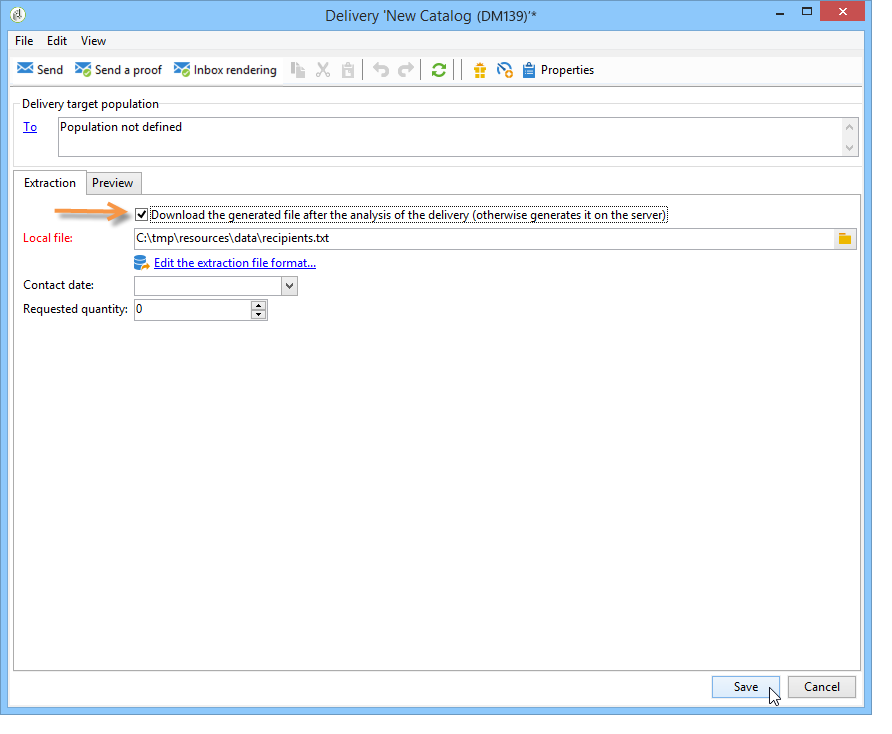
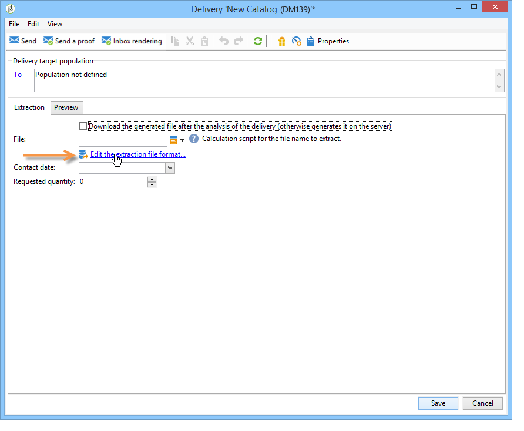
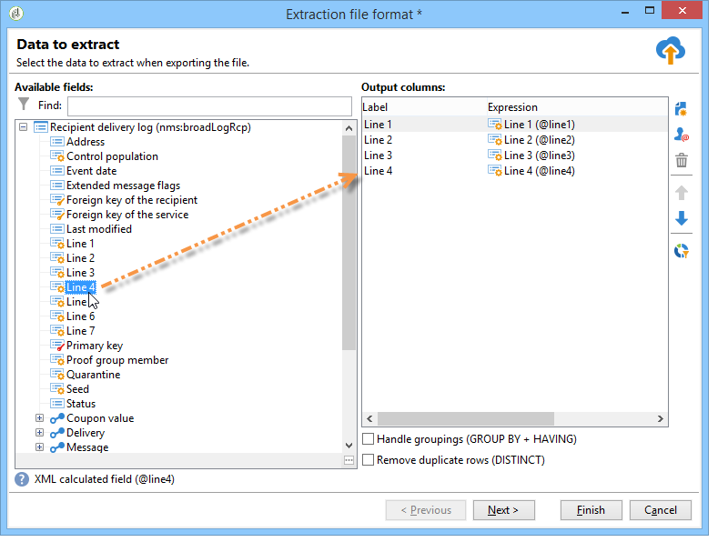

# Defining the direct mail content{#defining-the-direct-mail-content}

## Extraction file {#extraction-file}

The name of the file which contains the extracted data is defined in the **File** field. The button to the right of the field lets you use personalization fields to create the file name.

By default, the extraction file is created and stored on the server. You can save it on your computer. To do this, check the **Download the generated file after the analysis of the delivery**. In this case, you need to indicate the access path to the local storage directory as well as the file name.

For a direct mail delivery, the content of the extraction is defined in **Edit the extraction file format...** link. 

This link lets you access the extraction wizard and define the information (columns) to be exported into the output file. 

It is possible to insert a personalized URL into the extraction file. For more on this, refer to [Web functionality](../../web/using/publishing-a-web-form.md).

>[!NOTE]
>
>This wizard includes the steps of the export wizard detailed in the [Getting Started](/platform/using/exporting-data.md#export-wizard) section.

