# Define the email content {#defining-the-email-content}

## Sender {#sender}

To define the name and address of the sender which will appear in the header of messages sent, click the **[!UICONTROL From]** link.

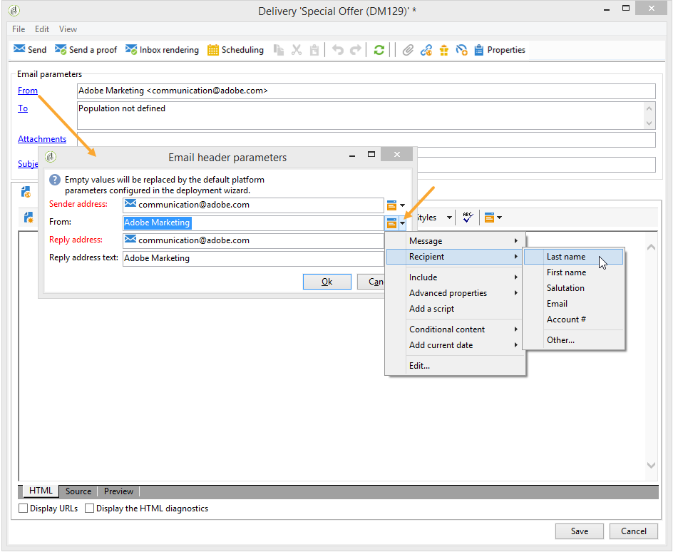

This window lets you enter all the information required to create the email message headers. This information can be personalized. To do this, use the buttons to the right of the input fields to insert personalization fields.

To find out how to insert and use personalization fields, refer to [About personalization](about-personalization.md) section.

>[!NOTE]
>
>* The sender's address is used for replies by default.
>* The header parameters must not be empty. By default, they contain the values input when configuring the deployment wizard. Learn more in [this section](../../installation/using/deploying-an-instance.md).
>* The sender's address is mandatory to allow an email to be sent (RFC standard).
>* Adobe Campaign checks the syntax of email addresses entered.

>[!CAUTION]
>
>To avoid deliverability issues, the email accounts that correspond to the addresses specified for deliveries and replies must exist and must be monitored. Check with your system administrator.

## Message subject {#message-subject}

The subject of the message is configured in the corresponding field. You can enter it directly in the field or click the **[!UICONTROL Subject]** link to enter a script. The personalization link lets you insert database fields in the subject.

>[!IMPORTANT]
>
>The message subject is mandatory.

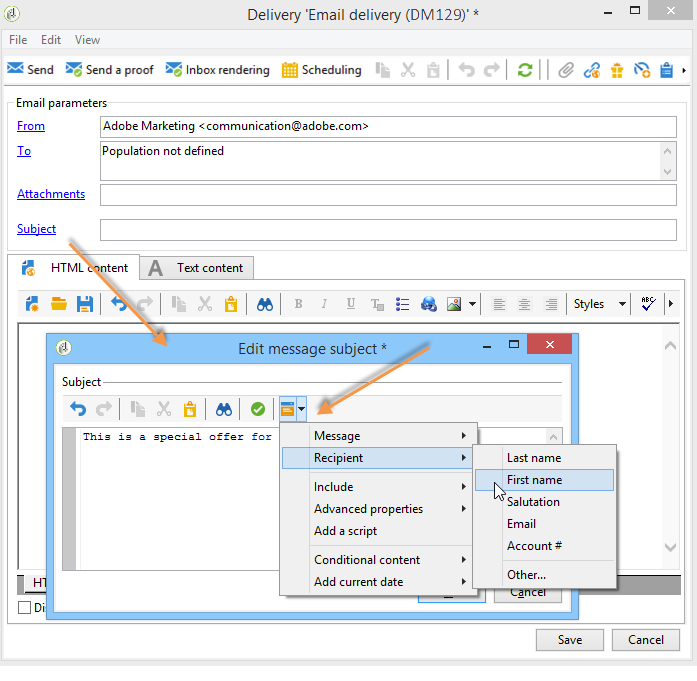

The field content will be replaced by the value in the recipient profile when the message is sent.

For example, in the message above, the subject of the message is personalized for each recipient with data from their profile.

>[!NOTE]
>
>The use of personalization fields is presented in [About personalization](about-personalization.md).

You can also insert emoticons to your subject line with the **[!UICONTROL Insert emoticon]** pop-up window.

## Message content {#message-content}

>[!IMPORTANT]
>
>For privacy reasons, we recommend using HTTPS for all external resources.

The content of the message is defined in the lower section of the delivery configuration window.

Messages are sent in HTML or text format by default, according to recipient preference. We recommend creating content in both formats to ensure that messages can be correctly displayed in any mail system. For more on this, refer to [Selecting message formats](email-parameters.md#selecting-message-formats).

* To import an HTML content, use the **[!UICONTROL Open]** button. You can also paste the source code directly into the **[!UICONTROL Source]** sub-tab.

  If you are using the [Digital Content Editor](../../web/using/about-campaign-html-editor.md) (DCE), refer to [Selecting a content template](../../web/using/use-case-creating-an-email-delivery.md#step-3---selecting-a-content).

  >[!IMPORTANT]
  >
  >The HTML content must be created beforehand, then imported into Adobe Campaign. The HTML editor is not designed for content creation.

  The **[!UICONTROL Preview]** sub-tab lets you view the rendering of each content for a recipient. The personalization fields and the conditional elements of content are replaced with the corresponding information for the selected profile.

  The toolbar buttons provide access to the standard actions and formatting parameters for the HTML page.

  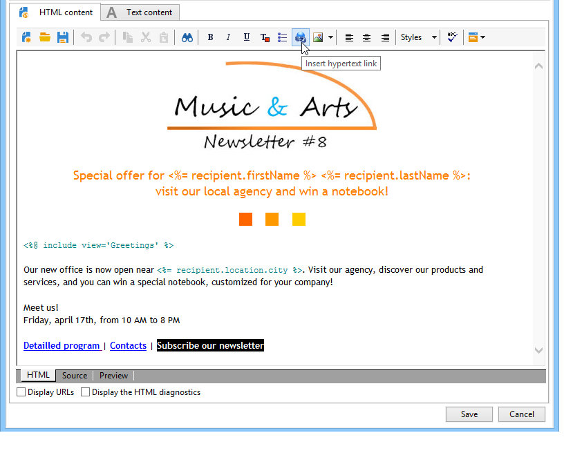

  You can insert images in messages from a local file or from an image library in Adobe Campaign. To do this, click the **[!UICONTROL Image]** icon and select the appropriate option.

  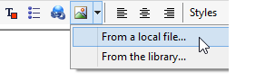

  Library images can be accessed via the **[!UICONTROL Resources>Online>Public resources]** folder in the folder tree. Also refer to [Adding images](#adding-images).

  The last button in the toolbar lets you insert personalization fields.

  >[!NOTE]
  >
  >The use of personalization fields is presented in [About personalization](about-personalization.md).

  The tabs at the bottom of the page let you display the HTML code of the page being created and view the rendering of the message with its personalization. To launch this display, click **[!UICONTROL Preview]** and select a recipient using the **[!UICONTROL Test personalization]** button in the toolbar. You can select a recipient from the defined target(s) or choose another recipient.

  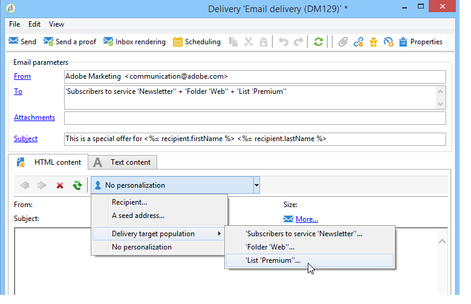

  You can validate the HTML message. You can also view the content of the email header.

  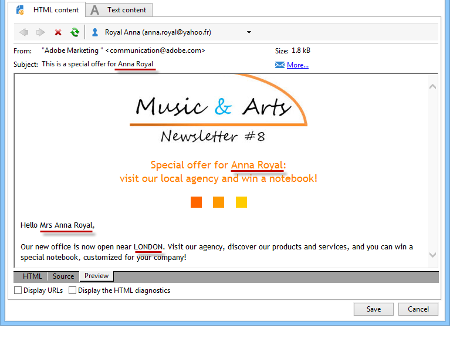

* To import a text content, use the **[!UICONTROL Open]** button, or the **[!UICONTROL Text Content]** tab to enter the content of the message when displayed in text format. Use the toolbar buttons to access actions on the contents. The last button lets you insert personalization fields.

  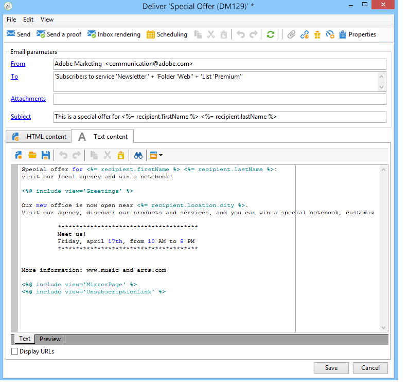

  As for the HTML format click the **[!UICONTROL Preview]** tab at the bottom of the page to view the rendering of the message with its personalization. 

  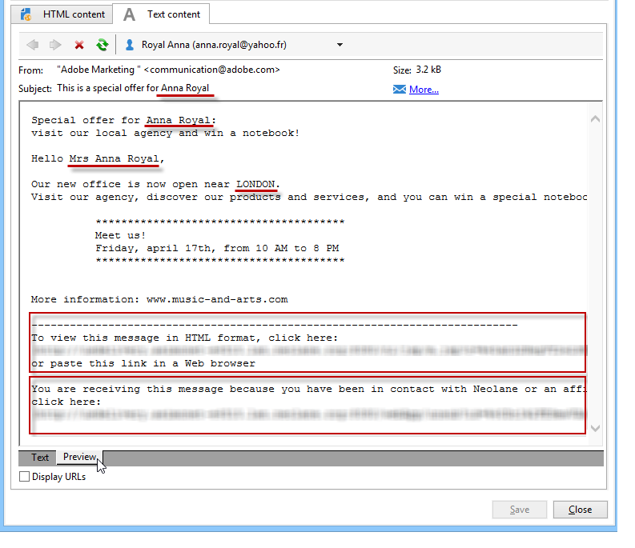

## Define interactive content {#amp-for-email-format}

Adobe Campaign enables you to try the new interactive [AMP for Email](https://amp.dev/about/email/) format, which enables to send dynamic emails, under certain conditions.

For more on this, see [this section](defining-interactive-content.md).

## Use content management {#using-content-management}

You can define the content of the delivery using the content management forms, directly in the delivery assistant. To do this, you must reference the publication template of the content management to be used, in the **[!UICONTROL Advanced]** tab of the delivery properties.

An additional tab lets you enter content that will automatically be integrated and formatted according to the content management rules.

>[!NOTE]
>
>For further information about content management in Adobe Campaign, refer to [this section](about-content-management.md).

## Insert emoticons {#inserting-emoticons}

You can insert emoticons to your email content.

1. Click the **[!UICONTROL Insert emoticon]** icon.
1. Select an emoticon from the pop-up window.

    

1. Click the **[!UICONTROL Close]** button when done.

To customize the emoticon list, refer to this [page](customizing-emoticon-list.md).

## Add images {#adding-images}

HTML format email deliveries can contain images. From the delivery assistant, you can import an HTML page containing images or insert images directly using the HTML editor via the **[!UICONTROL Image]** icon.

### Guardrails {#img-guardrails}

To avoid performance issues, images included in emails cannot exceed 100 KB. This limit, set by default, can be changed from the `NmsDelivery_MaxDownloadedImageSize` option. However, Adobe strongly recommends to avoid large images in your email deliveries.

Learn more in [the list of Campaign Classic options](../../installation/using/configuring-campaign-options.md#delivery).  

### Types of images {#img-types}

Images can be:

* A local image, or an image called from a server
* An image stored in the Adobe Campaign public resources library

  Public resources are accessible via the **[!UICONTROL Resources > Online]** node of the Adobe Campaign hierarchy. They are grouped in a library and can be included in email messages, but can also be used for campaigns or tasks, or for content management.

* An asset shared with Adobe Experience Cloud. Refer to [this section](../../integrations/using/sharing-assets-with-adobe-experience-cloud.md).

### Insert and manage images {#manage-images}

The delivery assistant lets you add local images, or images stored in the library, to the content of messages. To do this, click the **[!UICONTROL Image]** button in the HTML content toolbar.

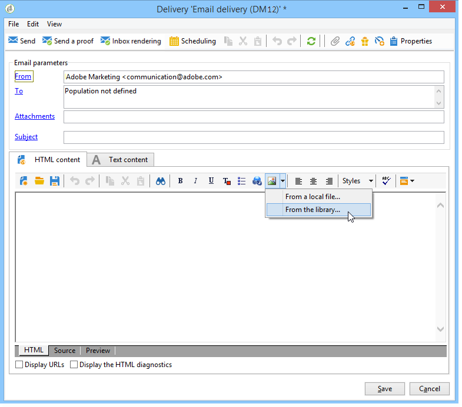

>[!IMPORTANT]
>
>In order for the recipients to be able to view the images included in the messages that they receive, these messages must be available on a server accessible from the outside.

To manage images via the delivery assistant:

1. Click the **[!UICONTROL Tracking & Images]** icon in the toolbar.
  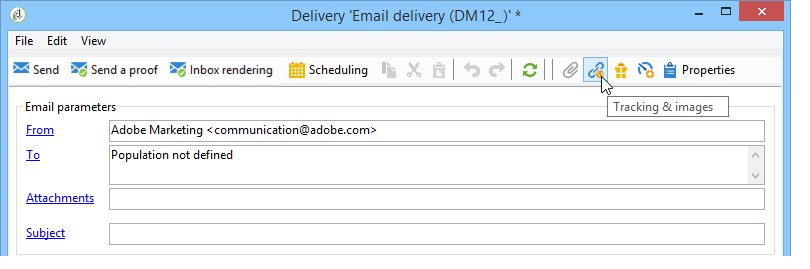

1. Select **[!UICONTROL Upload images]** in the **[!UICONTROL Images]** tab.
1. You can then choose whether you wish to include the images in the email message.
  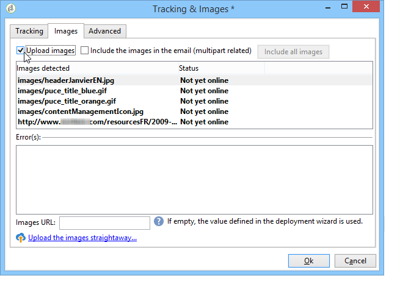

* You can upload images manually without waiting for the delivery analysis phase. To do this, click the **[!UICONTROL Upload the images straightaway...]** link.
* You can specify another path for access to the images on the tracking server. To do this, enter it in the **[!UICONTROL Images URL]** field. This value overrides the value defined in the parameters of the installation assistant.

When you open HTML content with included images in the delivery assistant, a message gives you the option of uploading the images immediately, according to the delivery parameters.

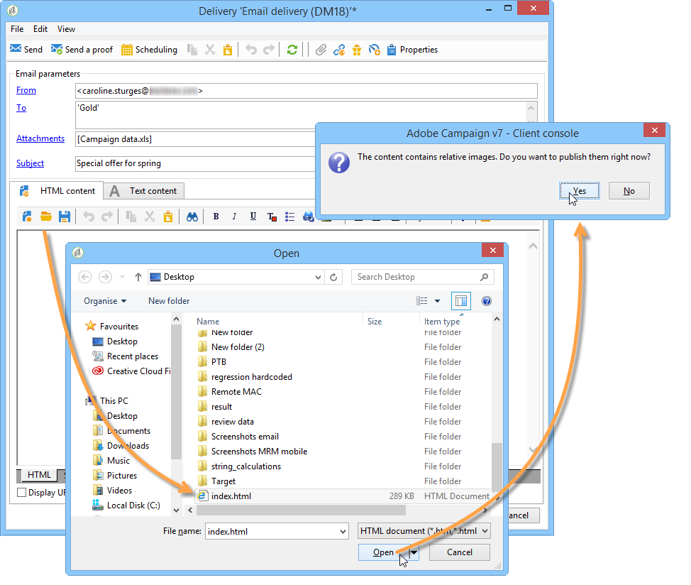

>[!IMPORTANT]
>
> The image URLs are modified during manual uploading or when sending messages.
> 

### Use case: send a message with images {#uc-images}

Below is a sample of a delivery with four images:

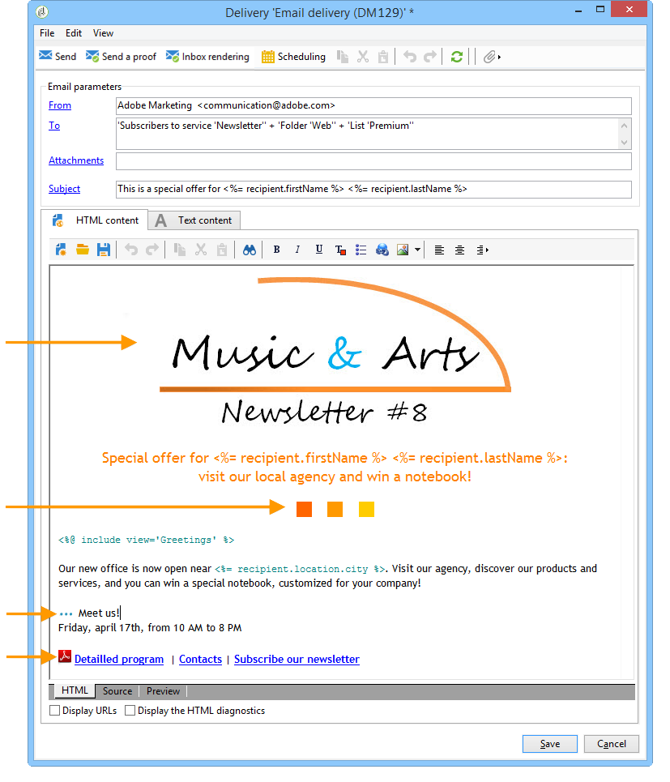

These images come from a local directory or Web site as you can verify from the **[!UICONTROL Source]** tab.

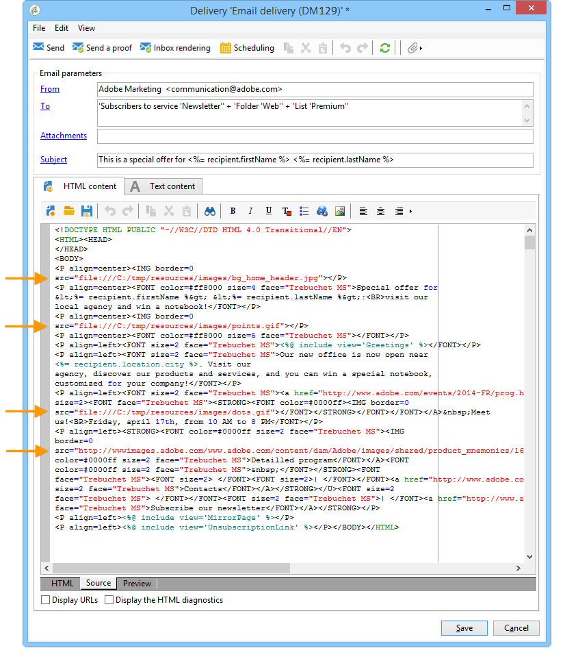

Click the **[!UICONTROL Tracking & Images]** icon and then the **[!UICONTROL Images]** tab to start detecting images in the message.

For each image detected, you can view its status:

* If an image is stored locally or located on another server, even if this server is visible from the outside (on an internet site, for example), it will be detected as **[!UICONTROL Not yet online]**.
* The images are detected as **[!UICONTROL Already online]** if they were uploaded earlier while creating another delivery.
* In the deployment wizard, you can define URLs for which image detection is not enabled: uploading these images will be **[!UICONTROL Skipped]**.

>[!NOTE]
>
>Images are identified by their content and not by their access paths. This means that an image uploaded previously under a different name or in a different directory will be detected as **[!UICONTROL Already online]**.

During the analysis phase, the images are automatically uploaded to the server so that they are accessible from the exterior, except for the local images which must be uploaded beforehand.

You can work ahead and upload images so that they can be viewed by other Adobe Campaign operators. You may find this useful if working collaboratively. To do this, click **[!UICONTROL Upload the images straightaway...]** to upload the images onto the server.

>[!NOTE]
>
>The URLs of the images in the email, and their names in particular, are then modified.

Once the images are online, you can view changes to their names and paths from the **[!UICONTROL Source]** tab of the message.

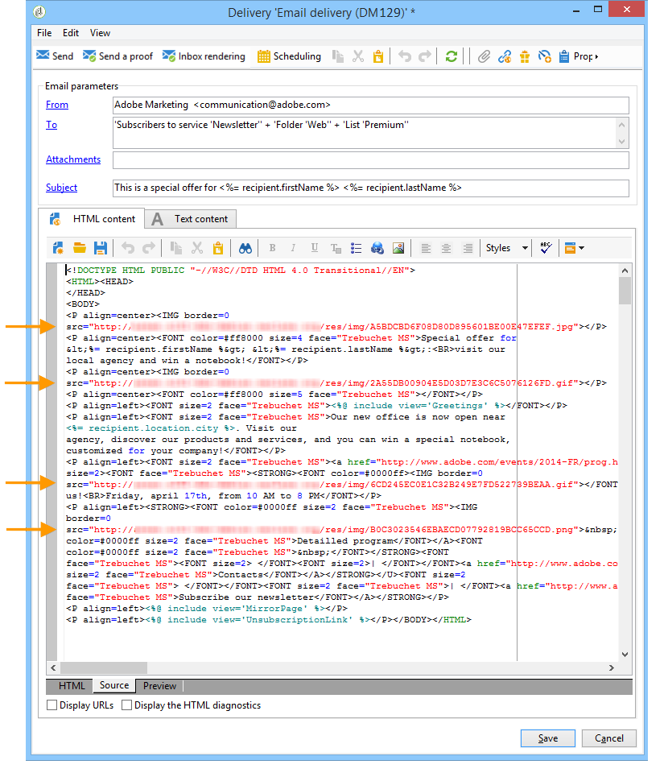

If you select **[!UICONTROL Include the images in the email]**, you can choose which images to include in the corresponding column.

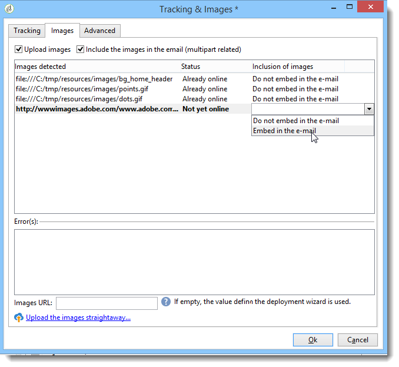

>[!NOTE]
>
>If local images are included in the message, you must confirm changes to the message source code.

## Insert a personalized barcode{#insert-a-barcode}

The barcode generation module lets you create several types of barcodes that comply with many common standards, including 2D barcodes.

It is possible to dynamically generate a barcode as a bitmap using a value defined using customer criteria. Personalized barcodes can be included in email campaigns. The recipient can print the message and show it to the issuing company for scanning (when checking out for example).

To insert a barcode into an email, place the cursor in the content where you want to display it, then click the personalization button. Select **[!UICONTROL Include > Barcode...]**.

Then configure the following elements to suit your needs:

1. Select the type of barcode.

    * For 1D format, the following types are available in Adobe Campaign: Codabar, Code 128, GS1-128 (formerly EAN-128), UPC-A, UPC-E, ISBN, EAN-8, Code39, Interleaved 2 of 5, POSTNET and Royal Mail (RM4SCC).

      Example of a 1D barcode:

      

    * The DataMatrix and PDF417 types concern the 2D format.

      Example of a 2D barcode:

      

    * To insert a QR code, select this type and enter the error correction rate to apply. This rate defines the quantity of information repeated and the tolerance to deterioration.

      

      Example of a QR code:

      

1. Enter the size of the barcode that you want to insert into the email: configuring the scale lets you increase or reduce the size of the barcode, from x1 to x10.
1. The **[!UICONTROL Value]** field enables you to define the value of the barcode. A value can match a special offer and can be the function of a criteria, it can be the value of a database field linked to the customers.

   This example shows an EAN-8 type barcode, to which was added the account number of a recipient. To add this account number, click the personalization button to the right of the **[!UICONTROL Value]** field and select **[!UICONTROL Recipient > Account number]**.

   

1. The **[!UICONTROL Height]** field lets you configure the height of the barcode without changing its width, by altering the amount of space between each bar.

   There is no restrictive entry control depending on the type of barcode. If a barcode value is incorrect, it will only be visible in **Preview** mode where the barcode will be crossed out in red.

   >[!NOTE]
   >
   >The value assigned to a barcode depends on its type. For example, an EAN-8 type shall have exactly 8 numbers.
   >
   >The personalization button to the right of the **[!UICONTROL Value]** field lets you add data in addition to the value itself. This enriches the barcode, provided that the barcode standard accepts it.
   >
   >For example, if you are using a GS1-128 type barcode and want to enter the account number of a recipient in addition to the value, click the personalization button and select **[!UICONTROL Recipient > Account number]**. If the account number of the selected recipient is entered correctly, the barcode takes it into account.

Once these elements have been configured, you can finalize your email and send it. To avoid errors, always make sure your content is displayed correctly before performing a delivery by clicking the **[!UICONTROL Preview]** tab.

>[!NOTE]
>
>If the value of a barcode is incorrect, its bitmap is shown crossed out in red.

