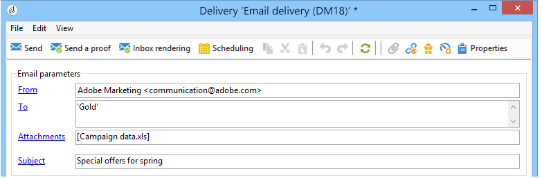

# Defining the email content{#defining-the-email-content}

## Sender {#sender}

To define the name and address of the sender which will appear in the header of messages sent, click the **[!UICONTROL From]** link.

This window lets you enter all the information required to create the email message headers. This information can be personalized. To do this, use the buttons to the right of the input fields to insert personalization fields.

To find out how to insert and use personalization fields, refer to [About personalization](../../delivery/using/about-personalization.md) section.

>[!NOTE]
>
>* The sender's address will be used for replies by default.
>* The header parameters must not be empty. By default, they contain the values input when configuring the deployment wizard. For further information, refer to the [Installation Guide](../../installation/using/deploying-an-instance.md).
>* The sender's address is mandatory to allow an email to be sent (RFC standard).
>* Adobe Campaign checks the syntax of email addresses entered.

>[!CAUTION]
>
>In the context of the checks implemented by Internet Access Providers (ISPs) to combat unsolicited email (spam), Adobe recommends creating email accounts that correspond to the addresses specified for deliveries and replies. Check with your messaging system administrator.

## Message subject {#message-subject}

The subject of the message is configured in the corresponding field. You can enter it directly in the field or click the **[!UICONTROL Subject]** link to enter a script. The personalization link lets you insert database fields in the subject.

>[!CAUTION]
>
>The message subject is mandatory.

The field content will be replaced by the value in the recipient profile when the message is sent.

For example, in the message above, the subject of the message is personalized for each recipient with data from their profile.

>[!NOTE]
>
>The use of personalization fields is presented in [About personalization](../../delivery/using/about-personalization.md).

## Message content {#message-content}

>[!CAUTION]
>
>For privacy reasons, we recommend to use HTTPS for all external resources.

The content of the message is defined in the lower section of the delivery configuration window.

Messages are sent in HTML or text format by default, according to recipient preference. We recommend creating content in both formats to ensure that messages can be correctly displayed in any mail system. For more on this, refer to [Selecting message formats](../../delivery/using/defining-the-email-content.md#selecting-message-formats).

You can also send emails with a new format, AMP for Email. See [AMP for Email format](../../delivery/using/defining-the-email-content.md#amp-for-email-format).

* To import an HTML content, use the **[!UICONTROL Open]** button. You can also paste the source code directly into the **[!UICONTROL Source]** sub-tab.

  If you are using the [Digital Content Editor](../../web/using/about-campaign-html-editor.md) (DCE), refer to [Selecting a content template](../../web/using/use-case--creating-an-email-delivery.md#step-3---selecting-a-content).

  >[!CAUTION]
  >
  >The HTML content must be created beforehand, then imported into Adobe Campaign. The HTML editor is not designed for content creation.

  The **[!UICONTROL Preview]** sub-tab lets you view the rendering of each content for a recipient. The personalization fields and the conditional elements of content are replaced with the corresponding information for the selected profile.

  The toolbar buttons provide access to the standard actions and formatting parameters for the HTML page.

  

  You can insert images in messages from a local file or from an image library in Adobe Campaign. To do this, click the **[!UICONTROL Image]** icon and select the appropriate option.

  

  Library images can be accessed via the **[!UICONTROL Resources>Online>Public resources]** folder in the folder tree. Also refer to [Adding images](../../delivery/using/defining-the-email-content.md#adding-images).

  The last button in the toolbar lets you insert personalization fields.

  >[!NOTE]
  >
  >The use of personalization fields is presented in [About personalization](../../delivery/using/about-personalization.md).

  The tabs at the bottom of the page let you display the HTML code of the page being created and view the rendering of the message with its personalization. To launch this display, click **[!UICONTROL Preview]** and select a recipient using the **[!UICONTROL Test personalization]** button in the toolbar. You can select a recipient from the defined target(s) or choose another recipient.

  

  You can validate the HTML message. You can also view the content of the email header.

  

* To import a text content, use the **[!UICONTROL Open]** button, or the **[!UICONTROL Text Content]** tab to enter the content of the message when displayed in text format. Use the toolbar buttons to access actions on the contents. The last button lets you insert personalization fields.

  

  As for the HTML format click the **[!UICONTROL Preview]** tab at the bottom of the page to view the rendering of the message with its personalization. 

  

## Selecting message formats {#selecting-message-formats}

You can change the format of email messages sent. To do this, edit the delivery properties and click the **[!UICONTROL Delivery]** tab. 

Select the format of the email in the lower section of the window:

* **[!UICONTROL Use recipient preferences]** (default mode)

  The message format is defined according to the data stored in the recipient profile and stored by default in the **[!UICONTROL email format]** field (@emailFormat). If a recipient wishes to receive messages in a certain format, this is the format sent. If the field is not filled in, a multipart-alternative message is sent (see below).

* **[!UICONTROL Let recipient mail client choose the most appropriate format]**

  The message contains both formats: text and HTML. The format displayed on reception depends on the configuration of the recipient's mail software (multipart-alternative).

  >[!CAUTION]
  >
  >This option includes both versions of the document. It therefore impacts the delivery rate, because the message size is greater.

* **[!UICONTROL Send all messages in text format]**

  The message is sent in text format. HTML format will not be sent, but used for the mirror page only when the recipient clicks on the message.

## AMP for Email format {#amp-for-email-format}

Messages can also be sent using the new interactive [AMP for Email](https://amp.dev/about/email/) format.

>[!NOTE]
>
>This feature is currently a beta capability in Adobe Campaign.

<!--This option is available through a dedicated package. Please check your license agreement.-->

To use this feature, the appropriate package must be installed. For hybrid and hosted architectures, the package needs to be also installed on the [mid-sourcing server](../../installation/using/mid-sourcing-server.md). Contact your account executive.

### About AMP for Email

Adobe Campaign now supports **AMP for Email**, a new format which allows to include AMP components inside messages to enhance the email experience with rich and actionable content. Making modern app functionality directly available within emails, it enables recipients to interact dynamically with content in the message itself.

For example, emails written with AMP can contain interactive elements such as image carousels, content stays up-to-date in the message, and recipients can take action like responding to a form without leaving their inbox.

AMP for Email is compatible with existing emails. The AMP version of the message is embedded into the email as a new MIME part, in addition to the HTML and/or plain text, ensuring compatibility across all email clients.

For more on the AMP for Email format and specifications, see the [AMP developer documentation](https://amp.dev/documentation/guides-and-tutorials/learn/email-spec/amp-email-format/#the-amphtml-email-format).

### AMP for Email delivery requirements {#amp-for-email-delivery-requirements}

Supported email provider today : gmail.com (beta)

When building your AMP content in Adobe Campaign, keep in mind the following conditions for an AMP email to be delivered:

* The [AMP for Email security requirements](https://developers.google.com/gmail/ampemail/security-requirements) must be met.
* The email must contain a fallback HTML version or plain text version in addition to the AMP MIME part. This fallback version is displayed if the AMP content cannot be displayed, for example when the mail client is offline or more than 30 days after the email was received.
* The AMP MIME part must contain a valid AMP document. Use the [AMP web-based validator](https://validator.ampproject.org) or similar websites to validate your content.
* The AMP MIME part must be smaller than 100KB.

You can also consult the [AMP for Email best practices](https://amp.dev/documentation/guides-and-tutorials/develop/amp_email_best_practices/?format=email) and the [Tips and know limitations for Gmail](https://developers.google.com/gmail/ampemail/tips).

### Using the AMP Email format in Adobe Campaign

To build an email using the AMP format, follow the steps below.

>[!NOTE]
    >
    >For more on building your first AMP email, see the [AMP developer documentation](https://amp.dev/documentation/guides-and-tutorials/start/create_email/?format=email).

1. Click the AMP content tab.

    

1. Write your AMP content. See [AMP for Email delivery requirements](../../delivery/using/defining-the-email-content.md#amp-for-email-delivery-requirements).

1. Personalize your AMP content.

    

1. Once done with editing, select your whole AMP content and copy-paste it into the [AMP web-based validator](https://validator.ampproject.org) or a similar website. Make sure you select **AMP4 EMAIL** from the drop-down list on top of the screen.

    

    Any errors will be flagged inline.

    

    >[!NOTE]
    >
    >The Adobe Campaign AMP editor is not designed for content validation. Use websites such as the [AMP web-based validator](https://validator.ampproject.org) to check your content is correct.

1. Copy-paste your content into [AMP Playground](https://playground.amp.dev) or a similar website to preview your content. Make sure you select **AMP for Email** from the drop-down list on top of the screen.

    

    >[!NOTE]
    >
    >You cannot preview your AMP content directly in Adobe Campaign. You must use an external website.

1. Switch to the **[!UICONTROL HTML content]** or **[!UICONTROL Text content]** tab and define content for at least one of these two formats.

    >[!CAUTION]
    >
    >When creating AMP content, your email must also contain a fallback HTML version or plain text version in addition to the AMP content.

### Testing AMP emails

Before you send a AMP-powered dynamic email, you can test it to verify its contents and behavior.
1. Send a proof as you would usually do.

    >[!CAUTION]
    >
    >The AMP for Email format is a beta capability which is not available for all email clients.

1. To test delivery with AMP format on Gmail accounts, see the [Gmail developer AMP for Email documentation](https://developers.google.com/gmail/ampemail/testing-dynamic-email).

### Best practices and troubleshooting

### 

## Using content management {#using-content-management}

You can define the content of the delivery using the content management forms, directly in the delivery wizard. To do this, you must reference the publication template of the content management to be used, in the **[!UICONTROL Advanced]** tab of the delivery properties.

An additional tab lets you enter content that will automatically be integrated and formatted according to the content management rules.

>[!NOTE]
>
>For further information about content management in Adobe Campaign, refer to the [Configuration guide](../../configuration/using/about-schema-reference.md).

## Adding attachments {#adding-attachments}

You can attach one or more files to an email delivery. Attachments can be in any format. You can also attach zipped files. If necessary, the content of the attachment can be personalized for each recipient.

>[!NOTE]
>
>The name of the attachment can be computed for each message as it is sent, and can depend on the recipient. It can also be personalized and converted to PDF at the time of sending. In these cases, it must be a calculated attachment. See [Attaching files](../../delivery/using/attaching-files.md).

To attach a file:

* Select the file to be attached. Drag and drop it in the **[!UICONTROL Attachments]** field. After validation, the file is uploaded onto the server.

  

* Or click the **[!UICONTROL Attach]** icon in the delivery wizard toolbar, and then select the file to be attached to the delivery.
* Or click the **[!UICONTROL Attachments]** link and then the **[!UICONTROL Add]** button, and select **[!UICONTROL File...]** to select the file to be attached to the delivery.

  

  Select the file to attach to the delivery and click **[!UICONTROL Open]**.

  

  After validation, the file is uploaded onto the server. The progress bar lets you monitor its progress:

  

You can attach several files to your delivery. They are listed in the **[!UICONTROL Attachments]** field.

## Adding images {#adding-images}

HTML format email deliveries can contain images. From the delivery wizard, you can import an HTML page containing images or insert images directly using the HTML editor via the **[!UICONTROL Image]** icon.

Images can be:

* A local image, or an image called from a server
* An image stored in the Adobe Campaign public resources library

  Public resources are accessible via the **[!UICONTROL Resources > Online]** node of the Adobe Campaign hierarchy. They are grouped in a library and can be included in email messages, but can also be used for campaigns or tasks, or for content management.

* An asset shared with Adobe Experience Cloud. Refer to [this section](../../integrations/using/sharing-assets-with-adobe-experience-cloud.md).

>[!CAUTION]
>
>To include images in the email messages using the delivery wizard, the Adobe Campaign instance must be configured to enable public resource management. This procedure can be performed from the deployment wizard. Refer to the [this section](../../installation/using/deploying-an-instance.md) for further information on configuration.

The delivery wizard lets you add local images, or images stored in the library, to the content of messages. To do this, click the **[!UICONTROL Image]** button in the HTML content toolbar.

In order for the recipients to be able to view the images included in the messages that they receive, these messages must be available on a server accessible from the outside.

To manage images via the delivery wizard, you must click the **[!UICONTROL Tracking & Images]** icon in the toolbar.

Select **[!UICONTROL Upload images]** in the **[!UICONTROL Images]** tab. You can then choose whether you wish to include the images in the email message.

* You can upload images manually without waiting for the delivery analysis phase. To do this, click the **[!UICONTROL Upload images now]** link.
* You can specify another path for access to the images on the tracking server. To do this, enter it in the **[!UICONTROL Image URL]** field. This value overrides the value defined in the parameters of the installation wizard.

When you open HTML content with included images in the delivery wizard, a message gives you the option of uploading the images immediately, according to the delivery parameters.

>[!CAUTION]
>
>The image access paths are modified during manual uploading or when sending messages.

### Example: sending a message with images {#example--sending-a-message-with-images}

Here is a sample of a delivery with four images:

These images come from a local directory or Web site as you can verify from the **[!UICONTROL Source]** tab.

Click the **[!UICONTROL Tracking & Images]** icon and then the **[!UICONTROL Images]** tab to start detecting images in the message.

For each image detected, you can view its status:

* If an image is stored locally or located on another server, even if this server is visible from the outside (on an internet site, for example), it will be detected as **[!UICONTROL Not yet online]**.
* The images are detected as **[!UICONTROL Already online]** if they were uploaded earlier while creating another delivery.
* In the deployment wizard, you can define URLs for which image detection is not enabled: uploading these images will be **[!UICONTROL Skipped]**.

>[!NOTE]
>
>Images are identified by their content and not by their access paths. This means that an image uploaded previously under a different name or in a different directory will be detected as **[!UICONTROL Already online]**.

During the analysis phase, the images are automatically uploaded to the server so that they are accessible from the exterior, except for the local images which must be uploaded beforehand.

You can work ahead and upload images so that they can be viewed by other Adobe Campaign operators. You may find this useful if working collaboratively. To do this, click **[!UICONTROL Upload the images straightaway...]** to upload the images onto the server.

>[!NOTE]
>
>The URLs of the images in the email, and their names in particular, are then modified.

Once the images are online, you can view changes to their names and paths from the **[!UICONTROL Source]** tab of the message.

If you select **[!UICONTROL Include the images in the email]**, you can choose which images to include in the corresponding column.

>[!NOTE]
>
>If local images are included in the message, you must confirm changes to the message source code.

## Sending emails on Japanese mobiles {#sending-emails-on-japanese-mobiles}

### Email formats for Japanese mobiles {#email-formats-for-japanese-mobiles}

Adobe Campaign manages three specific Japanese formats for email on mobiles: **Deco-mail** (DoCoMo mobiles), **Decore Mail** (Softbank mobiles) and **Decoration Mail** (KDDI AU mobiles). These formats impose particular coding, structure, and size constraints. Learn more about limitations and recommendations in [this section](../../delivery/using/defining-the-email-content.md#limitations-and-recommendations).

In order for the recipient to correctly receive messages in one of these formats, we recommend selecting **[!UICONTROL Deco-mail (DoCoMo)]**, **[!UICONTROL Decore Mail (Softbank)]** or **[!UICONTROL Decoration Mail (KDDI AU)]** in the corresponding profile:

However, if you leave the **[!UICONTROL Email format]** option as **[!UICONTROL Unknown]**, **[!UICONTROL HTML]** or **[!UICONTROL Text]**, Adobe Campaign will automatically detect (when sending the email) the Japanese format to use so that the message is correctly displayed.

This automatic detection system is based on the list of predefined domains defined in the **[!UICONTROL Management of Email Formats]** mail rule set. For more on managing email formats, refer to [this page](../../installation/using/email-deliverability.md#managing-email-formats).

### Limitations and recommendations {#limitations-and-recommendations}

A certain number of constraints apply for sending emails that will be read on a mobile operated by a Japanese provider (Softbank, DoCoMo, KDDI AU).

Therefore, you must:

* Only use images in JPEG or GIF format
* Create a delivery with text and HTML sections that are strictly lower than 10 000 bytes (for KDDI AU and DoCoMo)
* Use images with a total size (before encoding) that is lower than 100 KB
* Do not use more than 20 images per message
* Use a reduced size HTML format (a limited number of tags are available for each operator)

>[!NOTE]
>
>Limitations specific to each operator are to be taken into account when creating your message. Refer to:  
>
>* For DoCoMo, refer to [this page](https://www.nttdocomo.co.jp/service/developer/make/content/deco_mail/index.html)
>* For KDDI AU, refer to [this page](https://www.au.com/ezfactory/tec/spec/decorations/template.html)
>* For Softbank, refer to [this page](https://creation.mb.softbank.jp/mc/tech/tech_mail/mail_decore.html)

### Testing the email content {#testing-the-email-content}

#### Previewing the message {#previewing-the-message}

Adobe Campaign allows you to check that your message format is adapted to be sent to a Japanese mobile.

Once you have defined your content and entered the email subject, you can check the display and formatting when the message is created.

In the **[!UICONTROL Preview]** tab of the content editing window, clicking **[!UICONTROL More... > Deco-mail diagnostic]** allows you to:

* Check that the HTML content tags conform to the Japanese format restrictions
* Check that the number of images in the message does not exceed the limit imposed by the format (20 images)
* Check the total message size (less than 100kB)

  

#### Running typology rule {#running-typology-rule}

In addition to the previewing diagnosis, a second check is carried out when sending a proof or a delivery: a specific typology rule, **[!UICONTROL Deco-mail check]**, is started during the analysis.

>[!CAUTION]
>
>This typology rule is only executed if at least one of the recipients is configured to receive emails in **[!UICONTROL Deco-mail (DoCoMo)]**, **[!UICONTROL Decore Mail (Softbank)]** or **[!UICONTROL Decoration Mail (KDDI AU)]** format.

This typology rule allows you to make sure that the delivery respects the [format constraints](../../delivery/using/defining-the-email-content.md#limitations-and-recommendations) defined by the Japanese operators, particularly in relation to the total size of the email, the size of the HTML and text sections, the number of images in the messages, and the tags in the HTML content.

#### Sending proofs {#sending-proofs}

You can send proofs to test your delivery. When you send the proof, if you are using substitution addresses, please enter addresses that correspond to the email format of the profile used.

For example, you can replace a profile's address by test@softbank.ne.jp if the email format for this profile was defined beforehand on **[!UICONTROL Decore Mail (Softbank)]**.

### Sending messages {#sending-messages}

To send an email to recipients with Japanese email formats with Campaign, two options are possible:

* Create two deliveries: one only for Japanese recipients and another for other recipients - refer to [this section](../../delivery/using/defining-the-email-content.md#designing-a-specific-delivery-for-japanese-formats).
* Create a single delivery and Adobe Campaign will automatically detect the format to use - refer to [this section](../../delivery/using/defining-the-email-content.md#designing-a-delivery-for-all-formats).

#### Designing a specific delivery for Japanese formats {#designing-a-specific-delivery-for-japanese-formats}

You can create a workflow that contains two deliveries: one to be read on a Japanese mobile and another for recipients with a standard email format.

To do this, use the **[!UICONTROL Split]** activity in your workflow and define the Japanese email formats (Deco-mail, Decoration Mail and Decore Mail) as filtering conditions.

#### Designing a delivery for all formats {#designing-a-delivery-for-all-formats}

When Adobe Campaign dynamically manages the formats according to the domain (profiles with email formats defined as **[!UICONTROL Unknown]**, **[!UICONTROL HTML]** or **[!UICONTROL Text]** ), you can send the same delivery to all of your recipients.

The message contact will display correctly for the users on Japanese mobiles, just as for the standard recipients.

>[!CAUTION]
>
>Make sure to respect the special features associated with each Japanese email format (Deco-mail, Decoration Mail, and Decore Mail). For more information on limitations, refer to [this section](../../delivery/using/defining-the-email-content.md#limitations-and-recommendations).
