# Delivery dashboard {#delivery-dashboard}

The **delivery dashboard** is key to monitor your deliveries and eventual issues encountered during the sending of messages.

It allows you to retrieve information on a delivery and edit it if necessary. Note that tab contents may no longer be changed once the delivery has been sent.

Here are the information you can monitor using the several tabs that are available in the dashboard:

* [Delivery summary](#delivery-summary)
* [Delivery reports](#delivery-reports)
* [Delivery logs, mirror pages, exclusions](#delivery-logs-and-history)
* [Delivery tracking logs and history](#tracking-logs)
* [Delivery rendering](#delivery-rendering)
* [Delivery audit](#delivery-audit-)

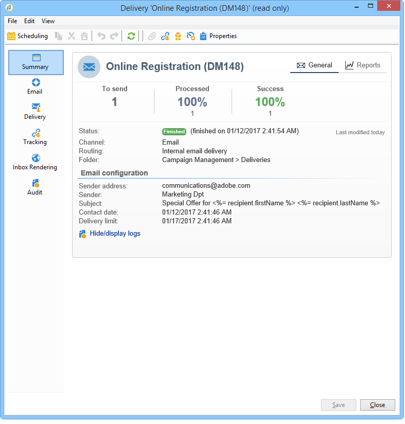

**Related topics:**

* [Understanding delivery failures](understanding-delivery-failures.md)
* [Understanding quarantine management](understanding-quarantine-management.md)
* [Delivery best practices](delivery-best-practices.md)
* [Managing deliverability](about-deliverability.md)

## Delivery summary {#delivery-summary}

The **[!UICONTROL Summary]** tab contains the characteristics of the delivery: delivery status, channel used, information about the sender, subject, information concerning execution.

## Delivery reports {#delivery-reports}

The **[!UICONTROL Reports]** link, which is accessible from the **[!UICONTROL Summary]** tab, lets you look at a set of reports related to the delivery action: general delivery report, detailed report, delivery report, distribution of failed messages, opening rate, clicks and transactions, etc.

The contents of this tab can be configured according to your requirements. For more on delivery reports, refer to [this section](../../reporting/using/delivery-reports.md).

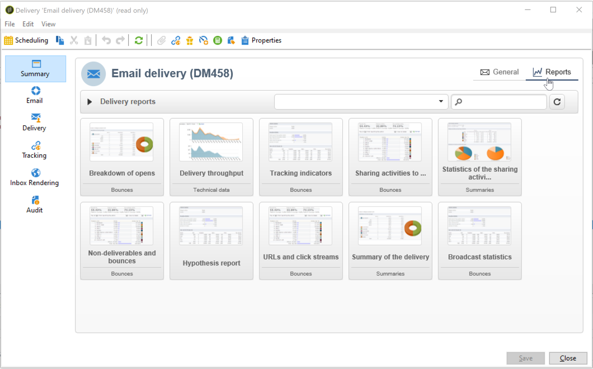

## Delivery logs, history and exclusions {#delivery-logs-and-history}

The **[!UICONTROL Delivery]** tab gives a history of the occurrences in this delivery. It contains the delivery logs, i.e. the list of messages sent and their status and the associated messages.

For a delivery, you can display (for example) only recipients with a failed delivery or an address in quarantine. To do this, click the **[!UICONTROL Filters]** button and select **[!UICONTROL By state]**. Then select the state in the drop-down list. Various statuses are listed in [this page](delivery-statuses.md).

>[!NOTE]
>
>The list displaying the delivery logs can be customized, as any list in Campaign Classic. You can, for example, add a column to know which IP address sent each email in a delivery. For more on this, refer to the use case detailed in [this section](#use-case).

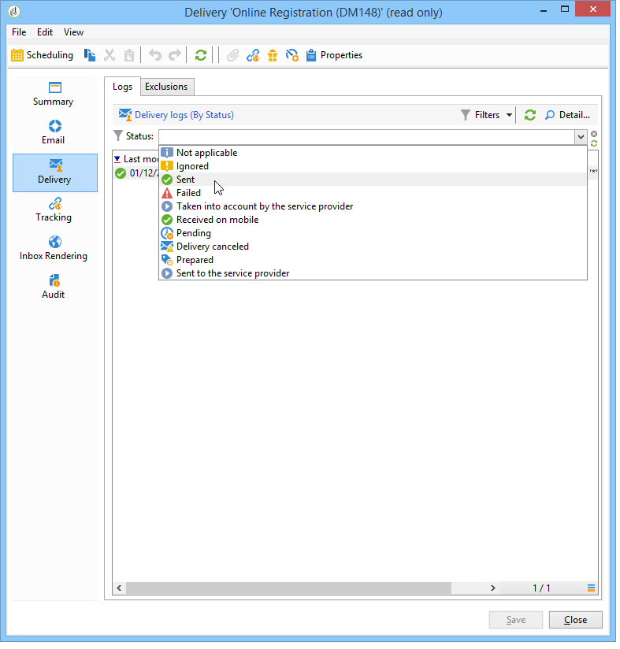

The **[!UICONTROL Display the mirror page for this message...]** link lets you view the mirror page for the contents of the delivery selected from the list in a new window.

The mirror page is available only for deliveries for which HTML content has been defined. For more on this, refer to [Generating the mirror page](sending-messages.md#generating-the-mirror-page).

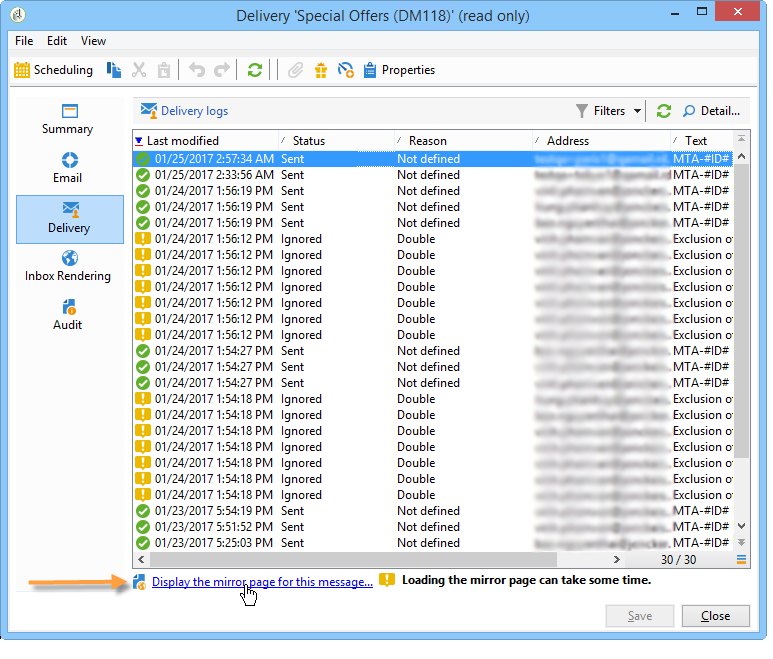

## Delivery tracking logs and history {#tracking-logs}

The **[!UICONTROL Tracking]** tab lists the tracking history for this delivery. This tab displays tracking data for the messages sent, i.e. all URLs subject to tracking by Adobe Campaign. The tracking data is updated hourly.

>[!NOTE]
>
>If tracking is not enabled for a delivery, this tab is not displayed.

Tracking configuration is performed at the appropriate stage in the delivery wizard. See [How to configure tracked links](how-to-configure-tracked-links.md).

**[!UICONTROL Tracking]** data is interpreted in the delivery reports. See [this section](../../reporting/using/delivery-reports.md).

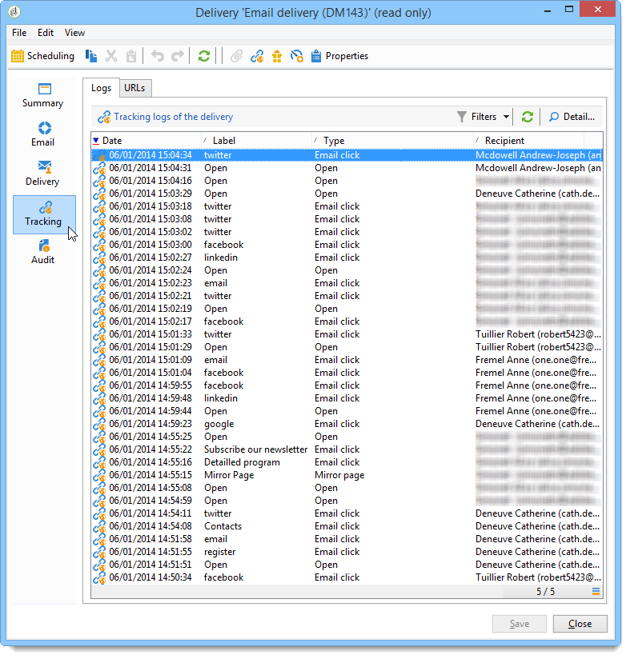

## Inbox rendering {#delivery-rendering}

The **[!UICONTROL Inbox rendering]** tab allows you to preview the message in the different contexts in which it may be received and check the compatibility in major desktops and applications.

This way, you can make sure that your message will be displayed to the recipients in an optimal way on a variety of web clients, web mails and devices.

For more on inbox rendering, refer to [this page](inbox-rendering.md)

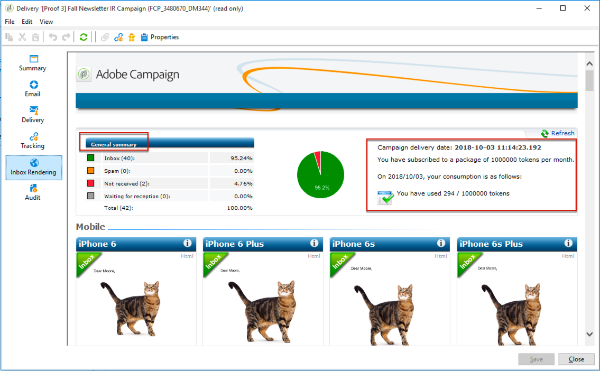

## Delivery audit {#delivery-audit-}

The **[!UICONTROL Audit]** tab contains the delivery log and all the messages concerning the proofs.

The **[!UICONTROL Refresh]** button lets you update the data. Use the **[!UICONTROL Filters]** button to define a filter on the data.

Special icons enable you to identify errors or warnings. See [Analyzing the delivery](steps-validating-the-delivery.md#analyzing-the-delivery).

The **[!UICONTROL Proofs]** sub-tab lets you view the list of proofs that have been sent.

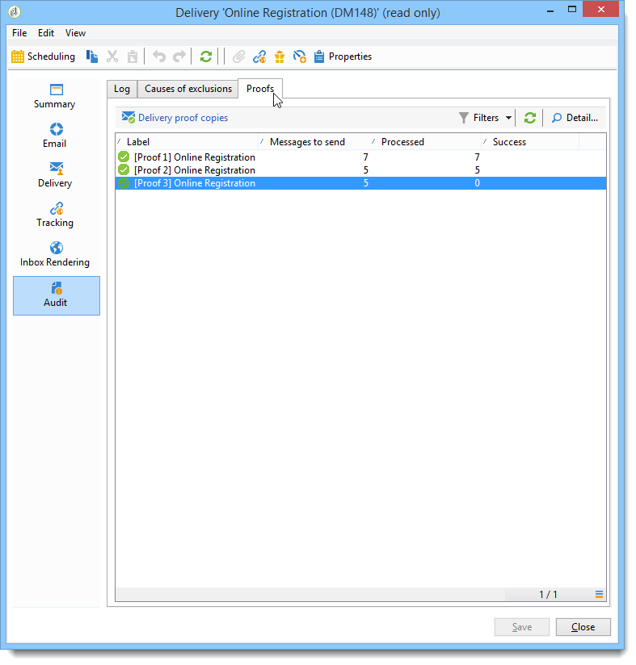

You can modify the information displayed in this window (and that of the **[!UICONTROL Delivery]** and **[!UICONTROL Tracking]** tabs) by selecting the columns to be displayed. To do this, click the **[!UICONTROL Configure list]** icon located in the lower right-hand corner. For more on configuring list display, refer to [this section](../../platform/using/adobe-campaign-workspace.md#configuring-lists).

## Delivery dashboard synchronization {#delivery-dashboard-synchronization}

From your delivery dashboard, you want to check the processed messages and delivery logs to be sure that your delivery was successfully sent.

Some indicators or status can be incorrect or not up-to-date, this may be resolved with the following solutions:

* If your delivery status is incorrect, check that all necessary approvals have been done for this delivery or that the **[!UICONTROL operationMgt]** and **[!UICONTROL deliveryMgt]** workflows are running without errors. This can also be due to the delivery using an affinity not configured on the sending instance.

* If your delivery indicators are still at zero and if you are on a mid-sourcing configuration, check the **[!UICONTROL Mid-sourcing (delivery counters)]** technical workflow. Start it if its status is not **[!UICONTROL Started]**. You can then try to recompute the indicators by right-clicking the relevant delivery in the Adobe Campaign explorer and selecting **[!UICONTROL Actions]** > **[!UICONTROL Recompute delivery and tracking indicators]**. For more information on tracking indicators, refer to this [section](../../reporting/using/delivery-reports.md#tracking-indicators).

* If your delivery counter does not match your delivery, try to recompute the indicators by right-clicking the relevant delivery in the Adobe Campaign explorer and selecting **[!UICONTROL Actions]** > **[!UICONTROL Recompute delivery and tracking indicators]** to resynchronize. For more information on tracking indicators, refer to this [section](../../reporting/using/delivery-reports.md#tracking-indicators).

* If your delivery counter is not up-to-date for mid-sourcing deployments, check that the **[!UICONTROL Mid-Sourcing (Delivery counters)]** technical workflow is running. For more on this, refer to this [page](../../installation/using/mid-sourcing-deployment.md).

You can also track your deliveries with different reports via the delivery dashboard. For more on this, refer to this [section](../../reporting/using/delivery-reports.md).

## Use case: Adding senders' IP addresses to the logs {#use-case}

In this section, you will learn how add to the delivery logs information regarding the IP address that sent each email in a delivery.

>[!NOTE]
>
>This modification is different if you are using a single instance or mid-sourcing instance. Before doing the modification, ensure you're connected to email sending instance.

### Step 1: Extend the schema

To add **publicID** in your delivery logs you need to extend the schema first. You can proceed as follow.

1. Create a schema extension, under **[!UICONTROL Administration]** > **[!UICONTROL Configuration]** > **[!UICONTROL Data Schemas]** > **[!UICONTROL New]**.

    For more information about schema extensions, refer to [this page](../../configuration/using/extending-a-schema.md).

1. Select **[!UICONTROL broadLogRcp]** to extend the Recipient delivery logs (nms) and define a custom Namespace. In this case it will be "cus":

    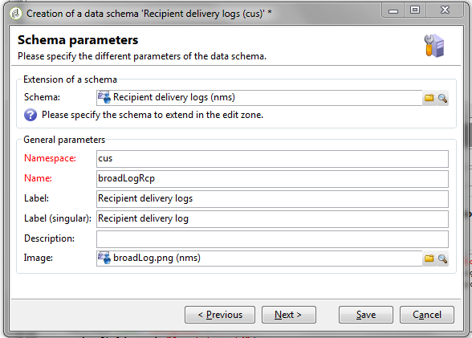

    >[!NOTE]
    >
    >If your instance is in Mid-sourcing, you need to work with broadLogMid schema.

1. Add the new field in your extension. In this sample, you need to replace:

    ```
    <element img="nms:broadLog.png" label="Recipient delivery logs" labelSingular="Recipient delivery log" name="broadLogRcp"/>
    ```

    by:

    ```
    <element img="nms:broadLog.png" label="Recipient delivery logs" labelSingular="Recipient delivery log" name="broadLogRcp">
    <attribute desc="Outbound IP identifier" label="IP identifier"
    name="publicId" type="long"/>
    </element>
    ```

    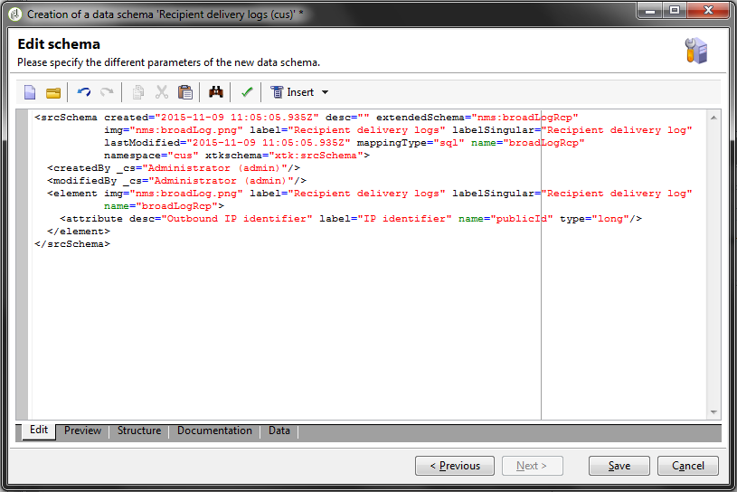

### Step 2: Update database structure

Once modifications are done, you need to update database structure so that it is aligned with its logical description.

To do this, follow the steps below:

1. Click the **[!UICONTROL Tools]** > **[!UICONTROL Advanced]** > **[!UICONTROL Update database structure...]** menu.

    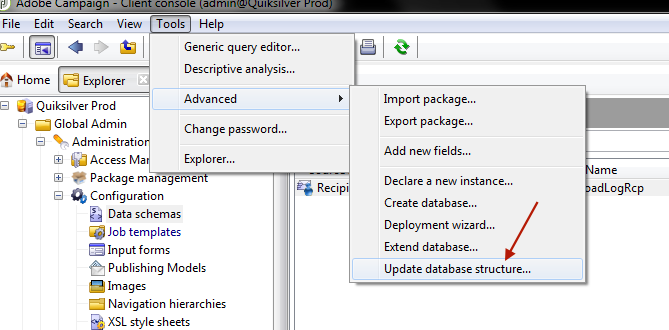

1. In the **[!UICONTROL Edit tables]** window, the **[!UICONTROL NmsBroadLogRcp]** table is checked (or the **[!UICONTROL broadLogMid]** table if your are in a Mid-sourcing environment), as below:

    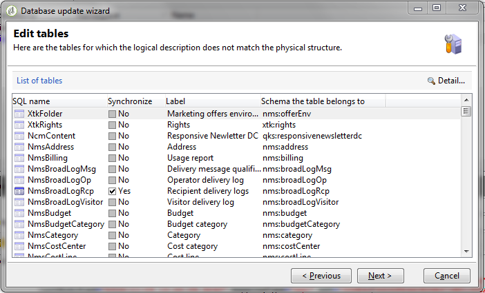

    >[!IMPORTANT]
    >
    >Always ensure there is no other modification, except the **[!UICONTROL NmsBroadLoGRcp]** table (or the **[!UICONTROL broadLogMid]** table if your are in a Mid-sourcing environment). If so, uncheck other tables.

1. Click **[!UICONTROL Next]** to validate. The following screen displays:

    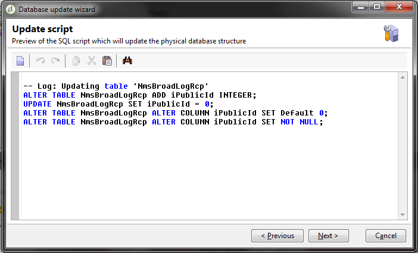

1. Click **[!UICONTROL Next]**, then **[!UICONTROL Start]** to start updating database structure. Index building is starting. This step can be long, depending on the number of rows in the **[!UICONTROL NmsBroadLogRcp]** table.

    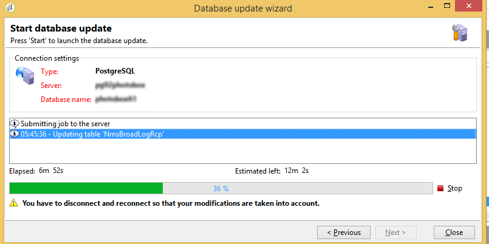

  >[!NOTE]
  >
  >Once update of the physical structure of the database is sucessfully completed, you need to disconnect and reconnect so that your modifications are taken into account.

### Step 3: Validate the modification

To confirm everything worked correctly, you need to update delivery logs screen.

To do this, access the delivery logs and add the "IP identifier" column.

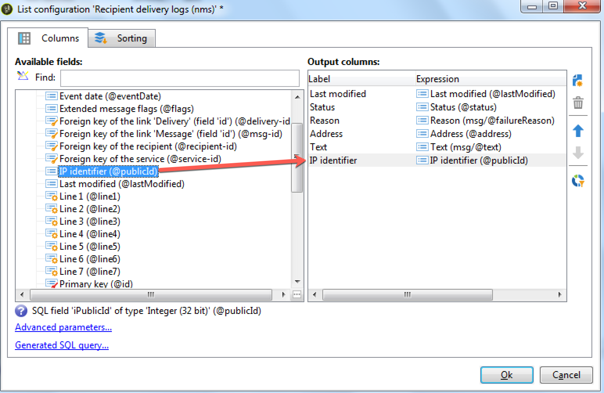

>[!NOTE]
>
>To learn how to configure lists in Campaign Classic interface, refer to [this page](../../platform/using/adobe-campaign-workspace.md).

Below is what you should see in the **[!UICONTROL Delivery]** tab after modifications:

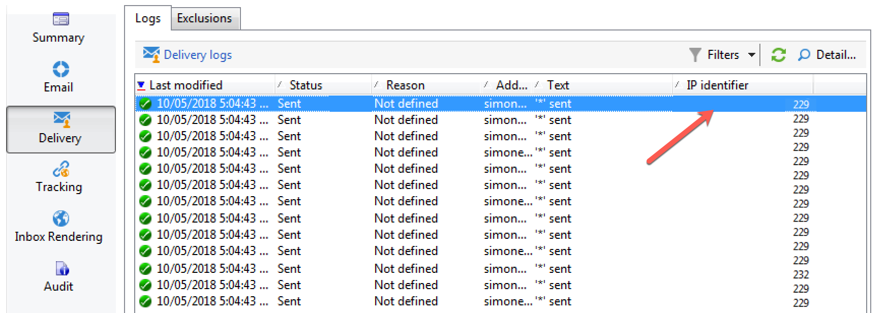
