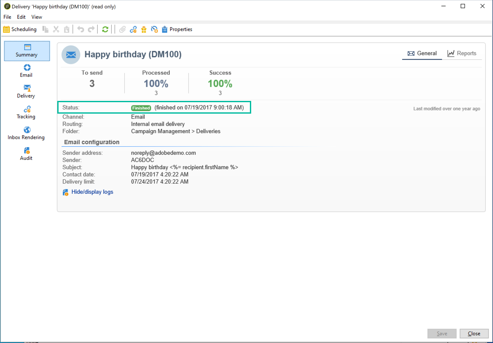

# Delivery statuses {#delivery-statuses}

<!--ajouter intro 

ajouter screenshot -->

Once a delivery has been sent, the delivery dashboard displays a status that allows you to monitor if the sending has been successfull. Possible statuses are detailed in the section below.



For more details on the different delivery failures you can encounter, and how to solve them, refer to [this page](../../delivery/using/understanding-delivery-failures.md).

**Related topics:**

* [Delivery dashboard](../../delivery/using/delivery-dashboard.md)
* [Delivery troubleshooting](../../delivery/using/delivery-troubleshooting.md)
* [About deliverability](../../delivery/using/about-deliverability.md)

## List of delivery statuses {#list-delivery-statuses}

<table> 
 <thead> 
  <tr> 
   <th> Status<br /> </th> 
   <th> Definitions and solutions<br /> </th> 
  </tr> 
 </thead> 
 <tbody> 
  <tr> 
   <td> Sent<br /> </td> 
   <td> The delivery was correctly sent to the message provider (but the recipient did not necessarily receive it).<br /> </td> 
  </tr> 
  <tr> 
   <td> Ignored<br /> </td> 
   <td> The delivery was not sent to the recipient because of an error with his address. It was either on denylist, quarantined, not provided or a duplicate. <br /> </td> 
  </tr> 
  <tr> 
   <td> Failed<br /> </td> 
   <td> The delivery could not reach the recipient because of an invalid address or a full inbox for example. It can also be linked to an issue with personalization blocks since they can generate errors when the schemas do not match the delivery mapping. See <a href="../../delivery/using/understanding-delivery-failures.md" target="_blank">Understanding delivery failures</a><br /> </td> 
  </tr>
  <tr> 
   <td> Pending<br /> </td> 
   <td> The delivery is ready to be sent and is going to be processed by the delivery server (MTA). See <a href="#pending-status" target="_blank">Pending status</a>.<br /> </td> 
  </tr> 
  <tr> 
   <td> Not applicable<br /> </td> 
   <td> The delivery was taken into account by the server (MTA) but not processed.<br /> </td> 
  </tr>  
  <tr> 
   <td> Delivery canceled<br /> </td> 
   <td> The delivery was canceled by an operator.<br /> </td> 
  </tr> 
  <tr> 
   <td> Taken into account by the service provider<br /> </td> 
   <td> The SMS service provider received the delivery.<br /> For hosted or hybrid installations, if you have upgraded to the <a href="../../delivery/using/sending-with-enhanced-mta.md" target="_blank">Enhanced MTA</a>, the message was successfully relayed from Campaign to the Enhanced MTA.</td> 
  </tr> 
  <tr> 
   <td> Received on mobile<br /> </td> 
   <td> The recipient received the SMS on their mobile device.<br /> </td> 
  </tr>
  <tr> 
   <td> Sent to the service provider<br /> </td> 
   <td> The delivery was sent to the SMS service provider but not received yet.<br />
   </td> 
  </tr> 
  <tr> 
   <td> Prepared<br /> </td> 
   <td> Intermediary status used only for external connectors such as the mobile channel. It follows the 'Pending' status and is the external connector that will determine the following status.<br /> </td> 
  </tr> 
 </tbody> 
</table>

To learn how to optimize the deliverability of your Adobe Campaign emails, refer to [this section](../../delivery/using/about-deliverability.md). For a deeper dive on deliverability, refer to the [Adobe Deliverability Best Practice Guide](https://experienceleague.adobe.com/docs/deliverability-learn/deliverability-best-practice-guide/introduction.html).

## Pending status {#pending-status}

After confirming your delivery, you can see that the status of your delivery is **[!UICONTROL Pending]**. This status means that the execution process is waiting on the availability of some resources.

The **[!UICONTROL Pending]** status can first mean that your delivery has been scheduled and is pending until the given date. For more on this, refer to the [Delivery scheduling](../../delivery/using/steps-sending-the-delivery.md#scheduling-the-delivery-sending) section.

If your delivery is not being sent and its status remains **[!UICONTROL Pending]**, it can be the result of:

* The MTA (Message Transfert Agent), that runs modules and processes on the delivery server and that manages email sending, may have not been started, or need to be restarted.

    To check this and to start the module if necessary, apply the following steps:

    >[!NOTE]
    >
    >This operation can be performed with an **on-premise** or **hybrid** hosting model with access the the Campaign server (see [hosting models](../../installation/using/hosting-models.md)).

    1. Check that your `mta@<instance>` modules are launched on your MTA servers.

        ```
        nlserver pdump
        HH:MM:SS > Application server for Adobe Campaign Classic (X.Y.Z YY.R build nnnn@SHA1) of DD/MM/YYYY
        [...]
        mta@<INSTANCENAME> (9268) - 23.0 Mb
        [...]
        ```

    1. If the MTA is not listed, start it with the following command:

        ```
        nlserver start mta@<INSTANCENAME>
        ```

        >[!NOTE]
        >
        >Replace `<INSTANCENAME>` with the name of your instance (production, development, etc.). The instance name is identified via the configuration files: `[path of application]nl6/conf/config-<INSTANCENAME>.xml`

* The delivery may be using an affinity not configured on the sending server.
    
    In this case, check the configuration of the traffic management (IP affinity) and use the **[!UICONTROL Managing affinities with IP addresses]** field to link deliveries to the MTA that manages the affinity. For more information on affinities, refer to [this section](../../installation/using/configure-delivery-settings.md).

* When too many campaigns are running, the delivery status remains in ‘Pending’ status.

    The limit of simultaneous campaigns is defined in the **[!UICONTROL NmsOperation_LimitConcurrency]** option. Default value is 10.
    
    Learn more about options in [this page](../../installation/using/configuring-campaign-options.md).


**Related topics:**

* [Delivery logs and history](#delivery-logs-and-history)
* [Understanding delivery failures](../../delivery/using/understanding-delivery-failures.md)
* [Delivery failure types and reasons](../../delivery/using/understanding-delivery-failures.md#delivery-failure-types-and-reasons)
