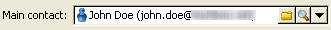

# Enriching content{#enriching-content}

Aggregators let you enrich the content with external data. This data comes from generic queries or linked tables.

## Generic queries {#generic-queries}

Queries are configured via the publication template in the **[!UICONTROL Aggregator]** tab.

The data retrieved will enrich the XML output document via its main element.

Example of return from a query on the recipient schema (**nms:recipient**):

```
<book name="Content Management">
  ...
  <collection-recipient>
    <recipient lastName="Doe" firstName="John" email="john.doe@aolf.com">
    ...
  </collection-recipient>
</book>
```

The **`<collection-recipient>`** element represents the input element of the document resulting from a query. The data retrieved is returned under this element; in our example, a recipient list.

### Adding a query {#adding-a-query}

The query parameters are edited using a wizard.

1. In the first page, specify the label and the schema containing the data to be retrieved.

   

   >[!NOTE]
   >
   >The edit field **Path** is used to rename the query output element.

1. The next page lets you select the data to retrieve.

   

1. The next page defines the filter condition.

   

1. The last page launches a preview of the data returned by the query.

   

## Linked tables {#linked-tables}

Links let you retrieve external data linked to the content.

There are two types of linked data:

* Content links: this is the native content management mode. The content of the link is automatically integrated in the XML output document.
* Links to external tables give access to all the other tables in the database with the constraint of retrieving the data of the selected link with an aggregator.

### Link to a content schema {#link-to-a-content-schema}

A content link is declared in the data schema as follows:

```
<element expandSchemaTarget="cus:chapter" label="Main chapter" name="mainChapter" type="string"/>
```

The definition of the link is populated on a **string**-type **`<element>`**, and the **expandSchemaTarget** attribute references the target schema ("cus:chapter" in our example). The referenced schema must be a content schema.

The content of the targeted element enriches the link element, i.e. the **`<chapter>`** element in our example schema:

```
<mainChapter computeString="Introduction" id="7011" title="Introduction" xtkschema="cus:chapter">    
  <page>Introduction to input <STRONG>forms</STRONG>.</page>
</mainChapter>
```

>[!NOTE]
>
>The **Compute string** of the link is presented from the **computeString** attribute.

In the input form, the edit control of the link is declared as follows:

```
<input type="articleEdit" xpath="mainChapter"/>
```


The **[!UICONTROL Magnifier]** icon enables you to open the edit form of the linked element.

#### Link collection {#link-collection}

To populate a collection of links, add the **unbound="true"** attribute to the definition of the link element in the data schema:

```
<element expandSchemaTarget="cus:chapter" label="List of chapters" name="chapter"  ordered="true" unbound="true"/>
```

The content of the targeted element enriches each collection element:

```
<chapter computeString="Introduction" id="7011" title="Introduction" xtkschema="cus:chapter">    
  <page>Introduction to input <STRONG>forms</STRONG>.</page>
</chapter>
```

In the input form, list control is declared as follows:

```
<input editable="false" nolabel="true" toolbarCaption="List of chapters" type="articleList" xpath="chapter" zoom="true"/>
```


A default column is displayed in order to view the **Compute string** of the targeted elements.

### Links to external tables {#links-to-external-tables}

A link to an external table is declared in the data schema as follows:

```
<element label="Main contact" name="mainContact" target="nms:recipient" type="link"/>
```

The definition of the link is populated on a **link**-type **`<element>`**, and the **target** attribute references the target schema ("nms:recipient" in our example).

By convention, links must be declared from the main element of the data schema.

The **Compute string** and the key of the targeted element enrich the **`<name>-id`** and **`<name>-cs`** attributes on the main element.

In our example, the link is populated in the "cus:book" schema, the content of the link data is contained in the "mainContact-id" and "mainContact-cs" attributes:

```
<book computeString="Content management" date="2006/06/08" id="6106" language="en" mainContact-cs="John Doe (john.doe@adobe.com)" mainContact-id="3012" name="Content management" xtkschema="cus:book">

```

Link edit control is declared as follows:

```
<input xpath="mainContact"/>
```



You can restrict the choice of target elements by adding the **`<sysfilter>`** element via the link definition in the input form:

```
<input xpath="mainContact">
  <!-- Filter the selection of the link on the Adobe domain -->
  <sysFilter>
    <condition expr="@domain =  'adobe.com '"/>
  </sysFilter>
</input>
```

>[!NOTE]
>
>This restriction also applies to content links.

#### Link collection {#link-collection-1}

The definition of the collection is identical to the definition of a list on collection elements:

```
<element label="List of contacts" name="contact" unbound="true">
  <element label="Recipient" name="recipient" target="nms:recipient" type="link"/>
</element>
```

In the input form, list control is declared as follows:

```
<input nolabel="true" toolbarCaption="List of contacts" type="list" xpath="contact">
  <input xpath="recipient"/>
</input>
```


>[!NOTE]
>
>The list is editable and lets you select the link from a "link"-type control presented above.

The content of the targeted element enriches each collection element in the output document:

```
<contact id="11504978621" recipient-cs="Doe John (john.doe@adobe.com)" recipient-id="3012"/>
<contact id="11504982510" recipient-cs="Martinez Peter (peter.martinez@adobe.com)" recipient-id="3013"/>
```

#### Link aggregation {#link-aggregation}

The content of each link referenced is limited to the internal key and the **Compute string** of the targeted element.

A JavaScript script is used to enrich the content of the links via SOAP queries.

**Example**: Adding the recipient name to the "mainContact" link and the "contact" collection links:

```
// Update <mainContact> link
var mainContactId = content.@['mainContact-id']
var query = xtk.queryDef.create(
    <queryDef schema="nms:recipient" operation="get">
      <select>
        <node expr="@lastName"/>
      </select>
      <where>
        <condition expr={"@id="+mainContactId}/>
      </where>
    </queryDef>)

var recipient = query.ExecuteQuery()
content.mainContact.@lastName = recipient.@lastName

// Update <contact> link collection
for each(var contact in content.contact)
{
  var contactId = contact.@['recipient-id']
  var query = xtk.queryDef.create(
    <queryDef schema="nms:recipient" operation="get">
      <select>
        <node expr="@lastName"/>
      </select>
      <where>
        <condition expr={"@id="+contactId}/>
      </where>
    </queryDef>
  )
  
  var recipient = query.ExecuteQuery()
  contact.@lastName = recipient.@lastName
}

```

The result obtained after script execution:

```
<mainContact lastName="Doe"/>

<contact id="11504978621" lastName="Doe" recipient-cs="Doe John (john.doe@adobe.com)" recipient-id="3012"/>  
<contact id="11504982510" lastName="Martinez" recipient-cs="Martinez Peter (peter.martinez@adobe.com)" recipient-id="3013"/> 

```

The content of the JavaScript code is added via the **[!UICONTROL Administration > Configuration > Content management > JavaScript Codes]** folder and must be populated in the publication template for each transformation.


