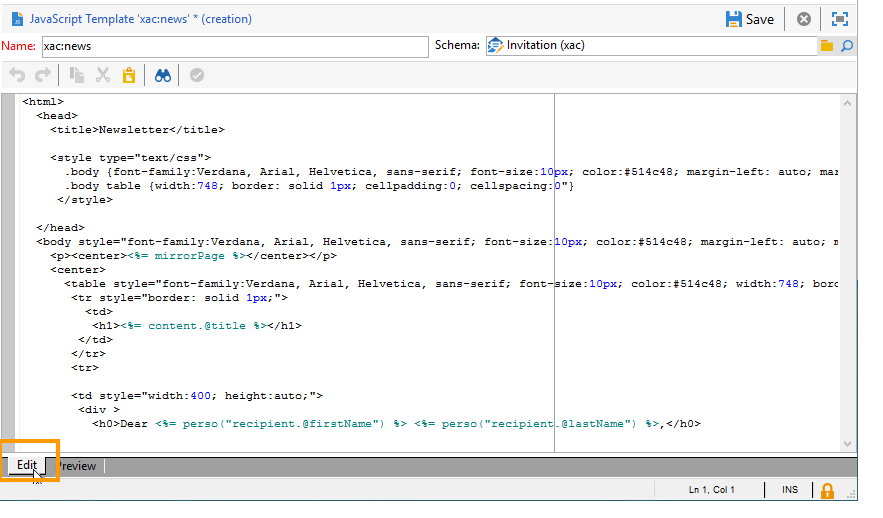
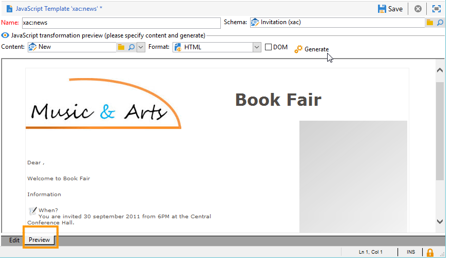
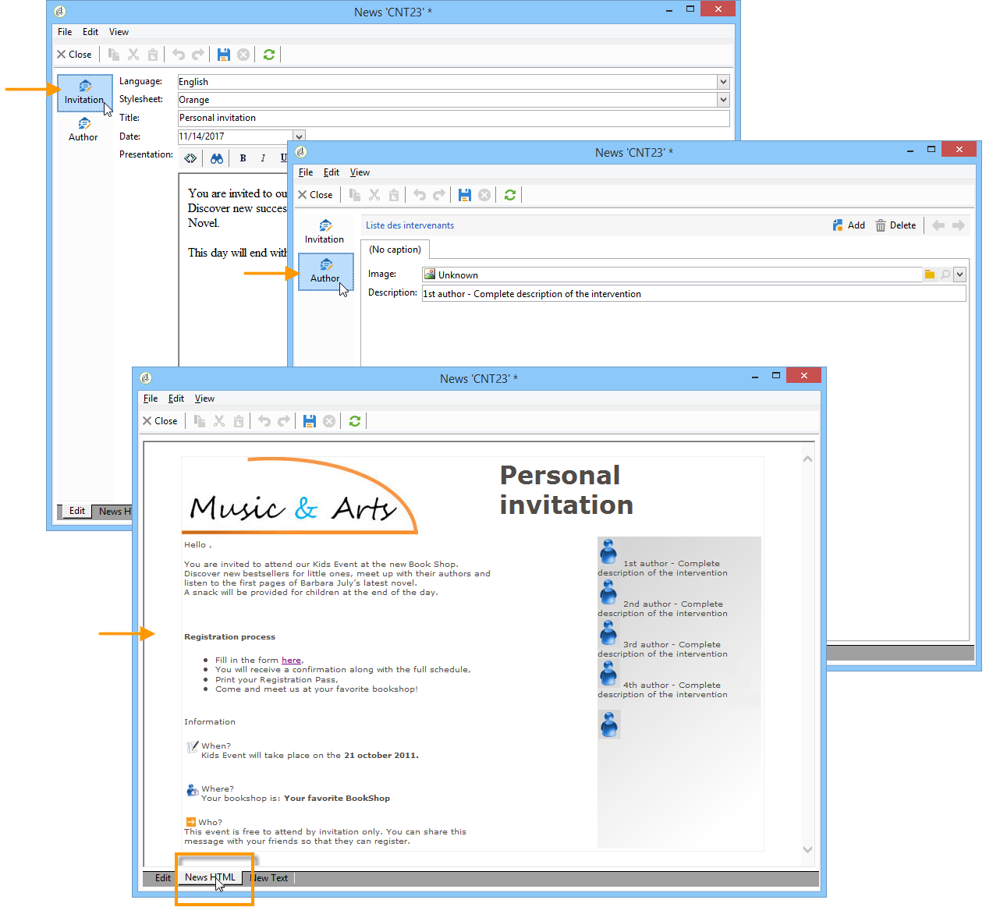
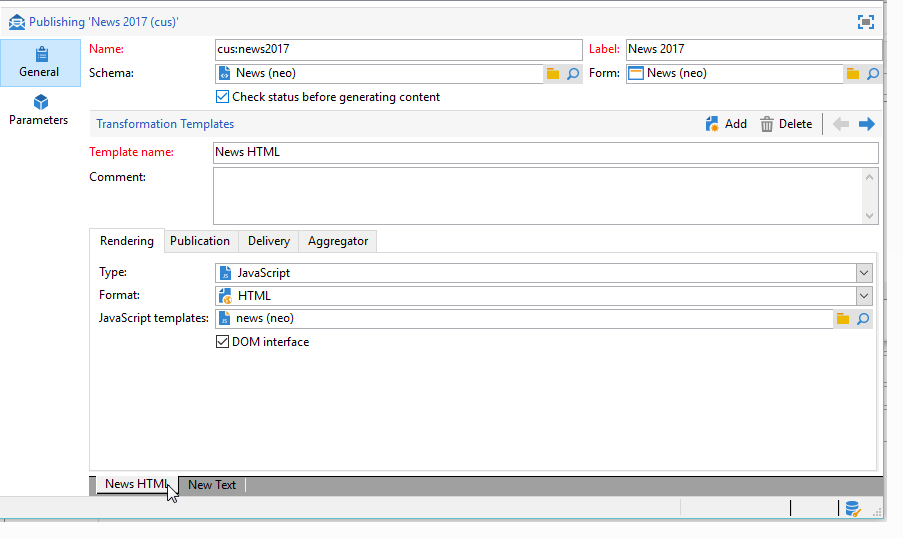
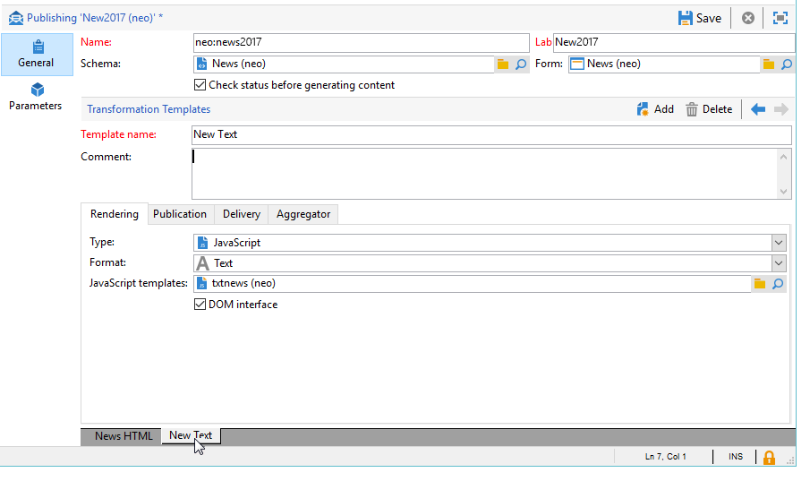
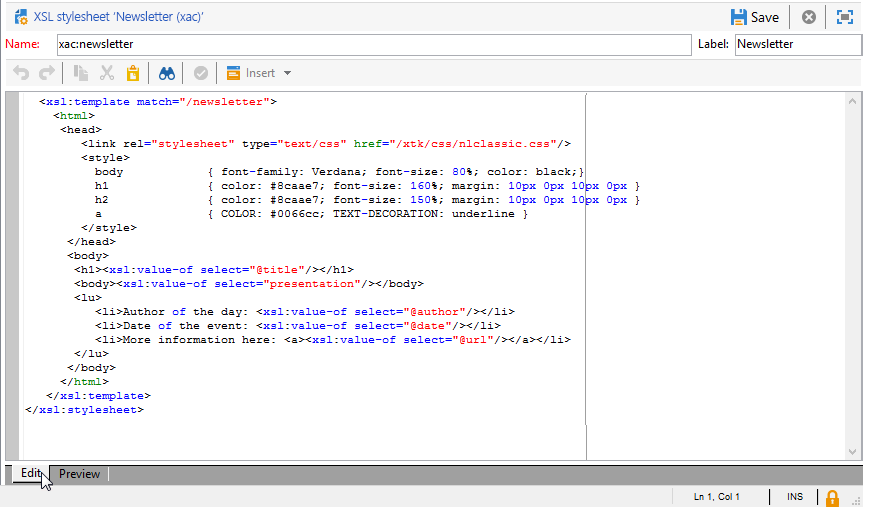
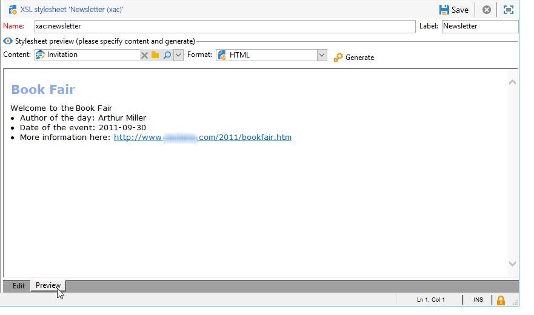

# Formatting{#formatting}

## JavaScript templates {#javascript-templates}

A JavaScript template is an HTML or text document that includes JavaScript code. It is constructed in the same way as an email content in a delivery action.

### Identification of a JavaScript template {#identification-of-a-javascript-template}

A JavaScript template is identified by its name and namespace just like schemas and forms. It is, however, recommended to add the **.js** option to the template name.

### Structure of a JavaScript template {#structure-of-a-javascript-template}

Example of a JavaScript HTML formatting template based on the "cus:book" schema:

```
<html>
  <body>
    <!-- Title of book -->
    <h1><%= content.@name %></h1>
    <ul>
      <% for each(var chapter in content.chapter) { %>
        <li><%= chapter.@name %></li>
      <% }%>
    </ul>
  </body>
</html>
```

The various JavaScript directives appear in the following form:

* Merge fields: displays the content of the data with the **`<%= <source> %>`** syntax where `<source>`is the source field of the data to be displayed.
* Instruction blocks: executes a series of JavaScript instructions included between the <% and %> tags.

The **content** object represents the main element of the input XML document.

In our example, the following line displays the content of the name book name:

```
<h1><%= content.@name %></h1>
```

The following code iterates on the `<chapter>` collection element:

```
<% for each(var chapter in content.chapter) { %>
  <li><%= chapter.@name %></li>
<% }%>
```

The attributes and elements of the content are represented as JavaScript objects and respect the structure of the source document.

**Example**:

* **content.@name**: retrieves the value of the "name" attribute of the main element
* **content.@`['name']`**: identical to the **content.@name** syntax
* **content.chapter.length**: returns the number of elements on the `<chapter` collection element
* **content.chapter`[0]`.@name**: retrieves the name of the first `<chapter>` element
* **chapter.name()**: returns the name of the `<chapter>` element
* **chapter.parent().name()**: returns the name of the parent element of `<chapter>`

>[!CAUTION]
>
>Because the '-' character is reserved in the JavaScript language, the recovery of the value of any attribute or element containing this character must be carried out via the `['<field>']` syntax.
>
>For example: `content.@['offer-id']`.

All the power of a programming language (variables, loops, conditional tests, functions, etc. ) is available to construct the output document. SOAP APIs are accessible to enrich the output document.

Examples:

* Conditional test:

  ```
  <% if (content.@number == 1 || content.@language == 'en') { %>
  <!-- Content to be displayed if test is true--> 
  <% } %>
  ```

* Function call:

  ```
  <!-- Displays a horizontal bar -->
  ;<% function DisplayHorizontalBar() { %>
    <hr/>
  <% } %> 
  
  <!-- The same function in a block  -->
  <% 
  function DisplayHorizontalBar2()
  {
    document.write('<hr/>');
  }
  %> 
  
  <!-- Returns the value in uppercase -->
  <% 
  function formatName(value)
  { 
    return value.toUpperCase(); 
  }
  %>
  
  <!-- Call functions -->
  <%= DisplayHorizontalBar1() %>
  <%= DisplayHorizontalBar2() %>
  <%= formatName(content.@name) %>
  ```

* Declarations and variable call:

  ```
  <%  var counter = 0; %>
  
  <%= counter += 10 %>
  
  ```

* Retrieval and display of a recipient name with static methods:

  ```
  <% var recipient = nms.recipient.get(1246); %>
  <%= recipient.lastName %>
  ```

* Recovery and display of a recipient name with non-static methods:

  ```
  <% var query = xtk.queryDef.create(
    <queryDef schema="nms:recipient" operation="get">
      <select>
        <node expr="@lastName"/>
      </select>
      <where>
        <condition expr="@id=1246"/>
      </where>
    </queryDef>);
  
    var recipient = query.ExecuteQuery();
  %>
  
  <%= recipient.@lastName %>
  ```

### Including a JavaScript template {#including-a-javascript-template}

You can constitute a library of functions or variables for later use. To do this, import the JavaScript template with the **eval** function. This lets you enrich contexts with additional functions declared in other JavaScript templates.

**Example**: importing the **common.jsp** template.

```
<% eval(xtk.javascript.get("cus:common.js").data);  %>
```

### Editing a JavaScript template {#editing-a-javascript-template}

The edit zone lets you populate the content of the JavaScript template:



>[!NOTE]
>
>The associated data model schema must be populated for the initialization of JavaScript objects.

To generate the preview of the output document at any time, select a content and an output format (HTML, Text, XML), then click **[!UICONTROL Generate]** :



>[!NOTE]
>
>It is not necessary to save the changes in order to preview the output document.

### Example of how to create and use a JavaScript template {#example-of-how-to-create-and-use-a-javascript-template}

Below you will find the configuration required for implementing the following content management using a JavaScript template:



This example involves the following steps:

1. Create the following schema (in this case: **neo:news**):

   ```
   <srcSchema _cs="Invitation (neo)"   entitySchema="xtk:srcSchema" img="xtk:schema.png" label="Invitation" mappingType="sql" name="news" namespace="neo" xtkschema="xtk:srcSchema">

     <enumeration basetype="string" default="en" name="language">
       <value label="Français" name="fr" value="fr"/>
       <value label="English" name="gb" value="gb"/>
     </enumeration>

     <enumeration basetype="string" name="css">
       <value label="Blue" name="bl" value="blue"/>
       <value label="Orange" name="or" value="orange"/>
     </enumeration>

     <element label="Intervenants" name="attendee">
       <key internal="true" name="id">
         <keyfield xpath="@id"/>
       </key>
       <attribute label="Name" name="name" type="string"/>
       <element label="Image" name="image" target="xtk:fileRes" type="link"/>
       <attribute label="Description" name="description" type="string"/>
       <attribute default="Gid()" label="Id" name="id" type="long"/>
     </element>

     <element label="Invitation" name="news" template="ncm:content" xmlChildren="true">

       <compute-string expr="@name"/>
       <attribute enum="language" label="Language" name="language" type="string"/>
       <attribute enum="css" label="Stylesheet" name="css" type="string"/>
       <attribute label="Title" name="title" type="string"/>
       <element label="Presentation" name="presentation" type="html"/>
       <attribute label="Date" name="date" type="date"/>
       <element label="Attendees list" name="attendeesList" ordered="true" ref="attendee" unbound="true"/>

     </element>
   </srcSchema>
   ```

1. Create the linked **[!UICONTROL Content management]** type form (**neo:news**)

   ```
   <form _cs="News (neo)" entitySchema="xtk:form"  img="xtk:form.png" label="News"  name="news" namespace="neo" type="contentForm" xtkschema="xtk:form">

     <container type="iconbox">
       <container label="Invitation">
         <input xpath="@langue"/>
         <input xpath="@css"/>
         <input xpath="@title"/>
         <input xpath="@date"/>
         <input xpath="presentation"/>
       </container>

       <container label="Intervenants">
         <container toolbarCaption="Liste des intervenants" type="notebooklist" xpath="attendeesList" xpath-label="@nom">
           <container>
             <input xpath="@nom"/>
             <input img="nl:sryimage.png" newEntityFormChoice="true" xpath="image">
               <sysFilter>
                 <condition expr="@isImage = true"/>
               </sysFilter>
             </input>
             <input xpath="@description"/>
           </container>
         </container>
       </container>
     </container>

   </form>
   ```

1. Create the JavaScript templates with message contents for HTML and Text formats.

    * In our example, for HTML:

      ```    
      <html>     
        <head>         
          <title>Newsletter</title>
           <style type="text/css">
            .body {font-family:Verdana, Arial, Helvetica, sans-serif; font-size:10px; color:#514c48; margin-left: auto; margin-right: auto;}
            .body table {width:748; border: solid 1px; cellpadding:0; cellspacing:0"}
           </style>
        </head>     
        <body>
          <p><center><%= mirrorPage %></center></p>
          <center>
            <table>      
             <tr>
              <td>                                                         
                                                   
              </td>
              <td>
                <h1><%= content.@title %></h1>
              </td>
             </tr>
             <tr>
              
             <td>
              <div >                                    
                <h0><%= hello,</h0>                              
                <p><%= content.presentation %></p>                                          
      
                <h0>Useful information</h0>                              
                <p>                                  
                  When? <br/><%= formatDate(content.@date, "%2D %Bl %4Y") %> From 10 AM in your bookshop.</p><br/>                                       
                <p>                                  
                  Who? <br>Meet our favorite authors and illustrators and get a signed copy of their book.</p><br/>                                                         
                <p>                                  
                  Attendance is free but there is a limited number of seats: sign up now!</p>
            </div>
            </td>
             
              <td>                                                    
               <div style="text-align:left; width:210; height:400px; background:url([IMAGE DE FOND])">
                
                  <h0><%= participant %></h0>
                  <%
                  var i
                  var iLength = content.attendeesList.length()
                  for (i=0; i<iLength; i++)
                  { %>
                  <p>
                    <%= generateImgTag(content.attendeesList[i].@["image-id"]) %>  <%= content.attendeesList[i].@description %>
                  </p>  
                  <% }  
                  %>                              
               </div2>
              </td>
          </tr>
        </table>
      </center>
      </body>    
      </html>
      ```

    * For the text:

      ```    
      <%= content.@title %>
      <%= content.presentation %>
      
      *** When? On <%= formatDate(content.@date, "%2D %Bl %4Y") %> From 10 AM in your bookshop.
      
      *** Who? Come and meet our favorite authors and illustrators and get a signed copy of their books. 
      
      *** Attendance is free but there is a limited number of seats: sign up now!

      Guests:
      ******************
      <%
      var i
      var iLength = content.attendeesList.length()
      //for (i=(iLength-1); i>-1; i--)
      for( i=0 ; i<iLength ; i++ )
        { %>
        Description <%= i %> : <%= content.attendeesList[i].@description %>
        <% }  
      %>
      
      ```

1. Now create the publication template used for both formats:

    * For HTML: 
    
      

    * For Text: 
    
      

1. You may then use this content template in your deliveries.

   For more on this, refer to [Using a content template](../../delivery/using/using-a-content-template.md).

## XSL Stylesheets {#xsl-stylesheets}

XSLT language lets you change an XML document into an output document. Depending on the output method of the stylesheet, the resulting document can be generated in HTML, plain text or another XML tree.

This transformation is in turn detailed in XML in a document known as the stylesheet.

### Identifying a stylesheet {#identifying-a-stylesheet}

A stylesheet is identified by its name and namespace, just like schemas and forms. It is, however, recommended that you add the **.xsl** extension to the name of the stylesheet.

The identification key of a stylesheet is a string formed by the namespace and the name separated by a colon; for example: **cus:book.xsl**.

### Structure of a stylesheet {#structure-of-a-stylesheet}

Example of an HTML formatting stylesheet based on the example schema "cus:book":

```
<?xml version="1.0" encoding="ISO-8859-1" ?>
<xsl:stylesheet xmlns:xsl="http://www.w3.org/1999/XSL/Transform" version="1.0">
  <xsl:output encoding="ISO-8859-1" method="html"/>
  <!-- Point of entry of the stylesheet -->
  <xsl:template match="/book">
    <html>
      <body>
        <!-- Book title -->
        <h1><xsl:value-of select="@name"/></h1>
        <lu>
          <!-- List of chapters -->
          <xsl:for-each select="child::chapter">
            <li><xsl:value-of select="@name"/></li>
          </xsl:for-each>
       </lu>
      </body>
    </html>
   </xsl:template>
</xsl:stylesheet>
```

A stylesheet is an XML document that obeys the following rules:

* the values of attributes are between quotation marks,
* an element must have an opening marker and a closing marker,
* replace the '<' or '&' characters with the **'&lt;'** or **'&'** entities,
* each XSL element must use the **xsl** namespace.

A stylesheet must start with the XSL root element marker **`<xsl:stylesheet>`** and end with the **`</xsl:stylesheet>`** marker. The XSL namespace must be defined in the opening marker as follows:

```
<xsl:stylesheet xmlns:xsl="http://www.w3.org/1999/XSL/Transform" version="1.0">
```

The **`<xsl:output>`** element specifies the format of the document generated. Specify the desired set of characters and the output format.

```
<xsl:output encoding="ISO-8859-1" method="html"/>
```

The following instructions describe the configuration of the stylesheet for the formatting of the output document.

```
<xsl:template match="/book">
  <html>
    <body>
      <!-- Book title -->
      <h1><xsl:value-of select="@name"/></h1>
      <lu>
        <!-- List of chapters -->
        <xsl:for-each select="child::chapter">
          <li><xsl:value-of select="@name"/></li>
        </xsl:for-each>
      </lu>
    </body>
  </html>
</xsl:template>
```

By default, the XSLT processor seeks the **template** that applies to the root or main node of the input XML document. The construction of the output document begins with this **template**.

In our example, an HTML page is generated from the "cus:book" schema by displaying the name of the book and the list of chapters.

>[!NOTE]
>
>For more information on the XSLT language, refer to an XSLT reference document.

### Displaying HTML/XML {#displaying-html-xml}

To display an **html** field, use the **disable-output-escaping="yes"** option from the **`<xsl:value-of>`** directive. This lets you avoid replacing characters with their XML entity (for example < with &lt;).

The **`<xsl:text>`** directive with the **disable-output-escaping="yes"** option lets you insert JavaScript tags for personalization fields or conditional tests.

Examples:

* Displaying the content of an "html"-type field:

  ```
  <xsl:value-of select="summary" disable-output-escaping="yes"/>
  ```

* Inserting the personalization field **<%= recipient.email %>**:

  ```
  <xsl:text disable-output-escaping="yes"><%= recipient.email %></xsl:text>
  ```

* Adding the conditional test **<% if (recipient.language == 'en') `{` %>**:

  ```
  <xsl:text disable-output-escaping="yes"><% if (recipient.language == 'en') { %></xsl:text>
  ```

### Including stylesheets {#including-stylesheets}

It is possible to build up a library of templates or variables to be shared among several stylesheets. The "longMonth" **template**, presented above, is a typical example of the advantage of locating a template remotely in a stylesheet so that it can be reused later.

The **`<xsl:include>`** directive indicates the name of the stylesheet to be included in the document.

**Example**: including the "common.xsl" style sheet.

```
<? xml version="1.0" encoding="ISO-8859-1" ?>
<xsl:stylesheet xmlns:xsl="http://www.w3.org/1999/XSL/Transform" version="1.0">
  <xsl:include href="common.xsl"/> 
  <xsl:output encoding="ISO-8859-1" method="jsp" indent="yes"/>
  ...
</xsl:stylesheet>
```

>[!NOTE]
>
>The name of the namespace must not be entered in the reference of the stylesheet to include. As a standard, this stylesheet is created with the user namespace.

### Editing a stylesheet {#editing-a-stylesheet}

The edit zone lets you populate the content of the stylesheet:



To generate a preview of the output document at any time, select a content instance and the format (HTML, Text, XML), and then click **[!UICONTROL Generate]** :



>[!NOTE]
>
>There is no need to save changes in the stylesheet to view the output document preview.

## Image management {#image-management}

### Image referencing {#image-referencing}

The images entered in the HTML output document can be referenced with absolute or relative references.

Relative referencing lets you enter the URL of the server containing the images in the **NcmRessourcesDir** and **NcmRessourcesDirPreview** options. These options contain the location of images for publication and preview in the Adobe Campaign client console.

These two options are accessible via the option management screen in the **[!UICONTROL Administration > Platform > Options]** folder.

**Example**:

* NcmResourcesDir = "https://server/images/"
* NcmResourcesDirPreview = "x:/images/"

During stylesheet processing, the **_resPath** attribute on the main element of the input XML document is automatically filled in with one or other of the options depending on context (preview or publication).

Example of how to use the image placement option and its use with an image:

```
/newsletter/image.png"/>
```

>[!NOTE]
>
>We recommend declaring a variable containing the reference of the server where the images are stored ("resPath" in our example).

### Using public resources {#using-public-resources}

You can also use **[!UICONTROL Public resources]** to declare images and upload them onto the server depending on the instance settings entered in the deployment wizard.

You can then call up these images in contents. to do this, use the following syntax in the content management schema:

```
<element label="Image" name="image" target="xtk:fileRes" type="link"/>
```

In the form, the field for selecting the image will be added via the following syntax:

```
<input img="nl:sryimage.png" newEntityFormChoice="true" xpath="image">
    <sysFilter>
      <condition expr="@isImage = true"/>
    </sysFilter>
  </input>
```

>[!NOTE]
>
>For more on **[!UICONTROL Public resources]** and how to configure and use them, refer to [this section](../../installation/using/deploying-an-instance.md#managing-public-resources).

## Date display {#date-display}

In the XML input document, the dates are stored in internal XML format: **YYYY/MM/DD HH:MM:SS** (example 2018/10/01 12:23:30).

Adobe Campaign provides date formatting functions for the JavaScript templates and XSL stylesheets detailed below.

### JavaScript date formatting {#javascript-date-formatting}

To display a date in the desired format, Adobe Campaign provides the **formatDate** function that takes as input the content of the date and a string specifying the output format with the following syntax: **%4Y/%2M/%2D %2H%2N%2S**

Examples:

* Display the date in the **31/10/2018** format:

  ```
   <%= formatDate(content.@date, "%2D/%2M/%4Y") %>
  ```

* Display the date in the **July 2018** format:

  ```
  <%
   function displayDate(date)
    {
      var aMonth = 
      [ 'January', 'February', 'March', 'April', 'May', 'June', 'July', 'August', 'September', 'October', 'November', 'December' ];
  
      var month = formatDate(content.@date, "%2M")
      var year = formatDate(content.@date, "%4Y")
      
      return aMonth[month-1]+" "+year;
    }
  %>
  
  <%= displayDate(content.@date) %>
  ```

### XSL date formatting {#xsl-date-formatting}

There is no standard date management function in XSLT syntax. To display a date in the desired format, Adobe Campaign provides the external function **date-format**. This function takes as its input the content of the date and a string specifying the output format with the following syntax: **%4Y/%2M/%2D %2H%2N%2S**

Examples:

* To display the date in the **01/10/2018** format:

  ```
  <xsl:value-of select="external:date-format(@date, '%2D/%2M/%4Y')"/>
  ```

* To display the date in the **July 2018** format:

  ```
  <!-- Returns the month in the form of a string with the month number as input -->
  <xsl:template name="longMonth">
    <xsl:param name="monthNumber"/>
      
    <xsl:choose>
      <xsl:when test="$monthNumber = 1">January</xsl:when>
      <xsl:when test="$monthNumber = 2">February</xsl:when>
      <xsl:when test="$monthNumber = 3">March</xsl:when>
      <xsl:when test="$monthNumber = 4">April</xsl:when>
      <xsl:when test="$monthNumber = 5">May</xsl:when>
      <xsl:when test="$monthNumber = 6">June</xsl:when>
      <xsl:when test="$monthNumber = 7">July</xsl:when>
      <xsl:when test="$monthNumber = 8">August</xsl:when>
      <xsl:when test="$monthNumber = 9">September</xsl:when>
      <xsl:when test="$monthNumber = 10">October</xsl:when>
      <xsl:when test="$monthNumber = 11">November</xsl:when>
      <xsl:when test="$monthNumber = 12">December</xsl:when>
    </xsl:choose>
  </xsl:template> 
  
  <!-- Display date -->
  <xsl:call-template name="longMonth">
    <xsl:with-param name="monthNumber">
      <xsl:value-of select="external:date-format(@date, '%2M')"/>
    </xsl:with-param>
  </xsl:call-template>
   <xsl:value-of select="external:date-format(@date, '%4y')"/>
  
  ```
