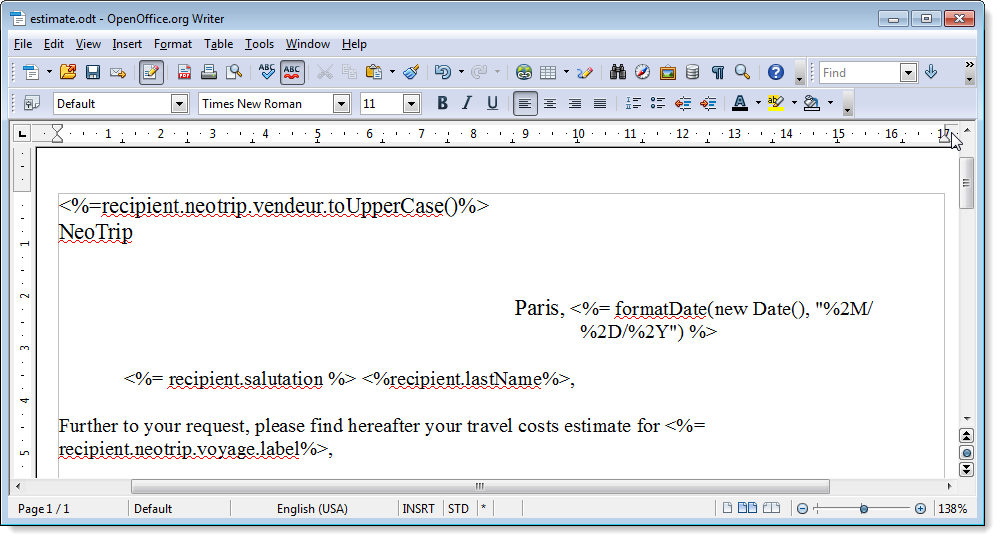
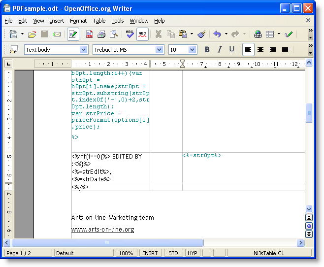
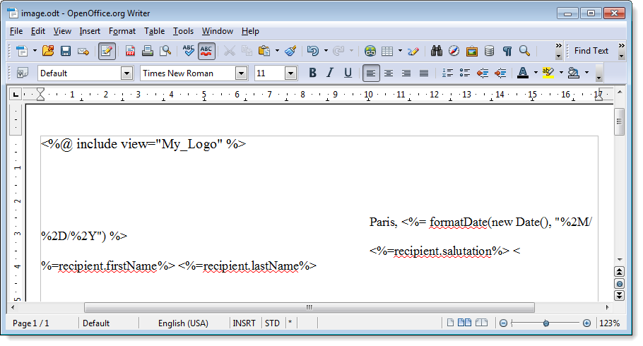
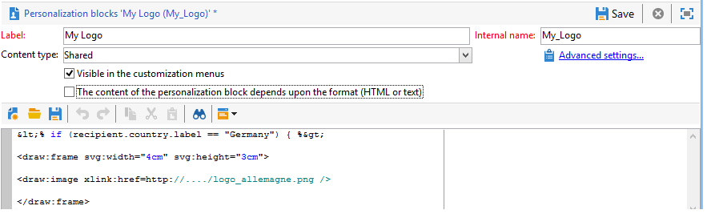
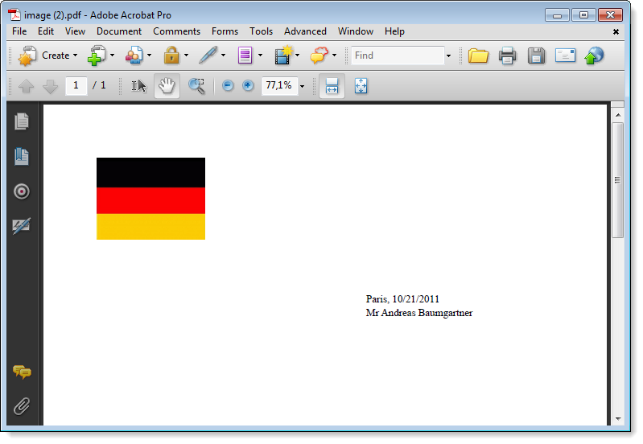

# Generating personalized PDF documents{#generating-personalized-pdf-documents}

## About variable PDF documents {#about-variable-pdf-documents}

Adobe Campaign lets you generate variable PDF documents (for email attachments, direct mail delivery) from LibreOffice or Microsoft Word documents.

The following extensions are supported: ".docx", ".doc", and ".odt".

To personalize your documents, the same JavaScript functionalities as for email personalization are available.

You need to activate the **[!UICONTROL "The content of the file is personalized and converted to PDF during the delivery of each message"]** option. This option is accessible when you attach the file to the delivery email. For more on attaching a calculated file, refer to the [Attaching files](../../delivery/using/attaching-files.md) section.

Example of an invoice header personalization:



To generate dynamic tables or include images via a URL, you need to follow a specific process.

## Generating dynamic tables {#generating-dynamic-tables}

The procedure for generating dynamic tables is as follows:

* Create a table with three lines and as many columns as necessary, then configure its layout (borders, etc.).
* Place your cursor on the table and click the **[!UICONTROL Table > Table properties]** menu. Go to the **[!UICONTROL Table]** tab and enter a name beginning with **NlJsTable**.
* In the first cell of the first line, define a loop ("for", for example) that enables iteration on the values you want to display in the table.
* In each cell of the second line of the table, insert scripts that return the values to display.
* Close the loop in the third and last line of the table.

  Example of a dynamic table definition:

  

## Inserting external images {#inserting-external-images}

The insertion of external images is useful if, for instance, you want to personalize a document with an image whose URL is entered in a field of the recipient.

To do this, you need to configure a personalization block, then include a call to the personalization block in the attachment.

**Example: inserting a personalized logo depending on the recipient's country**

**Step 1: create the attachment:**

* Insert the call to the personalization block: **<%@ include view="blockname" %>**.
* Insert your content (personalized or not) into the body of the file.



**Step 2: create the personalization block:**

* Go to the **[!UICONTROL Resources > Campaign management > Personalization blocks]** menu of the Adobe Campaign console.
* Create a new "My Logo" personalization block with "My_Logo" as an internal name.
* Click on the **[!UICONTROL Advanced parameters...]** link then check the **[!UICONTROL "The content of the block is included in an attachment"]** option. This lets you copy the definition of the personalization block directly into the content of the OpenOffice file.

  

  You need to differentiate two types of declarations within the personalization block:

  * The Adobe Campaign code of the personalization fields for which the "open" and "closed" chevrons must be replaced with escape characters (respectively `&lt;` and `&gt;`).
  * The entire OpenOffice XML code will be copied into the OpenOffice document.

In the example, the personalization block looks like this:

```
<% if (recipient.country.label == "Germany") { %>
<draw:frame svg:width="4cm" svg:height="3cm">
<draw:image xlink:href=https://..../logo_germany.png />
</draw:frame>
<% } else
if (recipient.country.label == "USA")
{ %>
<draw:frame svg:width="4cm" svg:height="3cm">
<draw:image xlink:href=https://..../logo_USA.png />
</draw:frame>
<% } %>
```

Depending on the recipient's country, personalization is visible in the document linked to the delivery:


