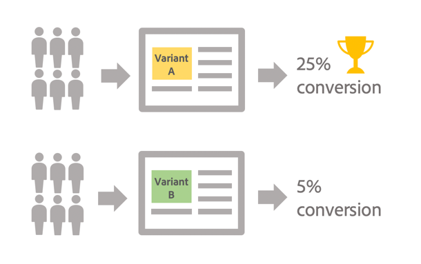

# Get started with A/B testing {#get-started-a-b-testing}

A/B testing allows you to compare multiple versions of a delivery against each other, in order to identify which one will have the biggest impact on the targeted population.

To do this, you first need to define multiple variants of the delivery. Each variant is then sent to population samples in order to determine which one performs better depending on the criteria of your choice (opens, spam complaints, clicks on a specific link, ...). 

In the example below, the delivery target has been splitted into two groups, each representing 50% of the targeted population. Each group receives two versions of the delivery with two different promotional offers. After the delivery is sent, it is concluded that variant A performed better, based on the number of clicks on the promotional offers.

With Campaign Classic, A/B testing is implemented through workflows, where you specify the population to target as well as the groups that will receive each variant (see [Configuring a/b testing](../../delivery/using/configuring-a-b-testing.md)).

The main steps are:

1. **Target** the desired population.
1. **Split the population** into sub-sets on which you will test the variants of your delivery.

     For example, you can send one version of a delivery to a small portion of the targeted population, and another version to the remaining population. This allows you to test a new version of a delivery as opposed to the delivery that is usually sent to your customers. You can also divide the targeted population into 3 groups in order to send them  three different versions of a delivery.

1. **Create multiple versions** of the delivery corresponding to each sub-set. The variant to test can be the subject, the message content, the sender name, etc.
1. Start the workflow, then use the **delivery logs** to analyze the behaviour of the sub-sets with each variant.

>[!NOTE]
>
>Workflows also allow you to automate your processes by automatically identifying the delivery variant that performed better, then sending it to the remaining population. For more on this, refer to this dedicated [use case](../../delivery/using/a-b-testing-use-case.md).
