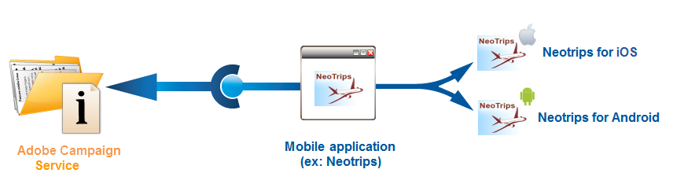
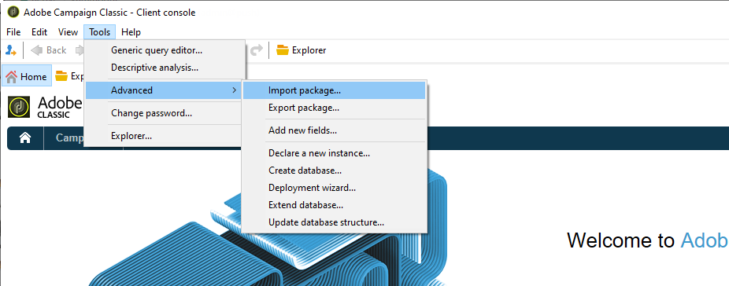
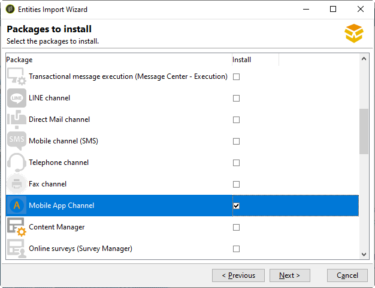
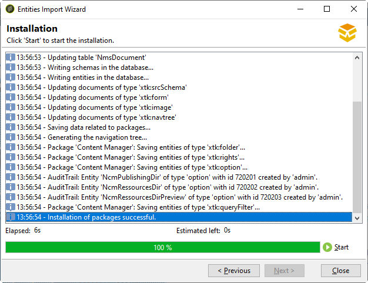

# Get started with the app configuration

You can find in this section a configuration sample based on a company which sells online holiday packages. His mobile application (Neotrips) is available to its customers in two versions: Neotrips for Android and Neotrips for iOS.

To send push notifications in Adobe Campaign, you need to:

* Create a **[!UICONTROL Mobile application]** type information service for the Neotrips mobile application. Refer to [this section for iOS](configuring-the-mobile-application.md#configuring-ios-service). and [this section for Android](configuring-the-mobile-application-android.md#configuring-android-service).
* Add the iOS and Android versions of the application to this service.
* Create a delivery for [iOS](create-notifications-ios.md) and [Android](create-notifications-android.md).

>[!NOTE]
>
>Go to the **[!UICONTROL Subscriptions]** tab of the service to view the list of subscribers to the service, i.e. all people who have installed the application on their mobile and agreed to receive notifications.

## Install the package {#installing-package-ios}

 [Learn how to install the mobile app package in video](https://experienceleague.adobe.com/docs/campaign-classic-learn/tutorials/sending-messages/push-channel/installing-the-mobile-app-channel.html?lang=en#sending-messages)

As a hybrid/hosted customer, contact [Adobe Customer Care](https://helpx.adobe.com/enterprise/admin-guide.html/enterprise/using/support-for-experience-cloud.ug.html) team to access push notification channel in Campaign. 

As an on-premise customer, you need to install a built-in package.

>[!CAUTION]
>
>Learn more about Campaign built-in packages, best practices and recommendations in [this page](../../installation/using/installing-campaign-standard-packages.md).

Installation steps are:

1. Access the package import wizard from **[!UICONTROL Tools > Advanced > Package import...]** in the Adobe Campaign client console.

   

1. Select **[!UICONTROL Install a standard package]**.

1. In the list that appears, check **[!UICONTROL Mobile App Channel]**.

   

1. Click **[!UICONTROL Next]**, then **[!UICONTROL Start]** to start the package installation.

   Once the packages are installed, the progress bar shows **100%** and you can see the following message in the installation logs: **[!UICONTROL Installation of packages successful]**.

   

1. **[!UICONTROL Close]** the installation window.

Once this step is done, you can configure your Android and iOS apps.
Refer to these sections:

* [Configuration steps for iOS](configuring-the-mobile-application.md)

* [Configuration steps for Android](configuring-the-mobile-application-android.md)
