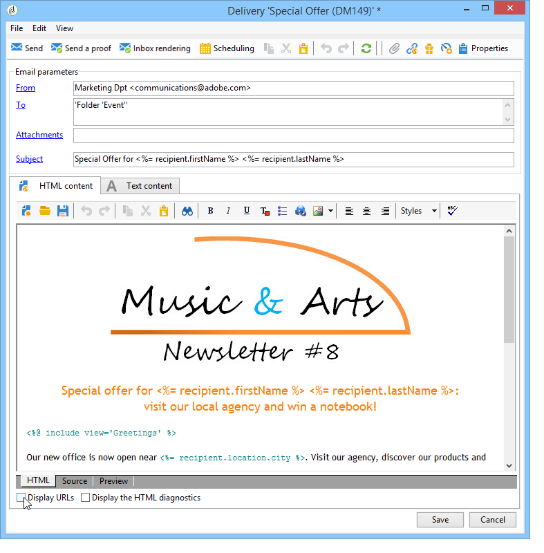
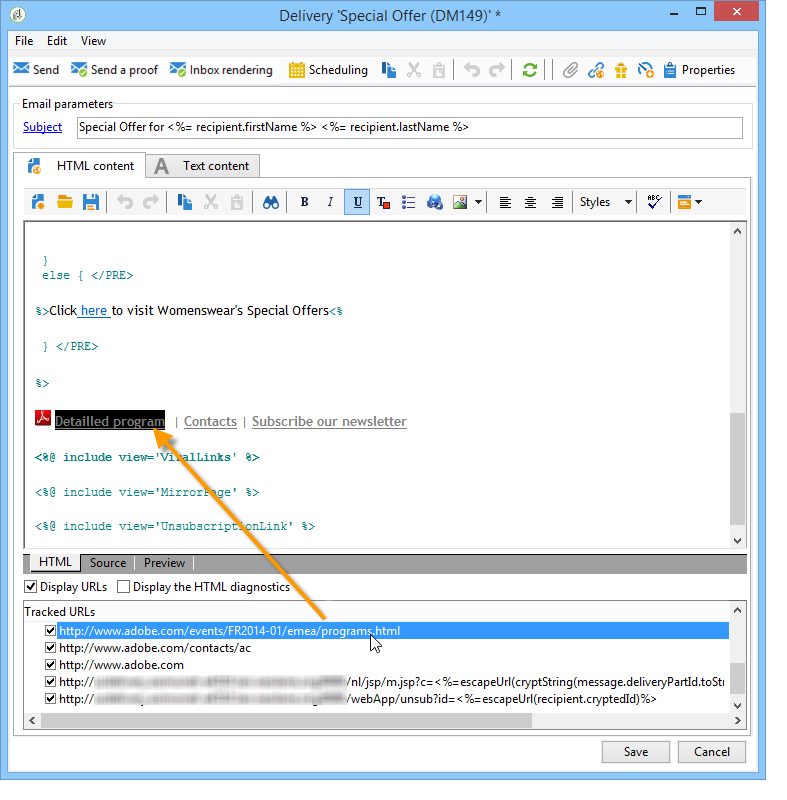
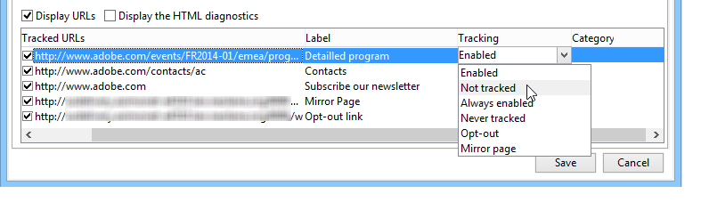

# How to configure tracked links{#how-to-configure-tracked-links}

For each delivery, you can track the reception of messages and the activation of the links inserted in the message content. This lets you track the behavior of recipients following the delivery actions which they were targeted by.

Tracking applies to messages, but web tracking lets you monitor how recipients browse a website (pages visited, purchases). The configuration of web tracking is presented in [this section](../../configuration/using/about-web-tracking.md).

>[!NOTE]
>
>The links in email content that contain personalization need specific syntax to be tracked. For more on how to add links in emails that can be personalized and that support tracking, refer to [this section](../../delivery/using/tracking-personalized-links.md).

Message tracking is enabled by default. To personalize how URLs are tracked, follow the steps below:

1. Select the **[!UICONTROL Display URLs]** option in the lower section of the delivery wizard, under the message content. 

   

   When you select a URL from the tracked URLs list, it is highlighted in the delivery content - except for the link in the mirror page and the unsubscription link that are provided by default.

   

1. For each URL of the message, select whether or not to activate tracking.

   >[!IMPORTANT]
   >
   >When the URL of the link is used as a label, it is recommended to desactivate tracking to avoid risks of rejection due to phishing.
   >
   >For example, if the www.adobe.com URL is inserted into the message and tracking activated on it, the content of the hypertext link will be modified to https://nlt.adobe.net/r/?id=xxxxxx. This means that it could be considered as fraudulent by recipient message clients.

1. If needed, change the tracking label, double-click the label and enter a new one.

   >[!NOTE]
   >
   >The labels of the tracked URLs and the labels can be modified to simplify the reading of information when tracking deliveries. Two URLs or two labels with the same name will be added together when calculating the click count.

1. If needed, change the tracking mode, select a new mode in the **[!UICONTROL Tracking]** column which matches the targeted link, as shown below:

   

   For each individual URL, you can set tracking mode to one of these values:

    * **[!UICONTROL Enabled]** : activates tracking on this URL. 
    * **[!UICONTROL Not tracked]** : desactivates tracking on this URL.
    * **[!UICONTROL Always enabled]** : always activates tracking of this URL. This information is saved so that the next time, if the URL appears again in a future message content, its tracking is automatically activated.
    * **[!UICONTROL Never tracked]** : never activates tracking of this URL. This information is saved so that the next time, if the URL appears again in a future message, its tracking be automatically deactivated.
    * **[!UICONTROL Opt-out]** : considers this URL as an opt-out or unsubscription URL.
    * **[!UICONTROL Mirror page]** : considers this URL is a mirror page URL.

1. In addition, you can select a category for each tracked URL in the drop-down list of the **[!UICONTROL Category]** column. These categories can be displayed reports, as for example in **[!UICONTROL URLs and click streams]** (see [this section](../../reporting/using/reports-on-deliveries.md#urls-and-click-streams)). Categories are defined in a specific enumeration: **[!UICONTROL urlCategory]** (see [Managing enumerations](../../platform/using/managing-enumerations.md)).
